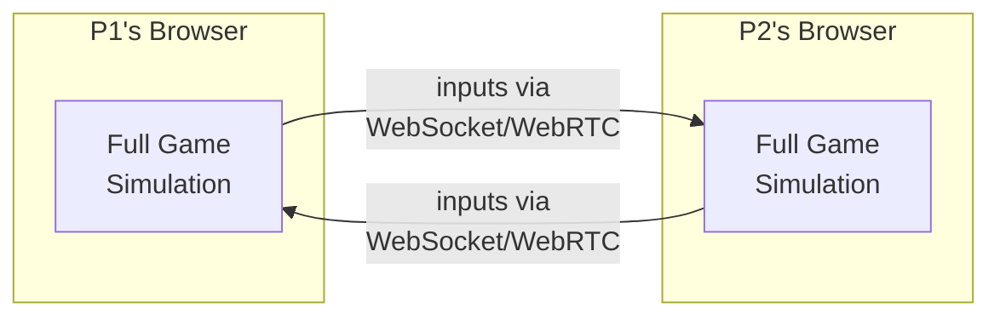
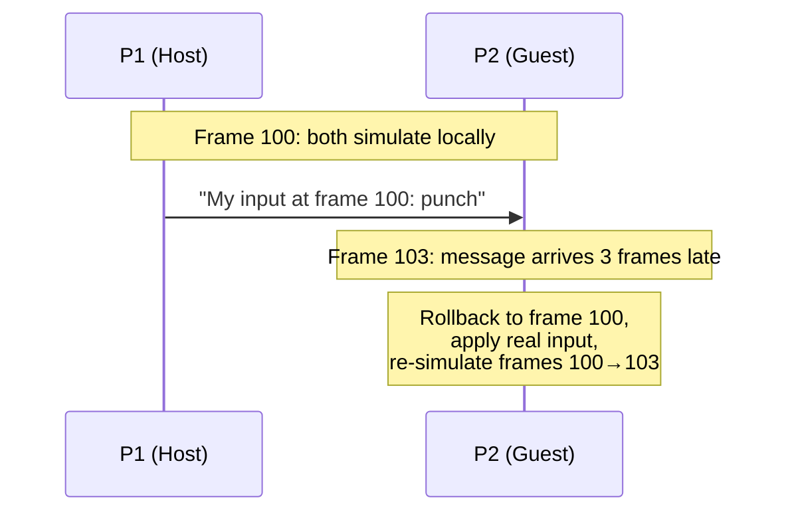
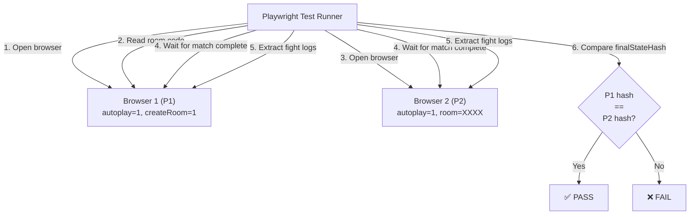
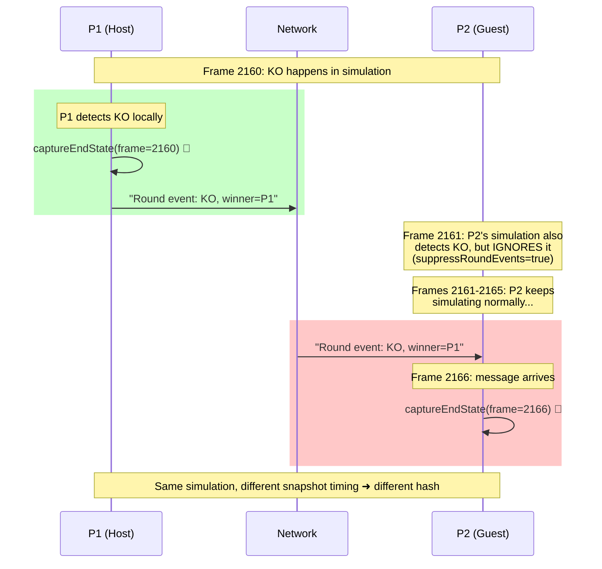
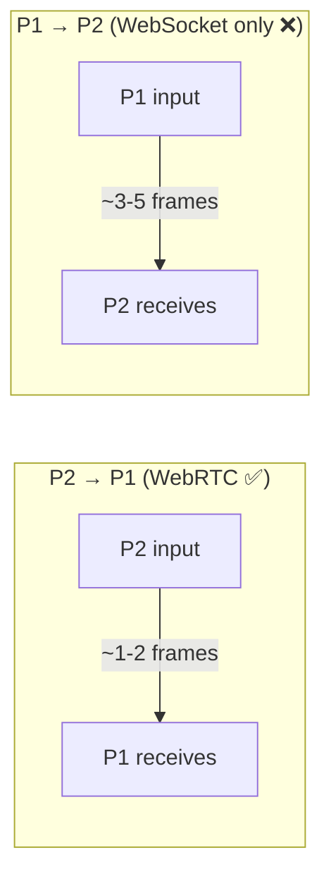

# E2E Failure Diagnosis: Deterministic Fighters Hash Mismatch

> **TL;DR:** The E2E test failed because P1 and P2 take their "final snapshot" of the game at different moments — P1 at the exact frame of the knockout, P2 six frames later when the network message arrives. The simulation itself was perfectly identical; only the timing of the observation differs.

## Source Data

This diagnosis was produced from the following E2E test artifacts (included alongside this file):

- [`deterministic-fighters-bundle.json`](deterministic-fighters-bundle.json) — Full fight logs from both peers (inputs, checksums, final state snapshots)
- [`deterministic-fighters-report.md`](deterministic-fighters-report.md) — Auto-generated test report summary
- [`deterministic-fighters-console.txt`](deterministic-fighters-console.txt) — Browser console output from both peers

## Background: How Online Multiplayer Works

In A Los Traques, two players fight over the internet. Each player's browser runs the **full game simulation locally** — there's no authoritative server computing the fight. This means both browsers must produce **exactly the same result** for every frame, or the players will see different things (a "desync").



Both peers exchange **only button inputs** (left, right, punch, kick, etc.), and each peer applies those inputs to its own simulation. If the simulation code is deterministic (same inputs → same output), both peers stay in sync.

### Rollback Netcode

Network messages take time to arrive. Rather than wait for the opponent's input every frame (which would feel laggy), each peer **predicts** what the opponent will do and simulates ahead. When the real input arrives and it was different from the prediction, the game **rolls back** to the last confirmed state and re-simulates forward with the correct input.



This is called **rollback netcode** (GGPO-style). It's the standard approach for fighting games.

### Host vs Guest Roles

While both peers run identical simulations, **P1 is the "host"** and has one special responsibility: it's the authority on **round events** (knockouts, timeups). When P1's simulation detects a KO, it:
1. Handles the round end locally (immediately)
2. Sends a message to P2 telling it what happened

P2 **suppresses** its own local KO detection and waits for P1's authoritative message. This prevents disagreements about who won a round.

## What the E2E Tests Do

The E2E test suite spawns two browser instances via Playwright, connects them in a multiplayer match with AI-controlled fighters, and waits for the match to complete. Then it compares each peer's game state to verify the simulation was deterministic.



Each browser records a `__FIGHT_LOG` containing:
- **Inputs** — every button press with frame number
- **Checksums** — a hash of the game state every 30 frames
- **Round events** — KOs and timeups with frame numbers
- **Final state** — a complete snapshot of both fighters + combat state at match end
- **Final state hash** — a single number summarizing the final state

The test checks that both peers' final state hashes match. If they don't, the simulation diverged somewhere.

## The Failure

### Test: `deterministic fighters` (simon vs jeka, seed=42)

| | P1 (Host) | P2 (Guest) |
|---|---|---|
| Final state hash | `2048722145` | `-192686270` |
| Total frames | 2363 | 2369 |
| **Snapshot frame** | **2160** | **2166** |
| Rollbacks | 0 | 87 |
| Max rollback depth | 0 | 5 |
| Desyncs | 0 | 0 |
| Mid-game checksums | 78 match | 78 match |
| Round events | 2 KOs recorded | 0 (empty) |
| WebRTC | ❌ Failed | ✅ Connected |

The hashes don't match, so the test failed. But notice: **all 78 mid-game checksums matched perfectly** and there were **zero desyncs**. The simulation was identical during gameplay.

### What's Actually Different?

Comparing the final state snapshots field by field:

| Field | P1's Snapshot | P2's Snapshot | What It Means |
|---|---|---|---|
| `p1.stamina` | 4190 | 4790 | Stamina regenerated for 6 extra frames |
| `p1.attackCooldown` | 19 | 13 | Cooldown counted down 6 more ticks |
| `p2.simY` | 220000 | 204669 | Knocked-up fighter still in the air |
| `p2.isOnGround` | true | false | Fighter hasn't landed yet |
| `p2.hurtTimer` | 30 | 24 | Hurt animation counted down 6 ticks |
| `combat.*` | identical | identical | Both agree on rounds, winner, matchOver |

Every single diff is explained by **6 extra frames of simulation**. P2's snapshot was taken 6 frames later than P1's, so fighters moved, timers ticked, stamina regenerated — but the game logic state (who won, what round, match over) is identical.

## Root Cause

The bug is in **when** each peer captures its final state snapshot, not in the simulation itself.



### The Code Path

Here's exactly what happens in the code:

**P1 (Host) — `FightScene.js:1196-1198`:**
```javascript
// rollbackManager.advance() returns the KO event immediately
const { roundEvent } = this.rollbackManager.advance(...);

if (roundEvent && this.isHost) {         // ← P1 enters here
  this.combat.handleRoundEnd(roundEvent); // → calls onMatchOver()
  // onMatchOver() calls captureEndState(currentFrame)
  // currentFrame = 2160 (the exact KO frame)
}
```

**P2 (Guest) — `FightScene.js:887-897`:**
```javascript
// P2 ignores its own local KO detection (suppressRoundEvents=true)
// Instead, it waits for P1's network message:
nm.onRoundEvent((msg) => {
  if (this.isHost) return;  // ← P1 skips this callback
  if (msg.matchOver) {
    this.onMatchOver(msg.winnerIndex);
    // onMatchOver() calls captureEndState(currentFrame)
    // currentFrame = 2166 (6 frames after the actual KO)
  }
});
```

**The snapshot itself — `FightScene.js:1949-1954`:**
```javascript
this.recorder?.captureEndState(
  this.p1Fighter,
  this.p2Fighter,
  this.combat,
  this.rollbackManager?.currentFrame ?? this.frameCounter,
  // ↑ This is the CURRENT frame when the function is called,
  //   not the frame when the KO actually happened
);
```

### Why P2 Had 87 Rollbacks and P1 Had Zero

The console logs reveal that **P1's WebRTC connection failed**:

```
P1: [WebRTC P1] offer created
P1: [WebRTC P1] failed (was connecting)
```

This means P1 sent its inputs only via WebSocket (slower relay through the server), while P2 sent its inputs via WebRTC (fast peer-to-peer). The result:



- **P1** received P2's inputs quickly → rarely needed to rollback → **0 rollbacks**
- **P2** received P1's inputs late → frequently predicted wrong → **87 rollbacks**

This asymmetry also explains the 6-frame delay in the round event message reaching P2.

## The Fix

**P2 should capture `finalState` at P1's authoritative KO frame, not at whatever frame P2 happens to be on when the network message arrives.**

P2's local KO detection can't be trusted either — it might fire on a predicted (not yet confirmed) frame that could be corrected by a future rollback. The safest approach is: P1 includes the frame number in its round event message, and P2 looks up the rollback system's stored snapshot at that exact frame.

Three changes were needed:

### 1. Include frame number in round event message (`FightScene.js:_sendRoundEvent`)

```javascript
// Before: no frame number
const payload = { event, winnerIndex, p1Rounds, p2Rounds, roundNumber, matchOver };

// After: add authoritative frame
const payload = {
  event, winnerIndex,
  frame: this.rollbackManager?.currentFrame ?? this.frameCounter,
  p1Rounds, p2Rounds, roundNumber, matchOver,
};
```

### 2. P2 captures from rollback snapshot at P1's frame (`FightScene.js:nm.onRoundEvent`)

```javascript
nm.onRoundEvent((msg) => {
  if (this.isHost) return;
  // ...dedup guards...
  if (msg.event === 'ko' || msg.event === 'timeup') {
    // Record round event on P2 side too (was previously empty)
    this.recorder?.recordRoundEvent(eventFrame, { type: msg.event, winnerIndex: msg.winnerIndex });

    if (msg.matchOver) {
      // Look up the snapshot at P1's authoritative KO frame
      if (this.recorder && msg.frame != null && this.rollbackManager) {
        const snapshot = this.rollbackManager.stateSnapshots.get(msg.frame);
        if (snapshot) {
          this.recorder.captureEndStateFromSnapshot(snapshot);
        }
      }
      this.onMatchOver(msg.winnerIndex);
    }
  }
});
```

The rollback system keeps snapshots for recent frames (within the rollback window). Since the KO frame is only a few frames behind the current frame, the snapshot is still in the buffer.

### 3. Guard against double-capture (`FightScene.js:onMatchOver`)

```javascript
// Skip if P2 already captured from the authoritative snapshot
if (this.recorder && !this.recorder.log.finalState) {
  this.recorder.captureEndState(p1Fighter, p2Fighter, combat, currentFrame);
}
```

This acts as a fallback: if the snapshot was pruned from the rollback buffer (e.g., very high latency), P2 falls back to capturing from live state — the old behavior. It's not perfect, but it's better than crashing.

### New method in FightRecorder

```javascript
captureEndStateFromSnapshot(snapshot) {
  this.log.finalState = snapshot;
  this.log.finalStateHash = hashGameState(snapshot);
  this.log.completedAt = Date.now();
}
```

### Why not just use P2's local KO detection?

P2 also detects the KO locally in `simulateFrame()`, and it would be tempting to capture the snapshot there. But the local detection happens on a **predicted** frame — P2 may be simulating with predicted (possibly wrong) inputs. If a rollback later corrects this frame, the KO might not have happened at all at that exact frame. P1's message is the authoritative source of truth, and using P1's frame number to look up the already-computed snapshot in the rollback buffer gives us the correct confirmed state.

## How to Verify

```bash
# Run the full E2E suite
bun run test:e2e

# Or watch both browsers fight in real-time
bun run test:e2e:headed
```

The `deterministic fighters` test should pass with matching hashes after the fix. The `random fighters` test (already passing) should continue to pass.

## Key Takeaway

This wasn't a simulation bug — the deterministic rollback netcode worked perfectly. It was a **measurement bug**: we were observing the game state at different times on each peer. The lesson: in a system with network delays, any observation or recording must be tied to the **simulation frame**, not the wall-clock time when a message happens to arrive.
