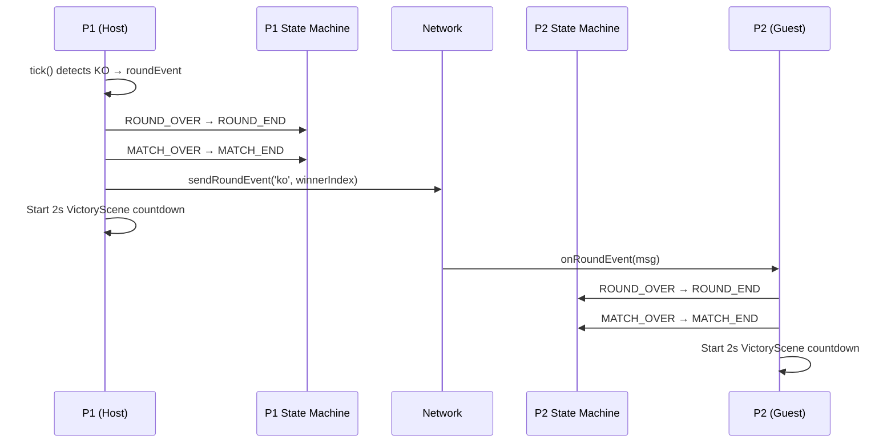
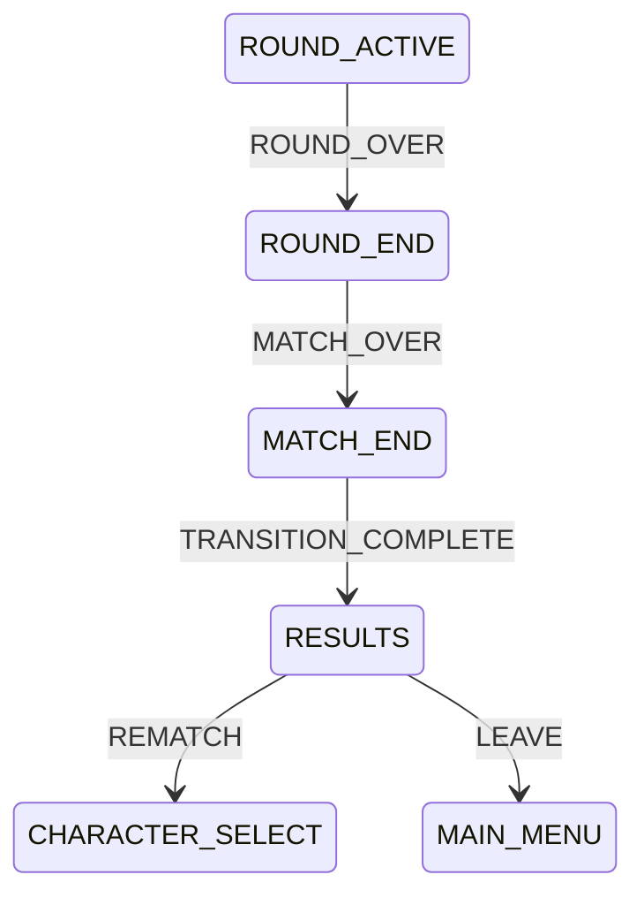
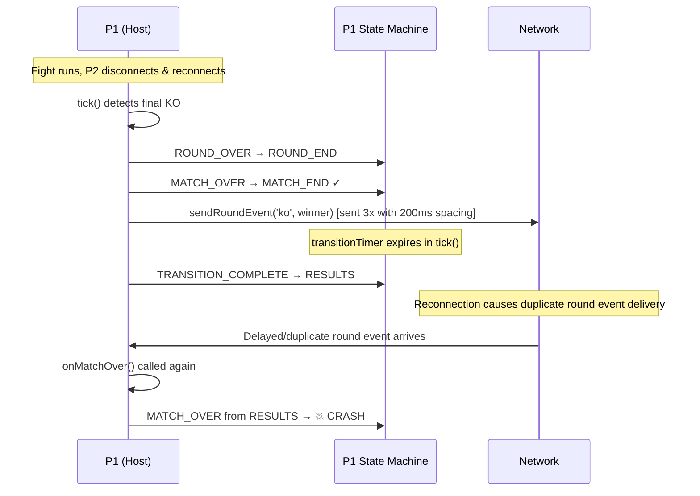

# E2E Diagnosis: Reconnection Test — Duplicate MATCH_OVER Transition

## TL;DR

`onMatchOver()` is called twice for the same match-ending event, and the second call crashes because the state machine already moved past `MATCH_END` into `RESULTS`.

## Background

### How online multiplayer ends a match

Our game uses **rollback netcode** — both players run the same simulation locally. When someone wins the final round, here's the sequence:



Both players end up in `MATCH_END` and transition to VictoryScene after a 2-second delay.

### The state machine flow for match endings



Once in `RESULTS`, the only valid events are `REMATCH` and `LEAVE`. Sending `MATCH_OVER` from `RESULTS` throws an error.

### What the reconnection E2E test does

The test (`tests/e2e/multiplayer-reconnection.spec.js`) simulates a network drop mid-fight:

1. P1 creates a room, P2 joins
2. Fight starts and runs for ~2 seconds
3. P2's WebSocket is forcibly closed (`socket.close()`)
4. Wait 1.5 seconds (within the 20-second grace period)
5. P2 reconnects (`socket.reconnect()`)
6. Fight resumes and runs to completion
7. Test asserts both peers saw `matchComplete: true`, zero desyncs

## The failure

```
Uncaught Error: Invalid transition: event 'MATCH_OVER' is not valid
in state 'RESULTS'. Valid events: [REMATCH, LEAVE]
```

Source: `src/systems/MatchStateMachine.js:167`, triggered from `FightScene.js:2008`.

The error occurs during test cleanup (`ctx1.close()` at line 133 of the test), meaning it happened asynchronously in the game — likely a delayed network event arriving after the match already ended.

## Root cause

`onMatchOver()` is called without checking if the match-over transition has already been processed. The method calls `this.matchState.transition(MatchEvent.MATCH_OVER)` unconditionally at line 2008:

```javascript
// src/scenes/FightScene.js:2004-2008
onMatchOver(winnerIndex) {
  if (this.matchState.canTransition(MatchEvent.ROUND_OVER)) {
    this.matchState.transition(MatchEvent.ROUND_OVER);  // guarded ✓
  }
  this.matchState.transition(MatchEvent.MATCH_OVER);    // NOT guarded ✗
  // ...
}
```

Here's what happens in the reconnection scenario:



The `_sendRoundEvent` method (line 2011) sends the round event **3 times with 200ms spacing** for reliability. After a reconnection, one of these retransmissions (or a re-sent event from the server's rejoin flow) can arrive late and trigger `onMatchOver()` again.

### Contributing factors

1. **`TRANSITION_COMPLETE` auto-fires**: The simulation loop detects `!wasRoundActive && this.combat.roundActive` (lines 1276-1278 in `_handleOnlineUpdate`) and fires `TRANSITION_COMPLETE`. For match-over, this transitions `MATCH_END → RESULTS` before the delayed round events finish arriving.

2. **No guard on `onMatchOver`**: The P2 `onRoundEvent` handler has a `_matchOverProcessed` guard (line 851), but the `onMatchOver()` method itself doesn't guard the `MATCH_OVER` transition. Any call site that reaches `onMatchOver` without its own guard will crash if the state machine has already moved past `MATCH_END`.

3. **Reconnection re-delivery**: After P2 reconnects, the server may re-send pending messages, or P1's redundant sends arrive out of order.

## The fix

Guard the `MATCH_OVER` transition in `onMatchOver()` and add an early return if the match has already been processed:

```javascript
// src/scenes/FightScene.js
onMatchOver(winnerIndex) {
  // Guard: don't process match-over twice
  if (!this.matchState.canTransition(MatchEvent.MATCH_OVER)) return;

  if (this.matchState.canTransition(MatchEvent.ROUND_OVER)) {
    this.matchState.transition(MatchEvent.ROUND_OVER);
  }
  this.matchState.transition(MatchEvent.MATCH_OVER);
  // ... rest of method
}
```

This is safe because `MATCH_OVER` is only valid from `ROUND_END`. If we're already in `MATCH_END` or `RESULTS`, the early return prevents the crash and the duplicate processing (duplicate audio, duplicate scene transitions).

## How to verify

```bash
bun run test:e2e                    # All 3 E2E tests should pass
bun run test:e2e:headed             # Watch visually — reconnection test should complete cleanly
bun run test:run                    # Unit tests still pass
```

## Key takeaway

When a method triggers state machine transitions, it should **always** guard with `canTransition()` — especially in networked code where the same event can arrive via multiple paths (local detection, network relay, reconnection re-delivery). The P2 `onRoundEvent` handler got this right with `_matchOverProcessed`; `onMatchOver()` itself did not.
