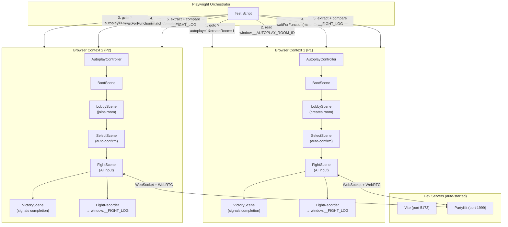
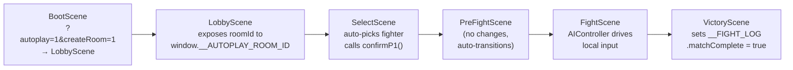

# E2E Multiplayer Testing Framework

Browser-based testing framework that spawns two game instances in autoplay mode, runs a full multiplayer match, and verifies both peers reach identical final state.

## Architecture



## Quick Start

```bash
# Run headless (CI-friendly)
bun run test:e2e

# Watch both browsers fight in real-time
bun run test:e2e:headed

# Manual testing (two tabs)
# Tab 1: http://localhost:5173/?autoplay=1&createRoom=1&fighter=simon&seed=42
# Tab 2: http://localhost:5173/?autoplay=1&room=XXXX&fighter=jeka&seed=42
```

Both Vite and PartyKit dev servers are auto-started by Playwright's `webServer` config.

## Components

### AutoplayController (`src/systems/AutoplayController.js`)

Reads URL parameters and exposes config to all scenes via `window.game.autoplay`.

| Parameter | Example | Description |
|-----------|---------|-------------|
| `autoplay` | `1` | Enable autoplay mode (required) |
| `createRoom` | `1` | Create a new room (P1) |
| `room` | `ABCD` | Join existing room (P2, existing param) |
| `fighter` | `simon` | Select specific fighter (default: random) |
| `aiDifficulty` | `hard` | AI difficulty: easy, medium, hard (default: medium) |
| `seed` | `12345` | Deterministic PRNG seed for reproducible AI decisions |
| `speed` | `2` | Overclock: run N simulation steps per visual frame (default: 1) |

### FightRecorder (`src/systems/FightRecorder.js`)

Records fight events to `window.__FIGHT_LOG`. Only instantiated when autoplay is active (zero overhead in normal gameplay).

**Recorded data:**

```javascript
window.__FIGHT_LOG = {
  // Metadata
  roomId, playerSlot, fighterId, opponentId, stageId,
  startedAt, completedAt, matchComplete,

  // Sparse input log (only when input changes)
  inputs: [{ frame, encoded }],

  // Periodic checksums (every 30 frames)
  checksums: [{ frame, hash }],

  // Round events
  roundEvents: [{ frame, type, winnerIndex }],

  // Network events (connect, rollback, desync, etc.)
  networkEvents: [{ time, type, ...data }],

  // Stats
  rollbackCount, maxRollbackFrames, desyncCount, totalFrames,

  // Final state (captured at match end)
  finalState,      // full game state snapshot
  finalStateHash,  // hashGameState() result
  result,          // { winnerId, loserId }
}
```

### Seeded PRNG in AIController

AIController accepts a seed via `setSeed(n)`. Uses mulberry32 PRNG to replace `Math.random()`. When seeded, AI decisions are fully deterministic — same seed + same game state = identical fight.

The seed is derived as `baseSeed + playerSlot` so P1 and P2 make different decisions even with the same base seed.

### Scene Chain (autoplay flow)



All autoplay logic is guarded by `if (this.game.autoplay?.enabled)`. No changes to normal gameplay.

### Overclock (`?speed=N`)

Multiplies the simulation accumulator so N frames run per visual frame instead of 1. E2E tests default to `speed=2` for ~2x faster matches.

When overclocked, the rollback system automatically scales:
- `inputDelay` multiplied by speed (more buffer for in-flight inputs)
- `maxRollbackFrames` multiplied by speed (wider rollback window)
- Adaptive delay recalculation disabled (would clamp values back down)

Higher speeds (5x+) stress the network more and can trigger latent desync bugs more often. Use `speed=1` for the most realistic testing conditions.

## Test Structure

```
tests/e2e/
  playwright.config.js               # Chromium, 120s timeout, webServer for Vite + PartyKit
  multiplayer-determinism.spec.js     # Main test suite
  helpers/
    browser-helpers.js                # URL builders, log extraction, wait utilities
```

### Test Cases

**1. Deterministic final state** — Specific fighters (`simon` vs `jeka`) with seed. Asserts:
- `finalStateHash` matches between P1 and P2
- Zero desyncs occurred
- All shared checksums match
- Both peers agree on the winner

**2. Random fighters smoke test** — No specific fighters or seed. Asserts:
- Match completes successfully on both sides
- Final state hashes match

### What the Tests Catch

| Scenario | How it's detected |
|----------|-------------------|
| Simulation non-determinism | `finalStateHash` mismatch |
| Floating-point divergence | Checksum mismatch at confirmed frames |
| Round event disagreement | `result.winnerId` mismatch |
| Desync under rollback | `desyncCount > 0` |
| Scene transition failure | `waitForMatchComplete` timeout |
| Connection failure | `waitForRoomId` timeout |

## Debugging Failed Tests

When a test fails, inspect the fight logs:

```javascript
// In browser console after a match:
console.log(JSON.stringify(window.__FIGHT_LOG, null, 2));
```

Key fields to check:
- **`checksums`** — find the first frame where hashes diverge between P1 and P2
- **`networkEvents`** — look for `desync` and `rollback` entries with frame numbers
- **`inputs`** — compare input sequences around the divergence frame
- **`rollbackCount`** / **`maxRollbackFrames`** — high values indicate prediction mismatches

On failure, the test generates two artifacts in `test-results/`:
- **`*-report.md`** — formatted markdown report (also posted as PR comment in CI)
- **`*-bundle.json`** — reproducibility bundle with everything needed to replay the fight

## Reproducibility Bundle

A single JSON file containing match config, both players' input logs, checksums, round events, and final state. Generated automatically on every E2E test run.

Use it to replay a fight in the browser:

```bash
# 1. Open browser console, store the bundle in sessionStorage:
sessionStorage.setItem('__REPLAY_BUNDLE', JSON.stringify(<paste bundle JSON>))

# 2. Navigate to replay mode (bundle survives the page load):
http://localhost:5173/?replay=1         # Normal speed
http://localhost:5173/?replay=1&speed=5 # Fast-forward
```

Or load the bundle file directly from the terminal:

```bash
# macOS — copies bundle to clipboard, then paste into console
cat test-results/random-fighters-bundle.json | pbcopy
# In browser console:
sessionStorage.setItem('__REPLAY_BUNDLE', '<paste>')
```

From Playwright (e.g., for automated replay verification):
```js
await page.evaluate((b) => { window.__REPLAY_BUNDLE = b; }, bundle);
await page.goto('http://localhost:5173/?replay=1&speed=5');
```

### Headless Replay

The bundle can also be replayed without a browser via the replay engine (`tests/helpers/replay-engine.js`):

```js
import { replayFromBundle } from './tests/helpers/replay-engine.js';
const result = replayFromBundle(bundle);
// result.finalStateHash, result.roundEvents, result.totalFrames
```

A Vitest test (`tests/systems/replay.test.js`) validates the replay engine against a known-good fixture.

## Remote Browser Testing (BrowserStack)

Run P1 and P2 on separate BrowserStack remote browsers for realistic cross-browser, cross-network testing. See [RFC 0009](rfcs/0009-e2e-remote-browser-testing.md) for full design.

```bash
# Requires BrowserStack credentials
BROWSERSTACK_USERNAME=xxx BROWSERSTACK_ACCESS_KEY=yyy bun run test:e2e:remote

# Specific browser preset (default, chrome-chrome, webkit-webkit)
REMOTE_E2E_PRESET=chrome-chrome bun run test:e2e:remote
```

**Trigger from CI** — two options:

1. **PR comment**: post `/e2e remote` or `/e2e remote --preset chrome-chrome --party-host myhost.partykit.dev`
2. **Manual**: Actions tab → "Remote E2E Tests (BrowserStack)" → "Run workflow" (works from any branch)

Results are posted back as a PR comment (if triggered from PR) with debug bundles as downloadable artifacts.

Key differences from local E2E:
- Two independent BrowserStack sessions (separate machines) connected via Playwright CDP
- Uses deployed staging infrastructure (Vercel + PartyKit cloud) — real network paths
- `speed=1` (no overclock) to exercise real latency and transport behavior
- `debug=1` always on — captures v2 debug bundles with telemetry and logger data
- Results in `test-results/remote/` including report, combined bundle, and console logs

### Architecture

```
tests/e2e/remote/
  remote-multiplayer.spec.js       # Test spec — orchestrates two remote browsers
  remote-config.js                 # Browser presets (Chrome/Win + WebKit/Mac, etc.)
  remote-helpers.js                # BrowserStack connection + data extraction helpers
  remote-playwright.config.js      # Playwright config (no webServer, longer timeouts)
```

## Future Enhancements

### Network Condition Simulation

Add a TCP proxy (e.g., Toxiproxy) between browsers and servers to simulate:
- Latency and jitter
- Packet loss and burst loss
- Mid-fight disconnection and reconnection

### Fight Replay Viewer

A dedicated replay UI that loads a bundle and lets you step through the fight frame-by-frame, showing both players' states side-by-side with divergence highlights.
