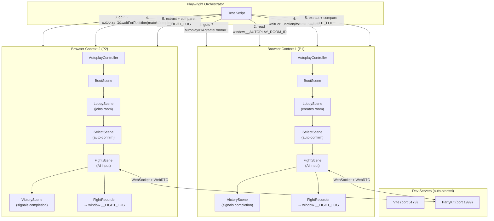
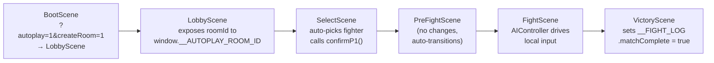

# E2E Multiplayer Testing Framework

Browser-based testing framework that spawns two game instances in autoplay mode, runs a full multiplayer match, and verifies both peers reach identical final state.

## Architecture



## Quick Start

```bash
# Run headless (CI-friendly)
bun run test:e2e

# Watch both browsers fight in real-time
bun run test:e2e:headed

# Manual testing (two tabs)
# Tab 1: http://localhost:5173/?autoplay=1&createRoom=1&fighter=simon&seed=42
# Tab 2: http://localhost:5173/?autoplay=1&room=XXXX&fighter=jeka&seed=42
```

Both Vite and PartyKit dev servers are auto-started by Playwright's `webServer` config.

## Components

### AutoplayController (`src/systems/AutoplayController.js`)

Reads URL parameters and exposes config to all scenes via `window.game.autoplay`.

| Parameter | Example | Description |
|-----------|---------|-------------|
| `autoplay` | `1` | Enable autoplay mode (required) |
| `createRoom` | `1` | Create a new room (P1) |
| `room` | `ABCD` | Join existing room (P2, existing param) |
| `fighter` | `simon` | Select specific fighter (default: random) |
| `aiDifficulty` | `hard` | AI difficulty: easy, medium, hard (default: medium) |
| `seed` | `12345` | Deterministic PRNG seed for reproducible AI decisions |

### FightRecorder (`src/systems/FightRecorder.js`)

Records fight events to `window.__FIGHT_LOG`. Only instantiated when autoplay is active (zero overhead in normal gameplay).

**Recorded data:**

```javascript
window.__FIGHT_LOG = {
  // Metadata
  roomId, playerSlot, fighterId, opponentId, stageId,
  startedAt, completedAt, matchComplete,

  // Sparse input log (only when input changes)
  inputs: [{ frame, encoded }],

  // Periodic checksums (every 30 frames)
  checksums: [{ frame, hash }],

  // Round events
  roundEvents: [{ frame, type, winnerIndex }],

  // Network events (connect, rollback, desync, etc.)
  networkEvents: [{ time, type, ...data }],

  // Stats
  rollbackCount, maxRollbackFrames, desyncCount, totalFrames,

  // Final state (captured at match end)
  finalState,      // full game state snapshot
  finalStateHash,  // hashGameState() result
  result,          // { winnerId, loserId }
}
```

### Seeded PRNG in AIController

AIController accepts a seed via `setSeed(n)`. Uses mulberry32 PRNG to replace `Math.random()`. When seeded, AI decisions are fully deterministic — same seed + same game state = identical fight.

The seed is derived as `baseSeed + playerSlot` so P1 and P2 make different decisions even with the same base seed.

### Scene Chain (autoplay flow)



All autoplay logic is guarded by `if (this.game.autoplay?.enabled)`. No changes to normal gameplay.

## Test Structure

```
tests/e2e/
  playwright.config.js               # Chromium, 120s timeout, webServer for Vite + PartyKit
  multiplayer-determinism.spec.js     # Main test suite
  helpers/
    browser-helpers.js                # URL builders, log extraction, wait utilities
```

### Test Cases

**1. Deterministic final state** — Specific fighters (`simon` vs `jeka`) with seed. Asserts:
- `finalStateHash` matches between P1 and P2
- Zero desyncs occurred
- All shared checksums match
- Both peers agree on the winner

**2. Random fighters smoke test** — No specific fighters or seed. Asserts:
- Match completes successfully on both sides
- Final state hashes match

### What the Tests Catch

| Scenario | How it's detected |
|----------|-------------------|
| Simulation non-determinism | `finalStateHash` mismatch |
| Floating-point divergence | Checksum mismatch at confirmed frames |
| Round event disagreement | `result.winnerId` mismatch |
| Desync under rollback | `desyncCount > 0` |
| Scene transition failure | `waitForMatchComplete` timeout |
| Connection failure | `waitForRoomId` timeout |

## Debugging Failed Tests

When a test fails, inspect the fight logs:

```javascript
// In browser console after a match:
console.log(JSON.stringify(window.__FIGHT_LOG, null, 2));
```

Key fields to check:
- **`checksums`** — find the first frame where hashes diverge between P1 and P2
- **`networkEvents`** — look for `desync` and `rollback` entries with frame numbers
- **`inputs`** — compare input sequences around the divergence frame
- **`rollbackCount`** / **`maxRollbackFrames`** — high values indicate prediction mismatches

The test report also prints a summary to console:

```
--- Multiplayer Determinism Report ---
Room: ABCD
P1: simon vs P2: jeka
Total frames: P1=3600, P2=3600
Rollbacks: P1=12, P2=8
Max rollback depth: P1=3, P2=4
Desyncs: P1=0, P2=0
Shared checksums: 120, mismatches: 0
Final state hash: P1=-1580074796, P2=-1580074796
Result: winner=simon
Duration: P1=62000ms, P2=62000ms
--------------------------------------
```

## Future Enhancements

### BrowserStack Integration

The framework is BrowserStack-compatible by design (URL-driven, `page.evaluate()` extraction). To run on real devices:

1. Add `browserstack.yml` with credentials and device matrix (iPhone 15 Safari, Android Chrome)
2. Deploy to staging or use BrowserStack Local tunnel
3. Run: `npx browserstack-node-sdk playwright test --config tests/e2e/playwright.config.js`

### Network Condition Simulation

Add a TCP proxy (e.g., Toxiproxy) between browsers and servers to simulate:
- Latency and jitter
- Packet loss and burst loss
- Mid-fight disconnection and reconnection

### Fight Replay

The recorded `inputs` array contains enough data to replay a fight frame-by-frame. A future replay viewer could load two fight logs and step through them side-by-side, highlighting divergence points.
