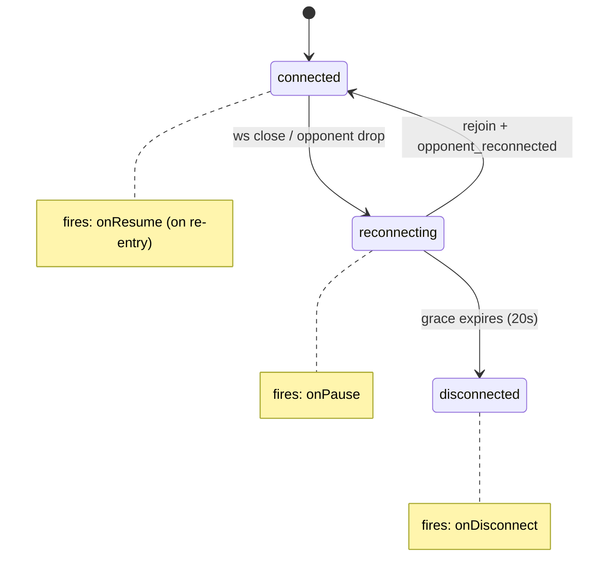
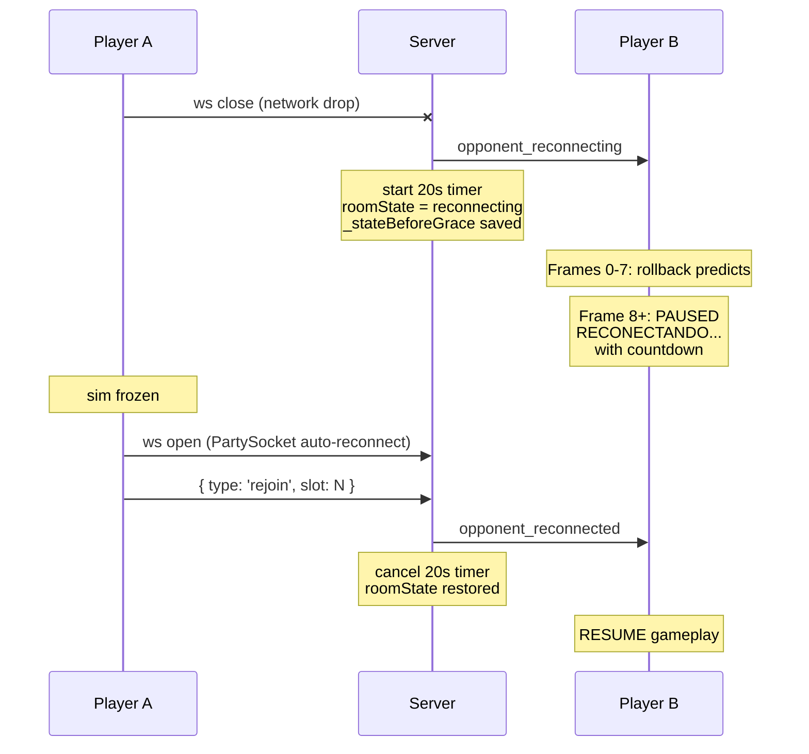
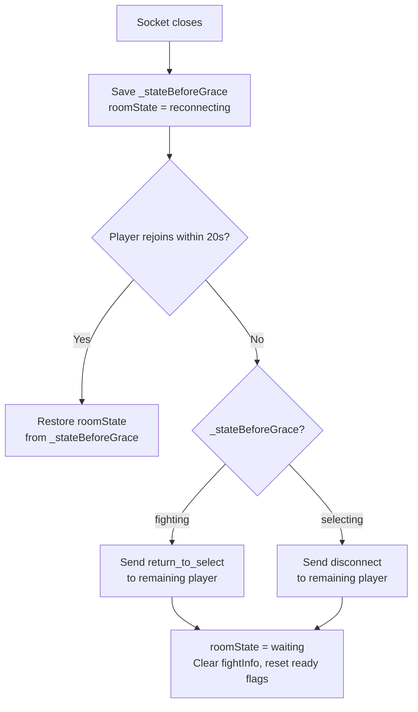
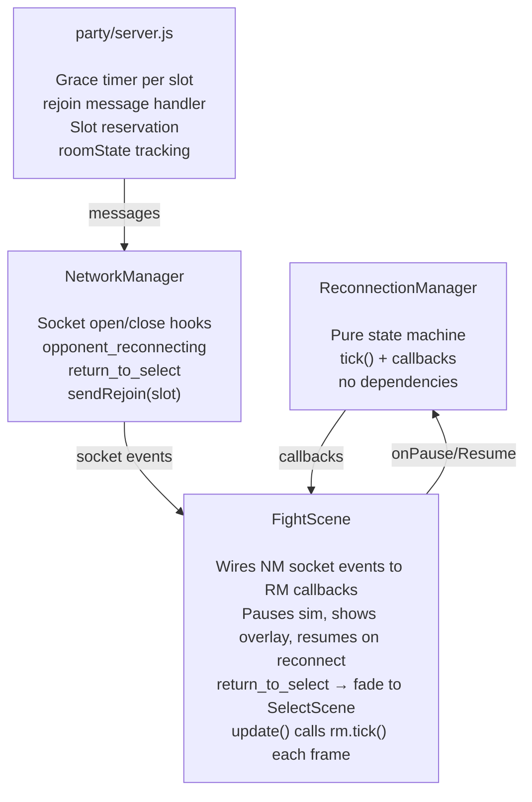

# Graceful Reconnection

20-second grace period absorbs brief network drops on mobile Safari. Covers both the client-side `ReconnectionManager` state machine and the server-side room state that determines what happens when the grace period expires.

## ReconnectionManager State Machine (Client)

Pure state machine with no Phaser or WebSocket dependencies. FightScene wires socket events to it and reacts to its callbacks.

## Successful Reconnection (< 20s)

## Grace Period Expiry

When the timer runs out, the server checks what state the room was in *before* the drop:

- **`return_to_select`**: Room is still viable. Remaining player sees "DESCONECTADO" for 2s, then fades to `SelectScene` with `NetworkManager` kept alive. A new opponent can join.
- **`disconnect`**: Remaining player goes to `TitleScene`, `NetworkManager` destroyed.

## Server Room State Machine

See [room-state-machine.md](room-state-machine.md) for the full `roomState` transition diagram and client message handling table.

## Module Responsibilities

## Connection Loss Detection

Two mechanisms detect connection loss:

1. **Pong timeout (active, ~9s)**: NetworkManager sends pings every 3s and tracks `_lastPongTime`. If no pong arrives for >6s (PONG_TIMEOUT_MS), it synthetically triggers `_onSocketClose()` to enter the reconnection flow. This fires ~9s after WiFi drops (2 missed pongs + next interval tick).
2. **WebSocket close (passive, 30s+)**: The browser eventually fires the `close` event. On mobile Safari this can take 30+ seconds.

The `ReconnectionManager.handleConnectionLost()` guard (`if (this._state !== 'connected') return`) ensures that if both fire, the second is a no-op.

## Key Files

| File | Role |
|------|------|
| `ReconnectionManager.js` | Pure state machine: connected → reconnecting → connected/disconnected |
| `party/server.js` | Grace timer, slot reservation, `roomState` + `_stateBeforeGrace`, `return_to_select` vs `disconnect` |
| `NetworkManager.js` | Socket lifecycle hooks, `opponent_reconnecting`/`opponent_reconnected`/`return_to_select` handlers, `sendRejoin()` |
| `FightScene.js` | Integration: wires NM events → RM, shows overlay, handles `return_to_select` transition to SelectScene |
