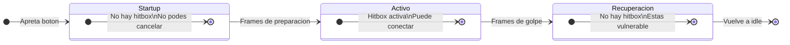
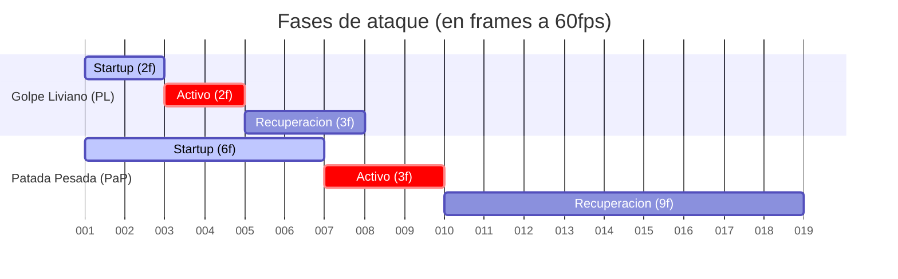
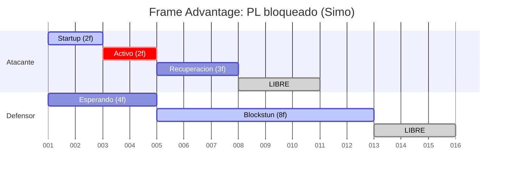
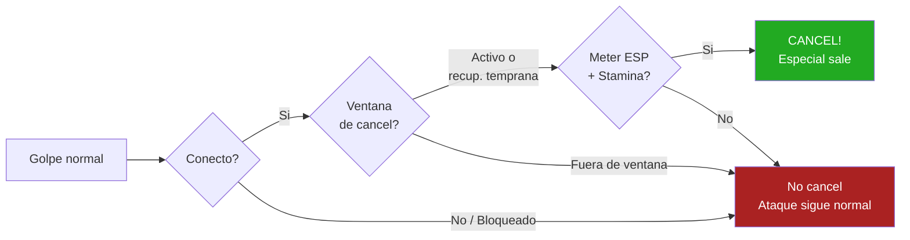
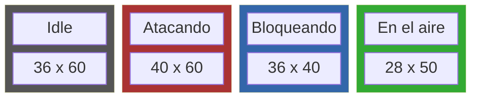

# Guia de Combate — A Los Traques

## Controles

### Teclado

| Accion | Tecla |
|--------|-------|
| Mover izquierda | ← |
| Mover derecha | → |
| Saltar | ↑ |
| Bloquear | ↓ |
| Golpe liviano (PL) | Z |
| Patada liviana (PaL) | X |
| Golpe pesado (PP) | A |
| Patada pesada (PaP) | S |
| Especial (ES) | D |
| Pausa | ESC |

### Pantalla tactil (iPhone)

- **Lado izquierdo**: joystick virtual para movimiento
- **Lado derecho**: 5 botones — PL, PaL, PP, PaP, ES
- Multi-touch: podes moverte y atacar al mismo tiempo

---

## Mecanicas Basicas

### Ataques y Fases

Cada ataque tiene tres fases:

- **Startup**: preparacion del golpe. No podes golpear durante estos frames.
- **Activo**: el golpe puede conectar. Si el oponente esta en rango, recibe dano.
- **Recuperacion**: tu personaje se recupera. Estas vulnerable y no podes actuar.

Comparacion de golpe liviano vs pesado:

**Ejemplo**: Si tiras una patada pesada (6f startup) y tu oponente tira un golpe liviano (2f startup), el golpe liviano conecta primero.

### Bloqueo

Mantene ↓ (o joystick abajo) para bloquear. Bloquear reduce el dano recibido al 20%.

Bloquear tiene un compromiso de **3 frames** — una vez que entras en bloqueo, no podes salir inmediatamente. Esto significa que bloquear es una prediccion, no una reaccion.

Cuando bloqueas, tu personaje se agacha, haciendo que tu hitbox sea mas chica y evitando algunos ataques altos.

### Ventaja de Frames (Frame Advantage)

Despues de que tu ataque es bloqueado, tanto vos como tu oponente quedan en un estado de recuperacion. Quien se recupera primero tiene la **ventaja de frames**.

En este ejemplo, el atacante se libera en el frame 7 pero el defensor recien en el frame 12. El atacante tiene **+5 frames de ventaja** — suficiente para tirar otro golpe antes de que el oponente pueda reaccionar.

- **Golpes livianos bloqueados**: vos te recuperas primero (ventaja para el atacante). Podes seguir presionando.
- **Golpes pesados bloqueados**: tu oponente se recupera primero (desventaja para el atacante). Cuidado.
- **Especiales bloqueados**: muy inseguro. Tu oponente se recupera mucho antes.

Esto crea un ritmo de "turnos" — despues de un golpe liviano bloqueado es tu turno de seguir atacando. Despues de un golpe pesado bloqueado, es el turno de tu oponente.

---

## Mecanicas Avanzadas

### Cancelar en Especial (Hit Confirm)

Esta es la mecanica mas importante para subir de nivel.

Si tu golpe normal **conecta** (no es bloqueado), podes cancelar la animacion tirando un especial (D) durante los frames activos o los primeros 4 frames de recuperacion.

**Reglas del cancel**:
- Solo funciona si el golpe conecto (no en whiff ni en bloqueo)
- Solo podes cancelar un golpe normal en especial (no especial en especial)
- Necesitas meter de especial (barra ESP) y stamina (barra STA)

**Por que importa**: Un golpe liviano solo hace ~5 de dano. Pero golpe liviano cancelado en especial hace ~33 de dano total. La habilidad esta en reconocer si tu golpe conecto o fue bloqueado, y decidir en milesimas de segundo si cancelar o no.

### Escalado de Combo

Cuando encadenas golpes en un combo, cada golpe siguiente hace menos dano:

| Golpe en combo | Dano |
|----------------|------|
| 1er golpe | 100% |
| 2do golpe | 80% |
| 3er golpe | 65% |
| 4to+ golpe | 50% |

Esto evita que un solo combo mate al oponente. Un combo de 2 golpes (normal → especial) es el punto ideal de eficiencia.

### Movimiento Aereo

- **Doble salto**: despues de unos frames en el aire, podes saltar de nuevo
- **Wall jump**: tocando una pared en el aire, apreta ↑ para rebotar
- **Wall slide**: tocando una pared, tu velocidad de caida se reduce

Tu hitbox en el aire es mas chica (mas angosta y corta), haciendo que seas mas dificil de golpear.

---

## Recursos

### Vida (HP)
Barra verde/roja arriba. Cuando llega a 0, pierde el round. Mejor de 2 rounds gana el match.

### Especial (ESP)
Barra amarilla. Se carga al recibir y dar dano. Cuando tenes 50+, podes tirar un especial (D). El especial hace mucho dano pero tiene startup largo y es muy inseguro si es bloqueado.

### Stamina (STA)
Barra cyan. Cada ataque consume stamina. Se regenera automaticamente (mas rapido en idle, mas lento atacando/bloqueando). Si te quedas sin stamina, no podes atacar hasta que se regenere.

---

## Arquetipos de Personajes

No todos los personajes juegan igual. Las diferencias clave son:

### Rushdown (Jecat, Panchito, Sun)
- Startup rapido (golpe liviano en 1-2f)
- Alcance corto (40-50px)
- Estrategia: acercate y presiona con golpes livianos rapidos

### Zoner (LinaPcmn)
- Alcance largo (55-70px)
- Startup medio
- Estrategia: mantene distancia y castiga con alcance superior

### Grappler (Ric)
- Hitbox alta (55px de alto)
- Alcance corto (35-45px)
- Dano alto, startup lento
- Estrategia: acercate y conecta golpes pesados devastadores

### Elastico (Bozz)
- Alcance extendido (55-65px)
- Frames activos largos (3-4f en normales)
- Estrategia: controla el espacio con golpes que quedan activos mas tiempo

### Balanced (Simo, Alv, Mao, y otros)
- Alcance y velocidad estandar
- Buenos en todo, excelentes en nada
- Estrategia: adapta tu juego segun el oponente

---

## Consejos para Principiantes

1. **Aprende a bloquear primero**. Un bloqueo a tiempo evita 80% del dano.
2. **Usa golpes livianos para empezar**. Son rapidos y seguros.
3. **No abuses de los golpes pesados**. Si fallan, quedas expuesto por muchos frames.
4. **Guarda el especial para hit confirms**. No lo tires crudo — es facil de bloquear.
5. **Mira tu stamina**. Si atacas mucho seguido, te vas a quedar sin stamina y no vas a poder atacar.

## Consejos para Jugadores Avanzados

1. **Practica el hit confirm**: golpe liviano → ver si conecto → cancelar en especial. Este es el skill gap principal.
2. **Cuenta frames de ventaja**: despues de un golpe liviano bloqueado, tenes ventaja. Segui atacando.
3. **Usa el salto con cuidado**: tu hurtbox es mas chica en el aire, pero no podes bloquear.
4. **Explota el bloqueo agachado**: al bloquear tu hitbox se achica. Algunos ataques altos te pasan por arriba.
5. **Conoce tus matchups**: contra rushdown, mantene distancia. Contra zoner, acercate con saltos y wall jumps.
