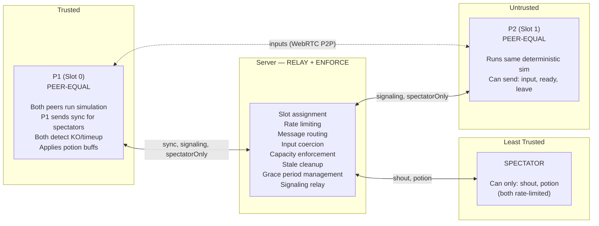
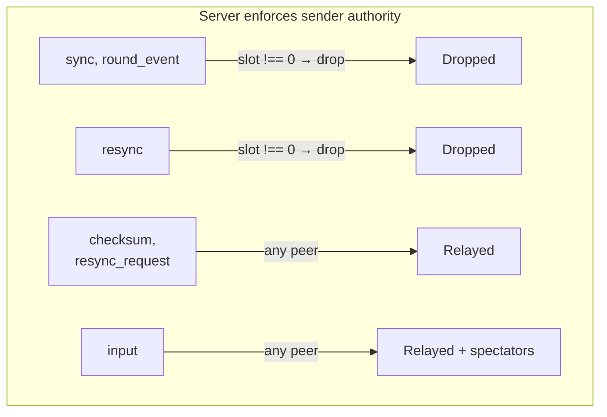
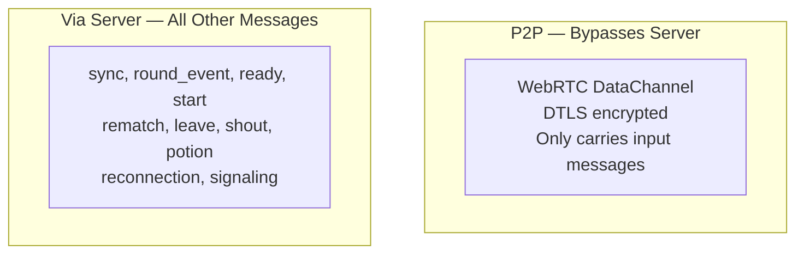
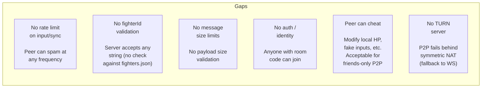

# Multiplayer Security Model

Trust boundaries, server protections, and known gaps.

## Trust Boundaries

Both peers run identical deterministic fixed-point simulations. FP integer math ensures bit-for-bit agreement — both independently detect KO, timeup, and round transitions. P1's additional roles: sending sync snapshots and round events for spectators, and sending authoritative resync snapshots on desync detection.

## Server-Side Protections (`party/server.js`)

### Room Capacity
- Max 2 player slots; extra connections get `full` + `close()`
- Slot -1 (unknown sender) = all messages ignored
- Stale slot detection compares against live connections

### Rate Limiting
- Shouts: 2s cooldown per connection
- Potions: 15s cooldown per connection
- Per-connection `Map`s, cleared on disconnect

### Input Coercion
- Shout text: `String().slice(0, 20)`
- Potion target: coerced to `0` or `1`
- Potion type: coerced to `'hp'` or `'special'`
- Unknown message types: silently ignored

### Grace Period
- 20s reconnection window per player slot
- Server tracks `roomState` and `_stateBeforeGrace` to send the right message on expiry
- See [room-state-machine.md](room-state-machine.md) for details

### Message Routing Isolation

| Method | Audience |
|--------|----------|
| `_sendToOther(slot, msg)` | Only opponent (not sender) |
| `_sendToHost(msg)` | Only slot 0 (potion requests) |
| `_broadcastToSpectators()` | Only spectators (not players) |
| `_broadcast()` | Everyone |

Spectator slot check: `if (slot === -1) return;` blocks all player message types from spectators.

### Authority Enforcement

Only P1 (slot 0) can send authoritative state messages (`sync`, `round_event`, `resync`). The server drops these from slot 1, preventing P2 from injecting false game state.

### WebRTC Signaling Relay
- Server relays `webrtc_offer`, `webrtc_answer`, `webrtc_ice` via `_sendToOther()` — only to the opponent, never to spectators
- Signaling messages are not validated (SDP/ICE payloads passed through). This is acceptable: malformed SDP only affects the recipient's RTCPeerConnection, which handles it gracefully
- No TURN server configured — only STUN (`stun.l.google.com`). If STUN fails (symmetric NAT), connection times out and falls back to WebSocket

### P2P Data Path

- DataChannel traffic is **DTLS encrypted** by the browser — no plaintext on the wire
- Only `input` messages flow over the DataChannel; all other message types remain on WebSocket through the server
- The `spectatorOnly` flag on WebSocket inputs prevents the server from double-relaying to the opponent when P2P is active. A malicious client could omit this flag to cause duplicate inputs, but the receiving peer's dedup guard (`if (this._webrtcReady && !this.isSpectator) break`) drops WebSocket inputs when DataChannel is active

## Client-Side Guards

- `PartySocket` maxRetries: 3
- Attack de-duplication: one-shot flags consumed after read
- HP capped at `MAX_HP`, special at `MAX_SPECIAL_FP`, stamina at `MAX_STAMINA_FP`
- Protocol: `localhost` = http, remote = https
- `ReconnectionManager` handles socket drops with grace period + overlay

## Known Security Gaps

| Gap | Impact | Mitigation |
|-----|--------|------------|
| No rate limit on input/sync | Peer can flood messages | Low risk: friends-only |
| No fighterId validation | Any string accepted | Cosmetic only, no gameplay impact |
| No message size limits | Large payloads possible | PartyKit has upstream limits |
| No auth/identity | Anyone with room code joins | Acceptable for friend groups |
| Peer can cheat locally | Can modify HP, fake inputs | Inherent to P2P; acceptable tradeoff |
| No TURN server | P2P fails behind symmetric NAT | Automatic fallback to WebSocket relay |
| SDP/ICE not validated by server | Malformed signaling passed through | Browser handles gracefully; worst case is P2P fails → WS fallback |
| P2P input not authenticated | Peer could send fake P2P inputs | Same risk as WS inputs — friends-only context |
