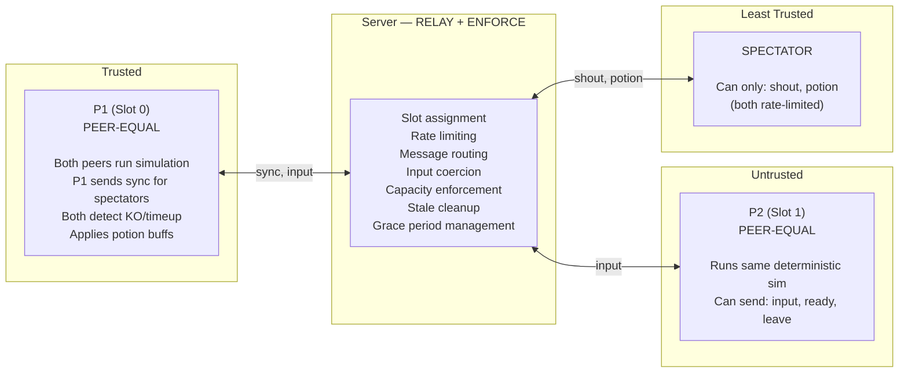
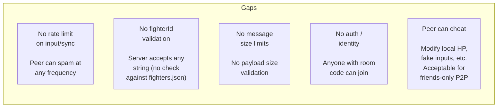

# Multiplayer Security Model

Trust boundaries, server protections, and known gaps.

## Trust Boundaries

Both peers run identical deterministic fixed-point simulations. FP integer math ensures bit-for-bit agreement — both independently detect KO, timeup, and round transitions. P1's only special role is sending sync snapshots and round events for spectators.

## Server-Side Protections (`party/server.js`)

### Room Capacity
- Max 2 player slots; extra connections get `full` + `close()`
- Slot -1 (unknown sender) = all messages ignored
- Stale slot detection compares against live connections

### Rate Limiting
- Shouts: 2s cooldown per connection
- Potions: 15s cooldown per connection
- Per-connection `Map`s, cleared on disconnect

### Input Coercion
- Shout text: `String().slice(0, 20)`
- Potion target: coerced to `0` or `1`
- Potion type: coerced to `'hp'` or `'special'`
- Unknown message types: silently ignored

### Grace Period
- 5s reconnection window per player slot
- Server tracks `roomState` and `_stateBeforeGrace` to send the right message on expiry
- See [room-state-machine.md](room-state-machine.md) for details

### Message Routing Isolation

| Method | Audience |
|--------|----------|
| `_sendToOther(slot, msg)` | Only opponent (not sender) |
| `_sendToHost(msg)` | Only slot 0 (potion requests) |
| `_broadcastToSpectators()` | Only spectators (not players) |
| `_broadcast()` | Everyone |

Spectator slot check: `if (slot === -1) return;` blocks all player message types from spectators.

## Client-Side Guards

- `PartySocket` maxRetries: 3
- Attack de-duplication: one-shot flags consumed after read
- HP capped at `MAX_HP`, special at `MAX_SPECIAL_FP`, stamina at `MAX_STAMINA_FP`
- Protocol: `localhost` = http, remote = https
- `ReconnectionManager` handles socket drops with grace period + overlay

## Known Security Gaps

| Gap | Impact | Mitigation |
|-----|--------|------------|
| No rate limit on input/sync | Peer can flood messages | Low risk: friends-only |
| No fighterId validation | Any string accepted | Cosmetic only, no gameplay impact |
| No message size limits | Large payloads possible | PartyKit has upstream limits |
| No auth/identity | Anyone with room code joins | Acceptable for friend groups |
| Peer can cheat locally | Can modify HP, fake inputs | Inherent to P2P; acceptable tradeoff |
