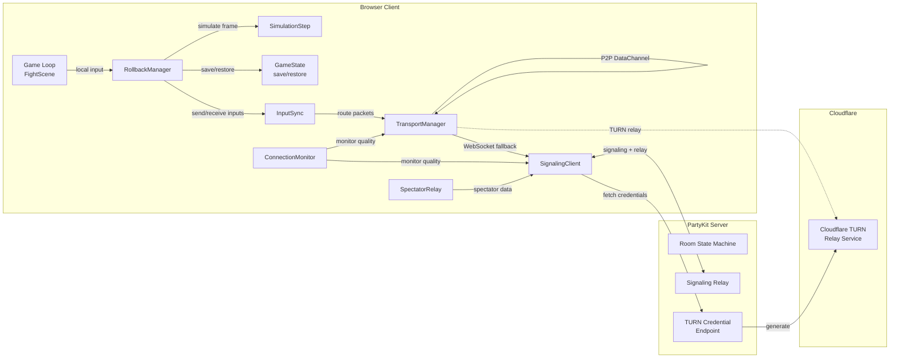
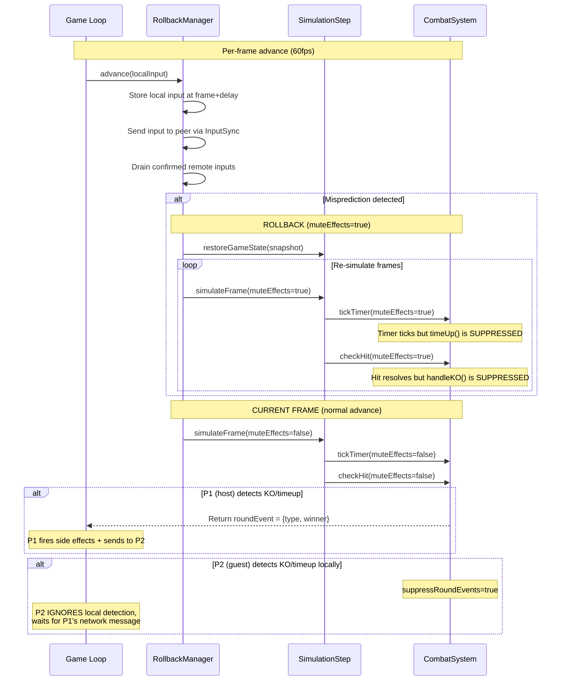
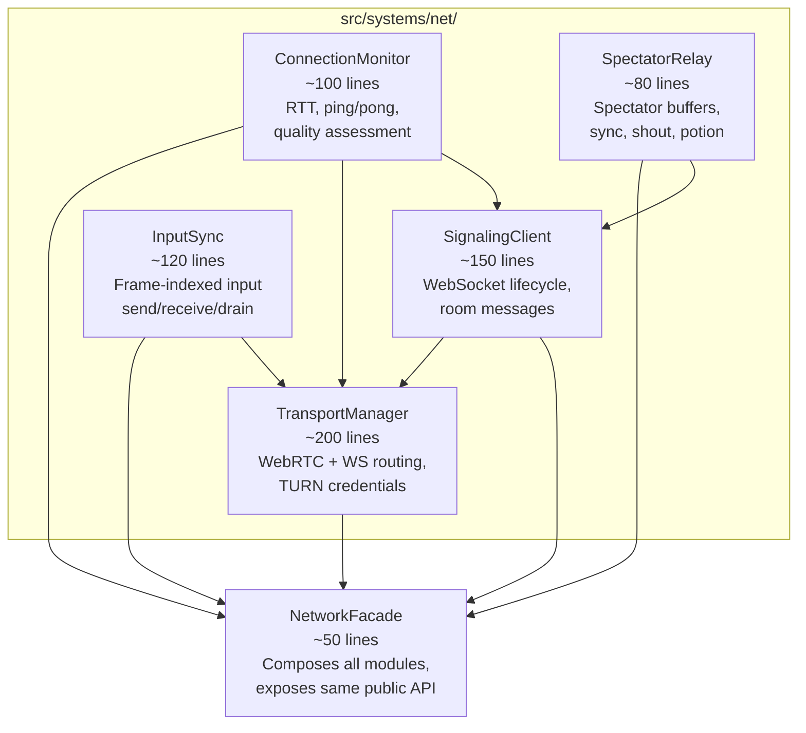
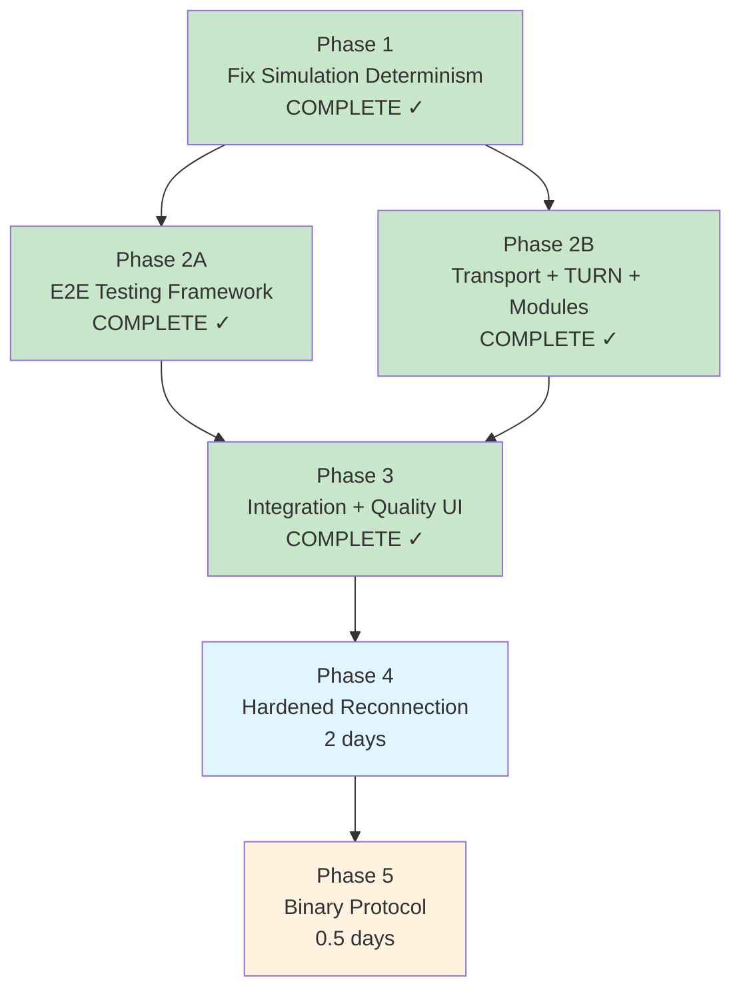

# RFC 0001: Networking Redesign

**Status:** In Progress — Phases 1, 2A, 2B, 3 complete
**Date:** 2026-03-22
**Author:** Architecture Team

---

## Summary

Multiplayer in A Los Traques is broken. Testing on real phones shows: timers 3-4 seconds apart, one phone declares a winner while the other continues playing, and fighters keep moving after the match has ended on one side.

Root cause analysis reveals bugs in **both** layers:

1. **Simulation/Rollback bugs** — Round-ending events (`timeUp`, `handleKO`) fire during rollback re-simulation and on predicted (unconfirmed) inputs, corrupting game state and causing divergence between peers.
2. **Transport bugs** — No TURN server means WebRTC fails behind symmetric NAT (every mobile carrier, most corporate WiFi). The 759-line `NetworkManager` monolith makes every fix a cross-cutting change.

This RFC proposes a full networking rewrite that fixes the simulation determinism bugs, adds Cloudflare TURN for reliable connectivity, decomposes the network layer into focused modules, and introduces a headless testing harness to prevent regressions.

---

## Goals and Non-Goals

### Goals

- **Fix multiplayer so both phones see the same game** — timer sync, round results agree, fighters stop when a round ends
- **Reliable P2P connectivity** — work across mobile carriers, corporate WiFi, symmetric NATs via TURN fallback
- **Rollback-safe round events** — KO/timeup detection must never corrupt simulation state during rollback re-simulation
- **Testable networking** — headless dual-simulation harness that can verify determinism and rollback correctness without a browser
- **Clean module boundaries** — replace the NetworkManager monolith with focused, independently testable modules
- **Connection quality visibility** — players know their connection quality before starting a match

### Non-Goals

- **Rust/Wasm rollback engine** — the current JS rollback math is sound; bugs are in event handling and transport, not in the rollback algorithm
- **Server-authoritative simulation** — P2P with rollback is correct for 1v1 fighting games (lowest latency)
- **Ranked matchmaking** — this is a friends game; room codes are sufficient
- **Anti-cheat** — friends-only context; peers can inspect/modify local state
- **Voice chat or video** — out of scope; game uses text shouts from spectators

---

## Requirements and Constraints

| Requirement | Detail |
|------------|--------|
| Platform | iPhone 15 Safari landscape (primary), Chrome/Firefox desktop (secondary) |
| Resolution | 480x270 internal, 60fps fixed timestep |
| Players | Exactly 2 per match + spectators |
| Perceived latency | < 100ms ("feels local") via input prediction |
| Transport | WebRTC DataChannel (unreliable/unordered) primary, WebSocket relay fallback |
| NAT traversal | Must work behind symmetric NAT (mobile carriers) |
| Reconnection | 20-second grace period for dropped connections |
| Language | All UI text in Spanish |
| Stack | Phaser 3, Vite, Bun, PartyKit (Cloudflare Workers) |
| Determinism | Fixed-point integer math (FP_SCALE=1000), frame-based timers, no floating-point in simulation path |

---

## Proposed Architecture

### High-Level Overview



### Rollback + Round Event Flow

This is the critical fix. The current system fires `timeUp()`/`handleKO()` during rollback re-simulation, corrupting state. The new design **defers** round events and only fires them on confirmed inputs.



### Module Decomposition

The 759-line `NetworkManager` is replaced by 5 focused modules:



---

## Technology Choices

| Component | Current | Proposed | Rationale |
|-----------|---------|----------|-----------|
| Rollback core | `RollbackManager.js` (JS) | Same (JS), with deferred round events | Architecture is sound; bugs are in event handling, not rollback math. GGRS/Wasm adds complexity without solving the actual problem. |
| TURN server | None (STUN only) | **Cloudflare Realtime TURN** | 1,000 GB/month free tier. Anycast routing to nearest edge. $0.05/GB after free tier. |
| STUN servers | `stun:stun.l.google.com:19302` (single) | Google STUN x2 + Cloudflare STUN | Redundancy. Multiple servers reduce single-point-of-failure risk. |
| Signaling/relay | PartyKit | **PartyKit** (keep) | Already deployed, works well. Built on Cloudflare Workers. Add `onRequest` for TURN credential endpoint. |
| Transport | `WebRTCTransport.js` + `NetworkManager.js` | `TransportManager.js` + `SignalingClient.js` | Clean separation of concerns. TURN credentials as constructor parameter. Transport-agnostic `send()` API. |
| Input sync | Embedded in `NetworkManager` | `InputSync.js` (extracted) | Independently testable. Clear API: `sendInput()`, `drainConfirmedInputs()`. |
| Monitoring | Ping/pong in `NetworkManager` | `ConnectionMonitor.js` (extracted) | Pre-match quality probing. Mid-match degradation detection. RTT on DataChannel (not just WebSocket). |
| Infra provisioning | Manual | **Terraform** (Cloudflare provider) | DNS, Workers config. TURN Key ID via Cloudflare dashboard/API (no Terraform resource exists for TURN yet). |
| Testing | Unit tests (Vitest) | + **Browser E2E framework** (Playwright) + **Headless replay engine** | Autoplay mode spawns two browsers, records confirmed inputs, compares final state. Replay engine reproduces fights from bundles. See `docs/e2e-testing.md`. |

### Cloudflare TURN Integration

```
┌─────────────┐     ┌──────────────────┐     ┌────────────────────┐
│  Client A    │     │  PartyKit Server │     │  Cloudflare TURN   │
│  (browser)   │     │  (onRequest)     │     │  Credential API    │
└──────┬───────┘     └────────┬─────────┘     └─────────┬──────────┘
       │  GET /turn-creds     │                         │
       │─────────────────────>│  POST generate-ice-     │
       │                      │  servers (ttl=86400)    │
       │                      │────────────────────────>│
       │                      │                         │
       │                      │  { iceServers: [...] }  │
       │                      │<────────────────────────│
       │  { iceServers }      │                         │
       │<─────────────────────│                         │
       │                      │                         │
       │  new RTCPeerConnection({ iceServers })         │
       │                                                │
```

**TURN Key ID and API Token** are provisioned via Terraform (`cloudflare_calls_turn_app` resource in `infra/main.tf`) and stored as PartyKit environment variables (`CLOUDFLARE_TURN_KEY_ID`, `CLOUDFLARE_TURN_API_TOKEN`).

**Terraform** manages: Cloudflare TURN app provisioning (key ID + bearer token). Outputs are wired to PartyKit env vars via `npx partykit env add`.

---

## Core API and Data Model

### SimulationStep — Rollback-Safe Round Events

The key change: `simulateFrame()` returns a round event descriptor instead of firing side effects directly. Side effects are deferred to the caller.

```javascript
// NEW: simulateFrame returns optional round event (no side effects)
/**
 * @returns {{ type: 'ko'|'timeup', winnerIndex: number } | null}
 */
export function simulateFrame(p1, p2, combat, p1Input, p2Input, { muteEffects = false } = {}) {
  p1.update();
  p2.update();
  applyInputToFighter(p1, decodeInput(p1Input));
  applyInputToFighter(p2, decodeInput(p2Input));
  combat.resolveBodyCollision(p1, p2);
  p1.faceOpponent(p2);
  p2.faceOpponent(p1);

  let roundEvent = null;
  if (combat.roundActive) {
    // checkHit returns KO info instead of calling handleKO()
    const p1Hit = combat.checkHit(p1, p2, { muteEffects });
    const p2Hit = combat.checkHit(p2, p1, { muteEffects });
    if (p1Hit?.ko) roundEvent = { type: 'ko', winnerIndex: 0 };
    else if (p2Hit?.ko) roundEvent = { type: 'ko', winnerIndex: 1 };

    // tickTimer returns timeup info instead of calling timeUp()
    const timerResult = combat.tickTimer({ muteEffects });
    if (timerResult?.timeup) {
      roundEvent = { type: 'timeup', winnerIndex: p1.hp >= p2.hp ? 0 : 1 };
    }
  }

  p1.syncSprite();
  p2.syncSprite();
  return roundEvent;
}
```

### RollbackManager — Deferred Event Handling

```javascript
// In RollbackManager.advance():

// During rollback re-simulation: IGNORE round events
for (let f = rollbackFrame; f < this.currentFrame; f++) {
  simulateFrame(p1, p2, combat, p1Input, p2Input, { muteEffects: true });
  // Return value (round event) is intentionally discarded
}

// During current frame: CAPTURE round event
const roundEvent = simulateFrame(p1, p2, combat, p1Input, p2Input);
// Return to caller (FightScene) for deferred handling
return { roundEvent };
```

### FightScene — P1 Authority for Round Events

```javascript
// P1 (host): fires side effects and sends to P2
const { roundEvent } = rollbackManager.advance(localInput, this, p1, p2, combat);
if (roundEvent && this.isHost) {
  combat.handleRoundEnd(roundEvent);  // Fire audio, camera, UI
  networkManager.sendRoundEvent(roundEvent);
}

// P2 (guest): waits for P1's network message
// combat.suppressRoundEvents = true (set in _setupOnlineMode)
networkManager.onRoundEvent((event) => {
  if (!this.isHost) {
    combat.handleRoundEnd(event);  // Fire audio, camera, UI
  }
});
```

### NetworkFacade — Composed Public API

The `NetworkFacade` composes all 5 modules and exposes the same API that `FightScene`, `LobbyScene`, and `SelectScene` currently use. This allows incremental migration.

```javascript
export class NetworkFacade {
  constructor(roomId, host, options) {
    this.signaling = new SignalingClient(roomId, host);
    this.transport = new TransportManager(this.signaling);
    this.inputSync = new InputSync(this.transport);
    this.monitor = new ConnectionMonitor(this.signaling, this.transport);
    this.spectator = options.spectator ? new SpectatorRelay(this.signaling) : null;
  }

  // Same public API as current NetworkManager:
  sendInput(frame, inputState, history) { return this.inputSync.sendInput(frame, inputState, history); }
  drainConfirmedInputs() { return this.inputSync.drainConfirmedInputs(); }
  sendChecksum(frame, hash) { return this.inputSync.sendChecksum(frame, hash); }
  sendReady(fighterId) { return this.signaling.sendReady(fighterId); }
  onAssign(cb) { return this.signaling.on('assign', cb); }
  onOpponentJoined(cb) { return this.signaling.on('opponent_joined', cb); }
  getPlayerSlot() { return this.signaling.playerSlot; }
  get rtt() { return this.monitor.rtt; }
  // ... etc
}
```

### InputSync — Clean Input Pipeline

```javascript
export class InputSync {
  constructor(transport) {
    this.transport = transport;
    this.remoteInputBuffer = new Map();  // frame → encodedInput
    this.lastRemoteInput = 0;
  }

  sendInput(frame, inputState, history) {
    const msg = { type: 'input', frame, state: inputState, history };
    this.transport.send(msg);
  }

  drainConfirmedInputs() {
    const entries = [...this.remoteInputBuffer.entries()];
    this.remoteInputBuffer.clear();
    return entries;
  }

  handleRemoteInput(frame, inputState, history) {
    this.remoteInputBuffer.set(frame, inputState);
    // Backfill gaps from redundant history
    for (const [hf, hs] of history) {
      if (!this.remoteInputBuffer.has(hf)) {
        this.remoteInputBuffer.set(hf, hs);
      }
    }
  }
}
```

### TransportManager — Dual Transport with TURN

```javascript
export class TransportManager {
  constructor(signalingClient) {
    this.signaling = signalingClient;
    this.pc = null;           // RTCPeerConnection
    this.dc = null;           // RTCDataChannel
    this.iceServers = null;   // Fetched from server
    this.state = 'idle';      // idle | connecting | webrtc | websocket
  }

  async fetchTurnCredentials() {
    // Called on opponent_joined, before WebRTC negotiation
    const creds = await this.signaling.fetchTurnCredentials();
    this.iceServers = creds.iceServers;
  }

  async connect(isOfferer) {
    await this.fetchTurnCredentials();
    this.pc = new RTCPeerConnection({ iceServers: this.iceServers });
    // ... DataChannel setup, offer/answer exchange via signaling
  }

  send(data) {
    if (this.dc?.readyState === 'open') {
      this.dc.send(JSON.stringify(data));
      return 'webrtc';
    }
    this.signaling.send(data);
    return 'websocket';
  }

  getConnectionInfo() {
    return {
      type: this.state,        // 'webrtc' | 'websocket'
      iceType: this._iceType,  // 'host' | 'srflx' | 'relay'
      rtt: this._dcRtt,
    };
  }
}
```

### ConnectionMonitor — Pre-Match Quality Probing

```javascript
export class ConnectionMonitor {
  constructor(signaling, transport) {
    this.signaling = signaling;
    this.transport = transport;
    this.rtt = 0;
    this.jitter = 0;
  }

  /**
   * Run pre-match quality assessment (call during character select).
   * Sends 10 pings over 2 seconds, measures RTT distribution.
   * @returns {{ avgRtt, maxRtt, jitter, iceType, quality: 'good'|'fair'|'poor' }}
   */
  async assessQuality() {
    const samples = [];
    for (let i = 0; i < 10; i++) {
      const rtt = await this._pingOnce();
      samples.push(rtt);
      await new Promise(r => setTimeout(r, 200));
    }
    const avgRtt = samples.reduce((a, b) => a + b, 0) / samples.length;
    const maxRtt = Math.max(...samples);
    const jitter = this._calculateJitter(samples);
    const iceType = this.transport.getConnectionInfo().iceType;

    let quality = 'good';
    if (avgRtt > 150 || iceType === 'relay') quality = 'fair';
    if (avgRtt > 250 || this.transport.state === 'websocket') quality = 'poor';

    return { avgRtt, maxRtt, jitter, iceType, quality };
  }
}
```

---

## Implementation Plan

### Phase 1: Fix Simulation Determinism (Critical Path) — COMPLETE ✓

**Goal:** Both peers see the same game state. Timer synchronized. Rounds end at the same time on both phones.

**Description:**
- Make `tickTimer()` accept `{ muteEffects }` — suppress `timeUp()` during rollback re-simulation
- Make `checkHit()` return KO info instead of calling `handleKO()` directly during simulation
- `simulateFrame()` returns optional round event descriptor instead of firing side effects
- `RollbackManager.advance()` captures round event from current frame, discards during re-simulation
- Both P1 and P2 set `combat.suppressRoundEvents = true` in `_setupOnlineMode()`
- P1 captures round events from `advance()` return value, fires via `combat.handleRoundEnd()`
- P2 receives round events from P1 via `onRoundEvent` network handler

**Deliverables:**
- Modified `CombatSystem.js` — `tickTimer({ muteEffects })`, `checkHit()` returns `{ hit, ko }`, new `handleRoundEnd(roundEvent)` method
- Modified `SimulationStep.js` — returns round event descriptor, passes `muteEffects` to all combat methods
- Modified `RollbackManager.js` — deferred round event handling, checksum on confirmed frames
- Modified `FightScene.js` — P1 authority, both players `suppressRoundEvents = true`, P2 `onRoundEvent` handler
- Modified `NetworkManager.js` — always accept WS inputs regardless of DataChannel state
- New `tests/systems/rollback-round-events.test.js` — 13 regression tests for rollback round events

**Additional fixes discovered during testing:**
- **False desync alerts:** Checksum was comparing predicted (unconfirmed) state at `currentFrame - 1`. Changed to `currentFrame - maxRollbackFrames - 1` so both peers compare confirmed state only. False desyncs triggered harmful resyncs that cleared input history.
- **Asymmetric WebRTC reconnection:** When P1's DataChannel reconnected, it ignored all WebSocket inputs. P2 might still be sending via WebSocket if P2's DataChannel wasn't ready. Removed the WS input ignore — `spectatorOnly` flag already prevents duplication.

**Estimated effort:** 2-3 days

---

### Phase 2A: E2E Testing Framework — COMPLETE ✓

**Goal:** Automated tests that catch desync, timer drift, and rollback corruption in real browsers.

**What was built (different from original plan):** Instead of a headless dual-simulation harness with `NetworkSimulator`, we built a browser-based E2E framework using Playwright that tests the full stack — real WebSocket/WebRTC, Phaser rendering, and scene transitions. This catches a wider class of bugs (scene flow, round transitions, network timing) than a headless harness would.

**Deliverables:**
- `src/systems/AutoplayController.js` — URL params (`?autoplay=1`, `?fighter=`, `?seed=`, `?speed=`) drive automated gameplay
- `src/systems/FightRecorder.js` — records inputs, confirmed input pairs (post-rollback), checksums, round events, desyncs to `window.__FIGHT_LOG`
- `src/systems/AIController.js` — seeded PRNG (`setSeed()`) for reproducible AI decisions
- `src/systems/ReplayInputSource.js` — frame-indexed input reader for browser replay
- `tests/e2e/multiplayer-determinism.spec.js` — Playwright tests spawning two browser contexts
- `tests/e2e/helpers/report-generator.js` — markdown failure reports (posted as PR comment in CI)
- `tests/e2e/helpers/bundle-generator.js` — reproducibility bundles with confirmed inputs
- `tests/helpers/sim-factory.js` — shared `createSimFighter`/`createSimCombat` (extracted from inline test definitions)
- `tests/helpers/replay-engine.js` — headless replay from bundle (Vitest, no browser)
- `tests/helpers/input-utils.js` — sparse-to-dense input expansion
- `tests/systems/replay.test.js` — Vitest replay determinism test
- `public/replay.html` — browser UI for loading and replaying bundles
- `.github/workflows/e2e.yml` — separate CI workflow with PR comment on failure + artifact upload
- Overclock mode (`?speed=N`) for faster test execution (2x default in CI)

**Key design decisions:**
- Browser E2E over headless dual-sim: tests the real game stack, not mocks. Already caught real desync bugs on first run.
- Confirmed input pairs: `RollbackManager._onConfirmedInputs` captures the exact P1+P2 inputs that `simulateFrame` received after rollback corrections, enabling exact replay.
- `?replay=1` mode: load a bundle via `/replay.html`, watch the fight with full Phaser rendering at any speed.
- Flaky test handling: `retries: 1` in Playwright config — known desync bug causes intermittent failures, marked as flaky (not blocking).

**Still planned (from original Phase 2A):**
- `NetworkSimulator` with configurable latency/jitter/loss — planned via Toxiproxy (see `TODO.md`)
- Network condition test scenarios (good WiFi, mobile cellular, burst loss, etc.)

**Full documentation:** `docs/e2e-testing.md`

---

### Phase 2B: Transport Layer + TURN — COMPLETE ✓

**Goal:** Reliable P2P connectivity across all network types. Clean module boundaries.

**What was built:**

**2B.1: Cloudflare TURN integration**
- `onRequest` handler on `party/server.js` generates TURN credentials via Cloudflare REST API (`POST rtc.live.cloudflare.com/v1/turn/keys/{keyId}/credentials/generate`)
- Reads `CLOUDFLARE_TURN_KEY_ID` and `CLOUDFLARE_TURN_API_TOKEN` from PartyKit env vars
- Graceful fallback: returns STUN-only servers when TURN is not configured or API fails
- `TransportManager.fetchTurnCredentials()` calls the endpoint before WebRTC negotiation
- `WebRTCTransport` accepts `iceServers` parameter instead of hardcoding STUN-only

**2B.2: Module decomposition**
The 762-line `NetworkManager` monolith was decomposed into 5 focused modules + a composing facade, all in `src/systems/net/`:

- **`SignalingClient.js`** (~175 lines) — PartySocket lifecycle, type-based message dispatch via `on(type, cb)`, B4 pending message queue, B5 callback buffering for `sync`/`round_event`/`start`
- **`TransportManager.js`** (~160 lines) — WebRTC lifecycle, TURN credential fetching, dual-transport routing (DataChannel primary, WS fallback), signaling relay
- **`InputSync.js`** (~210 lines) — Input buffers (player + spectator), B3 OR-merge attack flags, input history gap-fill, `drainConfirmedInputs()` for RollbackManager, dual-transport `sendInput()`
- **`ConnectionMonitor.js`** (~85 lines) — Ping interval (3s), pong timeout (6s), RTT measurement
- **`SpectatorRelay.js`** (~120 lines) — Sync/round_event broadcast with B5 buffering, spectator count, shout, potion, fight state
- **`NetworkFacade.js`** (~260 lines) — Composes all 5 modules, exposes identical public API to `NetworkManager` (same callback registration, send methods, input consumption, lifecycle)

**Key design decisions:**
- `SignalingClient` uses a generic `on(type, cb)` event system instead of ~30 named callback properties. Other modules register for the types they care about.
- B5 buffering lives in two layers: `SignalingClient` buffers messages when no handler is registered for a type; `SpectatorRelay` additionally buffers `sync`/`round_event` when its own callback isn't set yet (since it eagerly registers handlers on `SignalingClient` in its constructor).
- `NetworkManager.js` is NOT deleted yet — scenes still import it. Phase 3 swaps imports to `NetworkFacade`.
- `WebRTCTransport.js` stays as a standalone module; `TransportManager` wraps it with TURN credentials and signaling relay.

**2B.3: Terraform configuration** — deferred (infrastructure provisioning is orthogonal to code)

**Deliverables:**
- `src/systems/net/SignalingClient.js` — WebSocket lifecycle, message dispatch
- `src/systems/net/TransportManager.js` — WebRTC + TURN + transport routing
- `src/systems/net/InputSync.js` — Input buffers, OR-merge, dual-transport send
- `src/systems/net/ConnectionMonitor.js` — Ping/pong, RTT, timeout detection
- `src/systems/net/SpectatorRelay.js` — Spectator messaging with B5 buffering
- `src/systems/net/NetworkFacade.js` — Composes all modules, same public API
- Modified `party/server.js` — `onRequest` for TURN credential endpoint
- Modified `src/systems/WebRTCTransport.js` — accepts `iceServers` param
- `tests/systems/net/signaling-client.test.js` (25 tests)
- `tests/systems/net/transport-manager.test.js` (18 tests)
- `tests/systems/net/input-sync.test.js` (24 tests)
- `tests/systems/net/connection-monitor.test.js` (8 tests)
- `tests/systems/net/spectator-relay.test.js` (16 tests)
- `tests/systems/net/network-facade.test.js` (25 tests)
- Modified `tests/party/server.test.js` (6 new TURN endpoint tests)

**Estimated effort:** 4-5 days

---

### Phase 3: Integration + Connection Quality — COMPLETE ✓

**Goal:** Wire fixed simulation to new transport. Pre-match quality indicator.

**What was done:**
- Swapped `NetworkManager` imports to `NetworkFacade` in `LobbyScene` and `SpectatorLobbyScene` (the two construction sites). All other scenes receive the network manager via scene data, so the swap is transparent.
- `FightScene._setupOnlineMode()` updated to use `onSocketClose(cb)`/`onSocketOpen(cb)` methods instead of direct `_onSocketClose`/`_onSocketOpen` assignment
- `RollbackManager` JSDoc updated to reference `NetworkFacade`
- TURN credentials automatically fetched on `opponent_joined` (async, before WebRTC init). Credentials cached for reconnection.
- Connection quality indicator in `SelectScene`: shows "P2P" (green) when WebRTC DataChannel is open, "Relay" (yellow) when only WebSocket, or "..." (red) when disconnected. Updates every 2 seconds.
- Added `_webrtcReady` compat getter on `NetworkFacade` for FightScene HUD

**Deferred to future work:**
- `ConnectionMonitor.assessQuality()` pre-match probing (10-ping RTT distribution) — useful but not blocking; the simpler transport indicator covers the main use case
- `connection_quality` server message type — both peers can assess independently
- `NetworkManager.js` and `WebRTCTransport.js` not deleted yet — can be removed once integration is verified on real devices

**Deliverables:**
- Modified `src/scenes/LobbyScene.js` — import swap to NetworkFacade
- Modified `src/scenes/SpectatorLobbyScene.js` — import swap to NetworkFacade
- Modified `src/scenes/FightScene.js` — use public socket callbacks
- Modified `src/scenes/SelectScene.js` — connection quality indicator
- Modified `src/systems/RollbackManager.js` — JSDoc update
- Modified `src/systems/net/NetworkFacade.js` — `_webrtcReady` getter, TURN fetch on opponent_joined

---

### Phase 4: Hardened Reconnection (Depends on Phase 3)

**Goal:** Fix race conditions in reconnection flow.

**Description:**
- `TransportManager` handles WebRTC renegotiation as a proper state machine (not `_initWebRTC()` called from multiple code paths)
- On reconnect: `SignalingClient` reconnects WebSocket → sends `rejoin` → waits for server confirmation → `TransportManager` renegotiates WebRTC
- Sequential, not concurrent: WebSocket must be stable before WebRTC renegotiation starts
- `ReconnectionManager` (already solid) receives events from `SignalingClient` and `TransportManager` through clean callbacks
- Add reconnection integration test in headless harness: simulate WebSocket drop, reconnect, verify state convergence

**Deliverables:**
- `TransportManager` reconnection state machine
- `SignalingClient` rejoin flow (sequential)
- `tests/integration/reconnection.test.js`

**Risks:**
- WebRTC renegotiation on Safari has known quirks (ICE restart behavior). Mitigate: on reconnect failure, fall back to WebSocket relay rather than retrying indefinitely.

**Estimated effort:** 2 days

---

### Phase 5: Binary Input Protocol (Optional)

**Goal:** Reduce per-packet overhead on DataChannel.

**Description:**
Currently inputs are JSON-encoded (~100 bytes per packet):
```json
{"type":"input","frame":1234,"state":{"left":true,"right":false,...},"history":[[1233,42],[1232,0]]}
```

Replace with binary encoding on DataChannel (keep JSON on WebSocket for debuggability):
- 1 byte: message type (0x01 = input)
- 2 bytes: frame number (uint16, wraps at 65535 = ~18 minutes at 60fps)
- 2 bytes: encoded input (uint16, only 9 bits used)
- N * 4 bytes: history entries (uint16 frame + uint16 input each)
- Total: ~13 bytes vs ~100 bytes

**Why optional:** At 60fps, even JSON is only ~6KB/s, well within any connection. But smaller packets reduce DataChannel per-packet overhead and are more resilient to congestion.

**Deliverables:**
- `src/systems/net/BinaryCodec.js` — encode/decode binary input packets
- `tests/systems/net/binary-codec.test.js`
- Updated `TransportManager.send()` to use binary on DataChannel

**Risks:**
- Binary debugging is harder. Mitigate: keep JSON on WebSocket path, add hex dump logging for binary path.

**Estimated effort:** 0.5 days

---

## Phase Dependency Diagram



**Completed** (green): Phases 1, 2A, 2B, 3. **Next** (blue): Phase 4. Phase 5 is optional (orange).

**Remaining estimated effort:** 2-2.5 days (Phases 4 and 5).

---

## Migration and Rollout Strategy

### Incremental Migration via NetworkFacade

The `NetworkFacade` pattern allows zero-disruption migration:

1. **Phase 1** modifies existing files in-place (SimulationStep, CombatSystem, RollbackManager, FightScene). No module boundary changes.

2. **Phase 2B** creates new modules in `src/systems/net/` and a `NetworkFacade` that exposes the exact same public API as the current `NetworkManager`. Scenes continue to import and use the same interface.

3. **Phase 3** swaps imports from `NetworkManager` to `NetworkFacade`. This is a mechanical find-and-replace with no behavioral changes.

4. Once all scenes use `NetworkFacade`, delete `src/systems/NetworkManager.js` and `src/systems/WebRTCTransport.js`.

### Rollout Steps

1. ✅ **Local testing:** Fix simulation bugs (Phase 1), E2E testing framework (Phase 2A) — catches desync bugs in CI
2. **Staging:** Deploy TURN-enabled PartyKit server, test on two iPhones over cellular
3. **Canary:** Enable for a subset of rooms (e.g., rooms starting with "test-")
4. **Full rollout:** Remove canary gate, update docs

### Backward Compatibility

- The PartyKit server changes are additive (new `onRequest` endpoint, new `connection_quality` message type). Old clients continue to work — they just won't use TURN or quality probing.
- The `NetworkFacade` exposes the same API. No scene changes required during Phase 2B.

---

## Testing Strategy

### Layer 1: Browser E2E Framework (COMPLETE ✓)

Playwright-based framework that spawns two browser instances in autoplay mode, runs full multiplayer matches, and verifies determinism. See `docs/e2e-testing.md` for complete details.

- **Autoplay mode** (`?autoplay=1`): AI-driven gameplay, seeded PRNG, overclock support
- **FightRecorder**: captures inputs, confirmed input pairs (post-rollback), checksums, round events, desyncs
- **Failure reports**: markdown report + reproducibility bundle generated on every run, posted as PR comment in CI
- **Replay**: load bundle via `/replay.html` for browser replay, or `replayFromBundle()` for headless Vitest replay
- **CI**: separate workflow (`.github/workflows/e2e.yml`), artifact upload, `retries: 1` for known flaky desync

```bash
bun run test:e2e          # Headless (CI)
bun run test:e2e:headed   # Watch both browsers fight
```

### Layer 2: Targeted Rollback Regression Tests (COMPLETE ✓)

13 tests in `tests/systems/rollback-round-events.test.js` covering:
- Timer reaching 0 during rollback re-simulation (no side effects)
- KO during rollback (deferred, not fired)
- KO on predicted vs confirmed inputs
- Round event deduplication
- Timer/state synchronization

### Layer 3: Headless Replay Engine (COMPLETE ✓)

`tests/helpers/replay-engine.js` replays fights from bundles using pure simulation (no Phaser). Uses shared `sim-factory.js` (extracted from test inline definitions). Vitest test validates deterministic replay against fixture bundles.

### Layer 4: Transport Unit Tests (COMPLETE ✓)

116 tests across 6 test files in `tests/systems/net/`:
- `SignalingClient` (25 tests): message dispatch, B4 queuing, B5 buffering, socket lifecycle, destroy cleanup
- `TransportManager` (18 tests): WebRTC lifecycle, signaling relay, P2P messaging, TURN credentials, transport fallback
- `InputSync` (24 tests): B3 OR-merge, input history processing, P2P input, dual-transport send, checksum/resync, drain
- `ConnectionMonitor` (8 tests): ping interval, pong timeout, RTT measurement
- `SpectatorRelay` (16 tests): send/receive for all spectator message types, B5 buffering, reset/destroy
- `NetworkFacade` (25 tests): API surface validation, message routing, WebRTC integration, B4/B5 behavior, resetForReselect

### Layer 5: Network Condition Simulation (Planned — Toxiproxy)

TCP proxy between browsers and PartyKit for simulating latency, jitter, packet loss, burst loss, and disconnection. See `TODO.md` for design.

---

## Open Questions and Alternatives

### Open Questions

| # | Question | Impact | Current Leaning |
|---|----------|--------|-----------------|
| 1 | Should P2 also detect round events locally (with delay tolerance) as a backup, or purely wait for P1's message? | If P1 disconnects mid-round-event, P2 might hang. | P2 detects locally with a 30-frame delay as a fallback. If P1's message hasn't arrived within 30 frames of local detection, P2 fires locally. |
| 2 | Should the binary protocol (Phase 5) be prioritized? | Smaller packets are more resilient to congestion on constrained mobile connections. | Keep optional. JSON at 6KB/s is fine for DataChannel. Revisit if testing shows packet loss issues at scale. |
| 3 | Should we add a TURN-only mode for debugging? | Useful for testing TURN path specifically. | Yes — add a `?forceTurn=1` URL parameter that sets `iceTransportPolicy: 'relay'` on RTCPeerConnection. |
| 4 | Should spectator sync use the rollback system or stay as P1-broadcasted snapshots? | Current approach (P1 broadcasts every 3 frames) is simple and works. Rollback for spectators adds complexity. | Keep current approach. Spectators don't need frame-perfect accuracy. |
| 5 | How should we handle TURN credential expiry during very long sessions? | TURN credentials have max 48h TTL. Matches are typically < 10 minutes. | No action needed. If a match somehow lasts > 48h, TURN fallback stops working but WebSocket relay continues. |

### Alternatives Considered

**GGRS (Rust/Wasm)**
- Pros: Battle-tested rollback library, handles spectator delay, input delay calculation
- Cons: Wasm bridging overhead (copy 30 state fields across JS/Wasm boundary 60x/sec), Rust toolchain maintenance, Safari Wasm debugging is painful
- Verdict: **Rejected.** The rollback math is 324 lines of JS and works correctly. The bugs are in event handling and transport, not rollback scheduling.

**geckos.io**
- Pros: WebRTC DataChannel library with server-side Node component, handles connection management
- Cons: Designed for client-server topology (not P2P), adds a server hop, unmaintained (last release 2023)
- Verdict: **Rejected.** P2P is correct for 1v1 fighting games. Adding a server hop increases latency.

**Cloudflare Durable Objects (replace PartyKit)**
- Pros: More control, no PartyKit dependency
- Cons: Would reimplement WebSocket management that PartyKit provides for free. PartyKit IS built on Durable Objects.
- Verdict: **Rejected.** PartyKit works and is deployed. The server code is 362 lines and well-understood.

**Client-Server Architecture (server runs simulation)**
- Pros: No desync possible (single source of truth), easier anti-cheat
- Cons: Adds ~50-100ms latency per input (server round-trip), requires beefy server, overkill for friends game
- Verdict: **Rejected.** For a 1v1 fighting game where every frame matters, P2P with rollback is the correct architecture.

**Metered.ca (alternative TURN provider)**
- Pros: Simple REST API, free tier (50 GB/month)
- Cons: Smaller free tier than Cloudflare (50 GB vs 1,000 GB), separate infrastructure from the rest of the stack
- Verdict: **Rejected in favor of Cloudflare TURN.** Same cloud provider as PartyKit, 20x larger free tier.

---

## Appendix: Files Modified/Created

### Phase 1 (Complete) — Modified

| File | Change |
|------|--------|
| `src/systems/CombatSystem.js` | `tickTimer({ muteEffects })`, `checkHit()` returns KO info, `handleRoundEnd()` |
| `src/systems/SimulationStep.js` | Returns round event, passes `muteEffects` to all combat methods |
| `src/systems/RollbackManager.js` | Deferred round event in `advance()`, discard during re-simulation, `_onConfirmedInputs` callback |
| `src/scenes/FightScene.js` | P1 authority wiring, P2 `suppressRoundEvents`, deferred events, autoplay, replay mode |
| `tests/systems/rollback-round-events.test.js` | 13 regression tests for deferred round events |

### Phase 2A (Complete) — Created

| File | Purpose |
|------|---------|
| `src/systems/AutoplayController.js` | URL param reader for autoplay/replay mode |
| `src/systems/FightRecorder.js` | Records inputs, confirmed pairs, checksums, round events, desyncs |
| `src/systems/AIController.js` | Added seeded PRNG for reproducible AI |
| `src/systems/ReplayInputSource.js` | Frame-indexed input reader for browser replay |
| `tests/e2e/playwright.config.js` | Playwright config (Chromium, webServer, retries) |
| `tests/e2e/multiplayer-determinism.spec.js` | E2E determinism tests |
| `tests/e2e/helpers/browser-helpers.js` | URL builders, log extraction, wait utilities |
| `tests/e2e/helpers/report-generator.js` | Markdown failure report generator |
| `tests/e2e/helpers/bundle-generator.js` | Reproducibility bundle generator |
| `tests/helpers/sim-factory.js` | Shared `createSimFighter`/`createSimCombat` |
| `tests/helpers/input-utils.js` | Sparse-to-dense input expansion |
| `tests/helpers/replay-engine.js` | Headless replay from bundle |
| `tests/systems/replay.test.js` | Vitest replay determinism test |
| `public/replay.html` | Browser UI for loading and replaying bundles |
| `.github/workflows/e2e.yml` | CI workflow for E2E tests |
| `docs/e2e-testing.md` | E2E testing framework documentation |

### Phase 2B (Complete) — Created

| File | Purpose |
|------|---------|
| `src/systems/net/SignalingClient.js` | WebSocket lifecycle, type-based message dispatch |
| `src/systems/net/TransportManager.js` | WebRTC + TURN + transport routing |
| `src/systems/net/InputSync.js` | Input buffers, OR-merge, dual-transport send |
| `src/systems/net/ConnectionMonitor.js` | Ping/pong, RTT, timeout detection |
| `src/systems/net/SpectatorRelay.js` | Spectator messaging with B5 buffering |
| `src/systems/net/NetworkFacade.js` | Composes all modules, same public API |
| `tests/systems/net/signaling-client.test.js` | 25 tests for SignalingClient |
| `tests/systems/net/transport-manager.test.js` | 18 tests for TransportManager |
| `tests/systems/net/input-sync.test.js` | 24 tests for InputSync |
| `tests/systems/net/connection-monitor.test.js` | 8 tests for ConnectionMonitor |
| `tests/systems/net/spectator-relay.test.js` | 16 tests for SpectatorRelay |
| `tests/systems/net/network-facade.test.js` | 25 tests for NetworkFacade |

### Phase 2B (Complete) — Modified

| File | Change |
|------|--------|
| `party/server.js` | Added `onRequest` for TURN credential endpoint |
| `src/systems/WebRTCTransport.js` | Accepts `iceServers` param instead of hardcoding |
| `tests/party/server.test.js` | 6 new tests for TURN credential endpoint |

### Phases 3-5 (Planned) — To Create

| File | Purpose |
|------|---------|
| `infra/main.tf` | Terraform config for Cloudflare DNS + env vars |
| `src/systems/net/BinaryCodec.js` | Binary input encoding (Phase 5, optional) |

### Phases 3-5 (Planned) — To Delete

| File | Reason |
|------|--------|
| `src/systems/NetworkManager.js` | Replaced by `net/` modules + `NetworkFacade` (Phase 3) |
| `src/systems/WebRTCTransport.js` | Kept as-is; wrapped by `TransportManager` |
