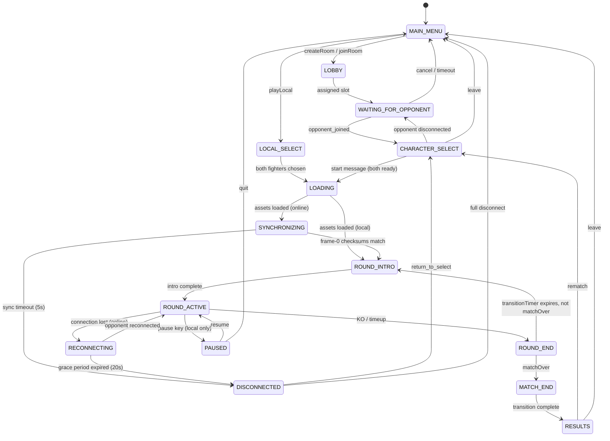
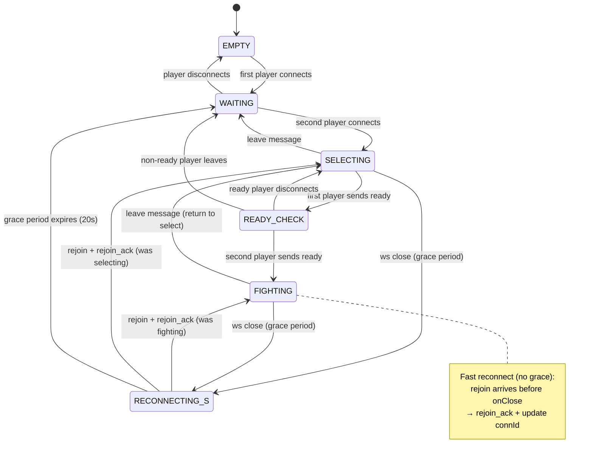
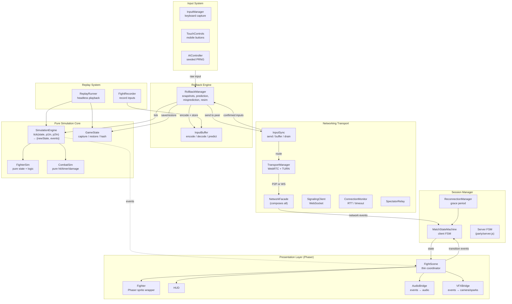
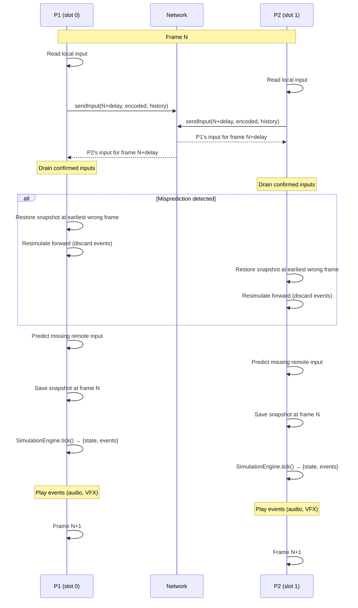
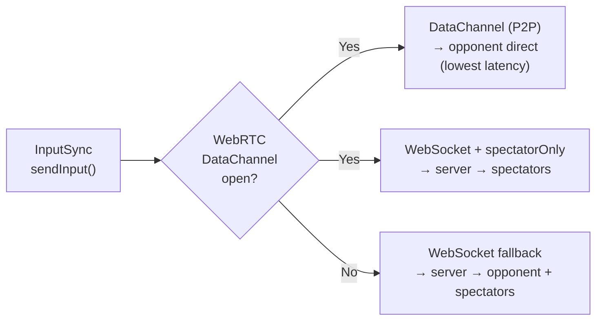
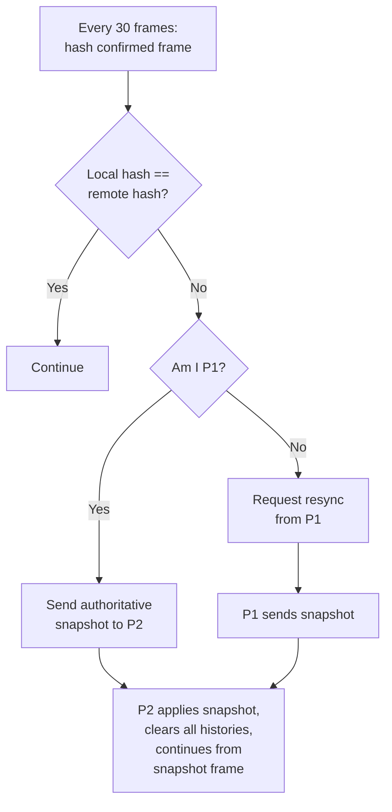
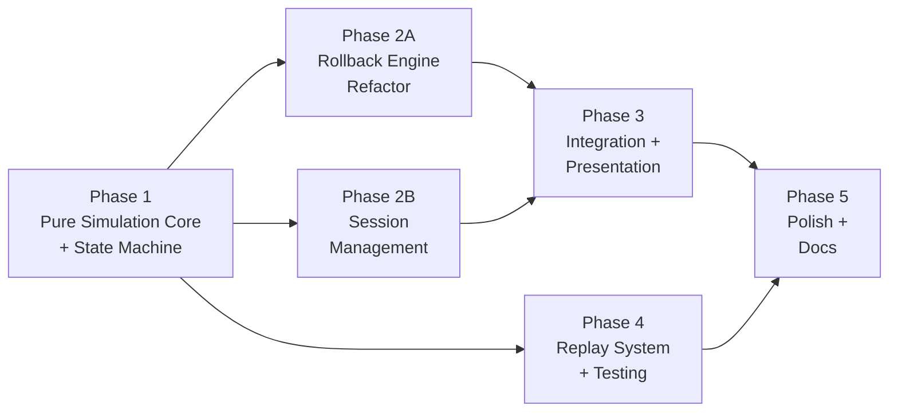

# RFC 0002: Multiplayer Architecture Redesign

**Status:** In Progress — Phase 1 complete, Phase 2A.1–2A.2 complete, Phase 2B.2 complete
**Date:** 2026-03-24
**Updated:** 2026-03-25
**Author:** Architecture Team
**Predecessor:** [RFC 0001: Networking Redesign](0001-networking-redesign.md) (Phases 1–4 complete)
**PR:** [#49](https://github.com/simon0191/a-los-traques/pull/49)

---

### What's Next

The next high-impact task is **2B.1: Wire MatchStateMachine into FightScene**. This is the largest remaining refactor — FightScene is ~1,939 lines with boolean flags (`_reconnecting`, `_onlineDisconnected`, `combat.roundActive` as flow control) that should be replaced by state machine transitions. Each MatchState maps to a block in the update loop, eliminating the 3-way `online`/`local`/`spectator` branching.

Once 2B.1 is done, 2B.3 (SYNCHRONIZING state), 2B.4 (ReconnectionManager → state machine), and 2A.4 (frame-0 sync exchange) are unblocked. After all of Phase 2, Phase 3 (event-driven presentation: AudioBridge, VFXBridge, remove `_muteEffects`) can begin.

**Key files to read before starting 2B.1:**
- `src/systems/MatchStateMachine.js` — the FSM to integrate (15 states, validated transitions)
- `src/scenes/FightScene.js` — the refactor target (~1,939 lines)
- `tests/systems/match-state-machine.test.js` — 29 tests documenting all valid transitions

---

## Summary

RFC 0001 fixed the acute desync bugs (deferred round events, TURN for NAT traversal, network module decomposition) and hardened the reconnection flow (`rejoin_ack` gating, re-entrant grace timers, transport degradation events). The multiplayer system now works in the common case. However, it remains difficult to reason about, modify, and test because:

1. **No formal game state machine.** Match lifecycle (rounds, transitions, reconnection, pause) is implicit — spread across FightScene (1,939 lines), CombatSystem, SimulationStep, and the PartyKit server. There is no single place to answer "what state is the match in?"
2. **Simulation entangled with rendering.** `SimulationStep.simulateFrame()` calls `fighter.syncSprite()`. `Fighter.update()` and `CombatSystem.checkHit()` call `this.scene.game.audioManager.play()` and `this.scene.cameras.main.shake()` guarded by `_muteEffects`. The simulation cannot run without a Phaser scene.
3. **Test duplication.** `tests/helpers/sim-factory.js` (442 lines) reimplements all Fighter and CombatSystem logic without Phaser — a parallel universe that drifts from the real code.
4. **No replay system** despite having deterministic simulation, fixed-point math, and input recording infrastructure.
5. **Mode branching complexity.** FightScene handles `online`, `local`, `spectator`, and `replay` modes through conditional branches in the update loop.

This RFC proposes a clean architecture that makes the multiplayer system **understandable by every engineer on the team**: a formal game state machine, a pure simulation core with zero Phaser dependencies, event-driven presentation, and a replay system that falls out naturally from determinism.

---

## Goals and Non-Goals

### Goals

| Priority | Goal |
|----------|------|
| **P0** | **Understandability** — Any engineer can read the state machine diagram and know exactly what state the match is in, what transitions are valid, and what each subsystem does |
| **P0** | **Determinism** — Same initial state + same per-frame inputs = bitwise identical simulation on all machines, verified by checksums and replay |
| **P0** | **Debuggability** — Record any match as an input log; replay it headlessly to reproduce bugs without a browser |
| **P1** | **Maintainability** — Each subsystem has a clear API boundary. Changes to networking never touch simulation. Changes to rendering never touch game logic |
| **P1** | **Testability** — Simulation core runs in Node.js with zero mocking. Eliminate the `sim-factory.js` test duplicate |
| **P2** | **Replay system** — Record and playback matches from initial state + input log, both headlessly (CI) and in-browser (with full rendering) |

### Non-Goals

| Non-Goal | Rationale |
|----------|-----------|
| Rust/Wasm simulation engine | The JS simulation is sound — bugs are in architecture, not math. Integer fixed-point on V8/JSC is deterministic. |
| Server-authoritative simulation | P2P rollback is correct for 1v1 fighting games (lowest latency). Server remains a pure relay. |
| Ranked matchmaking | Friends-only game; room codes are sufficient. |
| Anti-cheat | Friends-only context; peers can inspect local state. |
| Voice/video chat | Out of scope; game uses text shouts from spectators. |

---

## High-Level Requirements

| # | Requirement | Detail |
|---|------------|--------|
| R1 | Deterministic simulation | `SimulationEngine.tick(state, p1Input, p2Input)` produces bitwise identical `(newState, events)` on all machines given the same inputs. No `Date.now()`, no `Math.random()`, no floating-point in the simulation path. |
| R2 | Explicit game state machine | Named states (`ROUND_ACTIVE`, `RECONNECTING`, etc.) with defined transitions. One enum value answers "what state is the match in?" on both client and server. |
| R3 | Clear subsystem boundaries | Simulation, rollback, networking, session management, and presentation are independent modules with documented APIs. No cross-cutting `this.scene` references. |
| R4 | Replay from input log | Given `{initialState, inputs[]}`, reproduce the exact match headlessly (no browser). Final state hash matches the original. |
| R5 | Zero-Phaser simulation | The simulation core compiles and runs in Node.js. `sim-factory.js` test duplicate is eliminated. |

---

## Game State Machine

### Problem

Today, the client "state" is whichever Phaser scene is active (LobbyScene, SelectScene, FightScene, VictoryScene). Within FightScene, the actual state is a combination of:

- `this.gameMode` (`'online'` / `'local'` / `'spectator'`)
- `combat.roundActive` (boolean)
- `combat.matchOver` (boolean)
- `combat.transitionTimer` (integer countdown)
- `this._reconnecting` (boolean, set by ReconnectionManager)
- `this._onlineDisconnected` (boolean)

These flags interact in subtle ways. There is no single source of truth, and adding new states (e.g., a pre-match sync handshake) requires touching multiple files.

### Client State Machine

A single `MatchStateMachine` module owns the current state as an enum value. All transitions are validated — invalid transitions throw, making impossible states unrepresentable.



**Key design decisions:**

- **SYNCHRONIZING** is new. Before the first simulation tick, both peers exchange frame-0 checksums via WebSocket. Only when both agree does the simulation start. This eliminates a class of early-frame desyncs where one peer's `create()` completes faster.
- **ROUND_INTRO / ROUND_END are simulation states.** In online mode, the deterministic `transitionTimer` (300 frames) handles the pause between rounds inside the simulation. Presentation effects (text animations, audio stings) are fire-and-forget overlays that do not gate state transitions.
- **RECONNECTING pauses the simulation.** No frames advance. On resume, the simulation continues from the exact frame it paused at. This replaces the current pattern where `_reconnecting` is a boolean that interacts with multiple other flags.
- **PAUSED only exists in local mode.** Online mode cannot pause (already enforced, now modeled).

### Server State Machine

The PartyKit server's `roomState` string is replaced by a formal state machine with validated transitions.



**Key changes from current:**

- **EMPTY** is added. Currently the server starts in `waiting` with 0 players, which is indistinguishable from `waiting` with 1 player.
- **READY_CHECK** is split from SELECTING. This makes it explicit that one player has committed a fighter choice. The server rejects duplicate `ready` messages and validates that `ready` is only accepted in SELECTING or READY_CHECK states.
- All incoming messages are validated against the current state. Out-of-state messages are rejected instead of silently processed.
- **`rejoin_ack`** (added in RFC 0001 Phase 4): Server sends `rejoin_ack` on both grace and no-grace rejoin paths. The rejoining peer uses this as a "signaling stable" signal before initiating WebRTC. Connection IDs are updated on no-grace rejoin to prevent stale `onClose` events from starting erroneous grace periods.

### `MatchStateMachine` Module API

```javascript
// src/systems/MatchStateMachine.js — pure module, no Phaser dependency

export const MatchState = {
  MAIN_MENU: 'MAIN_MENU',
  LOBBY: 'LOBBY',
  WAITING_FOR_OPPONENT: 'WAITING_FOR_OPPONENT',
  CHARACTER_SELECT: 'CHARACTER_SELECT',
  LOCAL_SELECT: 'LOCAL_SELECT',
  LOADING: 'LOADING',
  SYNCHRONIZING: 'SYNCHRONIZING',
  ROUND_INTRO: 'ROUND_INTRO',
  ROUND_ACTIVE: 'ROUND_ACTIVE',
  ROUND_END: 'ROUND_END',
  MATCH_END: 'MATCH_END',
  RESULTS: 'RESULTS',
  PAUSED: 'PAUSED',
  RECONNECTING: 'RECONNECTING',
  DISCONNECTED: 'DISCONNECTED',
};

export class MatchStateMachine {
  constructor(initialState = MatchState.MAIN_MENU) { ... }

  get state() { return this._state; }

  /** Validate and execute a transition. Throws on invalid transition. */
  transition(event) { ... }

  /** Register a callback for state changes. */
  onTransition(callback) { ... }
  // callback signature: (fromState, toState, event) => void
}
```

FightScene becomes a consumer: "given that the state machine is in `ROUND_ACTIVE`, render accordingly." It no longer owns the match state.

---

## Subsystem Decomposition

### Overview

Six subsystems with well-defined boundaries. Each subsystem has a single responsibility and a public API that other subsystems consume.



### Subsystem Details

#### 1. Pure Simulation Core

**Location:** `src/simulation/`
**Phaser dependency:** None.

The simulation core is a set of pure functions and plain-object state. Given the same inputs, it produces bitwise identical outputs on every machine.

| Module | Responsibility |
|--------|---------------|
| `SimulationEngine.js` | `tick(state, p1Input, p2Input) → { state, events }` — one deterministic frame advance |
| `FighterSim.js` | Fighter state object + pure methods (`update`, `moveLeft`, `attack`, `getHitbox`, `faceOpponent`, `resetForRound`) |
| `CombatSim.js` | Pure combat resolution: `resolveBodyCollision`, `checkHit`, `tickTimer`, `applyDamage` — returns event descriptors |
| `GameState.js` | `cloneGameState`, `hashGameState` (snapshot = clone of tick output; restore = pointer swap) |

**Key API — `SimulationEngine.tick()`:**

```javascript
/**
 * Advance the simulation by one frame. Pure function.
 * Returns a NEW state object — the input state is not modified.
 * Past return values serve as the rollback snapshot window.
 *
 * @param {GameState} state - Current game state (not modified)
 * @param {number} p1Input - Encoded input for P1 (9-bit integer)
 * @param {number} p2Input - Encoded input for P2 (9-bit integer)
 * @returns {{ state: GameState, events: SimEvent[] }}
 */
export function tick(state, p1Input, p2Input) { ... }
```

**SimEvent types:**

| Event | Fields | Replaces |
|-------|--------|----------|
| `hit` | `{ attacker: 0\|1, damage, ko: boolean }` | `CombatSystem.checkHit()` audio/camera/tint side effects |
| `block` | `{ defender: 0\|1, damage }` | Block tint + audio in `CombatSystem` |
| `whiff` | `{ player: 0\|1 }` | `Fighter.update()` line 105–106 whiff audio |
| `jump` | `{ player: 0\|1 }` | `Fighter.update()` line 257/264/268 jump audio |
| `special_charge` | `{ player: 0\|1 }` | `Fighter.update()` line 316–317 special audio |
| `ko` | `{ winnerIndex: 0\|1 }` | Round-ending event (already returned by `simulateFrame`) |
| `timeup` | `{ winnerIndex: 0\|1 }` | Round-ending event (already returned by `simulateFrame`) |
| `round_reset` | `{}` | `transitionTimer` expires, fighters reset for next round |

This replaces every `this.scene._muteEffects` guard. During rollback resimulation, the caller simply **discards the events array**. During normal advance, the presentation layer maps events to audio and VFX.

#### 2. Rollback Engine

**Location:** `src/systems/RollbackManager.js`, `src/systems/InputBuffer.js`
**Phaser dependency:** None (currently references `scene._muteEffects`; that is removed).

| Module | Responsibility |
|--------|---------------|
| `RollbackManager` | Per-frame advance loop: store input → send → drain confirmed → detect misprediction → rollback + resim → predict → snapshot → simulate → checksum |
| `InputBuffer` | Encode/decode 9 booleans ↔ integer. Predict input (repeat movement, zero attacks). |

**Refined `advance()` signature:**

```javascript
// Current: advance(rawLocalInput, scene, p1, p2, combat)
// New:     advance(rawLocalInput, gameState)
//
// Returns: { state: GameState, events: SimEvent[], roundEvent: RoundEvent | null }
```

The `scene` parameter is eliminated. The `p1`, `p2`, `combat` arguments are replaced by a single `GameState` object that the simulation core operates on. Round events are returned alongside the full event list.

**Snapshot model (Option A — immutable):** `SimulationEngine.tick()` returns a new `GameState` object each frame. Past states are the rollback window — no separate `captureGameState()` call needed in the advance loop. Rollback is a pointer swap to a past return value, not a field-by-field restore. See [Appendix: State Representation](#appendix-state-representation) for alternatives.

#### 3. Input System

**Location:** `src/systems/InputManager.js`, `src/systems/TouchControls.js`, `src/systems/AIController.js`
**Phaser dependency:** Yes (keyboard/touch capture requires Phaser). This is expected — input capture is inherently platform-specific.

No changes needed. These modules already have clean APIs:

- `InputManager.getInput()` → `{ left, right, up, down, lp, hp, lk, hk, sp }`
- `AIController.getInput(ownFighter, opponent)` → same shape
- `TouchControls` dispatches keyboard-like events

#### 4. Networking Transport

**Location:** `src/systems/net/`
**Phaser dependency:** None.

The five modules from RFC 0001 are retained as-is. Their decomposition is sound.

| Module | Lines | Responsibility |
|--------|-------|---------------|
| `SignalingClient` | ~220 | WebSocket lifecycle, room messages, callback buffering |
| `TransportManager` | ~170 | WebRTC DataChannel + WS fallback, TURN credentials, `transportDegraded`/`transportRestored` events |
| `InputSync` | ~280 | Frame-indexed input send/receive/drain, attack OR-merge, dual-transport routing |
| `ConnectionMonitor` | ~70 | Ping/pong RTT, timeout detection |
| `SpectatorRelay` | ~100 | Spectator sync, shout, potion messaging |
| `NetworkFacade` | ~380 | Composes all modules, exposes unified API, `queueWebRTCInit()`/`rejoin_ack` gating |

#### 5. Session Manager

**Location:** `src/systems/MatchStateMachine.js`, `src/systems/ReconnectionManager.js`, `party/server.js`
**Phaser dependency:** None (`MatchStateMachine` and `ReconnectionManager` are pure).

| Module | Responsibility |
|--------|---------------|
| `MatchStateMachine` | Client-side FSM. Single enum state, validated transitions, event callbacks. |
| `ReconnectionManager` | 20-second grace period. Re-entrant for simultaneous disconnects. Overlay management. Fires `RECONNECTING` / `DISCONNECTED` transitions. |
| Server FSM (`party/server.js`) | Server-side room state. Validates incoming messages against current state. |

#### 6. Presentation Layer

**Location:** `src/scenes/FightScene.js`, `src/entities/Fighter.js`, new `AudioBridge.js`, `VFXBridge.js`
**Phaser dependency:** Yes (this is the Phaser layer).

| Module | Responsibility |
|--------|---------------|
| `FightScene` | Thin coordinator. Reads state from `MatchStateMachine`. Delegates simulation to `RollbackManager`. Routes `SimEvent[]` to bridges. |
| `Fighter` | Phaser sprite wrapper. Holds reference to `FighterSim`. `syncSprite()` reads sim state, updates sprite position/animation. |
| `AudioBridge` | Maps `SimEvent[]` → `audioManager.play()` calls. Declarative mapping table. |
| `VFXBridge` | Maps `SimEvent[]` → camera shake, hit sparks, tints, flash. Declarative mapping table. |
| HUD | Reads fighter HP/special/stamina and combat timer from `GameState`. Pure display. |

**AudioBridge example:**

```javascript
const EVENT_AUDIO = {
  hit:            (e) => e.ko ? 'ko' : e.damage >= 15 ? 'hit_heavy' : 'hit_light',
  block:          () => 'hit_block',
  whiff:          () => 'whiff',
  jump:           () => 'jump',
  special_charge: () => 'special_charge',
  timeup:         () => 'announce_timeup',
  ko:             () => 'ko',
};

export function playEvents(audioManager, events) {
  for (const e of events) {
    const fn = EVENT_AUDIO[e.type];
    if (fn) audioManager.play(fn(e));
  }
}
```

---

## Determinism and Reproducibility

### Rules (violation = desync)

| # | Rule | Enforcement |
|---|------|-------------|
| D1 | **Fixed-point arithmetic only.** All positions, velocities, damage use integers × `FP_SCALE` (1000). No `parseFloat`, no fractional intermediates. | Lint rule on `src/simulation/` |
| D2 | **Frame-based timers only.** No `Date.now()`, `setTimeout`, `scene.time.addEvent` in simulation path. All timing = frame counts (60 frames = 1 second). | Lint rule + code review |
| D3 | **No `Math.random()` in simulation.** Only seeded PRNG (`mulberry32` in `AIController.setSeed()`), and only for AI decisions. | Lint rule on `src/simulation/` |
| D4 | **Deterministic input order.** P1 input applied before P2. Enforced by `SimulationEngine.tick()` argument order. | By construction |
| D5 | **Fixed timestep.** `FIXED_DELTA = 16.667ms` (1/60s). Accumulator in game loop ensures exactly 60 simulation ticks per second regardless of render framerate. | `FightScene.update()` accumulator loop |
| D6 | **No floating-point in simulation.** All arithmetic uses `Math.trunc()` for division. `fpRectsOverlap`, `fpClamp` operate on integers. Prevents ARM/x86 denormal discrepancies. | `FixedPoint.js` constants + lint rule |
| D7 | **No state leakage from rendering.** Simulation never reads sprite positions, Phaser timers, or animation state. `syncSprite()` is write-only (sim → sprite). | Enforced by `FighterSim` having no `this.scene` |

### Existing Infrastructure

These already exist and are retained:

- **Fixed-point constants:** `src/systems/FixedPoint.js` — `FP_SCALE=1000`, pre-computed gravity, jump velocity, stamina regen per frame
- **Integer damage math:** `src/systems/combat-math.js` — `calculateDamage()`, `comboScaledDamage()` using `Math.round()` and `Math.trunc()`
- **State hashing:** `src/systems/GameState.js` — `hashGameState()` XOR-rotates 20 integer fields for checksum comparison
- **Input encoding:** `src/systems/InputBuffer.js` — 9 booleans packed as integer, bitwise prediction

### Verification Layers

| Layer | Method | Current Status |
|-------|--------|---------------|
| **Unit tests** | Run same inputs twice through `SimulationEngine.tick()`, assert identical `hashGameState()` | Exists via `determinism.test.js` (needs migration from `sim-factory.js`) |
| **Checksum exchange** | Every 30 frames, peers compare hash of confirmed frame (`currentFrame - maxRollbackFrames - 1`) | Exists in `RollbackManager` |
| **E2E browser tests** | Playwright spawns 2 browsers, autoplay mode, compare final state hashes | Exists via `multiplayer-determinism.spec.js` |
| **Headless replay** | Load `{initialState, inputs[]}`, run `SimulationEngine.tick()` in Node.js, compare final hash | New (Phase 4) |
| **Lint rules** | Flag `Math.random()`, `Date.now()`, `parseFloat`, floating-point division in `src/simulation/` | New (Phase 1) |

### Recording and Replaying a Match

```
┌──────────────────────────────────────────────────────────────────┐
│                        Replay Bundle                             │
├──────────────────────────────────────────────────────────────────┤
│  version: 2                                                      │
│  metadata: { date, p1Id, p2Id, stageId, seed, duration }        │
│  initialState: GameState (frame 0)                               │
│  inputs: [ { frame: 0, p1: 0b000000000, p2: 0b000000000 },     │
│            { frame: 1, p1: 0b000000001, p2: 0b000010000 },      │
│            ...                                                   │
│            { frame: N, p1: ..., p2: ... } ]                      │
│  finalStateHash: number (for verification)                       │
└──────────────────────────────────────────────────────────────────┘
```

**To replay:** Feed `initialState` into `SimulationEngine`, apply `inputs[frame]` each tick, compare `hashGameState(finalState)` against `finalStateHash`. If they match, the simulation is deterministic. If not, a regression has been introduced.

**To render a replay:** Same as above, but run inside `FightScene` with `gameMode: 'replay'`. The existing `ReplayInputSource` feeds inputs frame-by-frame. Playback speed is controllable (1x, 2x, 0.5x).

---

## Networking and Rollback Model

### Conceptual Overview

The game uses GGPO-style rollback netcode: both peers run identical deterministic simulations locally with zero perceived input lag. Remote inputs are predicted (repeat last movement, zero attacks). When confirmed input arrives and differs from prediction, the game restores a snapshot and resimulates forward.



### Input Pipeline

1. Local input captured at visual frame rate (`InputManager.getInput()` or `AIController.getInput()`)
2. Encoded to 9-bit integer via `InputBuffer.encodeInput()`
3. Stored at `currentFrame + inputDelay` (default 3 frames, adaptive 1–5)
4. Sent to peer with 2 frames of redundant history (mitigates packet loss)
5. Remote inputs buffered by frame number in `InputSync.remoteInputBuffer`
6. `RollbackManager` drains confirmed inputs each frame via `drainConfirmedInputs()`
7. Unconfirmed frames use prediction: `predictInput(lastConfirmed)` = repeat movement bits, zero attack bits

### Input Encoding

```
Bit:  8   7   6   5   4   3   2   1   0
     [sp] [hk] [lk] [hp] [lp] [dn] [up] [rt] [lt]
      │          attacks          │    movement     │
      └──── ATTACK_MASK ─────────┘└── MOVE_MASK ───┘
```

### Rollback Mechanics

| Parameter | Value | Notes |
|-----------|-------|-------|
| Input delay | 3 frames (default) | Adaptive: recalculated every 180 frames based on RTT |
| Max rollback window | 7 frames | Scales with input delay: `max(7, inputDelay * 2 + 1)` |
| Checksum interval | 30 frames | Compare hash of `currentFrame - maxRollbackFrames - 1` |
| Input redundancy | 2 frames per packet | Backfills gaps from packet loss |
| Prediction strategy | Repeat movement, zero attacks | Prevents phantom attacks on misprediction |
| Resync cooldown | 60 frames | Prevents resync storms |

### Dual-Transport Routing



The rollback system is transport-agnostic. `RollbackManager` reads from `remoteInputBuffer` regardless of whether inputs arrived via DataChannel or WebSocket. Mid-fight transport switches (P2P drops → WS fallback) are invisible to the simulation.

### Frame-0 Synchronization (New)

Before the first `ROUND_ACTIVE` tick, both peers enter the `SYNCHRONIZING` state:

1. Both peers create identical `GameState` at frame 0 (same fighter data, same stage, same initial positions)
2. Both compute `hashGameState(frame0State)` and exchange hashes via WebSocket
3. If hashes match → transition to `ROUND_INTRO` → `ROUND_ACTIVE`
4. If hashes mismatch → P1 sends authoritative frame-0 snapshot → P2 applies it → retry comparison
5. If no agreement within 5 seconds → transition to `DISCONNECTED`

This prevents the current scenario where one peer might start 1–2 frames ahead if its scene `create()` completes faster.

### Round Event Handling (Unchanged from RFC 0001)

Both P1 and P2 set `suppressRoundEvents = true` in online mode. Round-ending events are deferred:

- **P1 (host):** Captures round event from `advance()` return, fires side effects via `handleRoundEnd()`, sends event to P2 + spectators
- **P2 (guest):** Ignores local round event detection. Receives authoritative event from P1 via `onRoundEvent` handler.

The simulation state update (incrementing `roundsWon`, setting `roundActive = false`) happens deterministically in `SimulationEngine.tick()` on both peers at the same frame. Only the side effects (audio sting, camera shake, HUD animation) are asymmetric.

### Desync Detection and Recovery



---

## Implementation Plan

### Phase 1 — Pure Simulation Core + State Machine

**Objective:** Extract all simulation logic into Phaser-free modules. Eliminate `sim-factory.js`. Create the formal game state machine.

**Tasks:**

| # | Task | Status | Details |
|---|------|--------|---------|
| 1.1 | Create `src/simulation/FighterSim.js` | **Done** | Pure fighter state + logic class. 37 unit tests. |
| 1.2 | Create `src/simulation/CombatSim.js` | **Done** | Pure combat resolution. 19 unit tests. |
| 1.3 | Create `src/simulation/SimulationEngine.js` | **Done** | Pure `tick()` returning immutable state. `captureGameState`/`restoreGameState`/`hashGameState`. 18 unit tests. Determinism verified. |
| 1.4 | Refactor `Fighter.js` → delegate to `FighterSim` | **Done** | Fighter holds `this.sim` (FighterSim). All sim fields proxied via getter/setter. Phaser side effects applied after delegation. |
| 1.5 | Refactor `CombatSystem.js` → delegate to `CombatSim` | **Done** | CombatSystem holds `this.sim` (CombatSim). Pure methods delegate; audio/camera/tints stay in CombatSystem. |
| 1.6 | Delete `tests/helpers/sim-factory.js` | **Done** | 442-line duplicate eliminated. Tests import FighterSim/CombatSim directly. |
| 1.7 | Create `src/systems/MatchStateMachine.js` | **Done** | 15 states, validated transitions, event callbacks. 29 unit tests. |
| 1.8 | Add lint rules | Deferred | Lower priority. Can be added anytime. |

**Parallelization:**
- Tasks 1.1, 1.2, 1.3 can be done in parallel (independent extractions)
- Tasks 1.4, 1.5 depend on 1.1, 1.2 respectively
- Task 1.6 depends on 1.1, 1.2, 1.3
- Task 1.7 is independent (can run in parallel with everything)
- Task 1.8 is independent

**Dependencies:** None. This phase can start immediately.

**Verification:**
- All existing tests pass (determinism, rollback, combat math)
- `FighterSim` and `CombatSim` import successfully in Node.js without Phaser
- `SimulationEngine.tick()` produces bitwise identical output to `simulateFrame()` for the same inputs
- `MatchStateMachine` transition tests cover all valid and invalid transitions

---

### Phase 2A — Rollback Engine Refactor (parallel with 2B)

**Objective:** Update `RollbackManager` to use the pure simulation core. Eliminate the `scene` parameter.

**Tasks:**

| # | Task | Status | Details |
|---|------|--------|---------|
| 2A.1 | Update `advance()` signature | **Done** | Removed `scene` parameter. `advance(rawLocalInput, p1, p2, combat)`. `_muteEffects` accessed via `p1.scene` during rollback (temporary until Phase 3). |
| 2A.2 | Use `SimulationEngine.tick()` | **Done** | RollbackManager uses `tick()` for both normal frames and resimulation. Snapshots from `captureGameState`/`restoreFighterState`/`restoreCombatState` in SimulationEngine. |
| 2A.3 | Tag snapshots confirmed/predicted | Pending | |
| 2A.4 | Implement frame-0 sync exchange | Pending | Depends on 2B.3 (SYNCHRONIZING state in FightScene). |
| 2A.5 | Add snapshot version field | Pending | |

**Dependencies:** Phase 1 (`SimulationEngine` must exist).

**Verification:**
- Rollback tests pass with new `advance()` signature
- Frame-0 sync exchange works in E2E tests
- Resync snapshots include version field and reject mismatched versions

---

### Phase 2B — Session Management (parallel with 2A)

**Objective:** Integrate `MatchStateMachine` into the scene flow. Formalize server FSM.

**Tasks:**

| # | Task | Status | Details |
|---|------|--------|---------|
| 2B.1 | Wire `MatchStateMachine` into FightScene | Pending | Large refactor (~1,939 lines). Replace boolean flags with state machine transitions. Each state maps to a block in `update()`. |
| 2B.2 | Formalize server state machine | **Done** | `RoomState` enum + `_transition()` validator. Added EMPTY and READY_CHECK states. Messages validated against current state. 6 new tests. Merged with PR #42's `rejoin_ack` and no-grace rejoin path. |
| 2B.3 | Add SYNCHRONIZING state flow | Pending | Depends on 2B.1 (FightScene must use MatchStateMachine). |
| 2B.4 | Update ReconnectionManager | Pending | Blocked by 2B.1. Wire `connection_lost`/`grace_expired`/`opponent_reconnected` to MatchStateMachine transitions. |

**Dependencies:** Phase 1 (`MatchStateMachine` must exist).

**Verification:**
- FightScene uses only `matchStateMachine.state` for flow control (no boolean flags)
- Server rejects out-of-state messages with appropriate error responses
- Reconnection flow works end-to-end in E2E tests (existing `multiplayer-reconnection.spec.js` from RFC 0001 Phase 4)

---

### Phase 3 — Integration and Event-Driven Presentation

**Objective:** Wire the pure simulation core to Phaser through the event system. Refactor FightScene from 1,939 lines to a thin coordinator.

**Tasks:**

| # | Task | Details |
|---|------|---------|
| 3.1 | Create `AudioBridge.js` | Declarative mapping: `SimEvent[] → audioManager.play()`. Replaces all `this.scene.game.audioManager.play()` in Fighter (5 call sites) and CombatSystem (7 call sites). |
| 3.2 | Create `VFXBridge.js` | Declarative mapping: `SimEvent[] → cameras.main.shake()`, hit sparks, tints. Replaces CombatSystem camera/tint code (5 call sites). |
| 3.3 | Refactor FightScene update loop | Single loop: read state from `MatchStateMachine` → switch on state → delegate to appropriate handler. No 3-way mode branching. |
| 3.4 | Move `syncSprite()` out of simulation | `SimulationEngine.tick()` no longer calls `syncSprite()`. FightScene calls `fighter.syncSprite()` after receiving new state from rollback manager. |
| 3.5 | Spectator mode cleanup | Spectators receive `GameState` snapshots from P1. Apply state directly to `FighterSim` objects, sync to sprites. Events reconstructed from state deltas or sent explicitly. |
| 3.6 | Remove `_muteEffects` | All `this.scene._muteEffects` checks in Fighter and CombatSystem are removed. The event-based architecture makes them unnecessary. |

**Dependencies:** Phases 1, 2A, 2B.

**Verification:**
- All audio/VFX plays through bridges (no direct `this.scene` audio calls in simulation code)
- FightScene has no `_muteEffects` references
- Local, online, spectator, and replay modes all work through the same state machine
- E2E multiplayer tests pass

---

### Phase 4 — Replay System and Testing Infrastructure

**Objective:** Formalize replay recording and playback. Build headless replay runner for CI.

**Tasks:**

| # | Task | Details |
|---|------|---------|
| 4.1 | Formalize replay bundle format | `{ version, initialState, inputs: [{frame, p1, p2}], metadata, finalStateHash }` |
| 4.2 | Update `FightRecorder.js` | Record `initialState` at frame 0. Record confirmed input pairs. Record final state hash. Export standardized bundle. |
| 4.3 | Create `src/simulation/ReplayRunner.js` | Headless runner: given a replay bundle, iterate `SimulationEngine.tick()`, compare final hash. Runs in Node.js. |
| 4.4 | Add CI replay determinism test | `tests/systems/replay-determinism.test.js` — Load saved replay bundles, run through `ReplayRunner`, verify final state hash matches. |
| 4.5 | Browser replay mode | `FightScene` with `gameMode: 'replay'`. Existing `ReplayInputSource` feeds inputs. Variable speed (0.5x, 1x, 2x). |
| 4.6 | NetworkSimulator (stretch) | Wraps `InputSync` with configurable latency, jitter, packet loss. Enables test scenarios like "50ms latency, 5% loss → verify no desync". |

**Dependencies:** Phase 1 (`SimulationEngine` must exist). Tasks 4.1–4.5 can proceed after Phase 1 without waiting for Phases 2–3.

**Verification:**
- Saved replay bundles reproduce matches with identical final state hashes
- `ReplayRunner` runs in Node.js without Phaser dependency
- CI test catches determinism regressions

---

### Phase 5 — Polish, Documentation, and Cleanup

**Objective:** Remove legacy code, update documentation, optimize performance.

**Tasks:**

| # | Task | Details |
|---|------|---------|
| 5.1 | Delete legacy code | Remove `sim-factory.js` (done in Phase 1). Remove any remaining `_muteEffects` patterns. Remove dead `NetworkManager.js` if still present. |
| 5.2 | Binary input protocol (optional) | `BinaryCodec.js` for DataChannel packets. Keep JSON on WebSocket for debuggability. |
| 5.3 | Performance profiling | Verify rollback resimulation of 7 frames < 1ms on iPhone 15 Safari. Profile `SimulationEngine.tick()` for zero-allocation hot path. |
| 5.4 | Update documentation | Rewrite `docs/rollback-netcode.md` with new architecture. Update `docs/room-state-machine.md` with formalized server FSM. Create `docs/simulation-core.md`. Update `CLAUDE.md` with new file locations. |
| 5.5 | Safari determinism | Add Safari to E2E browser matrix. Verify cross-browser determinism. |

**Dependencies:** Phases 1–4.

### Phase Dependency Graph



Phases 2A, 2B, and 4 can all proceed in parallel after Phase 1 completes.

---

## Open Questions and Risks

### Open Questions

| # | Question | Options | Recommendation |
|---|----------|---------|----------------|
| Q1 | Should `SimulationEngine.tick()` return a new state or mutate in place? | See [Appendix: State Representation](#appendix-state-representation) for full analysis. | **A — return new state.** Functional purity eliminates aliasing bugs, makes snapshots free (past return values are the rollback window), and simplifies `RollbackManager`. GC pressure from ~4 object allocations per tick is acceptable for 2-fighter state (~500 bytes). Profile in Phase 5; if Safari GC causes frame drops during 7-frame resim, upgrade to Option C (ring buffer). |
| Q2 | How to handle `Fighter.update()` audio during Phase 1 transition? | **A)** Keep `_muteEffects` guard temporarily, migrate to events in Phase 3 **B)** Immediately add events to `FighterSim.update()` return | **A — keep guard temporarily.** Lower risk; preserves current behavior during the extraction. Full event migration happens in Phase 3. |
| Q3 | Should spectators run local simulation from input stream? | **A)** Current model: P1 sends periodic state snapshots **B)** Spectators receive both players' inputs and simulate locally | **A for now.** B gives smoother playback but requires spectators to maintain rollback state. Defer to Phase 5 as a stretch goal. |
| Q4 | Should the server validate game state? | **A)** Pure relay (current) **B)** Server runs simulation and validates | **A — pure relay.** Friends-only game. Server validates protocol invariants (message type valid for room state, slot ownership, rate limits) but not game state. |

### Risks

| Risk | Impact | Likelihood | Mitigation |
|------|--------|-----------|------------|
| **Fighter.js refactor regression** | Desync bugs reintroduced | Medium | Existing determinism test suite (`determinism.test.js`, `rollback-round-events.test.js`) verifies bit-for-bit identical behavior. Run before and after every refactor step. |
| **GC pressure from state + event allocation** | Frame drops during rollback on iPhone | Low | State: ~4 objects per tick (~500 bytes) + events array. During 7-frame resim: ~28-35 extra objects. V8 nursery GC handles this cheaply; verify on JSC (Safari). If problematic, upgrade to ring buffer (Option C in appendix). Events: pre-allocate fixed-size array, reuse per tick. Profile in Phase 5. |
| **Scope creep** | Plan is 15–20 engineering days total | Medium | Phase 1 delivers standalone value (eliminates test duplicates, headless simulation). If only Phase 1 ships, the codebase is significantly improved. Each subsequent phase is independently valuable. |
| **Safari determinism** | Integer math may differ between V8 and JSC | Low | All simulation uses `Math.trunc()` and integer ops which are well-specified. E2E tests already run cross-browser. Add Safari explicitly in Phase 5. |
| **Breaking autoplay/E2E infrastructure** | E2E tests break during FightScene refactor | Medium | Keep `AutoplayController` and `FightRecorder` interfaces stable. They read/write inputs — as long as the input/event interface is preserved, they work with any underlying simulation architecture. |
| **`sim-factory.js` migration** | 442-line file used by multiple test files | Medium | Gradual migration: first make `sim-factory.js` a thin wrapper around `FighterSim`, then update tests one by one, then delete. |

---

## Appendix: Current vs. Proposed File Layout

```
src/
  simulation/               # NEW — Pure simulation core (zero Phaser deps)
    SimulationEngine.js     # tick(state, p1Input, p2Input) → {state, events}
    FighterSim.js           # Pure fighter state + methods
    CombatSim.js            # Pure combat resolution
  systems/
    RollbackManager.js      # REFACTORED — uses SimulationEngine
    GameState.js            # UNCHANGED — capture/restore/hash
    InputBuffer.js          # UNCHANGED — encode/decode/predict
    FixedPoint.js           # UNCHANGED — FP constants
    CombatSystem.js         # REFACTORED — delegates to CombatSim, owns side effects
    MatchStateMachine.js    # NEW — formal client state machine
    ReconnectionManager.js  # REFACTORED — fires state machine transitions
    AudioBridge.js          # NEW — SimEvent[] → audio
    VFXBridge.js            # NEW — SimEvent[] → camera/sparks/tint
    combat-math.js          # UNCHANGED
    InputManager.js         # UNCHANGED
    TouchControls.js        # UNCHANGED
    AIController.js         # UNCHANGED
    SimulationStep.js       # DEPRECATED → replaced by SimulationEngine
    net/                    # UNCHANGED (from RFC 0001)
      NetworkFacade.js
      SignalingClient.js
      TransportManager.js
      InputSync.js
      ConnectionMonitor.js
      SpectatorRelay.js
  entities/
    Fighter.js              # REFACTORED — thin Phaser wrapper, delegates to FighterSim
    combat-block.js         # UNCHANGED
  scenes/
    FightScene.js           # REFACTORED — thin coordinator consuming MatchStateMachine
    (others unchanged)
party/
  server.js                 # REFACTORED — formal server state machine
tests/
  helpers/
    sim-factory.js          # DELETED — replaced by FighterSim/CombatSim
  simulation/               # NEW — tests for pure simulation core
    simulation-engine.test.js
    fighter-sim.test.js
    combat-sim.test.js
    replay-determinism.test.js
```

---

## Appendix: State Representation

`SimulationEngine.tick()` returns a new `GameState` each frame (Option A). This section documents the decision and the alternatives we evaluated, so we can revisit if profiling reveals issues.

### Decision: Option A — Return new state (immutable)

```javascript
function tick(state, p1Input, p2Input) {
  const newState = cloneGameState(state);
  // ... mutate newState ...
  return { state: newState, events };
}

// RollbackManager:
snapshots[frame] = currentState;                          // free — no copy needed
const { state: newState, events } = tick(currentState, p1In, p2In);
currentState = newState;

// Rollback:
currentState = snapshots[rollbackFrame];                  // pointer swap, no restore
```

**Why:** Snapshots are free (past return values). Rollback is a pointer swap. No aliasing bugs — HUD reads a past state reference while resim creates new objects. Simpler `RollbackManager` (no `captureGameState`/`restoreGameState` in the advance loop).

**Cost:** ~4 object allocations per tick (wrapper + p1 + p2 + combat + 0-2 currentAttack). During 7-frame resim: ~28-35 extra objects. GameState is ~500 bytes — allocation cost is dominated by GC bookkeeping, not copy size.

### Alternative B — Mutate in place

```javascript
function tick(state, p1Input, p2Input) {
  // mutate state directly, zero allocation
  return { state, events };
}

// Snapshot requires explicit deep copy before each tick:
snapshots[frame] = captureGameState(state);  // deep copy
tick(state, p1Input, p2Input);               // mutates state

// Restore requires field-by-field copy:
restoreGameState(snapshots[rollbackFrame], state);
```

**Tradeoff:** Zero allocation during resim. But requires snapshot discipline (must call `captureGameState` before every tick or lose rollback ability), and aliasing is a bug source (any reference to `state.p1` sees mutations during resim).

**When to switch:** If profiling shows Option A's allocations cause GC pauses during resim on iPhone Safari, switch to this. It's the pattern the current code already uses.

### Alternative C — Pre-allocated ring buffer

```javascript
const pool = Array.from({ length: MAX_ROLLBACK + 2 }, () => createEmptyState());
let cursor = 0;

function tick(source, p1Input, p2Input) {
  cursor = (cursor + 1) % pool.length;
  copyStateInto(source, pool[cursor]);  // overwrite pre-allocated slot
  // mutate pool[cursor]
  return { state: pool[cursor], events };
}
```

**Tradeoff:** Zero allocation ever — not even for snapshots. All state objects pre-allocated at match start. Past states survive in the ring buffer until the cursor wraps. Rollback is pointer swap (like A) and resim is zero-allocation (like B). Adds complexity: ring buffer indexing, fixed pool size. The `currentAttack` sub-object needs its own pool or a "present" flag.

**When to switch:** If Option A or B still show GC pressure after optimization. This is what C/C++ GGPO implementations use.

### Alternative D — ArrayBuffer + DataView (binary struct)

```javascript
const STATE_BYTES = 208;  // 2 fighters × ~22 Int32 fields + combat × 8 Int32 fields

// Snapshot = buffer.slice() (single memcpy, ~208 bytes)
// Restore = Uint8Array.set() (single memcpy)
// Hash = iterate Uint32Array (no field extraction)
// Network = send raw buffer (208 bytes vs ~800 bytes JSON)
```

**Tradeoff:** Fastest possible snapshot/restore/hash/serialize. But field access becomes `view.getInt32(offset)` instead of `state.p1.simX` — worse developer experience, harder to debug, fragile to schema changes. The `currentAttack` sub-object (nullable, variable fields) needs pre-allocated space with a presence flag. String fields (`fighter.state`) must be encoded as integer enums.

**When to switch:** If the game grows beyond 2 fighters, if state size exceeds ~2KB, or if binary DataChannel protocol becomes a priority for bandwidth reduction. For 208 bytes of state with 2 fighters, the copy cost difference vs plain objects is negligible.

### Comparison

| | Alloc per tick | Alloc per 7-frame resim | Snapshot cost | Aliasing risk | Code complexity |
|---|---|---|---|---|---|
| **A: New state** | 4-5 objects | 28-35 objects | Free | None | Low |
| **B: Mutate** | 0 | 0 | 1 deep copy/frame | High | Low |
| **C: Ring buffer** | 0 | 0 | Free | None | Medium |
| **D: ArrayBuffer** | 0 | 0 | memcpy (~208 bytes) | None | High |
