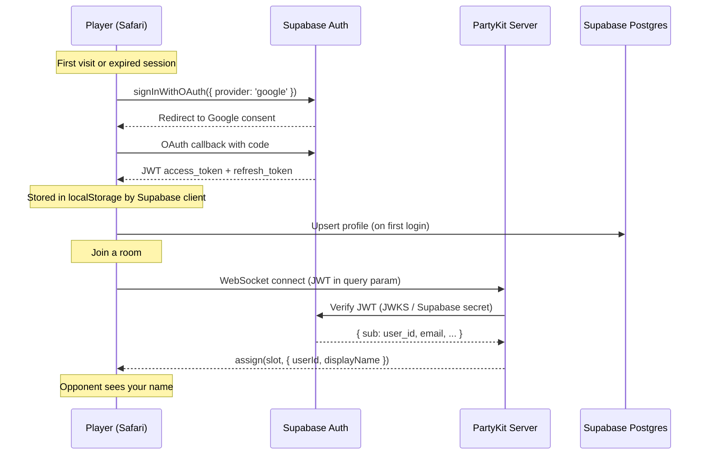
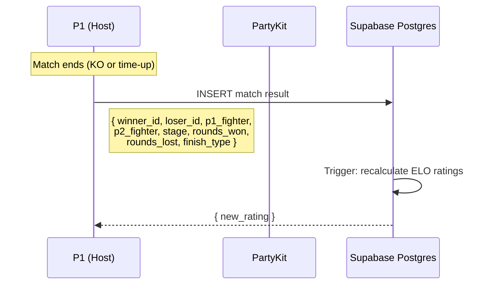

# RFC 0003: Authentication & Player Identity

**Status:** Draft
**Date:** 2026-03-25
**Author:** Architecture Team

---

## Summary

A Los Traques has no concept of player identity. Every session is ephemeral — players are just slot 0 or slot 1 in a room. There's no way to know who you played against, track your record, or see who's the best in the friend group.

This RFC adds OAuth-based authentication (Google & Apple Sign-In), persistent player profiles, match history, and a leaderboard — all backed by Supabase. The goal is to turn "anonymous room code matches" into "I beat Simo 3-2 last Tuesday and climbed to #2 on the leaderboard."

---

## Goals and Non-Goals

### Goals

- **Player identity** — persistent profiles with display name and avatar, recognized across sessions
- **OAuth sign-in** — Google and Apple Sign-In, zero passwords, works on iPhone Safari
- **Match history** — win/loss record per fighter, opponents faced, dates played
- **Leaderboard** — ELO-style rating among the friend group, win streaks, rankings
- **Room authentication** — PartyKit validates player identity before granting a slot (prevents anonymous room hijacking)
- **Minimal friction** — sign-in once, auto-refresh tokens, never see a login screen again

### Non-Goals

- **Public matchmaking** — room codes remain the mechanism for finding opponents
- **Access restriction** — not building an invite-only allow-list (any authenticated user can play)
- **Social features** — no friends list, chat, or notifications (beyond what spectator shouts already provide)
- **Server-authoritative match results** — P1 reports results; no server-side simulation verification
- **Migration of historical data** — no match data exists today; we start fresh

---

## Requirements and Constraints

| Requirement | Detail |
|------------|--------|
| Platform | iPhone 15 Safari landscape (primary target) |
| Auth providers | Google Sign-In, Apple Sign-In |
| Backend | Supabase (Auth + Postgres + Row Level Security) |
| Relay server | PartyKit (existing, needs JWT validation added) |
| Token format | Supabase JWT (access + refresh tokens) |
| Session persistence | Tokens in `localStorage`, auto-refresh via Supabase client |
| Match reporting | P1 (slot 0) reports match results to Supabase after match ends |
| Latency budget | Auth check on room join must add < 200ms to connection time |

---

## Architecture Overview

```
┌─────────────────┐     OAuth     ┌──────────────────┐
│   iPhone Safari  │◄────────────►│  Google / Apple   │
│   (Phaser game)  │              └──────────────────┘
│                  │                       │
│  Supabase Client │    JWT tokens         │
│  (auth + data)   │◄─────────────────────┘
└───────┬──────────┘
        │  WebSocket + JWT in handshake
        ▼
┌──────────────────┐   validate JWT   ┌──────────────────┐
│   PartyKit Server │────────────────►│  Supabase Auth    │
│  (room relay)     │                 │  (JWKS endpoint)  │
└──────────────────┘                  └──────────────────┘
        │
        │  match result (P1 reports)
        ▼
┌──────────────────┐
│  Supabase Postgres│
│  (profiles,       │
│   matches,        │
│   leaderboard)    │
└──────────────────┘
```

### Authentication Flow



### Match Reporting Flow



---

## Database Schema

### `profiles` table

| Column | Type | Notes |
|--------|------|-------|
| `id` | `uuid` PK | = Supabase `auth.users.id` |
| `display_name` | `text` | From OAuth provider, editable |
| `avatar_url` | `text` | From OAuth provider |
| `elo_rating` | `integer` | Default 1200 |
| `wins` | `integer` | Default 0 |
| `losses` | `integer` | Default 0 |
| `win_streak` | `integer` | Current streak, default 0 |
| `best_streak` | `integer` | All-time best streak, default 0 |
| `favorite_fighter` | `text` | Most-played fighter ID (computed) |
| `created_at` | `timestamptz` | Auto |
| `updated_at` | `timestamptz` | Auto |

### `matches` table

| Column | Type | Notes |
|--------|------|-------|
| `id` | `uuid` PK | Auto-generated |
| `winner_id` | `uuid` FK → profiles | |
| `loser_id` | `uuid` FK → profiles | |
| `winner_fighter` | `text` | Fighter ID used by winner |
| `loser_fighter` | `text` | Fighter ID used by loser |
| `stage_id` | `text` | Stage ID |
| `rounds_won` | `integer` | Winner's round count |
| `rounds_lost` | `integer` | Loser's round count |
| `finish_type` | `text` | `'ko'`, `'timeout'`, `'disconnect'` |
| `duration_seconds` | `integer` | Total match time |
| `played_at` | `timestamptz` | Default `now()` |

### `fighter_stats` table (per-player, per-fighter)

| Column | Type | Notes |
|--------|------|-------|
| `id` | `uuid` PK | Auto-generated |
| `user_id` | `uuid` FK → profiles | |
| `fighter_id` | `text` | e.g. `'simon'`, `'jeka'` |
| `wins` | `integer` | Default 0 |
| `losses` | `integer` | Default 0 |
| `UNIQUE(user_id, fighter_id)` | | One row per player per fighter |

### Row Level Security

```sql
-- Profiles: anyone can read, only owner can update their own
CREATE POLICY "Public profiles" ON profiles FOR SELECT USING (true);
CREATE POLICY "Own profile update" ON profiles FOR UPDATE USING (auth.uid() = id);

-- Matches: anyone can read, only authenticated users can insert
CREATE POLICY "Public matches" ON matches FOR SELECT USING (true);
CREATE POLICY "Insert own matches" ON matches FOR INSERT
  WITH CHECK (auth.uid() = winner_id OR auth.uid() = loser_id);

-- Fighter stats: anyone can read, system-managed via trigger
CREATE POLICY "Public fighter stats" ON fighter_stats FOR SELECT USING (true);
```

### ELO Calculation (Postgres function)

```sql
CREATE OR REPLACE FUNCTION update_ratings()
RETURNS TRIGGER AS $$
DECLARE
  k CONSTANT integer := 32;  -- K-factor (high for small player pool)
  winner_elo integer;
  loser_elo integer;
  expected_winner float;
  delta integer;
BEGIN
  SELECT elo_rating INTO winner_elo FROM profiles WHERE id = NEW.winner_id;
  SELECT elo_rating INTO loser_elo FROM profiles WHERE id = NEW.loser_id;

  expected_winner := 1.0 / (1.0 + power(10, (loser_elo - winner_elo)::float / 400));
  delta := round(k * (1 - expected_winner));

  -- Update winner
  UPDATE profiles SET
    elo_rating = elo_rating + delta,
    wins = wins + 1,
    win_streak = win_streak + 1,
    best_streak = GREATEST(best_streak, win_streak + 1),
    updated_at = now()
  WHERE id = NEW.winner_id;

  -- Update loser
  UPDATE profiles SET
    elo_rating = GREATEST(elo_rating - delta, 100),  -- Floor at 100
    losses = losses + 1,
    win_streak = 0,
    updated_at = now()
  WHERE id = NEW.loser_id;

  -- Update fighter stats (upsert)
  INSERT INTO fighter_stats (user_id, fighter_id, wins)
    VALUES (NEW.winner_id, NEW.winner_fighter, 1)
    ON CONFLICT (user_id, fighter_id) DO UPDATE SET wins = fighter_stats.wins + 1;

  INSERT INTO fighter_stats (user_id, fighter_id, losses)
    VALUES (NEW.loser_id, NEW.loser_fighter, 1)
    ON CONFLICT (user_id, fighter_id) DO UPDATE SET losses = fighter_stats.losses + 1;

  -- Update favorite_fighter (most-played)
  UPDATE profiles SET favorite_fighter = (
    SELECT fighter_id FROM fighter_stats
    WHERE user_id = NEW.winner_id
    ORDER BY (wins + losses) DESC LIMIT 1
  ) WHERE id = NEW.winner_id;

  UPDATE profiles SET favorite_fighter = (
    SELECT fighter_id FROM fighter_stats
    WHERE user_id = NEW.loser_id
    ORDER BY (wins + losses) DESC LIMIT 1
  ) WHERE id = NEW.loser_id;

  RETURN NEW;
END;
$$ LANGUAGE plpgsql;

CREATE TRIGGER after_match_insert
  AFTER INSERT ON matches
  FOR EACH ROW EXECUTE FUNCTION update_ratings();
```

---

## Implementation Plan

### Phase 1: Supabase Setup & Auth Flow

**New files:**
- `src/services/auth.js` — Supabase client singleton, sign-in/sign-out, session management
- `src/scenes/AuthScene.js` — Sign-in UI (shown if no valid session)

**Modified files:**
- `src/main.js` — Add AuthScene to scene list
- `src/scenes/BootScene.js` — Check auth session; route to AuthScene if needed
- `package.json` — Add `@supabase/supabase-js` dependency

**Auth service (`src/services/auth.js`):**
```javascript
import { createClient } from '@supabase/supabase-js';

const supabase = createClient(
  import.meta.env.VITE_SUPABASE_URL,
  import.meta.env.VITE_SUPABASE_ANON_KEY
);

export async function signInWithGoogle() {
  return supabase.auth.signInWithOAuth({
    provider: 'google',
    options: { redirectTo: window.location.origin }
  });
}

export async function signInWithApple() {
  return supabase.auth.signInWithOAuth({
    provider: 'apple',
    options: { redirectTo: window.location.origin }
  });
}

export async function getSession() {
  const { data: { session } } = await supabase.auth.getSession();
  return session;
}

export async function getUser() {
  const { data: { user } } = await supabase.auth.getUser();
  return user;
}

export function onAuthStateChange(callback) {
  return supabase.auth.onAuthStateChange(callback);
}

export async function signOut() {
  return supabase.auth.signOut();
}

export { supabase };
```

**AuthScene flow:**
1. Check `getSession()` — if valid, skip to TitleScene
2. If no session, show two buttons: "ENTRAR CON GOOGLE" / "ENTRAR CON APPLE"
3. OAuth redirect → Supabase handles callback → redirects back to game
4. On return, BootScene detects session → upserts profile → proceeds to TitleScene

**Environment variables (Vite):**
```
VITE_SUPABASE_URL=https://xxxxx.supabase.co
VITE_SUPABASE_ANON_KEY=eyJhbGciOi...
```

### Phase 2: PartyKit JWT Validation

**Modified files:**
- `party/server.js` — Validate JWT on WebSocket connect
- `src/systems/net/SignalingClient.js` — Send JWT in connection params

**Server-side validation:**
```javascript
// party/server.js — in onConnect()
async onConnect(conn, ctx) {
  const token = new URL(conn.uri, 'http://localhost').searchParams.get('token');
  if (!token) {
    conn.send(JSON.stringify({ type: 'auth_error', reason: 'missing_token' }));
    conn.close(4001, 'Missing auth token');
    return;
  }

  try {
    const user = await this.verifyToken(token);
    conn.userId = user.sub;
    conn.displayName = user.user_metadata?.full_name || 'Anon';
    conn.avatarUrl = user.user_metadata?.avatar_url || null;
  } catch (err) {
    conn.send(JSON.stringify({ type: 'auth_error', reason: 'invalid_token' }));
    conn.close(4003, 'Invalid auth token');
    return;
  }

  // Existing slot assignment logic continues...
}
```

**Token verification options (choose one):**
- **Option A: Supabase JWT secret** — Decode and verify with `SUPABASE_JWT_SECRET` env var (symmetric HS256). Fastest, no network call.
- **Option B: JWKS endpoint** — Fetch Supabase's public keys and verify asymmetrically. More standard, but adds a network call (cacheable).

Recommendation: **Option A** — simpler, faster, and we control both ends.

**Client-side token passing:**
```javascript
// SignalingClient.js — pass token in PartySocket connection
const socket = new PartySocket({
  host,
  room: roomId,
  query: { token: session.access_token }
});
```

**Player identity in room:**
- On slot assignment, server sends `{ type: 'assign', slot, userId, displayName, avatarUrl }`
- On `opponent_joined`, server sends opponent's identity: `{ type: 'opponent_joined', displayName, avatarUrl, userId }`
- SelectScene and FightScene display opponent's real name instead of generic "P2"

### Phase 3: Match History & Reporting

**New files:**
- `src/services/matches.js` — Match result reporting and history queries

**Modified files:**
- `src/scenes/FightScene.js` — Report match result after final round
- `src/scenes/VictoryScene.js` — Show match stats, ELO change

**Match reporting (`src/services/matches.js`):**
```javascript
import { supabase } from './auth.js';

export async function reportMatch({ winnerId, loserId, winnerFighter, loserFighter,
                                     stageId, roundsWon, roundsLost, finishType,
                                     durationSeconds }) {
  const { data, error } = await supabase.from('matches').insert({
    winner_id: winnerId,
    loser_id: loserId,
    winner_fighter: winnerFighter,
    loser_fighter: loserFighter,
    stage_id: stageId,
    rounds_won: roundsWon,
    rounds_lost: roundsLost,
    finish_type: finishType,
    duration_seconds: durationSeconds,
  }).select().single();

  if (error) console.error('Match report failed:', error);
  return data;
}

export async function getMatchHistory(userId, limit = 20) {
  const { data } = await supabase.from('matches')
    .select('*, winner:profiles!winner_id(display_name), loser:profiles!loser_id(display_name)')
    .or(`winner_id.eq.${userId},loser_id.eq.${userId}`)
    .order('played_at', { ascending: false })
    .limit(limit);
  return data;
}

export async function getLeaderboard() {
  const { data } = await supabase.from('profiles')
    .select('id, display_name, avatar_url, elo_rating, wins, losses, win_streak, best_streak, favorite_fighter')
    .order('elo_rating', { ascending: false });
  return data;
}
```

**FightScene integration:**
- After match ends (in `handleMatchEnd()`), P1 calls `reportMatch()` with both players' user IDs
- User IDs are passed through the scene chain from LobbyScene (where they're received from the server)
- P2 does NOT report (prevents double-counting)
- Disconnect matches: reported as `finish_type: 'disconnect'`, winner = player who stayed

### Phase 4: Leaderboard & Profile UI

**New files:**
- `src/scenes/LeaderboardScene.js` — Rankings table
- `src/scenes/ProfileScene.js` — Player stats, match history, per-fighter record

**Modified files:**
- `src/scenes/TitleScene.js` — Add "RANKING" and "PERFIL" buttons

**LeaderboardScene:**
- Fetches `getLeaderboard()` on enter
- Displays sorted table: rank, name, ELO rating, W/L, streak
- Current player highlighted
- Tap player → shows their ProfileScene

**ProfileScene:**
- Player's display name, avatar, ELO rating
- Overall W/L record, best streak
- Per-fighter stats (grid of fighter portraits with W/L under each)
- Recent match history (scrollable list)
- "CERRAR SESION" button

**TitleScene additions:**
- "RANKING" button → LeaderboardScene
- Player name + avatar displayed in corner (confirms who you're signed in as)

---

## Scene Flow Changes

```
BootScene
  ├── Has session? ──► TitleScene (existing flow)
  │                      ├── VS MAQUINA → SelectScene (local, no auth needed for AI)
  │                      ├── EN LINEA → LobbyScene (JWT passed to PartyKit)
  │                      ├── RANKING → LeaderboardScene (new)
  │                      └── PERFIL → ProfileScene (new)
  └── No session? ──► AuthScene (new)
                        ├── ENTRAR CON GOOGLE → OAuth redirect
                        └── ENTRAR CON APPLE → OAuth redirect
                        (callback returns to BootScene → TitleScene)
```

---

## Security Considerations

| Concern | Mitigation |
|---------|-----------|
| JWT expiry mid-match | Supabase auto-refreshes tokens; match reporting uses fresh token |
| Fake match reports | RLS ensures `auth.uid()` matches winner_id or loser_id |
| Double reporting | P1-only reporting + unique constraint on `(winner_id, loser_id, played_at)` with 5-second window |
| ELO manipulation | Trigger runs server-side in Postgres, not client-computable |
| Token in WebSocket URL | PartyKit connections are WSS (encrypted); token is short-lived (1 hour) |
| OAuth redirect hijack | `redirectTo` is locked to `window.location.origin` |
| Anonymous play | Local/AI mode works without auth; online requires sign-in |

---

## Migration & Rollout

### Phase 1 (Auth + Profile) — Minimum viable
1. Set up Supabase project (Auth + Postgres)
2. Enable Google and Apple OAuth providers in Supabase dashboard
3. Create `profiles` table with RLS
4. Add `@supabase/supabase-js` dependency
5. Implement `auth.js` service + AuthScene
6. Modify BootScene routing
7. Deploy with env vars (`VITE_SUPABASE_URL`, `VITE_SUPABASE_ANON_KEY`)

### Phase 2 (Room Auth) — Secure rooms
1. Add `SUPABASE_JWT_SECRET` to PartyKit env vars
2. Add JWT validation to `party/server.js` `onConnect()`
3. Pass JWT from SignalingClient
4. Send player identity (name, avatar) on slot assignment
5. Display opponent name in SelectScene/FightScene

### Phase 3 (Match History) — Track results
1. Create `matches` and `fighter_stats` tables with RLS
2. Create `update_ratings()` trigger
3. Implement `matches.js` service
4. Add match reporting to FightScene (P1 only)
5. Display ELO change on VictoryScene

### Phase 4 (Leaderboard + Profile) — Show off
1. Implement LeaderboardScene
2. Implement ProfileScene
3. Add buttons to TitleScene
4. Show signed-in player name on TitleScene

---

## Open Questions

1. **Guest mode?** — Should unauthenticated users be able to play online (with no stats tracked), or is sign-in mandatory for online play?
2. **Display name editing** — Allow players to change their display name, or always use the OAuth provider's name?
3. **Avatar source** — Use OAuth avatar only, or let players choose their selected fighter's portrait as avatar?
4. **Match validation** — Should we add any server-side validation of match results (e.g., match duration plausibility, both players were in the room)?
5. **Offline AI matches** — Should local/AI matches count toward fighter stats (but not ELO)?

---

## Dependencies

| Dependency | Version | Purpose |
|-----------|---------|---------|
| `@supabase/supabase-js` | ^2.x | Auth + Postgres client |
| Supabase project | — | Hosted Auth + Postgres + RLS |
| `jose` (or similar) | ^5.x | JWT verification in PartyKit (if using JWKS) |

---

## Alternatives Considered

### Firebase Auth + Firestore
- **Pros:** Good mobile support, free tier
- **Cons:** Firestore query model less flexible for leaderboards, vendor lock-in to Google ecosystem
- **Decision:** Supabase chosen for SQL flexibility (ELO queries, aggregations, triggers)

### Invite-only tokens
- **Pros:** Zero login UI, just share a link
- **Cons:** No persistent identity, no leaderboard, tokens can be shared/leaked
- **Decision:** OAuth provides persistent identity needed for match history + leaderboard

### PartyKit Durable Objects for storage
- **Pros:** No additional infra
- **Cons:** Key-value only, no SQL queries, no built-in auth, poor fit for leaderboards
- **Decision:** Supabase provides proper relational DB + auth in one package
