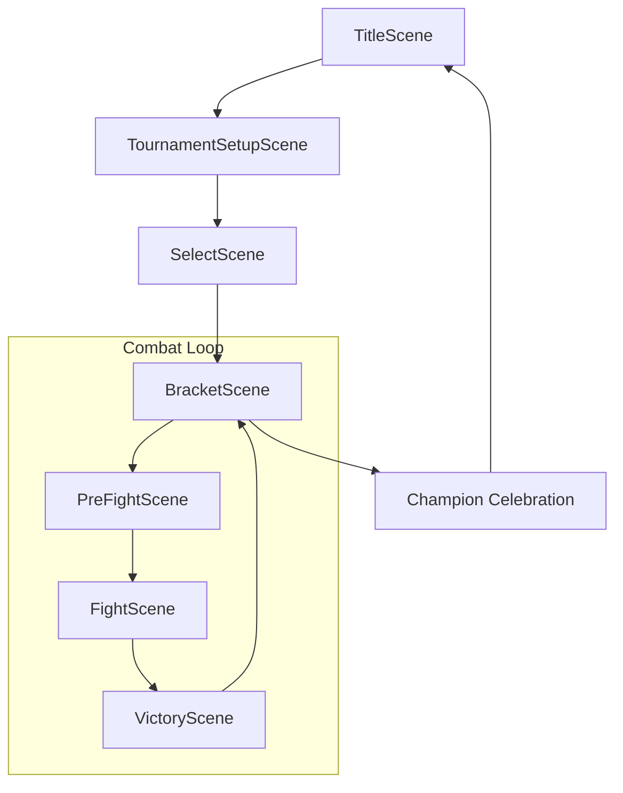
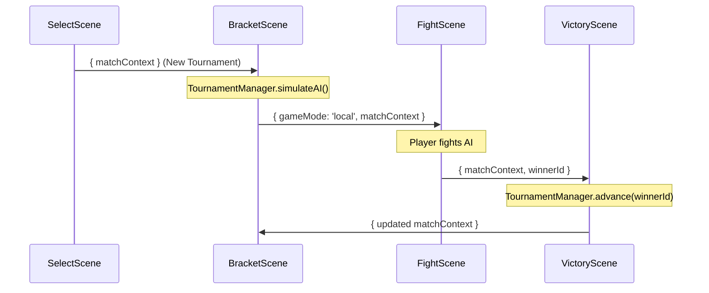

# RFC 0003: Unified Tournament System

## Status
Proposed

## 1. Context & Objectives
The "Tournament Mode" provides a structured competitive local experience through an automated bracket system (8 or 16 fighters). This redesign aims to replace the initial experimental implementation with a robust, deterministic, and future-proof architecture that separates the *competition format* from the *connection type*.

### Key Goals:
- **Unified Orchestration**: Treat tournaments as a layer above the combat simulation.
- **Deterministic Simulation**: AI-vs-AI matches use seeded PRNG to ensure reproducible results.
- **Online Ready**: Design the state management to be easily mirrored via a server (e.g., PartyKit) in the future.
- **Robust State Persistence**: Ensure tournament progress is never lost during scene transitions.

## 2. Architecture & Data Model

### 2.1 Separation of Concerns
We decouple "how we fight" (`gameMode`) from "why we are fighting" (`matchContext`).

- **`gameMode`**: `local` (vs AI), `online` (vs player), `spectator`.
- **`matchContext`**: A payload containing the competition logic.

```javascript
// matchContext Schema
{
  type: 'tournament',
  tournamentId: string, // Unique session ID
  tournamentState: {
    size: 8 | 16,
    seed: number,
    currentRound: number,
    rounds: Array<Match[]>
  },
  matchInfo: {
    roundIndex: number,
    matchIndex: number
  }
}
```

### 2.2 The `TournamentManager`
A pure JavaScript class (Phaser-independent) that serves as the source of truth for the bracket.

| Method | Responsibility |
| :--- | :--- |
| `generate(fighters, size, seed)` | Creates the initial shuffled bracket. Ensures player is in a valid slot. |
| `simulateAI(roundIndex)` | Uses a seeded PRNG (`mulberry32`) to decide winners for all AI vs AI matches. |
| `advance(roundIndex, matchIndex, winnerId)` | Updates the bracket and promotes the winner to the next round's slot. |
| `getCurrentMatch(fighterId)` | Finds the next match where the specified fighter is a participant. |
| `isComplete()` | Checks if the final match has a winner. |

## 3. System Flow

### 3.1 Scene Lifecycle
The tournament flows through a specialized loop within the Phaser Scene Manager.



### 3.2 State Synchronization Flow
The following diagram illustrates how the `TournamentManager` state travels through the scenes, addressing previous issues with data loss during transitions.



## 4. Detailed Implementation

### 4.1 Bracket Generation & Slot Invariance
To ensure consistent controls for the player, the `TournamentManager` enforces the **"P1 Slot Rule"**:
- In any match involving the player, the player is automatically assigned to the P1 slot.
- If the initial shuffle places the player in P2, the `TournamentManager` swaps the fighters in that specific match box during generation.

### 4.2 Deterministic AI Simulation
Instead of `Math.random()`, AI-vs-AI matches use a seeded generator initialized in `TournamentSetupScene`.

```javascript
// Example deterministic logic
const prng = new SeededRandom(tournamentSeed);
const winner = prng.next() > 0.5 ? match.p1 : match.p2;
```
This ensures that if a user reloads the same tournament (e.g., from a save file), the AI-only results remain identical.

### 4.3 Transition Fixes (Ref: PR #52 Review)
The `onMatchOver` path in `FightScene.js` is updated to pass the full context:

```javascript
// FightScene.js
onMatchOver(winnerIndex) {
  const winnerData = winnerIndex === 0 ? this.p1Data : this.p2Data;
  this.scene.start('VictoryScene', {
    winnerId: winnerData.id,
    gameMode: this.gameMode,
    matchContext: this.matchContext // CRITICAL: Pass the tournament context
  });
}
```

## 5. Visual Representation (BracketScene)
The `BracketScene` will visualize the tree structure based on the tournament size.

- **Fighter Nodes**: Display portrait, name, and status.
- **Status Highlighting**:
    - **RED Border**: The human player's path.
    - **GREEN Text**: Winners of completed matches.
    - **Grayed Out**: Losers/Eliminated fighters.
- **Animation**: When returning from `VictoryScene`, the `BracketScene` will animate the winner's advancement into the next slot for visual feedback.

## 6. Future Online Integration
The architecture is designed to support **Online Tournaments** via PartyKit:
1.  **State Source**: The `TournamentManager` logic is mirrored on the PartyKit server.
2.  **Sync**: Instead of local `advance()`, the client sends a result message to the server, which broadcasts the updated state to all participants.
3.  **Unified Scene**: The `BracketScene` remains identical; it simply consumes the state from a WebSocket instead of a local object.

## 7. Risks & Mitigations
| Risk | Mitigation |
| :--- | :--- |
| **State Desync** | `BracketScene` re-validates the entire tree on every `init()` to ensure `rounds` are consistent with `winners`. |
| **Large Brackets** | The UI will use a "Round-by-Round" view or horizontal scrolling for 16/32-size tournaments. |
| **Scene Crashes** | If a scene crashes, the `TournamentManager` state can be backed up in `localStorage` for immediate recovery (Future work). |
