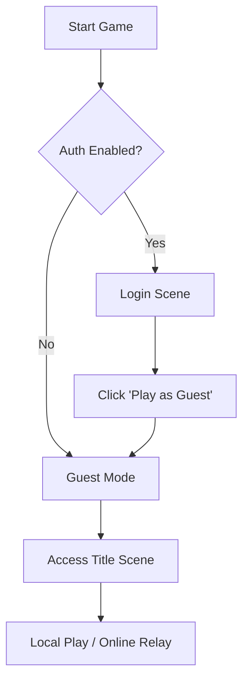
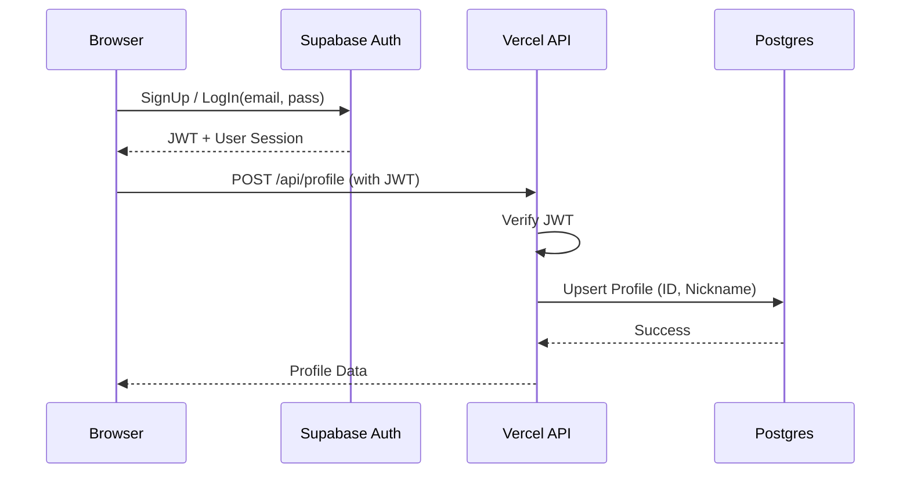
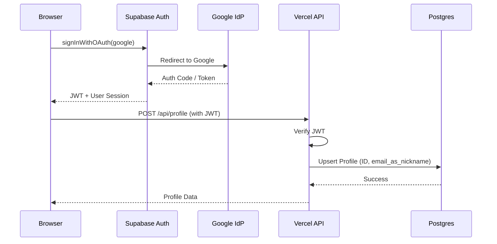
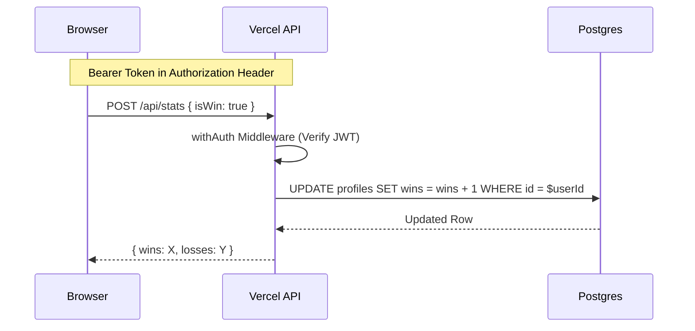

# RFC 0004: Comprehensive Authentication & Persistence Architecture

## Status
Proposed

## Context
The project is evolving from a client-side only interaction with Supabase to a more robust, decoupled architecture using a Vercel Functions backend. This RFC describes the complete authentication and persistence flow, covering all supported modes (Guest, Email/Password, and OAuth) and the new API layer.

## Objectives
-   **Decouple DB Access**: Use Vercel Functions as an API layer, keeping Supabase as an implementation detail for Auth only.
-   **Unified Persistence**: Centralize all data storage (profiles, statistics) behind the Vercel API.
-   **Portable Migrations**: Use `dbmate` for pure Postgres migrations.
-   **Support All Modes**: Clearly define the behavior for Guest, Email/Password, and Google OAuth users.
-   **Local Development**: Enable a "dev bypass" for seamless local testing without external dependencies.

## Authentication Modes

### 1. Guest Mode (Bypass)
Used when Supabase credentials are missing or the user chooses "JUGAR COMO INVITADO". No persistent data is saved.



### 2. Email/Password Authentication
Standard registration and login flow using Supabase Auth.



### 3. Google OAuth Authentication (Proposed)
Streamlined login using Google identity.



## Data Persistence Flow (Stats)

All authenticated requests for data persistence (e.g., updating wins/losses) must flow through the Vercel API.



## Technical Specification

### 1. Vercel Functions (`api/`)
-   `api/_lib/handler.js`: Shared logic for JWT verification (`jose`), database pooling (`pg`), and error handling.
-   `api/profile.js`: Handles `GET` (fetch profile) and `POST` (upsert profile on login).
-   `api/stats.js`: Handles `POST` (update stats).

### 2. Database (Postgres + dbmate)
Migrations live in `db/migrations/`.
```sql
-- Example: 20260327000000_create_profiles.sql
CREATE TABLE profiles (
    id UUID PRIMARY KEY,
    nickname TEXT UNIQUE,
    wins INTEGER DEFAULT 0,
    losses INTEGER DEFAULT 0,
    updated_at TIMESTAMP WITH TIME ZONE DEFAULT CURRENT_TIMESTAMP
);
```

### 3. Client Services
-   `src/services/supabase.js`: Refactored to handle **only** `signUp`, `logIn`, `logOut`, and `getSession`.
-   `src/services/api.js` (New): Handles all communication with `/api/*` endpoints, including automatic attachment of the JWT.

### 4. Local Development Bypass
In `NODE_ENV !== 'production'`, if `SUPABASE_JWT_SECRET` is not provided, the API will accept an `X-Dev-User-Id` header. This allows testing the backend logic without a real Supabase token.

## Security Considerations
-   **JWT Verification**: The backend *must* verify the Supabase JWT on every request using the `SUPABASE_JWT_SECRET`.
-   **XSS Protection**: User-provided strings (emails, nicknames) must be handled safely in the UI (using `textContent` instead of `innerHTML`).
-   **Input Validation**: The API must validate all incoming payloads (e.g., ensuring `isWin` is a boolean).

## Implementation Plan
1.  **Infrastructure**: Install dependencies (`jose`, `pg`, `dbmate`).
2.  **Migrations**: Create initial `dbmate` migration.
3.  **Backend**: Implement `api/_lib` and initial endpoints.
4.  **Client**: Implement `src/services/api.js` and refactor `supabase.js`.
5.  **UI**: Update `LoginScene`, `TitleScene`, and `VictoryScene` to use the new API.
