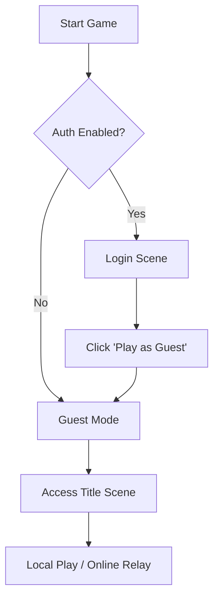
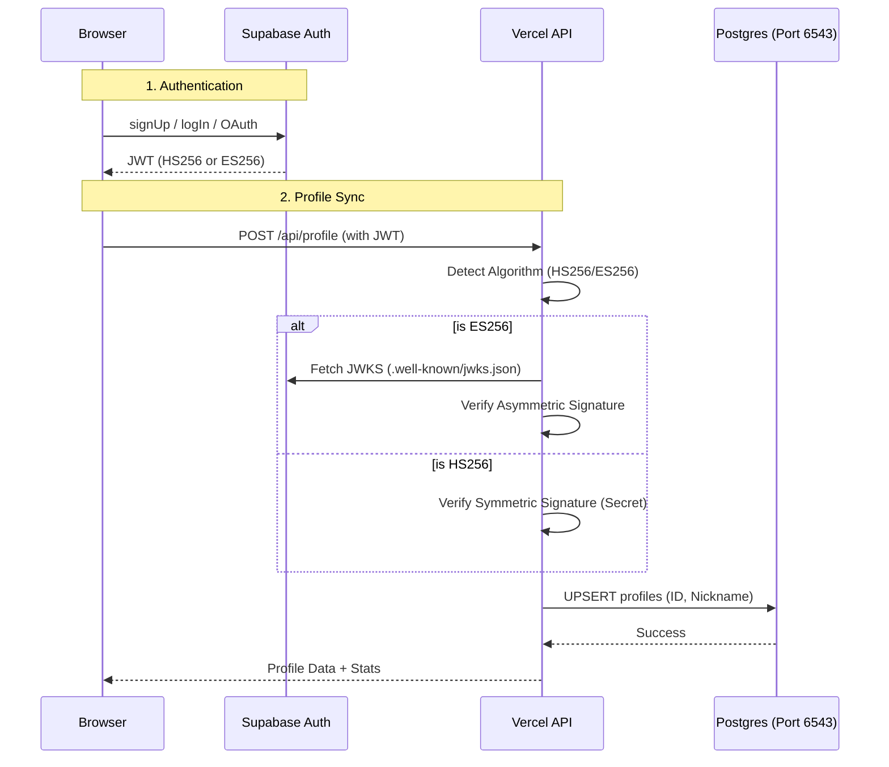
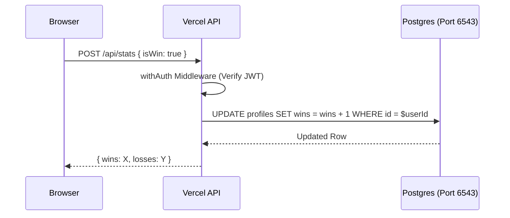

# RFC 0004: Comprehensive Authentication & Persistence Architecture

## Status
Proposed (Updated with Implementation Learnings)

## Context
The project has moved from a client-side only interaction with Supabase to a decoupled architecture using a Vercel Functions backend. This RFC describes the complete, production-ready authentication and persistence flow, covering all supported modes (Guest, Email/Password, and OAuth), modern JWT security, and robust database connectivity.

## Objectives
-   **Decouple DB Access**: Use Vercel Functions as an API layer, keeping Supabase strictly for Authentication.
-   **Universal JWT Support**: Support both Legacy (HS256) and Modern (ES256) Supabase JWT signing keys.
-   **Unified Persistence**: Centralize all data storage (profiles, statistics) behind the Vercel API.
-   **Portable Migrations**: Use `dbmate` for pure Postgres migrations, removing vendor-specific triggers.
-   **Network Compatibility**: Ensure connectivity on IPv4-only networks (like Vercel and many local ISPs) via the Supabase Connection Pooler.

## Authentication Modes

### 1. Guest Mode (Bypass)
Used when Supabase credentials are missing or the user chooses "JUGAR COMO INVITADO". No persistent data is saved.

### 2. Authenticated Flow (Email/Password & OAuth)
Standard registration and login flow using Supabase Auth, followed by a mandatory profile sync with the Vercel Backend.

## Data Persistence Flow (Stats)

All authenticated requests for data persistence (e.g., updating wins/losses) flow through the Vercel API using a "Bearer Token" pattern.

## Technical Specification

### 1. Vercel Functions (`api/`)
-   **`api/_lib/handler.js`**: Shared logic for JWT verification.
    -   Uses `jose` for lightweight, edge-compatible verification.
    -   Automatically handles **JWKS fetching** if the project uses asymmetric keys (`ES256`).
    -   Provides a database client from a global pool.
-   **`api/profile.js`**: Handles `GET` (fetch profile) and `POST` (upsert profile on login).
-   **`api/stats.js`**: Handles atomic `POST` updates for wins/losses.

### 2. Database Connectivity (IPv4 / Supavisor)
To ensure compatibility with environments like Vercel and local dev machines without IPv6 support, the system connects via the **Supabase Connection Pooler (Port 6543)**.
-   **URL Pattern**: `postgresql://postgres.[ID]:[PASS]@[HOST]:6543/postgres?pgbouncer=true`

### 3. Client Services
-   **`src/services/api.js`**: Handles all communication with `/api/*`. Includes automatic JWT attachment and a developer bypass (`X-Dev-User-Id`) for local testing without real tokens.
-   **`src/services/supabase.js`**: Refactored to handle **only** authentication actions (login, logout, session management).

## Security & Reliability
-   **XSS Protection**: All user-generated content (nicknames, emails) is rendered using `textContent` or `innerText` to prevent script injection.
-   **Robust JSON Parsing**: The client-side `apiFetch` detects empty or non-JSON responses (like 404/502 HTML pages) and provides clear diagnostic errors instead of crashing during `JSON.parse`.
-   **Local Development**: `vite.config.js` is configured with a proxy for `/api` to allow seamless development with `vercel dev`.

## Implementation Plan (Completed)
1.  **Backend**: Edge-compatible handlers with dual-algorithm support.
2.  **Migrations**: `dbmate` used for portable schema management.
3.  **UI**: `LoginScene`, `TitleScene`, and `VictoryScene` updated to use the decoupled API.
4.  **DevOps**: Added `dev:all` script to start both frontend and backend concurrently.
