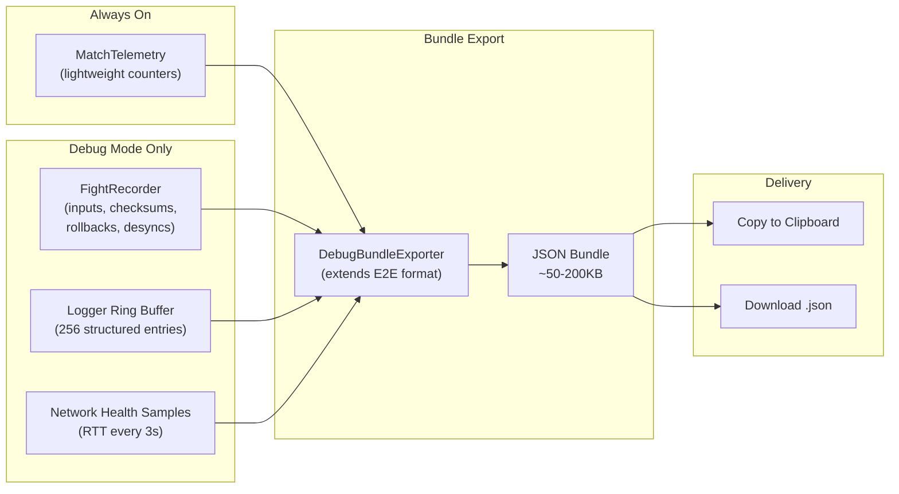
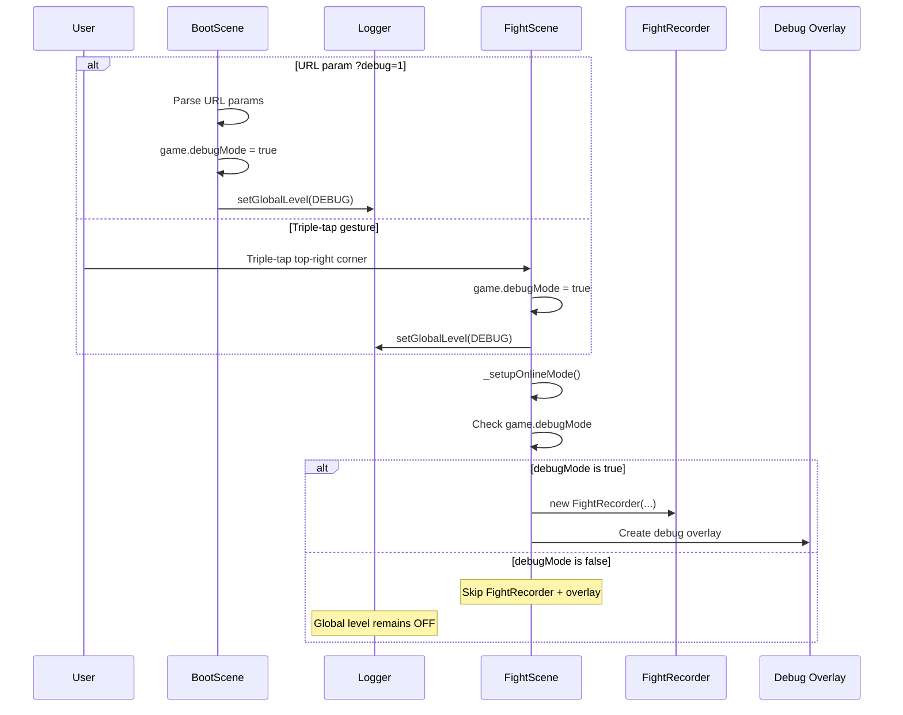
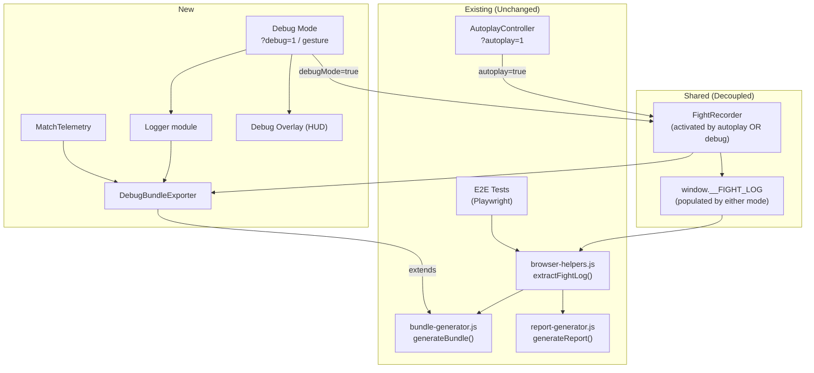
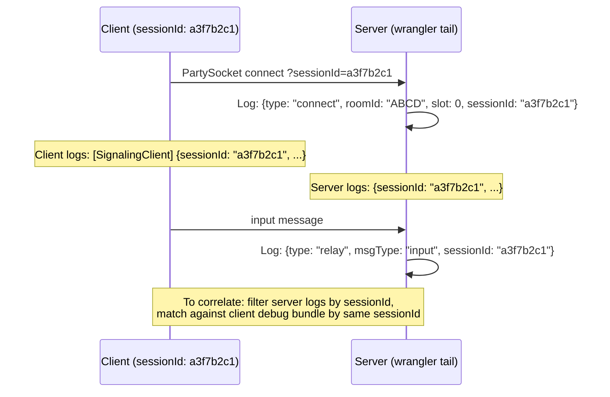
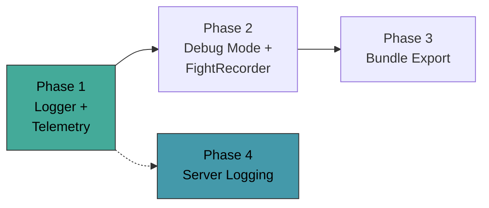

# RFC 0004: Multiplayer Debuggability

**Status:** Proposed
**Date:** 2026-03-30
**Author:** Architecture Team
**Predecessor:** [RFC 0002: Multiplayer Architecture Redesign](0002-multiplayer-redesign.md) (Phases 1–3 complete)

---

## Summary

When a player reports "multiplayer is broken", the team has zero data: no logs from either peer, no network health metrics, no input/rollback/desync timeline, no way to reproduce the issue. The existing debugging infrastructure -- FightRecorder, E2E bundle format, comparison reports -- is excellent but gated behind `?autoplay=1`. Real players never see it.

This RFC proposes a four-phase system that bridges the gap between the E2E test infrastructure and real-world debugging:

1. A structured, leveled, per-module **Logger** with an in-memory ring buffer
2. A **debug mode** that activates FightRecorder for real matches (decoupled from autoplay)
3. Exportable **debug bundles** in the same format the E2E framework already consumes
4. **Server-side** structured logging and room diagnostics

The system adds zero overhead when debug mode is off (always-on telemetry uses fewer than 200 bytes per match), and under 1KB/second of memory when debug mode is active.

---

## Goals and Non-Goals

### Goals

| Priority | Goal |
|----------|------|
| **P0** | **Field debugging** -- when a player reports a problem, the team can ask them to reproduce with `?debug=1` and export a bundle that contains everything needed to diagnose the issue |
| **P0** | **Always-on metrics** -- every match produces a lightweight summary (rollback count, max depth, desync count, transport mode, RTT samples) stored in memory, exportable on demand |
| **P0** | **Structured logging** -- replace scattered `console.log` with a tagged, leveled logger. Every networking module gets instrumented. Logs can be enabled per-module at runtime |
| **P1** | **Network health visibility** -- optional HUD overlay showing RTT, transport mode, rollback count, input buffer depth, desync count |
| **P1** | **Reuse existing infrastructure** -- FightRecorder and bundle-generator already capture the right data. The gap is activation, not implementation |
| **P2** | **Server-side observability** -- PartyKit server logs state transitions, message routing decisions, grace period events |

### Non-Goals

| Non-Goal | Rationale |
|----------|-----------|
| External analytics/crash reporting | No Sentry, no analytics SDK. Zero external dependencies. Friends-only game. |
| Persistent storage of debug bundles | Bundles are ephemeral (copy-to-clipboard or download). No backend storage needed. |
| Automated desync reporting | Requires server-side storage and a reporting UI. Players manually share bundles. |
| Performance profiling overlay | FPS counter exists in DevConsole. Frame timing profiling is a different concern. |
| Replay from debug bundles | Already works via `?replay=1` + `window.__REPLAY_BUNDLE`. Not new work. |

---

## High-Level Requirements

| # | Requirement | Detail |
|---|------------|--------|
| R1 | Structured logger | `Logger` module with levels (ERROR, WARN, INFO, DEBUG, TRACE), per-module tags, ring buffer storage, zero overhead when level is OFF |
| R2 | Always-on telemetry | Lightweight in-memory counters updated every match: rollback count, max depth, desync count, transport mode, RTT min/avg/max. Under 200 bytes. |
| R3 | Debug mode activation | URL param `?debug=1` or triple-tap top-right corner enables: verbose logging, FightRecorder, network health overlay |
| R4 | FightRecorder decoupled from autoplay | `FightRecorder` instantiation controlled by debug mode flag, not `game.autoplay?.enabled` |
| R5 | Debug bundle export | Same JSON format as E2E bundles (`generateBundle()`), augmented with logger ring buffer and network health samples. Downloadable or copy-to-clipboard. |
| R6 | Network health overlay | Optional HUD showing RTT, transport mode (P2P/WS), rollback count, input buffer depth, desync count, match state. Spanish labels. |
| R7 | Per-module instrumentation | All 6 networking modules (NetworkFacade, SignalingClient, TransportManager, InputSync, ConnectionMonitor, SpectatorRelay) plus FightScene and party/server.js get structured log calls at key decision points |
| R8 | Server-side logging | party/server.js logs state transitions, message routing, rejoin flow, grace period events, rate limit triggers |
| R9 | Zero performance impact when off | Logger level OFF = no string formatting, no object allocation, no function calls beyond a single branch check |

---

## Architecture

### Logger Module

```mermaid
flowchart TB
    subgraph Logger["Logger (src/systems/Logger.js)"]
        direction TB
        API["Logger.create('TransportManager')"]
        Levels["Levels: OFF < ERROR < WARN < INFO < DEBUG < TRACE"]
        RB["Ring Buffer (256 entries)"]
        Output["Output: console + ring buffer"]
    end

    subgraph Consumers["Per-Module Loggers"]
        L_TM["log.debug('WebRTC init', &#123;slot, offerer&#125;)"]
        L_SC["log.info('Handler registered', &#123;type&#125;)"]
        L_IS["log.trace('Input buffered', &#123;frame, depth&#125;)"]
        L_CM["log.debug('Pong received', &#123;rtt&#125;)"]
        L_NF["log.info('TURN fetch', &#123;servers&#125;)"]
        L_FS["log.warn('Desync detected', &#123;frame&#125;)"]
    end

    subgraph Config["Runtime Configuration"]
        Global["Global level (default: OFF)"]
        PerMod["Per-module override map"]
        Debug["?debug=1 sets Global=DEBUG"]
    end

    Consumers --> API
    API --> Levels
    Levels --> |"level >= threshold"| RB
    Levels --> |"level >= threshold"| Output
    Config --> Levels
```



### Data Flow: Debug Bundle Generation



### Debug Mode Activation Flow



### Integration with Existing Systems



---

## Detailed Design

### 1. Logger Module (`src/systems/Logger.js`)

A minimal structured logger. No external dependencies. Static singleton -- modules get lightweight wrappers via `Logger.create('ModuleName')`.

```javascript
// API sketch -- not final implementation
export const LogLevel = { OFF: 0, ERROR: 1, WARN: 2, INFO: 3, DEBUG: 4, TRACE: 5 };

class Logger {
  static _globalLevel = LogLevel.OFF;
  static _moduleOverrides = new Map();  // module -> level
  static _ringBuffer = [];              // { ts, module, level, msg, data }
  static _ringBufferMax = 256;

  static create(module) {
    return {
      error: (msg, data) => Logger._log(module, LogLevel.ERROR, msg, data),
      warn:  (msg, data) => Logger._log(module, LogLevel.WARN,  msg, data),
      info:  (msg, data) => Logger._log(module, LogLevel.INFO,  msg, data),
      debug: (msg, data) => Logger._log(module, LogLevel.DEBUG, msg, data),
      trace: (msg, data) => Logger._log(module, LogLevel.TRACE, msg, data),
    };
  }

  static _log(module, level, msg, data) {
    const threshold = Logger._moduleOverrides.get(module) ?? Logger._globalLevel;
    if (level > threshold) return;  // fast bail -- zero overhead when OFF
    const entry = { ts: Date.now(), module, level, msg, data };
    Logger._ringBuffer.push(entry);
    if (Logger._ringBuffer.length > Logger._ringBufferMax) Logger._ringBuffer.shift();
    // Console output: WARN/ERROR always, others only when enabled
    const prefix = `[${module}]`;
    if (level <= LogLevel.WARN) console.warn(prefix, msg, data ?? '');
    else console.log(prefix, msg, data ?? '');
  }
}
```

Key design decisions:

- **Fast bail.** When level is OFF, `_log()` returns after a single integer comparison. No string formatting, no object allocation.
- **Ring buffer.** Fixed-size (256 entries). Old entries dropped silently. Included in debug bundles. Not written to disk.
- **Console output.** WARN and ERROR always go to console when level is active. DEBUG/TRACE only when explicitly enabled. Production users see zero console noise when level is OFF.

### 2. MatchTelemetry (`src/systems/MatchTelemetry.js`)

Always-on lightweight counters. Updated in the RollbackManager advance loop. Zero allocation -- just integer increments.

```javascript
// Data shape -- plain object, not a class
{
  matchId: string,           // roomId or 'local'
  startedAt: number,         // Date.now()
  transportMode: string,     // 'webrtc' | 'websocket'
  transportChanges: number,
  rollbackCount: number,
  maxRollbackDepth: number,
  desyncCount: number,
  resyncCount: number,
  rttSamples: number[],      // sampled every 3s, max 60 entries (~3 min match)
  rttMin: number,
  rttMax: number,
  rttAvg: number,
  disconnectionCount: number,
  reconnectionCount: number,
  matchDurationMs: number,
}
```

Total memory: under 200 bytes (excluding `rttSamples` array which caps at ~480 bytes for a full match).

### 3. FightRecorder Decoupling

The critical change is at `src/scenes/FightScene.js:770`. Currently:

```javascript
// Current: only in autoplay
if (this.game.autoplay?.enabled) {
  this.recorder = new FightRecorder({ ... });
}
```

Proposed:

```javascript
// New: autoplay OR debug mode
if (this.game.autoplay?.enabled || this.game.debugMode) {
  this.recorder = new FightRecorder({ ... });
}
```

This single conditional change unlocks the entire FightRecorder data pipeline for real matches.

### 4. Debug Bundle Format

Extends the existing E2E bundle format (from `tests/e2e/helpers/bundle-generator.js`) with diagnostic data:

```javascript
{
  version: 2,
  generatedAt: '<ISO string>',
  source: 'debug' | 'e2e',            // distinguishes origin

  // Existing fields (same as E2E bundle)
  config: { p1FighterId, p2FighterId, stageId, ... },
  confirmedInputs: [...],
  p1: { playerSlot, inputs, checksums, roundEvents, networkEvents, finalState, ... },
  p2: null,                            // single-peer debug bundles only have local data

  // NEW: diagnostic data
  diagnostics: {
    telemetry: { /* MatchTelemetry counters */ },
    logBuffer: [{ ts, module, level, msg, data }],   // logger ring buffer
    networkHealth: {
      samples: [{ ts, rtt, transport, bufferDepth }],
      transportChanges: [{ ts, from, to }],
    },
    matchState: {
      transitions: [{ ts, from, to, event }],
      finalState: '<string>',
    },
    environment: {
      userAgent: '<string>',
      platform: '<string>',
      connection: { type, downlink, rtt },            // Navigator.connection
    },
  },
}
```

### 5. Debug Overlay (Network Health HUD)

Positioned bottom-left, below the existing transport indicator. All text in Spanish. Collapsed by default -- tap to expand.

```
Collapsed:
┌────────────────────┐
│  RTT: 45ms  P2P    │
└────────────────────┘

Expanded (tap):
┌──────────────────────────┐
│  RTT: 45ms    P2P        │
│  Rollbacks: 12  Max: 3   │
│  Desyncs: 0   Buf: 2     │
│  Estado: ROUND_ACTIVE     │
│  [Exportar Debug]         │
└──────────────────────────┘
```

- Updates once per second (same cadence as existing ping timer)
- Semi-transparent black background, monospace, depth 200
- Only visible when `game.debugMode` is true
- Reads from: `RollbackManager`, `ConnectionMonitor`, `TransportManager`, `InputSync`, `MatchStateMachine`

### 6. Server-Side Logging

PartyKit runs on Cloudflare Workers. `console.log` in Workers goes to the real-time log stream (via `wrangler tail` or dashboard). The server gets structured JSON logging at key decision points -- always on since Workers logs are ephemeral and cost nothing.

### 7. Client-Server Log Correlation

Client and server logs are independent systems with different clocks and no shared identifiers beyond `roomId` and `playerSlot`. To correlate them during incident analysis, we introduce a **session ID**.

**How it works:**

1. Client generates a short random session ID on connection (e.g. `crypto.randomUUID().slice(0, 8)` → `"a3f7b2c1"`)
2. Session ID is passed as a query parameter on the PartySocket connection: `new PartySocket({ query: { sessionId } })`
3. Server extracts `sessionId` from the connection URL and stores it alongside `connection.id`
4. All server logs include `{ roomId, slot, sessionId }` — all client logs include `{ roomId, slot, sessionId }`
5. Debug bundles include the `sessionId` in their metadata

**Correlation flow:**



**What you can correlate:**

| Scenario | Client-side evidence | Server-side evidence | Correlation key |
|----------|---------------------|---------------------|-----------------|
| Transport degradation | Logger: `[TransportManager] DataChannel closed` | Log: `{type: "relay", transport: "ws"}` (inputs now via WS) | `sessionId` + timestamp window |
| Reconnection | Logger: `[SignalingClient] Socket close` → `Socket open` | Log: `{type: "disconnect"}` → `{type: "rejoin", sessionId}` | `sessionId` (new connection, same session ID) |
| Grace period expiry | Logger: `[FightScene] Reconnection disconnect` | Log: `{type: "grace_expired", slot, sessionId}` | `sessionId` + `slot` |
| Desync | Debug bundle: checksum mismatch at frame N | Log: `{type: "relay", msgType: "resync_request"}` | `roomId` + timestamp window |

**Key properties:**
- `sessionId` survives reconnections — client reuses the same ID across PartySocket auto-reconnects
- Both peers in a room have different session IDs, so you can distinguish P1 vs P2 in server logs
- The `sessionId` is not sensitive (short random string, no PII)
- Correlation is manual (grep server logs by sessionId, compare with client bundle) — no automated join needed

---

## Module Instrumentation Plan

### What Gets Logged Per Module

**NetworkFacade** (`src/systems/net/NetworkFacade.js`):
- INFO: TURN fetch result (server count or failure)
- DEBUG: WebRTC init trigger (slot, offerer flag)
- DEBUG: Reconnect flow events (opponent_joined, opponent_reconnected, rejoin_ack)

**SignalingClient** (`src/systems/net/SignalingClient.js`):
- INFO: Socket open/close events
- DEBUG: Handler registration (`on()` calls with type)
- DEBUG: Pending queue flush (B4: count on reconnect)
- DEBUG: Callback buffer flush (B5: type, count)
- WARN: JSON parse errors (currently silently caught)
- TRACE: Message dispatch (type, has handler)

**TransportManager** (`src/systems/net/TransportManager.js`):
- INFO: WebRTC init (slot, offerer, ICE server count) -- replaces `console.log` at line 61
- INFO: TURN credentials fetched (server count) -- replaces `console.log` at line 140
- WARN: WebRTC unavailable -- replaces `console.log` at line 54
- WARN: TURN fetch failure -- replaces `console.log` at lines 133, 143
- DEBUG: Transport mode change (websocket to webrtc, degradation)
- DEBUG: DataChannel open/close events

**InputSync** (`src/systems/net/InputSync.js`):
- DEBUG: Input arrival (frame, buffer depth, source: p2p or ws)
- DEBUG: Redundant history applied (frame, gap count)
- TRACE: Input send (frame, transport used, history length)

**ConnectionMonitor** (`src/systems/net/ConnectionMonitor.js`):
- DEBUG: Pong received (RTT value)
- WARN: Pong timeout fired (last pong time, elapsed)

**SpectatorRelay** (`src/systems/net/SpectatorRelay.js`):
- DEBUG: Callback buffer flush (type, message count)
- DEBUG: Sync sent (frame number)

**FightScene** (`src/scenes/FightScene.js`):
- INFO: Online mode setup (slot, room, fighters, stage)
- WARN: Desync detected -- replaces `console.warn` at line 798
- WARN: Resync applied -- replaces `console.warn` at line 831
- DEBUG: Frame-0 sync result -- replaces `console.log` at lines 1850-1901
- DEBUG: Round event (type, winner, frame)
- DEBUG: Reconnection events (pause, resume, disconnect)

**party/server.js**:
- INFO: All state transitions (`_transition()`)
- INFO: Connect/disconnect events with slot and room state
- INFO: Rejoin flow (slot, grace active, reset flag)
- WARN: Rate limit triggers (type, connection ID, cooldown remaining)
- WARN: Out-of-state message rejections

---

## Implementation Plan

### Phase 1: Structured Logger + Always-On Telemetry

**Objective:** Create the Logger module and MatchTelemetry. Instrument all networking modules. Replace existing `console.log` calls with structured logger calls.

| # | Task | Details |
|---|------|---------|
| 1.1 | Create `src/systems/Logger.js` | Static singleton. Levels: OFF, ERROR, WARN, INFO, DEBUG, TRACE. Per-module tag. Ring buffer (256 entries). `Logger.create(module)` returns lightweight wrapper. Fast bail when level is OFF. |
| 1.2 | Create `src/systems/MatchTelemetry.js` | Always-on counters. Hooks into RollbackManager callbacks (`_onRollback`, `_onDesync`). Samples RTT from ConnectionMonitor every 3 seconds. Records transport changes. |
| 1.3 | Instrument `TransportManager.js` | Replace 5 existing `console.log` calls (lines 54, 61, 133, 140, 143) with logger calls. Add DEBUG logs for DataChannel state changes. |
| 1.4 | Instrument `SignalingClient.js` | Add log calls for socket lifecycle, handler registration, pending queue flush, B5 buffer flush. Replace silent catch with `log.warn()`. |
| 1.5 | Instrument `InputSync.js` | Add DEBUG log for input arrival (frame, buffer depth). Add TRACE log for input send. |
| 1.6 | Instrument `ConnectionMonitor.js` | Add DEBUG log for pong received (RTT). Add WARN log for timeout. |
| 1.7 | Instrument `SpectatorRelay.js` | Add DEBUG log for buffer flush, sync sent. |
| 1.8 | Instrument `NetworkFacade.js` | Add INFO/DEBUG logs for TURN fetch, WebRTC init, reconnect flow. |
| 1.9 | Replace FightScene console calls | Replace `console.warn`/`console.log` calls in FightScene.js online multiplayer paths with structured `log.*()` calls. Keep replay-specific `[REPLAY]` logs as-is (different concern). |
| 1.10 | Generate session ID in `SignalingClient` | Generate `sessionId` via `crypto.randomUUID().slice(0, 8)` on construction. Pass as PartySocket query param. Include in all Logger entries as context. Persist in debug bundles. |
| 1.11 | Unit tests | Test Logger: level filtering, ring buffer overflow, per-module override, fast bail. Test MatchTelemetry: counter increments, RTT sampling. |

**Verification:**
- All existing tests pass (no behavioral changes)
- `Logger.create('test').debug('msg')` with global level OFF produces zero side effects
- Ring buffer correctly caps at 256 entries
- No new `console.log` calls in `src/systems/net/` -- all replaced by Logger

---

### Phase 2: Debug Mode + FightRecorder for Real Matches

**Objective:** Activate FightRecorder and verbose logging for real matches via URL param or in-game gesture. Add network health overlay.

| # | Task | Details |
|---|------|---------|
| 2.1 | Parse `?debug=1` URL param | In BootScene alongside existing autoplay param parsing. Set `game.debugMode = true`. Call `Logger.setGlobalLevel(LogLevel.DEBUG)`. |
| 2.2 | Decouple FightRecorder from autoplay | Change guard at FightScene.js line 770 from `game.autoplay?.enabled` to `game.autoplay?.enabled \|\| game.debugMode`. Same for recorder hook wiring at lines 786-793. |
| 2.3 | Triple-tap gesture activation | In FightScene `create()`: register touch listener on top-right 60x40 region. Three taps within 1 second toggles `game.debugMode`. On activation: set Logger level, instantiate FightRecorder if not already active, show overlay. |
| 2.4 | Create `src/systems/DebugOverlay.js` | Phaser text container at bottom-left. Collapsed: RTT + transport mode. Tap to expand: rollback count, max depth, desync count, buffer depth, match state. Updates 1x/second. Spanish labels. Semi-transparent background. Depth 200. |
| 2.5 | Wire MatchTelemetry to FightScene | Create MatchTelemetry instance in `_setupOnlineMode()`. Wire to RollbackManager hooks. Feed data to debug overlay. |
| 2.6 | Integration test | Playwright test: load with `?debug=1`, verify FightRecorder is active (`window.__FIGHT_LOG` populated), verify Logger ring buffer has entries. |

**Verification:**
- `?debug=1` activates FightRecorder for a real online match (not autoplay)
- `window.__FIGHT_LOG` is populated with inputs, checksums, rollbacks, desyncs
- Logger ring buffer contains entries from networking modules
- Debug overlay shows live RTT, transport mode, rollback stats
- With `?debug=1` OFF, no FightRecorder, no overlay, no DEBUG-level logs (zero overhead)
- All existing E2E tests pass unchanged (autoplay path unaffected)

---

### Phase 3: Debug Bundle Export

**Objective:** Enable players to export a JSON debug bundle containing FightRecorder data, logger ring buffer, network health samples, and environment info.

| # | Task | Details |
|---|------|---------|
| 3.1 | Create `src/systems/DebugBundleExporter.js` | Generates JSON bundle from FightRecorder log, Logger ring buffer, MatchTelemetry, MatchStateMachine transition history, `Navigator.connection` info. Extends E2E `generateBundle()` format with `diagnostics` section. Sets `version: 2` and `source: 'debug'`. |
| 3.2 | Add "Exportar Debug" button | Visible only when `game.debugMode` is true. Placed in expanded debug overlay. Spanish label: "Exportar Debug". |
| 3.3 | Implement copy-to-clipboard | Primary export method for mobile. Uses `navigator.clipboard.writeText(JSON.stringify(bundle))`. Shows "Copiado!" confirmation toast. Falls back to download if clipboard API unavailable. |
| 3.4 | Implement file download | Secondary export method. Creates Blob + temporary `<a>` element, triggers download. Filename: `debug-{roomId}-{timestamp}.json`. |
| 3.5 | Add MatchStateMachine transition logging | Record all transitions in an array: `{ ts, from, to, event }`. Capped at 100 entries. Feed into debug bundle. |
| 3.6 | Collect environment info | `navigator.userAgent`, `navigator.platform`, `navigator.connection` (if available: `type`, `downlink`, `rtt`). Include in `diagnostics.environment`. |
| 3.7 | E2E bundle backward compatibility | Ensure existing `generateBundle()` in `tests/e2e/helpers/bundle-generator.js` still works. New bundles are a superset. `generateReport()` handles both v1 and v2 bundles. |

**Verification:**
- Exported bundle is valid JSON
- Bundle contains all FightRecorder data (inputs, checksums, rollbacks, desyncs)
- Bundle contains Logger ring buffer entries
- Bundle contains MatchTelemetry counters
- Bundle contains environment info (userAgent, connection type)
- Bundle is loadable by existing `generateReport()` (backward compatible)
- Copy-to-clipboard works on Mobile Safari iPhone 15
- File download works as fallback
- Bundle size is reasonable (50-200KB for a typical match)

---

### Phase 4: Server-Side Logging + Room Diagnostics

**Objective:** Add structured logging to `party/server.js`. Add an HTTP diagnostic endpoint for inspecting live room state.

| # | Task | Details |
|---|------|---------|
| 4.1 | Structured logging in `party/server.js` | Log state transitions in `_transition()`. Log connect/disconnect in `onConnect()`/`onClose()`. Log rejoin flow in `_handleRejoin()`. Log rate limit triggers. Use `console.log(JSON.stringify({...}))` for structured output compatible with `wrangler tail`. Extract `sessionId` from connection query params and include in all log entries for client-server correlation. |
| 4.2 | Room diagnostic HTTP endpoint | `GET /parties/main/{roomId}/diagnostics` returns JSON: `{ roomState, players, spectatorCount, graceTimers, fightInfo }`. Protected by bearer token from env var (`DIAG_TOKEN`). |
| 4.3 | Server-side ring buffer | In-memory array of last 50 server events (state transitions, connects, disconnects, errors). Included in diagnostic endpoint response. |
| 4.4 | Replace existing server console.log | Replace 2 existing `console.log` calls at lines 131 and 147 with structured JSON format. |
| 4.5 | Server test updates | Update `tests/party/server.test.js` to verify: diagnostic endpoint returns correct data, ring buffer caps at 50 entries. |

**Verification:**
- `wrangler tail` shows structured JSON logs for state transitions during a real match
- `GET /diagnostics` with valid token returns room state JSON
- `GET /diagnostics` without token returns 401
- Existing server tests pass

---

### Phase Dependencies



Phase 4 (server-side) only depends on Phase 1 for the logging pattern -- it can proceed in parallel with Phases 2-3.

---

## Decision Matrices

### Debug Mode Activation Method

| Method | Discoverability | Mobile Friendly | Accidental Activation Risk | Recommendation |
|--------|----------------|-----------------|---------------------------|----------------|
| URL param `?debug=1` | Low (team shares URL) | Yes | None | **Primary** |
| Triple-tap corner | Medium | Yes | Low (3 taps in 1s on small region) | **Secondary** |
| Long-press logo | Medium | Yes | Medium (accidental long press) | Reject |
| Shake gesture | Low | Yes | High (natural phone movement) | Reject |

**Decision:** URL param as primary, triple-tap as secondary (mobile). Both activate the same `game.debugMode` flag.

### Debug Bundle Delivery

| Method | Mobile Safari Support | User Effort | Size Limit | Recommendation |
|--------|----------------------|-------------|-----------|----------------|
| Copy to clipboard | Yes (Clipboard API) | Low (paste into chat) | ~1MB practical | **Primary** |
| File download | Yes (Blob + `<a>`) | Medium (find file, share) | Unlimited | **Fallback** |
| Upload to server | N/A | Lowest | Unlimited | Reject (no backend) |
| QR code | Limited | Medium | ~3KB max | Reject (too large) |

**Decision:** Copy-to-clipboard as primary (mobile-first, player pastes into Discord/WhatsApp). File download as fallback when clipboard API is unavailable.

### Logger Ring Buffer Size

| Size | Memory | Coverage at DEBUG level | Recommendation |
|------|--------|------------------------|----------------|
| 64 entries | ~16KB | ~10 seconds | Too short |
| 256 entries | ~64KB | ~40 seconds | **Selected** |
| 1024 entries | ~256KB | ~3 minutes | Excessive for mobile |

**Decision:** 256 entries. A typical desync investigation needs the 20-30 seconds before the event.

---

## Open Questions

| # | Question | Options | Recommendation |
|---|----------|---------|----------------|
| Q1 | Should MatchTelemetry persist across rematches? | A) Reset per match B) Accumulate across session | A -- reset per match. Each match should have independent metrics. |
| Q2 | Should the debug overlay be interactive (tap to expand)? | A) Static, always full B) Collapsed by default, tap to expand | B -- collapsed by default. Show only RTT and transport mode in collapsed state. |
| Q3 | Should Logger support remote log shipping? | A) Local only (ring buffer + console) B) Optional WebSocket shipping | A for now. Bundle export is sufficient. Revisit if manual sharing proves insufficient. |
| Q4 | Should the server diagnostic endpoint be available in production? | A) Always (token-protected) B) Dev only C) Feature-flagged | A -- always available. Token-protected is sufficient for a friends-only game. |
| Q5 | Should debug bundles include raw input data? | A) Full inputs (replayable) B) Stats only (smaller) | A -- full inputs. FightRecorder already captures sparse inputs efficiently. Enables replay for reproduction. |

---

## Risks and Mitigations

| Risk | Impact | Likelihood | Mitigation |
|------|--------|-----------|------------|
| Logger overhead in hot path | Frame drops during rollback resimulation | Low | Fast bail: single integer comparison when OFF. Never log inside `tick()` -- only in the networking layer around it. |
| Ring buffer memory on mobile | Memory pressure on iPhone | Low | Cap individual entry `data` at 500 chars. Total buffer under 128KB worst case. |
| Clipboard API failure on Mobile Safari | Can't export bundle | Medium | Always call from button click handler (satisfies user gesture requirement). HTTPS already required. Fall back to file download. |
| Debug mode left on by accident | UI clutter, minor perf impact | Low | Visible "DEBUG" badge in overlay. "Desactivar" button to turn off. |
| Breaking autoplay/E2E path | CI tests fail | Low | Change is additive (OR condition). Autoplay path identical. Add regression test. |
| Bundle size exceeds clipboard limit | Long matches produce large bundles | Low | Sparse input recording keeps size manageable. Fall back to file download. Show size in toast. |

---

## Replacing Existing Console Logs

The following existing `console.log`/`console.warn` calls get replaced by Logger calls. Non-breaking -- Logger emits to console at the same levels.

| File | Line(s) | Current | Replacement |
|------|---------|---------|-------------|
| `TransportManager.js` | 54 | `console.log('[TM] WebRTC unavailable')` | `log.warn('WebRTC unavailable')` |
| `TransportManager.js` | 61 | `console.log('[TM] initWebRTC ...')` | `log.info('WebRTC init', {slot, offerer})` |
| `TransportManager.js` | 133 | `console.log('[TM] TURN ... failed')` | `log.warn('TURN fetch failed', {status})` |
| `TransportManager.js` | 140 | `console.log('[TM] TURN ... fetched')` | `log.info('TURN fetched', {count})` |
| `TransportManager.js` | 143 | `console.log('[TM] TURN ... error')` | `log.warn('TURN fetch error', {err})` |
| `FightScene.js` | 798 | `console.warn('[DESYNC] ...')` | `log.warn('Desync', {frame, local, remote})` |
| `FightScene.js` | 831 | `console.warn('[RESYNC] ...')` | `log.warn('Resync applied', {frame})` |
| `FightScene.js` | 1850-1901 | `console.log('[SYNC] ...')` | `log.debug('Frame-0 sync', {...})` |
| `party/server.js` | 131 | `console.log('TURN ... error')` | `console.log(JSON.stringify({type: 'turn_error', ...}))` |
| `party/server.js` | 147 | `console.log('TURN ... error')` | `console.log(JSON.stringify({type: 'turn_error', ...}))` |

---

## Appendix: Example Debug Session

A player reports "the game froze and then desynced" on their iPhone.

1. Team asks player to reload with `?debug=1` appended to URL
2. Player reproduces the issue
3. Player taps the collapsed overlay, taps "Exportar Debug"
4. Player pastes the JSON bundle into Discord/WhatsApp
5. Team runs `generateReport()` on the bundle -- sees:
   - RTT spike from 40ms to 800ms at frame 340
   - Transport degraded from P2P to WS at frame 342
   - 6-frame rollback at frame 345 (normal max is 3)
   - Desync detected at frame 360 (checksum mismatch)
   - Resync applied at frame 362
   - Logger shows: `[TransportManager] DataChannel closed` at the exact timestamp
   - Logger shows: `[InputSync] Buffer depth 0 for 4 consecutive frames` preceding the desync
6. Team identifies root cause: network handoff caused ICE failure, WebSocket fallback introduced enough latency to exceed rollback window
7. Fix: increase max rollback window when transport degrades, or add proactive resync on transport degradation
