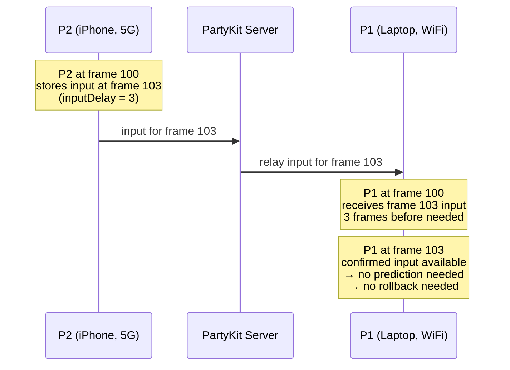
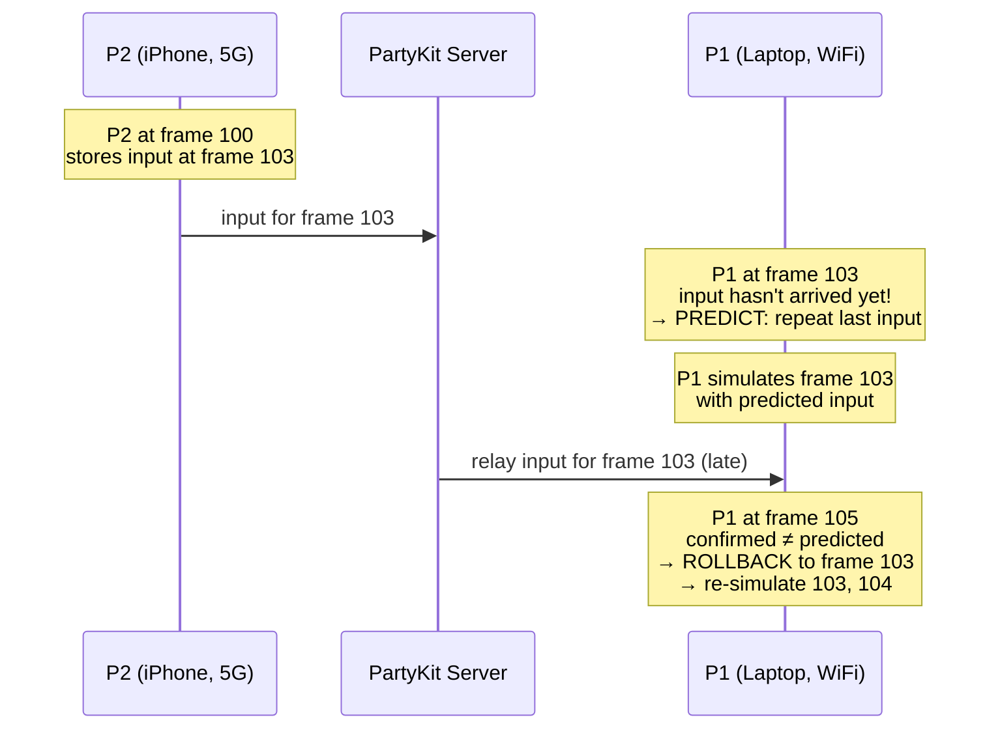
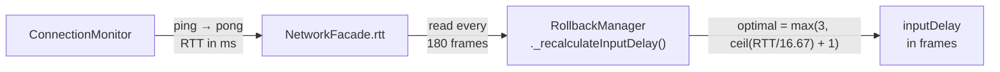
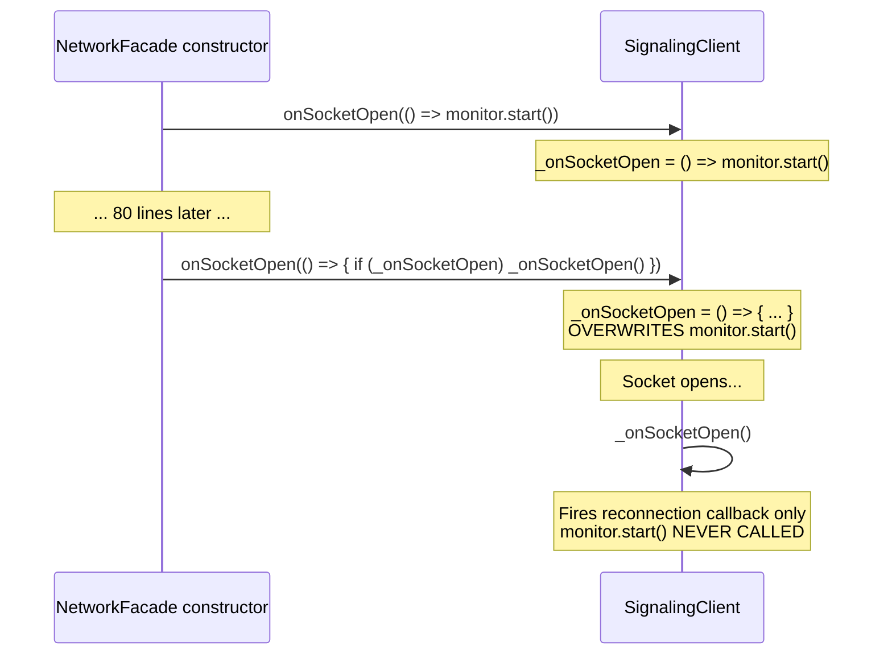
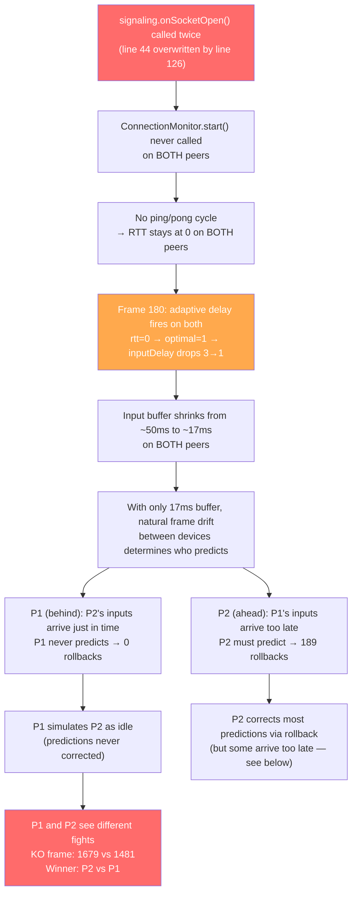
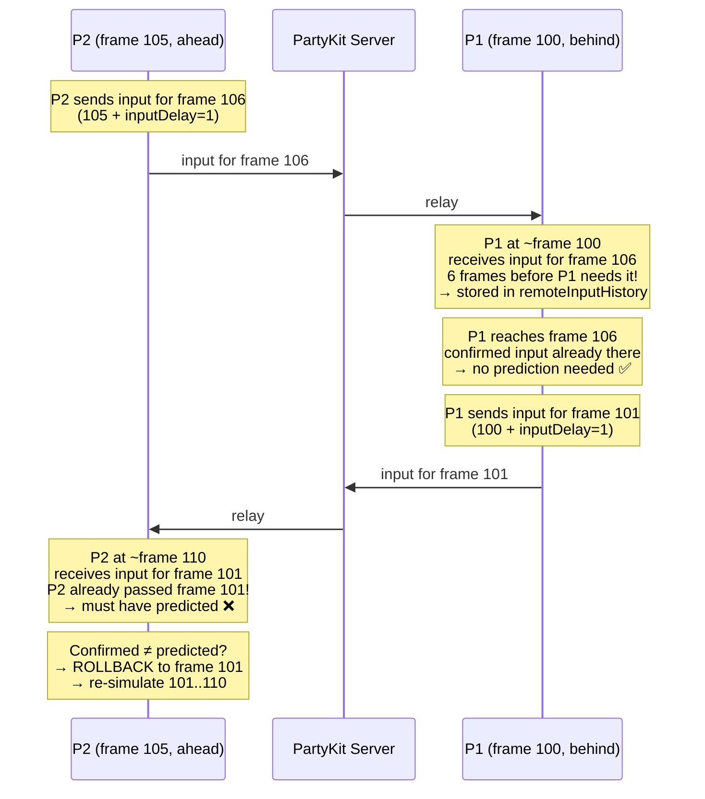
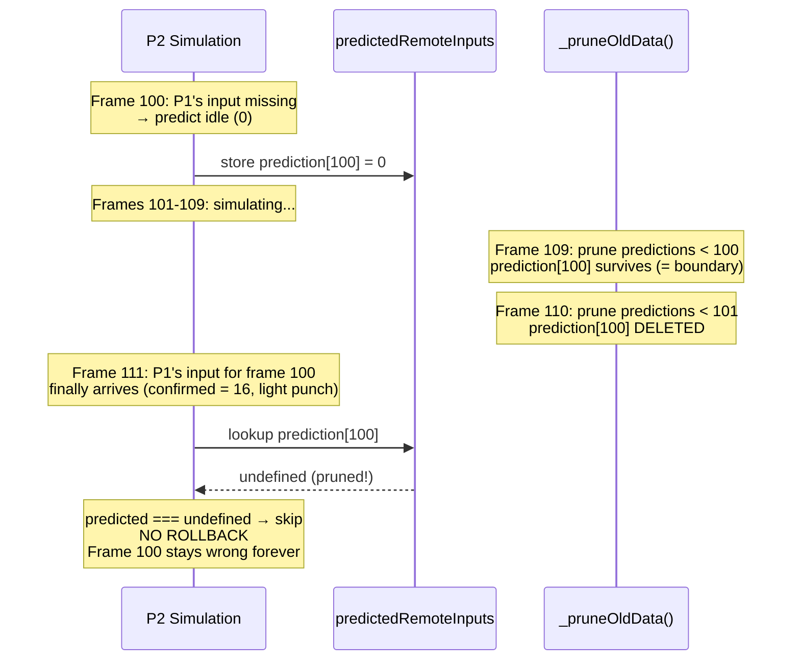
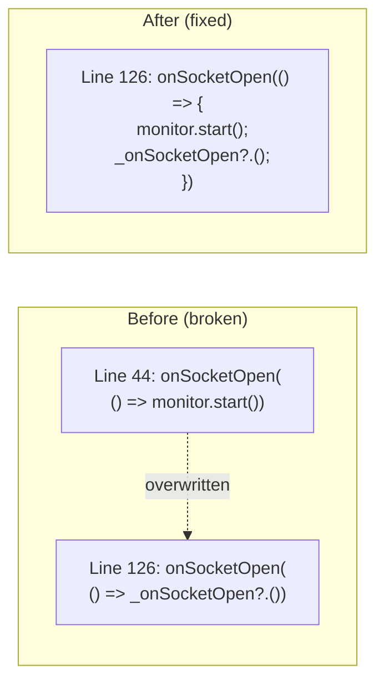
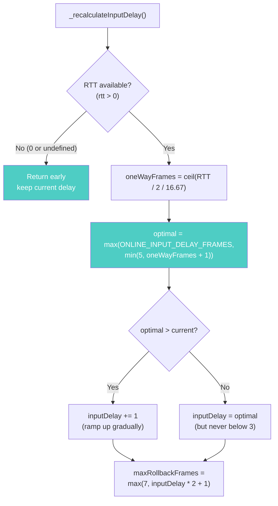
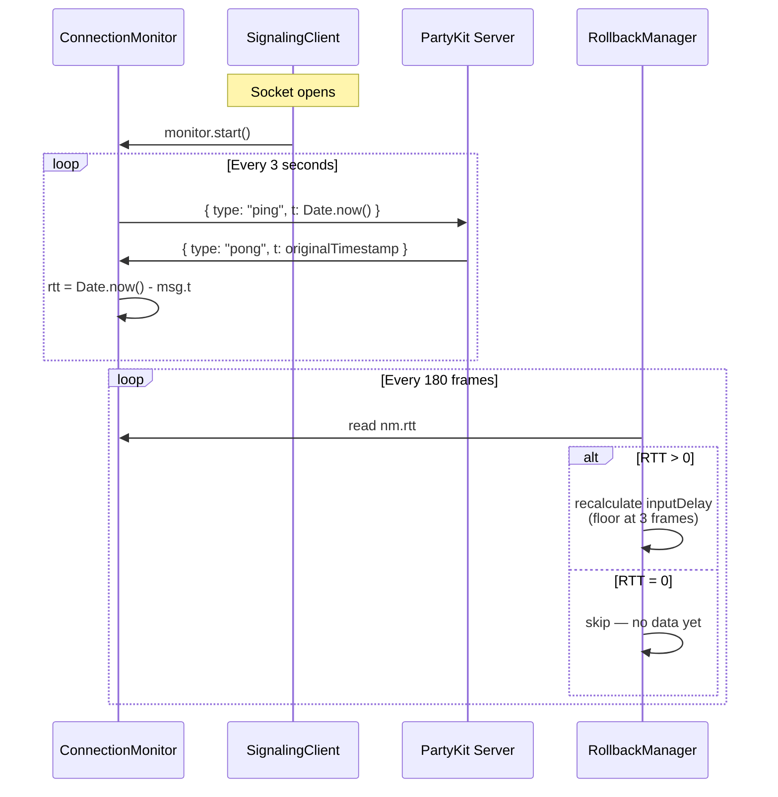

# RFC 0006: Fix P1 Never Rolls Back

**Status:** Proposed
**Date:** 2026-03-31
**Author:** Architecture Team
**Issue:** [#77](https://github.com/simon0191/a-los-traques/issues/77)

---

## Summary

In a real cross-device multiplayer match (WiFi laptop vs 5G iPhone), **P1 performed zero rollbacks while P2 performed 189**, causing the two simulations to diverge — health bars differed, timers drifted, and KO events occurred 198 frames (~3.3 seconds) apart. The two peers even disagreed on **who won the round**.

Root cause: a callback overwrite bug in `NetworkFacade` prevents `ConnectionMonitor` from ever starting on **both peers**. This means RTT (Round Trip Time — the time in milliseconds for a message to travel from a peer to the PartyKit server and back) is never measured. The adaptive input delay algorithm sees RTT = 0 and interprets it as "perfect zero-latency connection," slashing the input buffer from 3 frames (~50ms) to 1 frame (~17ms). With such a tiny buffer, natural frame drift between devices creates a one-sided rollback pattern: one peer never needs to predict while the other must predict constantly — and its wrong predictions are never corrected.

---

## Background

### How Rollback Netcode Uses Input Delay

In our GGPO-style rollback system, each peer stores their local input not at the current frame but at `currentFrame + inputDelay` frames ahead. This gives the opponent's input time to arrive over the network before the local simulation reaches that frame.



When inputs arrive **on time** (within the `inputDelay` buffer), no prediction or rollback is needed — the simulation uses confirmed inputs directly.

When inputs arrive **late** (after the peer has already simulated past that frame), the peer must predict the missing input, simulate forward, and later rollback + re-simulate when the real input arrives:



### How RTT Feeds Adaptive Delay

The `ConnectionMonitor` periodically pings the PartyKit server and measures the Round Trip Time (RTT) from the pong response. The `RollbackManager` uses this RTT every 180 frames to tune `inputDelay` — increasing it when the network is slow, keeping it at the baseline when it's fast:



### What Prediction Looks Like

When the rollback system doesn't have a confirmed remote input for a frame, it **predicts**: repeat the opponent's last movement direction, but zero out all attack buttons. This works well for idle frames (most frames in a fighting game), but misses attacks:

| Scenario | Prediction | Actual | Result |
|----------|-----------|--------|--------|
| Opponent idle | `0` (idle) | `0` (idle) | Match — no rollback needed |
| Opponent walking right | `2` (right) | `2` (right) | Match — no rollback needed |
| Opponent throws a punch | `0` (idle) | `16` (light punch) | **Mismatch — rollback!** |

---

## The Bug

### Callback Overwrite in NetworkFacade

The `NetworkFacade` constructor registers `signaling.onSocketOpen()` **twice**. Since `SignalingClient.onSocketOpen(cb)` is a plain property assignment (`this._onSocketOpen = cb`), the second call silently overwrites the first:



**Source locations:**
- First call: `NetworkFacade.js` line 44 — `this.signaling.onSocketOpen(() => this.monitor.start())`
- Second call: `NetworkFacade.js` line 126 — `this.signaling.onSocketOpen(() => { if (this._onSocketOpen) this._onSocketOpen() })`

### Cascading Failure Chain

The one-line callback overwrite triggers a chain of failures that ends in visible gameplay divergence:



### Why the Asymmetry? Both Peers Have the Same Bug

A natural question: if the bug affects **both** peers identically (both have RTT=0, both drop inputDelay to 1), why does only P2 rollback?

The answer is **frame drift**. Both peers run their simulation at a fixed 60fps timestep, but the actual device frame rate varies slightly. In this match, P2 (iPhone) accumulated 1996 simulation frames while P1 (laptop) accumulated 1979 — P2 is consistently **a few frames ahead**.

With `inputDelay = 1` (just 17ms of buffer), this small drift determines everything:



With `inputDelay = 3` (the designed baseline of ~50ms), both directions have enough buffer to absorb the frame drift AND the network latency. Both peers would predict only during latency spikes, and both would rollback roughly equally.

### Why Are Some Mispredictions Never Corrected?

The rollback system corrects mispredictions by comparing confirmed inputs against stored predictions. But `_pruneOldData()` deletes predictions older than `currentFrame - maxRollbackFrames - 2` (9 frames with default settings).

If a confirmed input arrives **after** its prediction was pruned, the system has nothing to compare against — it silently skips the correction:



With P2's maxRollbackDepth at **9** (right at the prune boundary), inputs arriving at depth 10+ are silently lost. Those frames keep the wrong predicted input — P2's simulation diverges from P1's for those frames.

---

## Evidence from Debug Bundle

Debug bundles from [the match](https://gist.github.com/simon0191/74ed33c4981424495fd1405717937855) confirm the diagnosis.

### P1 Fought a Ghost

P1's `confirmedInputs` (what P1's simulation actually used for each frame) show P2 as **idle for almost the entire match**:

| Frame | P1 input | P2 input | Note |
|-------|----------|----------|------|
| 0 | 0 | **0** | Both idle (start) |
| 71 | 4 (up) | **0** | P1 jumps, P2 "idle" |
| 202 | 66 | **0** | P1 attacks, P2 "idle" |
| 246 | 66 | **0** | P1 attacks, P2 "idle" |
| ... | ... | **0** | P2 invisible for ~1700 frames |
| 1696 | 0 | **16** | P2's only visible action in P1's simulation |

Meanwhile, P2's `confirmedInputs` show P2 actively fighting — pressing buttons from frame 307 onward (inputs 128, 33, 16, etc.). **P1's simulation never saw any of those actions.** P1 predicted idle and never rolled back to correct it.

### Match Outcome Divergence

| Metric | P1 (laptop) | P2 (iPhone) |
|--------|-------------|-------------|
| rollbackCount | **0** | **189** |
| maxRollbackDepth | **0** | **9** |
| KO frame | **1679** | **1481** |
| Round winner | **P2 wins** | **P1 wins** |
| totalFrames | 1979 | 1996 |
| RTT samples | `[]` (empty) | `[]` (empty) |
| transportMode | websocket | websocket |

Both peers have empty RTT samples — confirming `ConnectionMonitor` never started on either side.

---

## Proposed Fix

### Fix 1: Merge the Two `onSocketOpen` Callbacks (Root Cause)

**File:** `src/systems/net/NetworkFacade.js`

Remove the first standalone callback (line 44) and combine both responsibilities into the single later callback (line 126):



This ensures `ConnectionMonitor.start()` fires on every socket open (including reconnections) **and** the external `_onSocketOpen` callback (used by `ReconnectionManager`) also fires.

### Fix 2: Guard Adaptive Delay Against No-Data RTT

**File:** `src/systems/RollbackManager.js` — `_recalculateInputDelay()`

Two defense-in-depth changes so this class of bug can't recur even if RTT measurement breaks again:

1. **Early return when RTT = 0**: No RTT data means "monitor hasn't measured yet" — not "zero latency." Keep the current delay unchanged.

2. **Floor at `ONLINE_INPUT_DELAY_FRAMES`** (3): Never reduce `inputDelay` below the designed baseline. The baseline represents the minimum buffer for real-world internet connections. The adaptive algorithm may only **increase** the delay (for slow networks) or bring it back **down to** the baseline — never below it.



### Fix 3: Rename `ONLINE_INPUT_DELAY` → `ONLINE_INPUT_DELAY_FRAMES`

The value `3` is in **frames** (at 60fps, 1 frame = 16.67ms, so 3 frames = 50ms). The current name gives no hint of the unit. Rename across all source references for clarity.

**Files:** `FixedPoint.js` (declaration), `RollbackManager.js` (import + usage), `FightScene.js` (import + usage)

---

## Post-Fix Architecture

After the fix, the RTT measurement chain works correctly:



Both peers maintain a healthy `inputDelay >= 3` frames, giving the network ~50ms+ to deliver inputs before prediction is needed. Both peers will experience roughly symmetric rollback counts, and the simulation stays in sync.

---

### Fix 4: Fix RTT-to-Delay Formula for Server Relay

**File:** `src/systems/RollbackManager.js` — `_recalculateInputDelay()`

The `ConnectionMonitor` measures RTT to the **PartyKit server** (peer → server → peer). The old formula used `RTT / 2` as the one-way latency estimate:

```
Old:  oneWayFrames = ceil(RTT / 2 / 16.67)   ← one leg of server round-trip
New:  oneWayFrames = ceil(RTT / 16.67)         ← full relay path estimate
```

But when inputs travel via server relay (the common case — WebRTC failed to connect in the original match), the actual input path is sender → server → receiver. If both peers have similar latency to the server, the one-way relay latency ≈ full server RTT. The old formula underestimated by ~2x.

The new formula uses the full RTT as a conservative one-way estimate. This slightly overestimates for P2P mode (where inputs bypass the server), but the floor at `ONLINE_INPUT_DELAY_FRAMES` prevents the delay from going too low.

### Future Work: P2P RTT Measurement

When WebRTC DataChannel is active, the server RTT is irrelevant — the P2P path could be faster (direct route) or slower (TURN relay). A ping/pong mechanism over the DataChannel would give the true input latency, but requires new message types and transport-aware routing. Tracked separately.

---

## Test Plan

### Unit Tests

**`tests/systems/net/network-facade.test.js`** — regression tests for Fix 1:
- `monitor.start()` is called when socket opens
- Both `monitor.start()` AND `onSocketOpen` callback fire together on socket open

**`tests/systems/rollback-manager.test.js`** — tests for Fix 2:
- `_recalculateInputDelay()` does not change `inputDelay` when RTT is 0
- `_recalculateInputDelay()` does not change `inputDelay` when RTT is undefined
- `_recalculateInputDelay()` never reduces `inputDelay` below `ONLINE_INPUT_DELAY_FRAMES` (3)
- `_recalculateInputDelay()` increases `inputDelay` for high RTT (e.g., 150ms -> ramp up to 4)

### Manual Verification

- Two-device match (laptop + phone) with `?debug=1`
- Verify debug bundle shows: rollbacks on **both** peers (not just P2), RTT samples populated (non-empty), `inputDelay >= 3` throughout match

### Debug Bundle Replay

The existing debug bundles from issue #77 capture what happened with the broken code. They can't directly verify the fix (the fix changes network-layer behavior not captured in replay data), but they **confirm the diagnosis**: P1's `confirmedInputs` show P2 as idle for the entire match, proving P1 never received or corrected P2's actual inputs.
