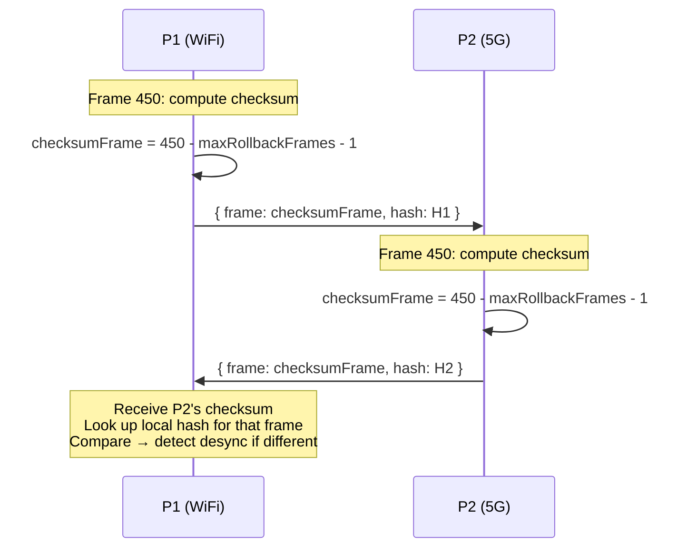
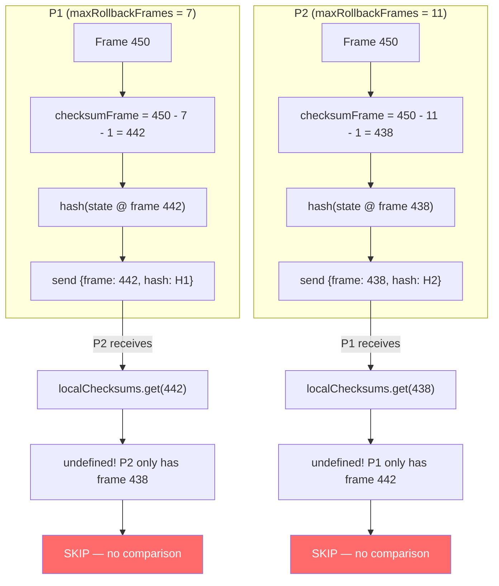
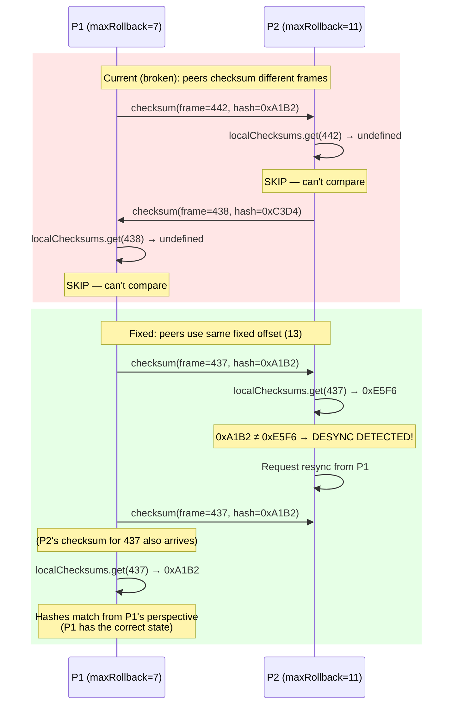
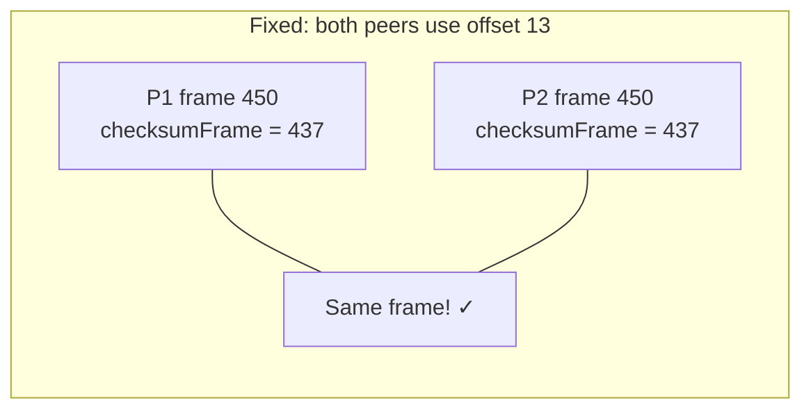
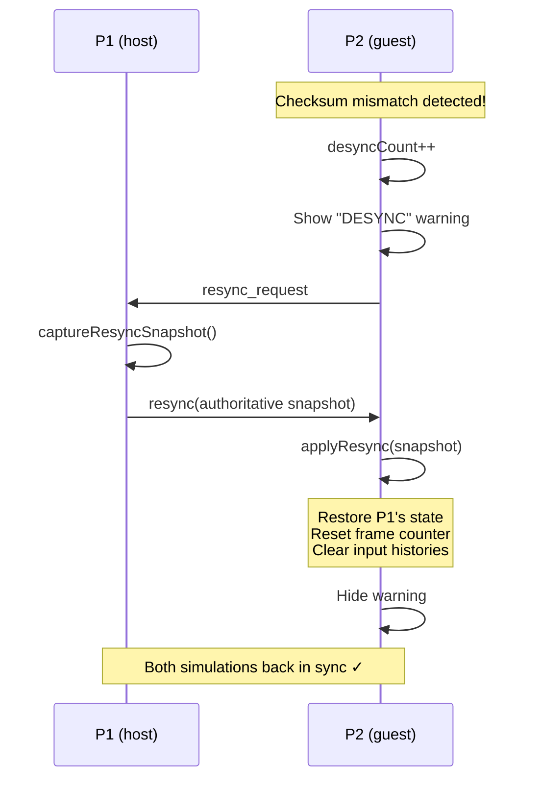

# RFC 0007: Fix Desync Detection Between Peers with Different RTT

**Status:** Proposed
**Date:** 2026-03-31
**Author:** Architecture Team
**Issue:** [#77](https://github.com/simon0191/a-los-traques/issues/77) (follow-up to RFC 0006)
**Predecessor:** [RFC 0006: Fix P1 Never Rolls Back](0006-fix-p1-no-rollback.md)

---

## Summary

After deploying the RTT measurement fix (RFC 0006), a real cross-device match still showed simulation divergence: KO frames differed by 16 frames, and by the end of round 2, the two peers had drifted 252 frames apart. The peers even disagreed on who won round 2. **Yet `desyncCount` was 0 on both sides** — the desync detection system didn't catch any of it.

Root cause: the checksum frame offset depends on `maxRollbackFrames`, which is a **peer-local value** derived from each peer's RTT. When one peer has low RTT (22ms) and the other has high RTT (102ms), they end up with different `maxRollbackFrames` (7 vs 11) and compute checksums for **different frames**. The checksums never align, so desync is never detected, and the existing resync mechanism never activates.

---

## Background

### How Desync Detection Works (Today)

Every 30 frames, each peer:
1. Picks a "safe" frame far enough back that both inputs should be confirmed
2. Hashes the game state at that frame
3. Sends `{frame, hash}` to the opponent
4. When receiving the opponent's checksum, compares against the local hash for that frame

If hashes mismatch → desync detected → P1 sends authoritative state snapshot → P2 applies it → back in sync.



### How Adaptive Delay Changes maxRollbackFrames

RFC 0006 introduced RTT measurement and adaptive input delay. Every 180 frames, `_recalculateInputDelay()` tunes `inputDelay` based on each peer's RTT to the server, then updates `maxRollbackFrames`:

```javascript
this.maxRollbackFrames = Math.max(7, this.inputDelay * 2 + 1);
```

Since each peer measures their **own** RTT independently, peers with different network conditions get different `maxRollbackFrames`:

| Peer | RTT | inputDelay | maxRollbackFrames |
|------|-----|------------|-------------------|
| P1 (WiFi, 22ms) | 22ms | 3 (stays at baseline) | **7** |
| P2 (5G, 102ms) | 102ms | 5 (ramps up) | **11** |

This is correct behavior for the rollback system — P2 needs a wider rollback window to accommodate its higher latency. The problem is that the checksum calculation depends on this peer-local value.

---

## The Bug

### Checksum Frame Offset Uses Peer-Local Value

Line 211 of `RollbackManager.js`:

```javascript
const checksumFrame = this.currentFrame - this.maxRollbackFrames - 1;
```

With P1's `maxRollbackFrames=7` and P2's `maxRollbackFrames=11`:



The receiving code:

```javascript
handleRemoteChecksum(frame, remoteHash) {
    const localHash = this._localChecksums.get(frame);
    if (localHash === undefined) return; // ← SILENTLY SKIPS
    // ...
}
```

The peers never even get to compare hash values — they're stuck one step earlier. P1 sends a checksum **for frame 442**. P2 receives it and asks "do I have a local hash for frame 442?" — but P2 only computed a hash for frame 438. `_localChecksums.get(442)` returns `undefined`, and the function returns early without comparing anything. It doesn't treat "I don't have that frame" as a desync — it assumes the local computation hasn't happened yet and silently drops the message.

With different offsets, **every** checksum message hits this early return. No hashes are ever compared. Desync detection is completely dead.

### Evidence from Debug Bundles

Post-fix match (WiFi laptop vs 5G iPhone):

| Metric | P1 (WiFi, 22ms RTT) | P2 (5G, 102ms RTT) |
|--------|---------------------|---------------------|
| rollbackCount | 5 | 227 |
| maxRollbackDepth | 9 | 13 |
| **desyncCount** | **0** | **0** |
| KO frame (round 1) | 1479 | 1463 |
| KO frame (round 2) | 4123 | **never detected locally** |
| totalFrames | 4236 | 4488 |
| Frame drift | | **252 frames** |

Round 1 had a 16-frame KO difference (both agreed on the winner). By round 2, the simulations had diverged so much that P2's local simulation never reached the KO condition — the 252-frame drift made the two games unrecognizable. The resync mechanism could have corrected this early, but it was never triggered because desync was never detected.

### Healthy vs Broken Desync Detection



---

## Proposed Fix

### Use a Fixed Checksum Offset

**File:** `src/systems/RollbackManager.js`

Replace the peer-local offset with a **constant** that's safely beyond the maximum possible rollback window for any peer:

```javascript
// Before:
const checksumFrame = this.currentFrame - this.maxRollbackFrames - 1;

// After:
const CHECKSUM_SAFE_OFFSET = 13; // Beyond max possible rollback window (inputDelay caps at 5 → maxRollback=11)
const checksumFrame = this.currentFrame - CHECKSUM_SAFE_OFFSET;
```

### Why 13?

The checksum frame must be far enough back that **both peers have confirmed inputs** for it (no predictions). If a frame still contains predicted inputs on one peer, its state might differ from the other peer *not because of a desync*, but because one peer hasn't rolled back yet. Comparing such frames would produce false positives.

The rollback window tells us how far back a peer might still be working with predictions:

```
maxRollbackFrames = max(7, inputDelay * 2 + 1)
```

The adaptive delay clamps `inputDelay` to at most 5 (`Math.min(5, ...)`):

```
inputDelay max = 5  →  maxRollbackFrames = max(7, 5×2+1) = 11
```

So the worst case is `maxRollbackFrames = 11` — any frame more than 11 frames behind `currentFrame` is guaranteed to have both inputs confirmed on both peers. Adding a safety margin of 2:

```
CHECKSUM_SAFE_OFFSET = 11 + 2 = 13
```

This means:
- Even when P1 has `maxRollbackFrames=7` and P2 has `maxRollbackFrames=11`, both compute `currentFrame - 13`
- Frame `currentFrame - 13` is beyond BOTH peers' rollback windows → both peers have confirmed inputs for it
- If the states differ at this frame, it's a real desync (not just a pending rollback)
- Both peers compute `450 - 13 = 437` → same frame → checksums can be compared



### What Happens After Desync Is Detected

The existing resync mechanism (already implemented in `FightScene._setupOnlineMode()`) activates:



This mechanism is already wired up and tested — it just never fires because the checksum comparison is broken.

---

## Test Plan

### Unit Tests

**`tests/systems/desync-detection.test.js`** — update existing tests + add new:
- Update checksum frame assertions for new fixed offset (13 instead of `maxRollbackFrames + 1`)
- New: two RollbackManagers with different `maxRollbackFrames` exchange checksums → desync detected
- New: checksum frame is consistent regardless of `maxRollbackFrames` value

**`tests/systems/rollback-manager.test.js`** — update checksum-related assertions

### Manual Verification

- Two-device match (laptop + phone) with `?debug=1`
- Intentionally create divergence (high latency connection)
- Verify: desyncCount > 0, "DESYNC" warning appears, resync triggers, simulation reconverges
