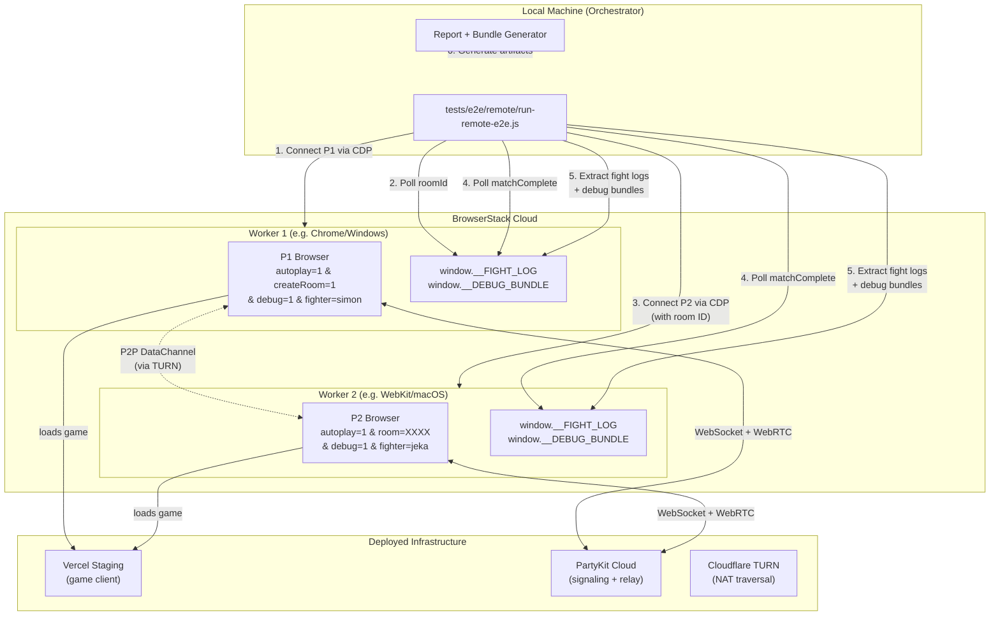
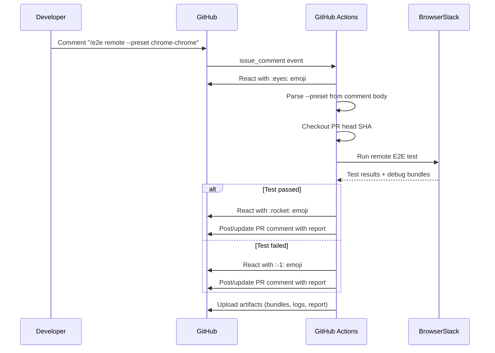

# RFC 0008: E2E Remote Browser Testing

**Status:** Proposed
**Date:** 2026-04-01
**Author:** Architecture Team
**Predecessor:** [E2E Testing Framework](../e2e-testing.md), [RFC 0005: Multiplayer Debuggability](0005-multiplayer-debuggability.md)

---

## Summary

Extend the E2E multiplayer testing framework to run P1 and P2 on **separate BrowserStack remote browsers**, connected through deployed PartyKit cloud infrastructure over real network paths. After match completion, full v2 debug bundles are extracted from both peers and saved locally for analysis.

## Motivation

The existing local E2E tests run both players on the same machine with sub-1ms RTT. This catches simulation determinism bugs but misses an entire class of issues that only manifest under real network conditions:

- **RTT asymmetry** — RFC 0007 documented a desync that only appeared with 80ms+ asymmetric RTT producing different `maxRollbackFrames` values between peers
- **WebRTC/TURN path** — local tests skip TURN entirely (direct localhost). Remote browsers exercise Cloudflare TURN credential flow and real ICE negotiation
- **Cross-browser divergence** — the game targets iPhone 15 Safari but tests only run on Chromium. Different JS engines, floating-point implementations, and timer behaviors can cause subtle determinism breaks
- **Geographic latency** — jitter, packet reordering, and transport fallback timing are invisible on localhost

## Architecture



## Sequence Diagram

```mermaid
sequenceDiagram
    participant O as Orchestrator<br/>(local machine)
    participant BS as BrowserStack<br/>CDP endpoint
    participant P1 as P1 Browser<br/>(Chrome/Windows)
    participant P2 as P2 Browser<br/>(WebKit/macOS)
    participant PK as PartyKit Cloud

    Note over O: bun run test:e2e:remote

    O->>BS: chromium.connect(wss://cdp.browserstack.com/playwright?caps=P1)
    BS-->>O: P1 browser session

    O->>P1: page.goto(staging/?autoplay=1&createRoom=1&debug=1&fighter=simon&seed=42)
    P1->>PK: WebSocket connect, create room

    loop Poll every 2s (max 60s)
        O->>P1: page.evaluate(() => window.__AUTOPLAY_ROOM_ID)
        P1-->>O: null → ... → "ABCD"
    end

    O->>BS: chromium.connect(wss://cdp.browserstack.com/playwright?caps=P2)
    BS-->>O: P2 browser session

    O->>P2: page.goto(staging/?autoplay=1&room=ABCD&debug=1&fighter=jeka&seed=42)
    P2->>PK: WebSocket connect, join room ABCD

    Note over P1,P2: WebRTC P2P negotiation via PartyKit signaling<br/>TURN via Cloudflare if needed

    par Match in progress
        P1->>P1: AutoplayController drives AI inputs
        P2->>P2: AutoplayController drives AI inputs
        P1<-->P2: Input exchange (DataChannel or WS fallback)
    end

    par Wait for both (max 180s)
        O->>P1: page.waitForFunction(__FIGHT_LOG?.matchComplete)
        O->>P2: page.waitForFunction(__FIGHT_LOG?.matchComplete)
    end

    par Extract data
        O->>P1: page.evaluate(() => window.__FIGHT_LOG)
        P1-->>O: fightLogP1
        O->>P1: page.evaluate(() => window.__DEBUG_BUNDLE)
        P1-->>O: v2 debug bundle P1
        O->>P2: page.evaluate(() => window.__FIGHT_LOG)
        P2-->>O: fightLogP2
        O->>P2: page.evaluate(() => window.__DEBUG_BUNDLE)
        P2-->>O: v2 debug bundle P2
    end

    O->>PK: GET /parties/main/ABCD/diagnostics
    PK-->>O: server diagnostics

    Note over O: Generate report + combined bundle<br/>→ test-results/remote/

    O->>P1: browser.close()
    O->>P2: browser.close()
```

## Design Decisions

### Why Playwright CDP Connect (not browserstack-node-sdk)

BrowserStack's `browserstack-node-sdk` wraps the entire Playwright test runner and launches both contexts on the **same remote machine** — defeating our goal of geographic separation. Instead, we use Playwright's `chromium.connect()` to BrowserStack's CDP WebSocket endpoint directly, creating two **independent sessions** on different machines. This gives us:

- Independent control over each browser (different OS/browser for P1 vs P2)
- Full `page.evaluate()`, `page.waitForFunction()`, `page.on('console')` — identical APIs to local tests
- Zero changes to existing Playwright helpers

### Why deployed infrastructure (not BrowserStack Local tunnel)

- **Realism**: Remote browsers hit deployed servers over real internet = true production conditions
- **WebRTC**: TURN/STUN works naturally over public internet; tunnels can interfere with ICE
- **Simplicity**: No tunnel binary, no port forwarding
- We already deploy to Vercel (frontend) and PartyKit cloud (multiplayer)

The `REMOTE_E2E_BASE_URL` env var overrides the staging URL for custom deployments.

### Why speed=1 (no overclock)

Local E2E uses `speed=2` for faster CI. Remote tests use `speed=1` because we want to exercise real network timing — latency, jitter, transport fallback decisions. Overclocking hides timing-sensitive bugs like the ones identified in RFC 0006 and 0007.

### Room ID coordination — no changes needed

Identical pattern to local E2E: poll `window.__AUTOPLAY_ROOM_ID` on P1 via `page.evaluate()`, pass to P2's URL. Playwright's CDP protocol supports `waitForFunction` over the WebSocket tunnel to BrowserStack.

## File Structure

### New Files

```
tests/e2e/remote/
  remote-multiplayer.spec.js       # Test spec — connects two remote browsers, runs match
  remote-config.js                 # Browser capability presets + defaults
  remote-helpers.js                # connectRemoteBrowser(), extractDebugBundle(), etc.
  remote-playwright.config.js      # Playwright config (no webServer, longer timeouts)
.github/workflows/e2e-remote.yml  # CI workflow — triggered by /e2e remote PR comment
docs/rfcs/0008-e2e-remote-browser-testing.md   # This RFC
```

### Modified Files

```
package.json                       # Add test:e2e:remote script
src/scenes/FightScene.js           # Expose window.__DEBUG_BUNDLE on match end (debug mode)
docs/e2e-testing.md                # Add "Remote Browser Testing" section
CLAUDE.md                          # Add remote E2E commands
```

## Browser Presets

| Preset | P1 | P2 | Purpose |
|--------|----|----|---------|
| `default` | Chrome / Windows 11 | WebKit / macOS Sonoma | Cross-browser, cross-OS |
| `chrome-chrome` | Chrome / Windows 11 | Chrome / macOS Sonoma | Isolate network effects |
| `webkit-webkit` | WebKit / macOS Sonoma | WebKit / macOS Ventura | Safari-like both sides |

Select via `REMOTE_E2E_PRESET` env var:
```bash
REMOTE_E2E_PRESET=chrome-chrome bun run test:e2e:remote
```

## Debug Bundle Capture

Two tiers of data extraction, both via `page.evaluate()` after match completion:

**Tier 1 (always):** `window.__FIGHT_LOG` — inputs, checksums, round events, network events, final state. Identical to local E2E. Fed through existing `generateBundle()` and `generateReport()` helpers.

**Tier 2 (with `debug=1`):** `window.__DEBUG_BUNDLE` — v2 format including Logger ring buffer, MatchTelemetry RTT samples, MatchStateMachine transition history, and environment info. Exposed by a small addition to FightScene.js on match completion.

**Tier 3 (with `DIAG_TOKEN`):** Server diagnostics fetched directly from `GET /parties/main/{roomId}/diagnostics`. Combined with client bundles into a single artifact.

### Output Structure

```
test-results/remote/
  remote-default-report.md          # Markdown report (same format as local E2E)
  remote-default-bundle.json        # Combined bundle with:
                                    #   - v1 fight logs (both peers)
                                    #   - v2 debug bundles (both peers)
                                    #   - server diagnostics
                                    #   - BrowserStack metadata
  remote-default-console.log        # Console output from both browsers
```

## Timeouts

| Operation | Local | Remote | Rationale |
|-----------|-------|--------|-----------|
| Room creation | 30s | 60s | Network roundtrip to PartyKit cloud |
| Match completion | 110s | 180s | speed=1 + real latency |
| Page load | default | 30s | Remote browser fetches from CDN |
| Total test | 300s | 300s | Same overall budget |

## Error Handling

| Failure | Behavior |
|---------|----------|
| Missing `BROWSERSTACK_*` env vars | Clear error with setup instructions |
| P1 session creation fails | Exit with BrowserStack error |
| Room ID timeout (60s) | Capture P1 console, save partial data, exit 1 |
| P2 session creation fails | Clean up P1 session, exit 1 |
| Match timeout (180s) | Extract partial fight logs, generate partial report, exit 1 |
| Game crash | Console logs captured in finally block |

The `finally` block always attempts to: extract partial fight logs, save console output, mark BrowserStack sessions, clean up both sessions.

## Environment Variables

| Variable | Required | Description |
|----------|----------|-------------|
| `BROWSERSTACK_USERNAME` | Yes | BrowserStack account username |
| `BROWSERSTACK_ACCESS_KEY` | Yes | BrowserStack access key |
| `REMOTE_E2E_BASE_URL` | No | Override staging URL |
| `REMOTE_E2E_PRESET` | No | Browser preset (default: `default`) |
| `DIAG_TOKEN` | No | PartyKit diagnostics token |

## Commands

### Local

```bash
# Default: Chrome/Windows vs WebKit/macOS against deployed staging
BROWSERSTACK_USERNAME=xxx BROWSERSTACK_ACCESS_KEY=yyy bun run test:e2e:remote

# Specific preset
REMOTE_E2E_PRESET=chrome-chrome BROWSERSTACK_USERNAME=xxx BROWSERSTACK_ACCESS_KEY=yyy bun run test:e2e:remote

# With server diagnostics
DIAG_TOKEN=zzz BROWSERSTACK_USERNAME=xxx BROWSERSTACK_ACCESS_KEY=yyy bun run test:e2e:remote
```

### CI (PR comment trigger)

Trigger a remote E2E run from any PR by posting a comment:

```
/e2e remote
/e2e remote --preset chrome-chrome
/e2e remote --preset webkit-webkit
```

The workflow (`.github/workflows/e2e-remote.yml`) is triggered by `issue_comment` events:



**How it works:**

1. Developer posts `/e2e remote` (with optional `--preset`) as a PR comment
2. `parse-command` job validates it's a PR comment starting with `/e2e remote`, extracts preset, reacts with :eyes:
3. `remote-e2e` job checks out the PR's head commit, installs deps, runs `bun run test:e2e:remote`
4. Results are posted back as a PR comment (idempotent — updates existing comment on re-run)
5. Debug bundles + logs uploaded as artifacts (14-day retention)
6. Final reaction emoji indicates pass (:rocket:) or fail (:-1:)

**Required secrets:**

| Secret | Description |
|--------|-------------|
| `BROWSERSTACK_USERNAME` | BrowserStack account username |
| `BROWSERSTACK_ACCESS_KEY` | BrowserStack access key |
| `DIAG_TOKEN` | PartyKit diagnostics token (optional) |

## What Is Reused vs What Is New

### Reused without modification
- `AutoplayController` — reads URL params identically on remote browsers
- `FightRecorder` → `window.__FIGHT_LOG` — populated identically
- `waitForRoomId()` / `waitForMatchComplete()` — `page.waitForFunction` works over CDP to BrowserStack
- `extractFightLog()` — `page.evaluate` works over CDP
- `generateReport()` / `generateBundle()` — process fight logs identically
- `?partyHost=` URL param for targeting deployed PartyKit
- `?debug=1` for enabling FightRecorder + debug infrastructure
- Server `/diagnostics` endpoint

### Reused with parameter override
- `waitForRoomId(page, 60_000)` — existing timeout param
- `waitForMatchComplete(page, 180_000)` — existing timeout param

### New
- Remote Playwright config (no `webServer`, longer timeout)
- `connectRemoteBrowser()` — `chromium.connect(wss://cdp.browserstack.com/...)`
- Remote URL builders (always `speed=1`, `debug=1`, `partyHost=...`)
- `extractDebugBundle()` — tries `__DEBUG_BUNDLE` then `__FIGHT_LOG`
- `fetchServerDiagnostics()` — direct HTTP from orchestrator
- Combined remote bundle format

### Small modification to existing code
- `FightScene.js` — expose `window.__DEBUG_BUNDLE` when debug mode active (8 lines, guarded by `this.game.debugMode`)

## Future Enhancements

- **Scheduled nightly runs**: Add `schedule` trigger to `e2e-remote.yml` for continuous monitoring
- **Mobile presets**: iPhone 15 Safari + Android Chrome (requires BrowserStack App Automate for real devices)
- **Network condition presets**: Combine with Toxiproxy for simulated 3G/4G latency
- **Multi-preset matrix**: Run all presets in parallel, aggregate results
