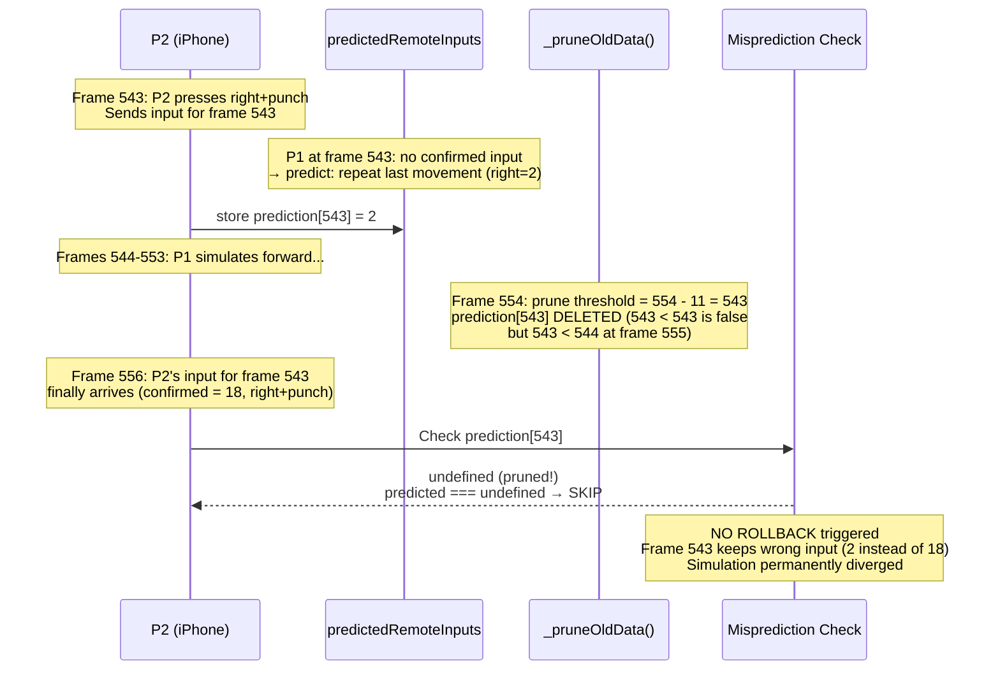
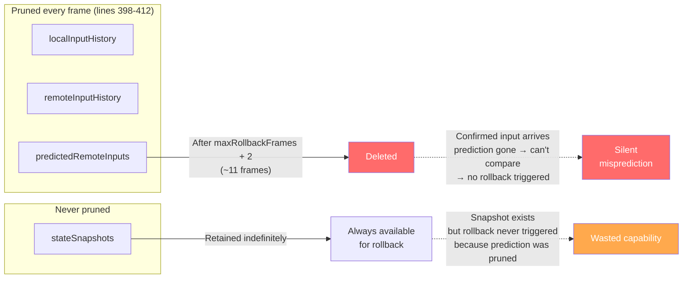
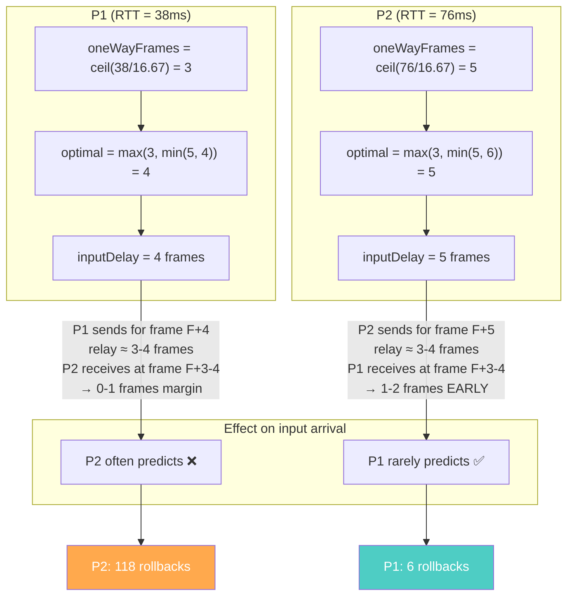
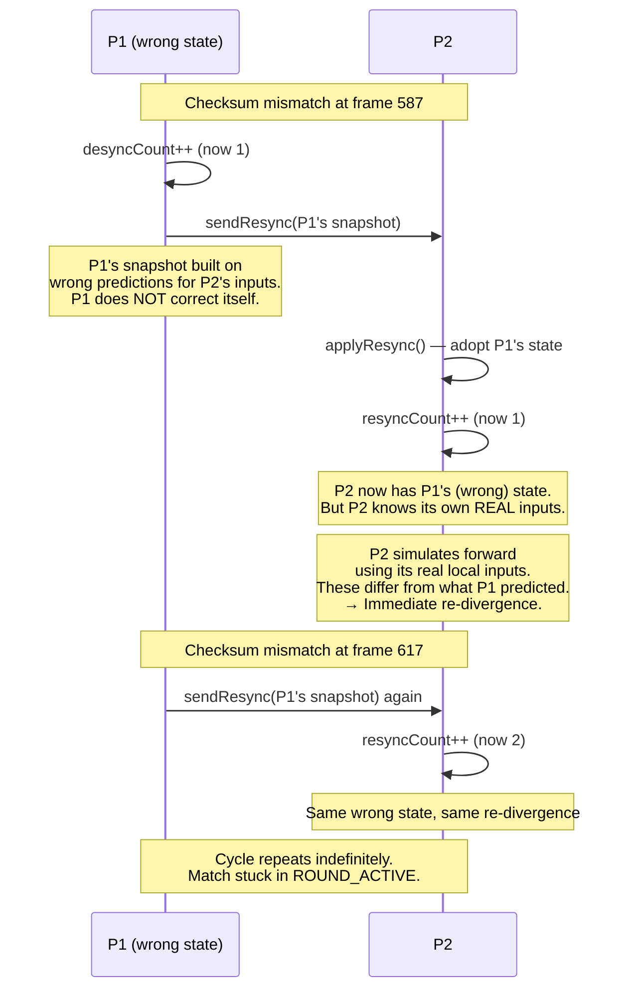
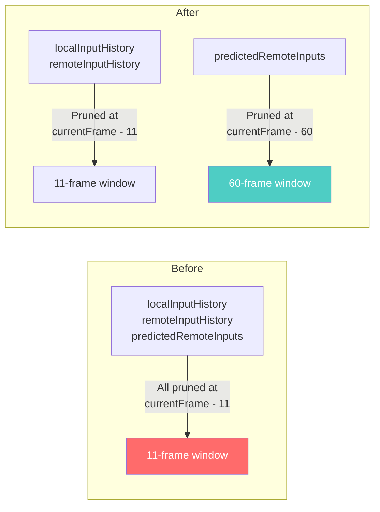
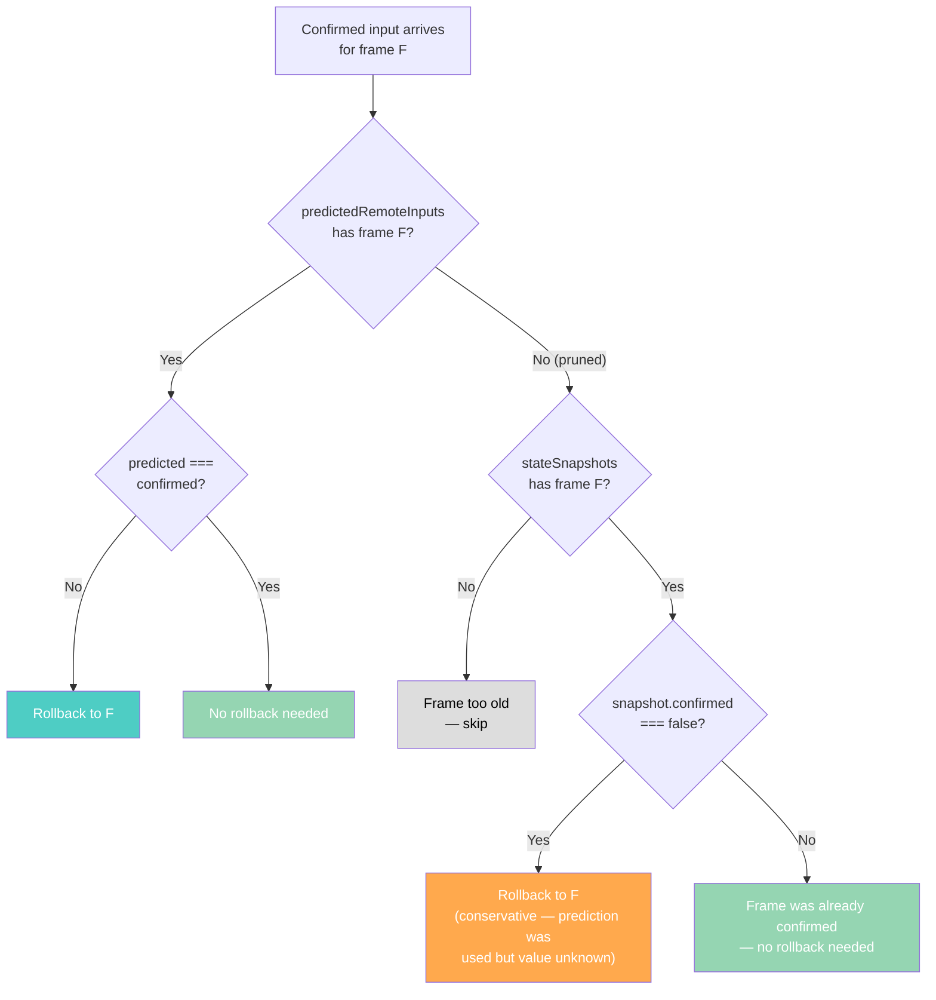
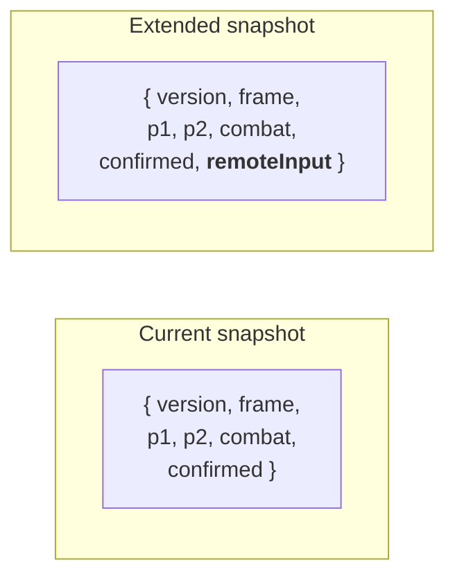
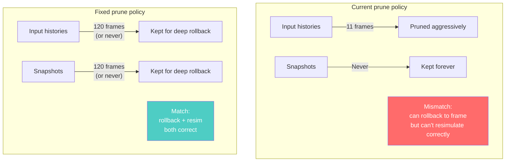
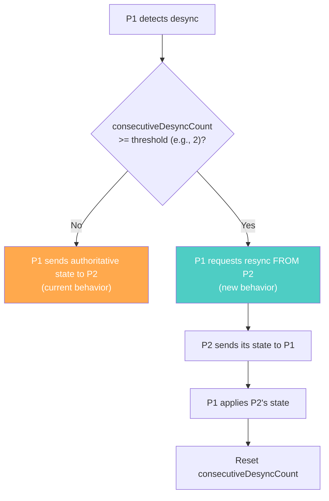

# RFC 0008: Prediction Pruning Causes Silent Desync

**Status:** Proposed
**Date:** 2026-03-31
**Author:** Architecture Team
**Related:** RFC 0006 (Fix P1 Never Rolls Back), RFC 0007 (Fix Desync Detection)

---

## Summary

After applying all four fixes from RFC 0006 (callback overwrite, RTT guard, constant rename, relay formula) and the checksum offset fix from RFC 0007, a real cross-device match (WiFi laptop vs 5G iPhone) still exhibits **persistent unresolved desync**. P1 performs only 6 rollbacks while P2 performs 118. Checksums diverge at frame 557 and never reconverge despite 3 resync attempts. The match gets stuck in ROUND_ACTIVE indefinitely — neither peer reaches KO or timeup.

Root cause: `_pruneOldData()` deletes entries from `predictedRemoteInputs` after `maxRollbackFrames + 2` frames (~11 frames). When a confirmed remote input arrives after its prediction has been pruned, the misprediction check finds `undefined` and **silently skips the correction**. The wrong predicted input remains baked into the simulation state forever. Because P1 is treated as authoritative for resync, sending P1's corrupted state to P2 just propagates the error — P2 immediately re-diverges because P2's own local inputs differ from what P1 predicted.

---

## Background: What RFC 0006 Fixed and What Remains

RFC 0006 identified a callback overwrite bug that prevented `ConnectionMonitor` from starting, causing RTT to read as 0 and `inputDelay` to drop to 1 frame. That produced a catastrophic failure: P1 had **0 rollbacks**, empty RTT samples, and the two peers disagreed on who won.

All four RFC 0006 fixes are confirmed applied in the current codebase. The new debug bundle (`debug3.json`) shows the improvement:

| Metric | RFC 0006 match (before fix) | Current match (after fix) |
|--------|---------------------------|--------------------------|
| RTT samples | Empty on both peers | 8 samples each |
| P1 inputDelay | Dropped to 1 | Stays at 3-4 (correct) |
| P1 rollbacks | 0 | 6 |
| P2 rollbacks | 189 | 118 |
| Outcome | Different winners | Match stuck (no KO) |

The situation improved from "catastrophic" to "broken." RTT is measured, adaptive delay works, and P1 does occasionally rollback. But the 20x rollback asymmetry and persistent checksum divergence reveal a **second-order bug** that was masked by the worse first-order bug.

---

## The Bug

### The Misprediction Detection Blind Spot

When a confirmed remote input arrives, the rollback system checks whether it predicted that frame's input correctly. If the prediction was wrong, it triggers a rollback. But predictions are pruned aggressively — after just `maxRollbackFrames + 2` frames (11 frames with default settings). If the confirmed input arrives after pruning, the check silently passes:



**Source:** `RollbackManager.js` lines 136-143 — the misprediction detection loop:

```javascript
for (const [frame, confirmedInput] of confirmedEncoded) {
    const predicted = this.predictedRemoteInputs.get(frame);
    if (predicted !== undefined && !inputsEqual(predicted, confirmedInput)) {
        if (rollbackFrame === -1 || frame < rollbackFrame) {
            rollbackFrame = frame;
        }
    }
    // When predicted === undefined: silently skipped — no rollback
}
```

### The Pruning Asymmetry

The critical design flaw is that `_pruneOldData()` (lines 398-412) prunes `predictedRemoteInputs` at the same rate as input histories, but `stateSnapshots` are **never pruned**:



The rollback mechanism has the **capability** to restore any past frame (snapshots exist) but not the **trigger** (predictions pruned). The system can rollback 100 frames if asked — it just never knows it needs to.

### Why Asymmetric RTT Makes This Worse

Both peers measure RTT to the server: P1 sees 38ms, P2 sees 76ms. The relay path (P2→server→P1) is symmetric: `P2.RTT/2 + P1.RTT/2 ≈ 57ms` in both directions. But the adaptive input delay is computed from each peer's own RTT, creating asymmetric buffers:



P2's higher input delay (5 vs 4) means P2's inputs arrive at P1 with comfortable headroom. P1's lower delay means P1's inputs arrive at P2 just barely on time — any jitter forces P2 to predict. This creates a natural one-sided rollback pattern.

The asymmetry is tolerable for P2 (118 rollbacks = predictions mostly corrected). The problem is P1: P1 "almost never" predicts, but when it does (6 times), the prediction window is so tight that late corrections from P2 can arrive after pruning.

### Why P1's 6 Rollbacks Aren't Enough

P1's rollback events cluster in two bursts, then stop entirely:

```
Frame 501 (depth 9) → rollback to 492
Frame 509 (depth 2) → rollback to 507
Frame 549 (depth 9) → rollback to 540
Frame 601 (depth 2) → rollback to 599
Frame 601 (depth 3) → rollback to 598
Frame 602 (depth 4) → rollback to 598
--- silence for remaining ~840 frames ---
```

After frame 602, P1 never rollbacks again despite P2 pressing buttons for another 800+ frames (confirmed inputs show p2 activity at frames 633, 1184, 1214, 1228, 1257, 1289). For these frames, P1 either:
- Receives P2's inputs before needing to predict (no rollback needed — correct), or
- Predicts, then the confirmed input arrives after pruning (no rollback triggered — **wrong**)

The checksum evidence proves the second case is occurring: checksums diverge at frame 557 and stay diverged through frame 1427 (end of data).

### Why Resync Can't Fix This

The resync mechanism is designed with P1 as authoritative: when desync is detected, P1 sends its state to P2. But when P1 is the source of the divergence (due to uncorrected mispredictions), this creates an unbreakable cycle:



**The fundamental flaw**: P1 is authoritative but P1 is wrong. Resync propagates P1's error to P2, and P2 immediately diverges because P2's actual inputs differ from P1's predictions.

---

## Evidence from Debug Bundle

### Checksum Timeline

Checksums match perfectly for the first 527 frames, then diverge permanently:

```
Frames  17-527:  18 consecutive MATCH ✅
Frame  557:      FIRST MISMATCH ❌ — divergence starts
Frames 587-1427: 29 consecutive MISMATCH ❌ — never recovers
```

Despite P2 applying 3 resyncs, no checksum ever matches again after frame 527.

### Confirmed Inputs Diverge

Both peers agree on inputs through frame 534. Then P2 shows inputs that P1's simulation never incorporated:

| Frame | P1 used (local log) | P2 used (remote log) | Issue |
|-------|--------------------|--------------------|-------|
| 534 | p2=2 (right) | p2=2 (right) | Last agreement |
| 543 | *(not logged)* | p2=18 (right+punch) | P1 missed this input |
| 544 | *(not logged)* | p2=2 (right) | P1 missed this input |
| 548 | *(not logged)* | p2=0 (idle) | P1 missed this input |
| 550 | *(not logged)* | p2=5 (left+up) | P1 missed this input |
| 558 | p2=5 (left+up) | — | P1 finally gets the input, 8 frames late |

P1's confirmed inputs log (recorded at current-frame tick, not during resim) shows that inputs are arriving late and potentially past the prediction pruning window.

### Desync / Resync Mismatch

| Metric | P1 (local) | P2 (remote) |
|--------|-----------|-------------|
| desyncCount | 2 | 1 |
| resyncCount | **0** | **3** |

P1's resyncCount is 0 **by design** — `onResync` handler returns early for the host (`if (this.isHost) return;` at `FightScene.js:997`). P2 applied 3 resyncs from P1's authoritative state but the divergence persisted because the authoritative state was wrong.

---

## Proposed Solutions

### Option A: Extend Prediction Retention Window

**Approach:** Keep `predictedRemoteInputs` for significantly longer than input histories — e.g., 60 frames instead of `maxRollbackFrames + 2` (11 frames).

**File:** `RollbackManager.js` — `_pruneOldData()`



**Pros:**
- Simple one-line change — just use a wider prune threshold for predictions
- Negligible memory cost (~60 integers)
- Misprediction detection works for inputs arriving up to 60 frames late

**Cons:**
- Still has a blind spot beyond 60 frames (arbitrary limit)
- **Deep rollbacks need input histories too** — if we rollback 50 frames, `_getInputForFrame()` needs `localInputHistory` entries for those frames, which are pruned at 11. Rolling back to a frame where the local input has been pruned would use `EMPTY_INPUT` (wrong), corrupting the resimulation.
- Must also extend `localInputHistory` and `remoteInputHistory` retention, which increases memory proportionally

**Variant:** Extend ALL maps to the same wider window (60 frames). Memory is still small (a few hundred entries of integers/objects). This makes deep rollbacks fully correct.

### Option B: Use `snapshot.confirmed` as Fallback Trigger

**Approach:** When a confirmed remote input arrives for a frame where the prediction was pruned, check whether the snapshot for that frame was marked `confirmed === false`. If so, a prediction was used for that frame's simulation — trigger a rollback even without the prediction value.

**File:** `RollbackManager.js` — misprediction detection loop (lines 136-143)



**Pros:**
- No arbitrary window limit — works for ANY frame that still has a snapshot
- Uses information already tracked (`snapshot.confirmed` is set at lines 179, 193, 210)
- No additional memory cost

**Cons:**
- **Conservative:** triggers rollback even if the prediction happened to be correct (prediction value is lost, can't compare). In practice this means some unnecessary rollbacks for frames where the predicted input matched the confirmed one.
- **Deep rollback input problem** (same as Option A): rolling back 50+ frames needs local input history for those frames. If `localInputHistory` was pruned, `_getInputForFrame()` returns `EMPTY_INPUT` for local inputs, corrupting the resimulation.
- Must pair with extended input history retention for correctness.

### Option C: Track Input Usage Per Frame (Precise)

**Approach:** Instead of relying on `predictedRemoteInputs` (which gets pruned), store which encoded remote input was *actually used* for each frame directly in the snapshot. When a confirmed input arrives, compare against what the snapshot actually consumed.

**File:** `RollbackManager.js` — snapshot capture + misprediction check

The snapshot already contains the simulation state. We extend it to include the remote input that produced that state:



The misprediction check becomes:

```javascript
// For each confirmed input, check what the snapshot actually used
for (const [frame, confirmedInput] of confirmedEncoded) {
    const snap = this.stateSnapshots.get(frame);
    if (snap && snap.remoteInput !== undefined
        && !inputsEqual(snap.remoteInput, confirmedInput)) {
        if (rollbackFrame === -1 || frame < rollbackFrame) {
            rollbackFrame = frame;
        }
    }
}
```

**Pros:**
- Precise — no false positives (compares exact values, not conservative guess)
- No arbitrary window limits — works as long as the snapshot exists
- `predictedRemoteInputs` map becomes unnecessary for misprediction detection (could remove it or keep it for stats)

**Cons:**
- Adds one integer field to every snapshot (~4 bytes per frame)
- Still requires extended `localInputHistory` + `remoteInputHistory` retention for deep rollback resimulation
- Slightly larger change (snapshot capture + misprediction check + resim path)

### Complementary Fix: Extend Input History Retention

**Required by all options.** Deep rollbacks need the actual inputs for resimulation. Currently `localInputHistory` and `remoteInputHistory` are pruned at the same 11-frame window. If we allow rollbacks deeper than 11 frames, `_getInputForFrame()` falls back to `EMPTY_INPUT` for local inputs — producing wrong resimulation results.

**Fix:** Prune input histories at the same rate as snapshots. Since snapshots are never pruned, we should either:
1. Prune snapshots AND input histories at a shared wider window (e.g., 120 frames), or
2. Never prune input histories (memory cost: ~4 bytes per frame per map, ~30KB for a 30-second match — negligible)



### Complementary Fix: P1 Self-Correction on Repeated Desync

Even with better misprediction detection, the resync mechanism remains one-directional: P1 always sends, P2 always receives. If P1's state is wrong (due to remaining edge cases), the cycle repeats.

**Fix:** If P1 detects N consecutive desyncs (e.g., 2-3), P1 should **request** a resync from P2 instead of sending its own state. This breaks the cycle by allowing the non-drifted peer to become authoritative.



---

## Recommendation

**Option C (track input per snapshot) + extended input history retention + P1 self-correction.**

Option C is the most precise: it detects exactly which frames need correction without false positives, has no arbitrary window limits, and the implementation is straightforward (one new field per snapshot, simplified misprediction check). The memory overhead is negligible.

Extended input history retention is required regardless of which option is chosen — without it, deep rollbacks produce corrupted resimulations.

P1 self-correction is a defense-in-depth measure that breaks the "authoritative peer is wrong" cycle. Even with perfect misprediction detection, edge cases (e.g., non-determinism bugs, serialization issues) could still leave P1 in a wrong state. Allowing P1 to accept corrections ensures the system can recover from any source of divergence.

### Implementation Order

| Phase | Change | Risk | Effort |
|-------|--------|------|--------|
| **1** | Extend input history + prediction retention to 120 frames | Low — strictly more data retained | Small |
| **2** | Add `remoteInput` field to snapshots, replace misprediction check | Medium — changes rollback trigger logic | Medium |
| **3** | P1 self-correction on repeated desync | Medium — changes resync authority model | Medium |

Phases 1-2 fix the silent misprediction bug. Phase 3 adds resilience against future divergence sources.

---

## Test Plan

### Unit Tests

**`tests/systems/rollback-manager.test.js`:**

Phase 1:
- Predictions for frame F survive until frame F + 120 (not pruned at F + 11)
- Local + remote input histories survive the same window
- Deep rollback (50+ frames) uses correct local inputs (not `EMPTY_INPUT`)

Phase 2:
- Snapshot captures `remoteInput` field (confirmed or predicted)
- Confirmed input arriving after prediction pruning still triggers rollback (via snapshot comparison)
- Confirmed input matching what snapshot used does NOT trigger unnecessary rollback
- Deep rollback after late input produces correct checksums

Phase 3:
- P1 sends authoritative state on first desync (existing behavior)
- P1 requests resync from P2 after 2+ consecutive desyncs
- P2 responds with its own snapshot when P1 requests
- P1 applies P2's snapshot and resets desync counter

### E2E Verification

- Two-device match with `?debug=1` and asymmetric network (e.g., one on throttled connection)
- Verify debug bundle shows: rollbacks on **both** peers, checksums reconverge after any desync, match reaches a conclusion (KO or timeup)

### Regression Check

- Re-run existing E2E tests (`bun run test:e2e`) to verify no regressions in the standard path
- Run desync detection tests (`tests/systems/desync-detection.test.js`) to verify checksum mechanics unchanged
