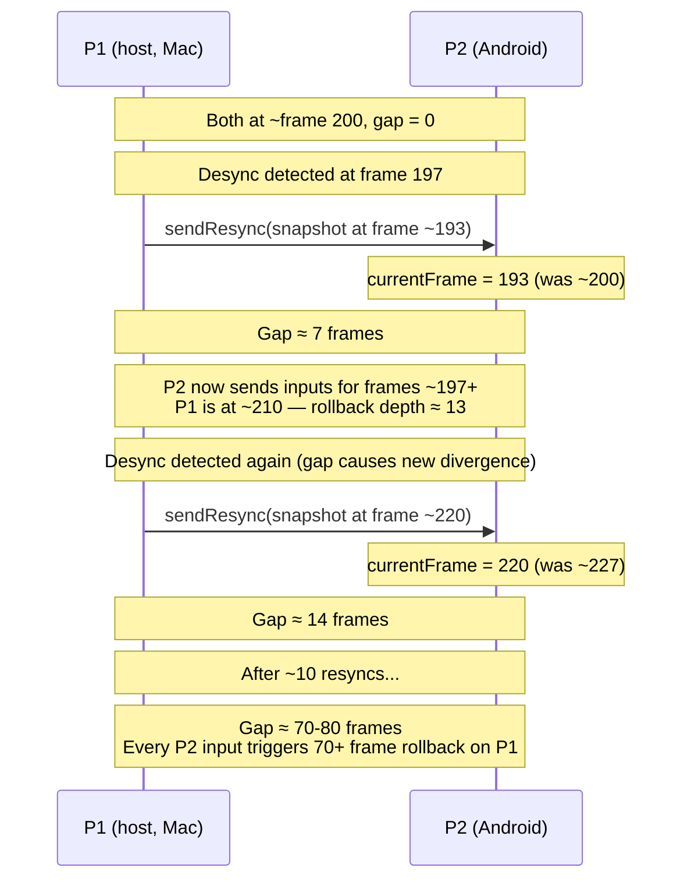
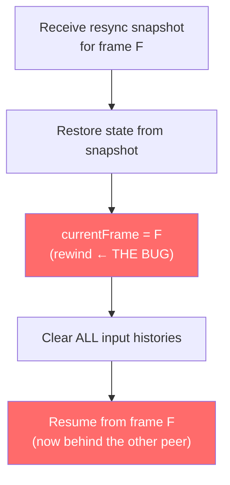
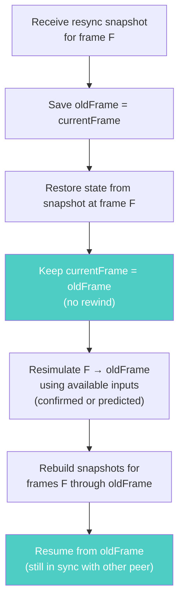

# RFC 0010: Resync Rewinds Frame Counter, Creating Escalating Frame Gap

**Status:** Proposed
**Date:** 2026-04-01
**Author:** Architecture Team
**Related:** RFC 0008 (Prediction Pruning Causes Silent Desync)

---

## Summary

After applying all three phases of RFC 0008 (extended retention, snapshot-based misprediction detection, P1 self-correction), a real cross-device match (Mac Chrome vs Android 4G, WebSocket relay) still exhibits **persistent desync with catastrophic rollback depths** (up to 80 frames). Both peers agree on the match outcome (KO at frame 1282, same winner), but the simulation state diverges permanently from frame 197 onwards with 17 desyncs on P1 and 10 on P2. Only a brief 4-checkpoint convergence window (frames 437-527) interrupts an otherwise unbroken chain of mismatches.

Root cause: `applyResync()` sets `this.currentFrame = snapshot.frame`, rewinding the resynced peer's frame counter backwards. Each resync widens the gap between peers by approximately `maxRollbackFrames` frames (~7-9). After multiple resyncs, the gap reaches 70-80 frames and stabilizes — every remote input then triggers a 70-80 frame deep rollback on the peer that's ahead. The resync mechanism, designed to fix divergence, instead creates a permanent frame offset that makes divergence worse.

---

## Background: What RFC 0008 Fixed and What Remains

RFC 0008 identified that predictions were pruned before confirmed inputs arrived, causing silent mispredictions. All three phases are confirmed applied:

| Phase | Fix | Status |
|-------|-----|--------|
| 1 | Extended input/prediction retention to 120 frames | Applied (commit b434931) |
| 2 | Snapshot-based misprediction detection via `snapshot.remoteInput` | Applied (commit 96e29d6) |
| 3 | P1 self-correction (reverse resync after 2+ consecutive desyncs) | Applied (commit 9fe0cc4) |

These fixes solved the *silent misprediction* problem — mispredictions are now detected correctly. But the resync mechanism that fires in response creates a new, worse problem: an ever-growing frame gap between peers.

---

## The Bug

### How `applyResync()` Creates a Frame Gap

When a desync is detected, the authoritative peer sends a snapshot to the other peer. The receiving peer applies it via `applyResync()`:

```javascript
// RollbackManager.js lines 287-320
applyResync(snapshot, p1, p2, combat) {
    restoreFighterState(p1Sim, snapshot.p1);
    restoreFighterState(p2Sim, snapshot.p2);
    restoreCombatState(combatSim, snapshot.combat);
    this.currentFrame = snapshot.frame;  // ← THE BUG: rewinds frame counter

    this.stateSnapshots.clear();
    this.localInputHistory.clear();
    this.remoteInputHistory.clear();
    this.predictedRemoteInputs.clear();
    // ...
}
```

The snapshot sent for resync comes from `captureResyncSnapshot()`, which returns the latest **confirmed** snapshot — typically `maxRollbackFrames` behind the sender's `currentFrame`. This means the receiver jumps back by the sender's rollback window depth.

### The Escalation Cycle

Each resync widens the gap. After enough resyncs, the gap stabilizes at 70-80 frames:



The gap creates a **feedback loop**:
1. Gap causes P1 to rollback deeply → resimulation with predicted inputs may differ from P2's actual inputs
2. Divergent state → desync detected → resync fires
3. Resync widens the gap → goto 1

### Why the Gap Self-Reinforces

After resync, the resynced peer (P2) clears all input histories. The remote peer (P1) continues advancing. Inputs that P1 sent for frames between the resync snapshot frame and P1's current frame are **lost** — they were already delivered before the resync and P2 cleared them. P1 won't re-send them (only `INPUT_REDUNDANCY=2` recent inputs are included in each packet).

So P2 predicts for all frames in the gap, using `EMPTY_INPUT` as the base (since `lastConfirmedRemoteInput` is reset to `EMPTY_INPUT` in `applyResync`). These predictions are almost certainly wrong, especially if P1 was actively pressing buttons. This guarantees immediate re-divergence after every resync.

### Why Reverse Resync (RFC 0008 Phase 3) Makes It Worse

RFC 0008 added a mechanism where P1, after 2+ consecutive desyncs, requests resync FROM P2 instead. But P2's `captureResyncSnapshot()` returns P2's latest confirmed snapshot, which is even further behind (P2 is already lagging). When P1 applies P2's snapshot, P1 jumps back to an even earlier frame — widening the gap from P1's side now. The two peers take turns falling behind.

---

## Evidence from Debug Bundle

### Progressive Rollback Depth Growth

The `chicha-simon.debug` bundle captures a full match (simon vs chicha, Mac vs Android). Rollback depth on P1 (local) grows throughout the match, proving the gap widens incrementally:

| Match Phase | Frame Range | Rollback Depth | Resyncs So Far |
|-------------|-------------|----------------|----------------|
| Early | 217-313 | 2-4 | 0-1 |
| First resync | 335 | 18 | ~3 |
| Brief recovery | 432-677 | 1-4 | ~5 |
| Escalation | 859 | 12 | ~8 |
| Steady-state | **995-1405** | **74-80** | 10+ |

262 of 377 rollbacks (70%) are in the 70-84 depth range — all occurring after the gap stabilized.

### Rollback Depth Distribution (P1)

| Depth Range | Count | Phase |
|-------------|-------|-------|
| 0-4 | 57 | Early match (healthy) |
| 5-9 | 6 | Transition |
| 10-19 | 52 | Post-resync escalation |
| 70-79 | 260 | Steady-state gap |
| 80-84 | 2 | Maximum observed |

### Frame Drift Matches Gap

| Metric | P1 (local) | P2 (remote) | Difference |
|--------|-----------|-------------|------------|
| totalFrames | 1472 | 1400 | **72** |
| Steady-state rollback depth | — | — | **74-77** |

The 72-frame totalFrames difference corresponds precisely to the steady-state rollback depth, confirming the gap theory.

### Checksum Timeline

```
Frames  17-167:  6 consecutive MATCH ✅ (first ~2.8 seconds)
Frame  197:      FIRST MISMATCH ❌
Frames 437-527:  4 consecutive MATCH ✅ (brief resync convergence)
Frames 557-1367: 28 consecutive MISMATCH ❌ (permanent divergence)
```

The brief convergence at frames 437-527 shows that a resync DID work momentarily — but the frame gap caused immediate re-divergence.

### Resync Asymmetry

| Metric | P1 (local) | P2 (remote) |
|--------|-----------|-------------|
| desyncCount | 17 | 10 |
| resyncCount | 7 | 18 |
| rollbackCount | 367 | 118 |
| maxRollbackDepth | 80 | 9 |

P2 was resynced 18 times (jumping backwards each time). P1 was resynced 7 times (via reverse resync). The combined effect created the ~72-frame gap.

### Environment Context

| Peer | Platform | Connection |
|------|----------|-----------|
| P1 (simon) | Mac Chrome | WiFi (RTT avg 32ms) |
| P2 (chicha) | Android Chrome | 4G (RTT avg 54ms, connection.rtt 150ms) |

Both peers on WebSocket relay (no WebRTC established). RTT is reasonable — the deep rollbacks are NOT caused by network latency but by the frame gap from resync.

---

## Proposed Solution: Treat Resync as Deep Rollback

Instead of rewinding `currentFrame`, treat resync as a rollback: restore the snapshot state and resimulate forward to the current frame. This keeps both peers' frame counters synchronized.

### Current Flow (Broken)



### Proposed Flow (Fixed)



### Implementation

**File:** `RollbackManager.js` — replace `applyResync()`:

```javascript
applyResync(snapshot, p1, p2, combat) {
    if (snapshot.version !== undefined && snapshot.version !== SNAPSHOT_VERSION) {
        console.warn(`[RESYNC] Rejected: version ${snapshot.version} !== ${SNAPSHOT_VERSION}`);
        return;
    }

    const p1Sim = p1.sim || p1;
    const p2Sim = p2.sim || p2;
    const combatSim = combat.sim || combat;

    const resyncFrame = snapshot.frame;
    const oldFrame = this.currentFrame;

    // 1. Restore state at resync frame
    restoreFighterState(p1Sim, snapshot.p1);
    restoreFighterState(p2Sim, snapshot.p2);
    restoreCombatState(combatSim, snapshot.combat);

    // 2. Store authoritative snapshot (replaces any predicted one)
    const resyncSnap = captureGameState(resyncFrame, p1Sim, p2Sim, combatSim);
    resyncSnap.confirmed = true;
    resyncSnap.remoteInput = undefined; // authoritative — no prediction tracking needed
    this.stateSnapshots.set(resyncFrame, resyncSnap);

    // 3. Resimulate forward from resyncFrame to oldFrame
    //    (like a rollback, using confirmed or predicted inputs)
    for (let f = resyncFrame; f < oldFrame; f++) {
        const p1Input = this._getInputForFrame(f, true);
        const p2Input = this._getInputForFrame(f, false);
        const { state } = tick(p1Sim, p2Sim, combatSim, p1Input, p2Input, f);
        state.confirmed = this._isFrameConfirmed(f);
        state.remoteInput = this.localSlot === 0 ? p2Input : p1Input;
        this.stateSnapshots.set(f + 1, state);
    }

    // 4. Do NOT rewind currentFrame — stay at oldFrame
    // currentFrame is unchanged

    // 5. Reset resync tracking
    this._resyncPending = false;
    this._lastResyncFrame = this.currentFrame;
    this._consecutiveDesyncCount = 0;
}
```

**Key differences from current code:**
- `currentFrame` is NOT changed — no frame gap created
- Input histories are NOT cleared — confirmed inputs remain available for resimulation
- Resimulation from `resyncFrame` to `oldFrame` rebuilds snapshots with corrected state
- Predictions for frames between `resyncFrame` and `oldFrame` may still be wrong, but they'll be corrected by the normal rollback mechanism when confirmed inputs arrive

### Why Not Clearing Input Histories Is Safe

The current `applyResync()` clears all input histories as a "fresh start." But this is counterproductive:
- Clearing `remoteInputHistory` discards confirmed inputs that were correctly received, forcing re-prediction
- Clearing `localInputHistory` discards the peer's own inputs, causing `_getInputForFrame()` to return `EMPTY_INPUT` during resimulation
- Both cause divergence, defeating the purpose of resync

By keeping input histories intact, the resimulation uses the best available data. Inputs that were already confirmed remain confirmed. Only the simulation STATE is corrected.

### Edge Case: `resyncFrame` Is Older Than Retention Window

If `resyncFrame < currentFrame - HISTORY_RETENTION_FRAMES`, some snapshots and inputs may have been pruned. In this case, fall back to the current behavior (rewind `currentFrame`):

```javascript
if (oldFrame - resyncFrame > HISTORY_RETENTION_FRAMES) {
    // Gap too large to resimulate — fall back to rewind
    this.currentFrame = resyncFrame;
    this.stateSnapshots.clear();
    this.localInputHistory.clear();
    this.remoteInputHistory.clear();
    this.predictedRemoteInputs.clear();
    this._localChecksums.clear();
    // ... (current behavior)
    return;
}
```

With `HISTORY_RETENTION_FRAMES = 120`, this fallback only triggers for extreme cases (2+ seconds of frame gap). In the observed bug, the gap is ~70-80 frames — well within the retention window.

---

## Secondary Issue: Resync Snapshot Staleness

`captureResyncSnapshot()` searches for the latest **confirmed** snapshot. With `maxRollbackFrames = 7-11`, this is typically 7-11 frames behind `currentFrame`. The receiver gets a state that's already outdated by the time it arrives (plus network transit time).

### Proposed Improvement

Send the snapshot for the **current frame** (even if unconfirmed) rather than searching for the latest confirmed one. The receiver will resimulate forward from it anyway, and a recent-but-unconfirmed snapshot is better than a stale confirmed one:

```javascript
captureResyncSnapshot(p1, p2, combat) {
    const p1Sim = p1.sim || p1;
    const p2Sim = p2.sim || p2;
    const combatSim = combat.sim || combat;
    const snap = captureGameState(this.currentFrame, p1Sim, p2Sim, combatSim);
    snap.confirmed = false;
    return snap;
}
```

This reduces the resimulation window on the receiver from `maxRollbackFrames + transit` frames to just `transit` frames (~2-4 frames at typical RTT).

---

## Test Plan

### Unit Tests

**`tests/systems/rollback-manager.test.js`:**

1. **Resync does not rewind currentFrame**: After `applyResync()`, verify `currentFrame` equals the value before resync, not `snapshot.frame`
2. **Resync resimulates forward**: After applying a resync snapshot at frame F with `currentFrame` at F+20, verify snapshots exist for frames F through F+20 and simulation state is coherent
3. **Input histories preserved after resync**: After `applyResync()`, verify `localInputHistory` and `remoteInputHistory` still contain their pre-resync entries
4. **Resync with available confirmed inputs**: Set up confirmed remote inputs for frames F through F+10, apply resync at frame F. Verify resimulation uses confirmed inputs (not predictions) for those frames
5. **Resync fallback for extreme gap**: If `currentFrame - snapshot.frame > HISTORY_RETENTION_FRAMES`, verify the old rewind behavior is used
6. **No frame gap after multiple resyncs**: Apply 5 consecutive resyncs. Verify `currentFrame` never drifts from its expected value
7. **captureResyncSnapshot returns current frame**: Verify snapshot frame equals `currentFrame`, not an older confirmed frame

### E2E Verification

- Two-device match with `?debug=1`, asymmetric network (throttled connection on one peer)
- Verify debug bundle shows:
  - Rollback depths stay within `maxRollbackFrames + inputDelay` (≤15 frames)
  - totalFrames difference between peers is ≤10 frames
  - Checksums reconverge after desync + resync
  - No progressive rollback depth growth

### Regression Check

- `bun run test:e2e` — existing E2E tests pass
- `bun run test:run` — unit tests pass
- Verify resync still corrects genuine divergence (not just no-ops)

---

## Implementation Order

| Phase | Change | Risk | Effort |
|-------|--------|------|--------|
| **1** | Rewrite `applyResync()` as deep rollback (no frame rewind, keep inputs, resimulate forward) | Medium — changes core resync semantics | Medium |
| **2** | Simplify `captureResyncSnapshot()` to use current frame | Low — strictly fresher data | Small |
| **3** | E2E validation on real devices with debug bundles | — | Testing |
