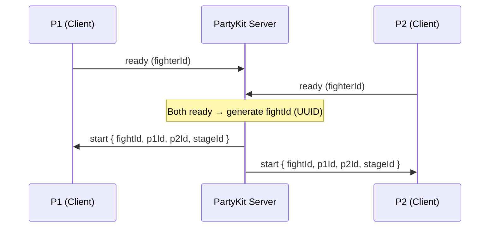
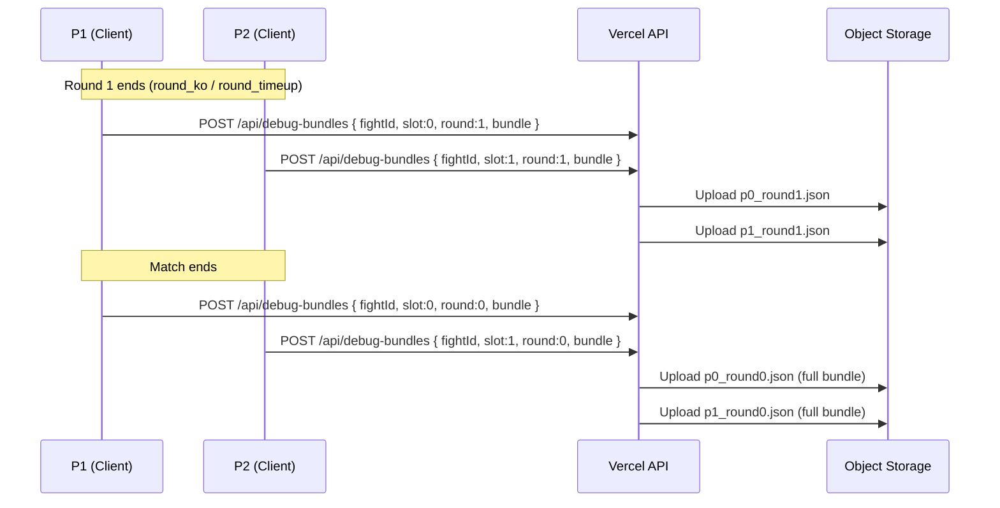

# RFC 0011: Auto-Upload Debug Bundles

**Status:** Proposed
**Date:** 2026-04-01
**Author:** Architecture Team
**Predecessor:** [RFC 0005: Multiplayer Debuggability](0005-multiplayer-debuggability.md)

---

## Summary

When debugging multiplayer issues, the current workflow (RFC 0005) requires manual export: tap the overlay, copy to clipboard or download, paste to Slack. This is fragile — if the game crashes mid-match, all debug data is lost. Players must also remember to export before leaving.

This RFC adds automatic, persistent debug bundle uploads. Every online fight gets a unique ID. When debug mode is active, both peers independently upload their debug bundles after each round and at match end to an object storage backend. An admin panel at `/admin/fights` lets authorized users browse fights and download bundles. Bundles expire after 7 days to control costs.

---

## Goals and Non-Goals

### Goals
- Every online fight gets a unique UUID, generated server-side
- Authorized users can enable debug mode (`?debug=1`) and bundles upload automatically
- Per-round uploads so partial data survives crashes
- Both peers upload independently for resilience
- Pluggable storage backend: local filesystem (dev) vs Supabase Storage (prod)
- Admin panel with paginated fight list, debug bundle filter, download links
- 7-day TTL on debug bundles with automated cleanup

### Non-Goals
- Uploading bundles for local/AI matches (online only)
- Real-time streaming of debug data during a match
- Replay viewer in the admin panel (bundles are downloaded as JSON)
- Automatic debug mode activation (still requires `?debug=1` or triple-tap)

---

## Architecture

### Fight ID Generation



The PartyKit server generates a `crypto.randomUUID()` in `_handleReady()` when `both_ready` fires. Both peers receive the same `fightId` in the `start` message — single source of truth, zero coordination needed.

### Upload Flow



Both peers upload independently. If one crashes mid-match, the other's per-round snapshots are still available. `round: 0` is the convention for the final full bundle at match end.

### Storage Interface

```
api/_lib/storage.js
├── uploadBundle(fightId, slot, round, jsonString)
├── downloadBundle(fightId, slot, round) → string | null
├── deleteBundles(fightId)
└── listBundles(fightId) → [{slot, round, key}]
```

Two backends selected by `STORAGE_BACKEND` env var:
- **`local`**: Writes to `/tmp/debug-bundles/{fightId}/p{slot}_round{round}.json`. For development.
- **`supabase`**: Uses `@supabase/supabase-js` with `SUPABASE_SERVICE_ROLE_KEY` to upload to a `debug-bundles` bucket.

### Database Schema

**New `fights` table:**

```sql
CREATE TABLE fights (
    id UUID PRIMARY KEY,                        -- fightId from PartyKit
    room_id TEXT NOT NULL,
    p1_user_id UUID REFERENCES profiles(id),
    p2_user_id UUID REFERENCES profiles(id),
    p1_fighter TEXT NOT NULL,
    p2_fighter TEXT NOT NULL,
    stage_id TEXT NOT NULL,
    started_at TIMESTAMPTZ DEFAULT NOW(),
    ended_at TIMESTAMPTZ,
    winner_slot SMALLINT,                       -- 0 or 1, NULL if incomplete
    rounds_p1 SMALLINT DEFAULT 0,
    rounds_p2 SMALLINT DEFAULT 0,
    has_debug_bundle BOOLEAN DEFAULT FALSE,
    debug_bundle_expires_at TIMESTAMPTZ
);
```

**New `is_admin` column on `profiles`:**

```sql
ALTER TABLE profiles ADD COLUMN is_admin BOOLEAN DEFAULT FALSE;
```

### Admin Panel

Preact + HTM SPA at `/admin/`, loaded from CDN (no build step). Auth via existing Supabase JS client.

**`/admin/fights`** page:
- Table: Date, P1, P2, Stage, Winner, Rounds, Debug Bundle links
- Filter: "Solo con debug bundle" checkbox
- Pagination: prev/next, sorted by `started_at DESC`
- Download links per peer per round

### API Endpoints

| Method | Path | Auth | Description |
|--------|------|------|-------------|
| POST | `/api/fights` | User | Create fight record (P1 at match start) |
| PATCH | `/api/fights` | User | Update fight (P2 registers, match result) |
| POST | `/api/debug-bundles` | User | Upload a debug bundle |
| GET | `/api/admin/fights` | Admin | Paginated fight list |
| GET | `/api/admin/debug-bundle` | Admin | Download a bundle |
| GET | `/api/cron/cleanup-bundles` | Cron | Delete expired bundles |

### TTL Cleanup

Vercel Cron runs daily at 3 AM UTC. Queries for fights where `has_debug_bundle = TRUE AND debug_bundle_expires_at < NOW()`, deletes storage objects, clears the flag.

---

## Implementation Phases

### Phase 1: Fight ID + Database Schema
- Database migrations (`fights` table, `is_admin` column)
- fightId generation in `party/server.js` `_handleReady()`
- Client-side propagation through scene chain to `FightRecorder`

### Phase 2: Storage Interface + Upload API
- Storage interface with local/supabase backends (`api/_lib/storage.js`)
- Upload endpoint (`api/debug-bundles.js`)
- Fight CRUD endpoint (`api/fights.js`)
- `withAdmin()` middleware (`api/_lib/handler.js`)

### Phase 3: Client-Side Auto-Upload
- Per-round upload in `FightScene.js` on `roundEvent`
- `DebugBundleExporter.uploadBundle()` helper
- Fight record creation at match start

### Phase 4: Admin Panel
- Admin API endpoints (`api/admin/fights.js`, `api/admin/debug-bundle.js`)
- Preact SPA (`public/admin/`)

### Phase 5: TTL Cleanup
- Cron endpoint (`api/cron/cleanup-bundles.js`)
- `vercel.json` cron configuration

---

## Test Plan

Every new module gets its own test file following existing Vitest patterns.

### Phase 1
- **`tests/party/server-fight-id.test.js`**: fightId generated on both_ready, included in start message, cleared on leave/disconnect, valid UUID format
- **`tests/systems/fight-recorder-fight-id.test.js`**: fightId stored in log, backward-compatible when omitted

### Phase 2
- **`tests/api/storage.test.js`**: upload/download/delete/list operations, path traversal prevention
- **`tests/api/debug-bundles.test.js`**: POST validation, storage calls, has_debug_bundle flag update, auth checks
- **`tests/api/fights.test.js`**: POST creates record, PATCH updates fields, duplicate/missing fightId handling, auth
- **`tests/api/handler-admin.test.js`**: is_admin check, 403 on non-admin, JWT verification inherited

### Phase 3
- **`tests/systems/debug-bundle-upload.test.js`**: correct API call, fire-and-forget on failure, no upload in guest mode

### Phase 4
- **`tests/api/admin/fights.test.js`**: pagination, hasDebug filter, nickname JOIN, total count, admin-only
- **`tests/api/admin/debug-bundle.test.js`**: bundle download, 404/403/400 cases

### Phase 5
- **`tests/api/cron/cleanup-bundles.test.js`**: deletes expired, skips non-expired, handles empty set, CRON_SECRET auth
