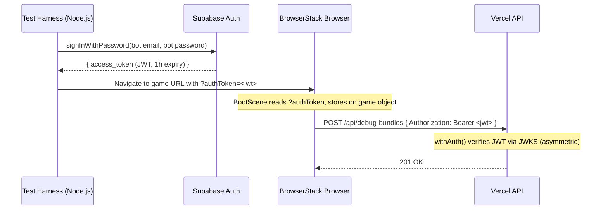

# RFC 0012: E2E Bot User for Debug Bundle Uploads

**Status:** Proposed
**Date:** 2026-04-02
**Author:** Architecture Team
**Predecessor:** [RFC 0011: Auto-Upload Debug Bundles](0011-auto-upload-debug-bundles.md)

---

## Summary

RFC 0011 added automatic debug bundle uploads gated by `withAuth()` (Supabase JWT). Remote E2E tests run on BrowserStack against deployed staging with `?autoplay=1&debug=1` but have no logged-in user — API calls for debug data persistence will 401.

This RFC introduces a **Supabase bot user** as a first-class citizen in the auth system. The E2E test harness signs in as the bot to get a real Supabase-issued JWT, then passes it to the remote browser. The backend requires zero changes — `withAuth()` verifies it like any other JWT.

For real users, debug UI (`?debug=1`) always works. Uploads only happen when the user is logged in normally.

---

## Goals and Non-Goals

### Goals
- E2E tests can upload debug bundles to deployed staging
- Bot user is a real Supabase Auth user with a profile row
- Supabase remains the sole JWT issuer — we never sign our own tokens
- Zero backend changes — existing `withAuth()` handles it

### Non-Goals
- Custom token signing or service account mechanisms
- Gating `?debug=1` UI activation (overlay/logger are harmless)
- Cleaning up the legacy HS256 path (separate concern)

---

## Architecture

### Auth Flow for E2E Tests



### Auth Fallback Chain in `apiFetch()`

```
1. Supabase session JWT (normal logged-in user)
2. Injected authToken from URL param (E2E bot)
3. X-Dev-User-Id header (local dev bypass, non-production only)
```

---

## Bot User Setup (One-Time, Manual)

1. Create user in Supabase dashboard: `e2e-bot@a-los-traques.com`
2. Note the user's UUID
3. Create a profile row:
   ```sql
   INSERT INTO profiles (id, nickname) VALUES ('<bot-uuid>', 'E2E Bot');
   ```
4. Add env vars to CI/CD and BrowserStack:
   - `E2E_BOT_EMAIL` — `e2e-bot@a-los-traques.com`
   - `E2E_BOT_PASSWORD` — secure password

---

## Implementation

### `tests/e2e/remote/remote-helpers.js` — Bot auth helper

```js
import { createClient } from '@supabase/supabase-js';

export async function getE2EBotToken() {
  const email = process.env.E2E_BOT_EMAIL;
  const password = process.env.E2E_BOT_PASSWORD;
  const supabaseUrl = process.env.SUPABASE_URL || process.env.VITE_SUPABASE_URL;
  const supabaseKey = process.env.SUPABASE_ANON_KEY || process.env.VITE_SUPABASE_ANON_KEY;

  if (!email || !password || !supabaseUrl || !supabaseKey) return null;

  const supabase = createClient(supabaseUrl, supabaseKey);
  const { data, error } = await supabase.auth.signInWithPassword({ email, password });
  if (error) throw new Error(`E2E bot login failed: ${error.message}`);
  return data.session.access_token;
}
```

URL builders get an `authToken` option:
```js
if (opts.authToken) params.set('authToken', opts.authToken);
```

### `src/scenes/BootScene.js` — Read `?authToken` from URL

```js
const authToken = params.get('authToken');
if (authToken) {
  this.game.authToken = authToken;
}
```

### `src/services/api.js` — Use injected authToken as fallback

```js
if (token) {
  headers.Authorization = `Bearer ${token}`;
}
// Injected auth token (E2E bot or external auth)
else if (window.game?.authToken) {
  headers.Authorization = `Bearer ${window.game.authToken}`;
}
// Local development bypass
else if (import.meta.env.DEV && !token) {
  headers['X-Dev-User-Id'] = '00000000-0000-0000-0000-000000000000';
}
```

### Backend — No changes

`withAuth()` already verifies Supabase JWTs via JWKS (asymmetric path). The bot's JWT is indistinguishable from any user's JWT.

### `api/fights.js` — No changes

Bot userId is a real UUID with a profile row. FK constraints satisfied.

---

## Security

| Concern | Mitigation |
|---------|------------|
| Token in URL | Lives only in BrowserStack session logs (private). 1-hour expiry. |
| Bot credentials | Stored as CI/CD secrets, never in code |
| Bot permissions | Same as any user — can create fights and upload bundles. No admin access. |
| Token reuse | Supabase JWT has 1-hour default expiry (configurable). E2E tests run in minutes. |

---

## Test Plan

### `tests/e2e/remote/remote-helpers.test.js` (new)
- `getE2EBotToken()` calls `signInWithPassword` with env var credentials
- Returns `access_token` string on success
- Returns `null` when env vars are missing
- Throws on auth failure (wrong password, etc.)

### Update: `tests/systems/debug-bundle-upload.test.js`
- Verify upload works when `window.game.authToken` is set (no Supabase session)

### Existing tests — No changes needed
- `withAuth()` JWT verification already tested
- Fight and debug-bundle endpoints accept any valid userId

### Manual verification
1. Create bot user in Supabase dashboard
2. Run remote E2E: `bun run test:e2e:remote`
3. Verify debug bundles appear in storage
4. Verify fight records have bot's userId as `p1_user_id`
