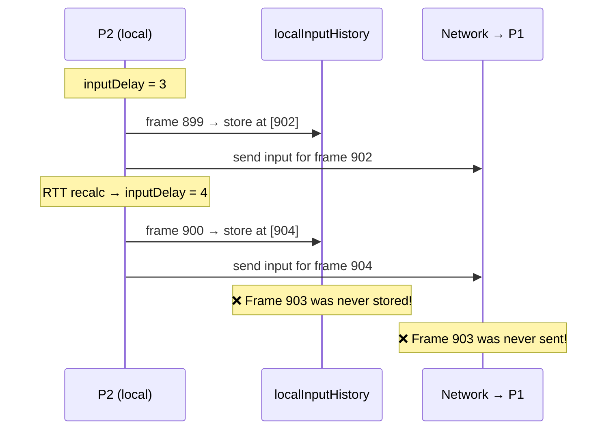
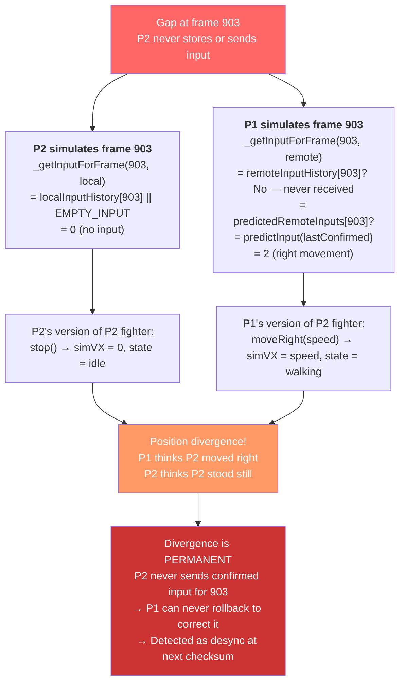
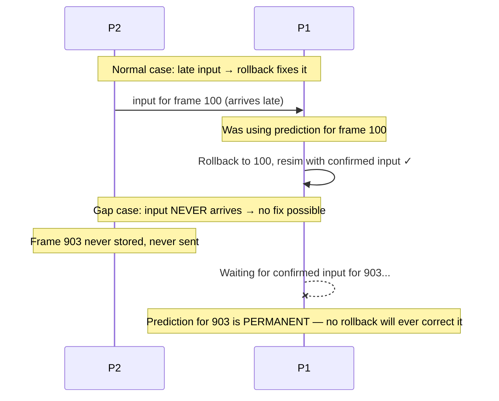
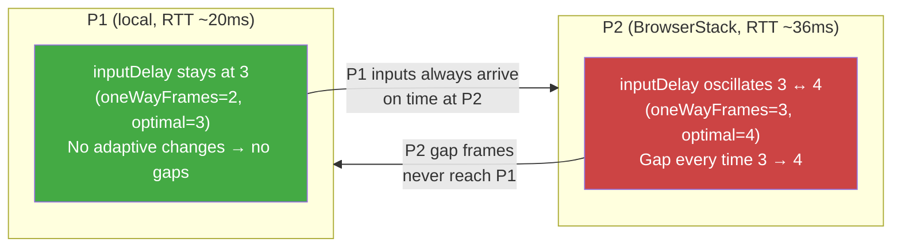
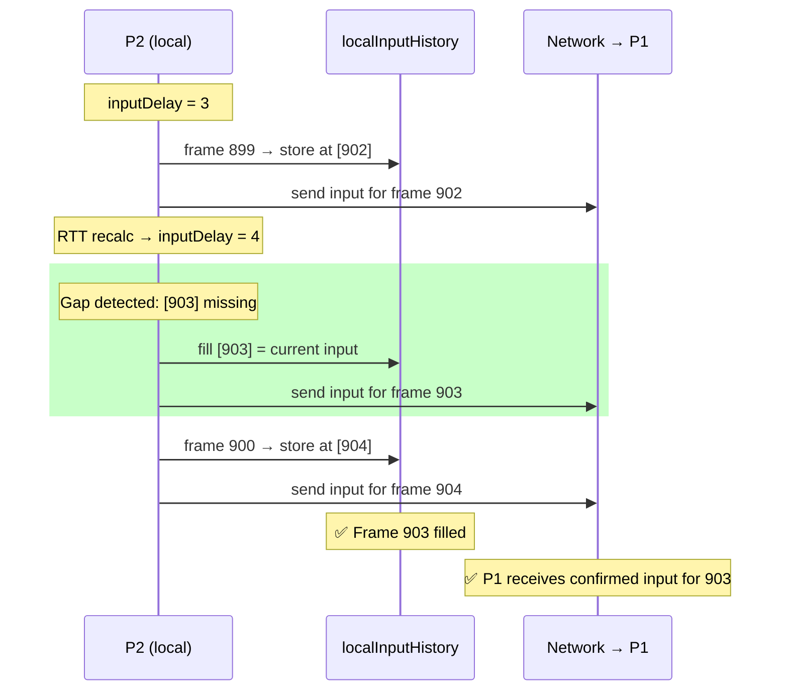

# RFC 0013: Fix Desync Caused by Adaptive Input Delay Frame Gap

**Status:** Proposed  
**Issue:** [#93](https://github.com/simon0191/a-los-traques/issues/93)  
**Related:** RFC 0006 (P1 never rolls back), RFC 0007 (desync detection), RFC 0008 (silent misprediction)

## Problem

Hybrid E2E tests (local P1 + BrowserStack P2) reveal 4 desyncs per match under asymmetric rollback load. **The root cause is not in the rollback/resimulation logic** — it's in how `RollbackManager` stores local inputs when the adaptive input delay changes.

### How inputs are stored

Each frame, `advance()` stores the local input at a **future** frame:

```javascript
const targetFrame = this.currentFrame + this.inputDelay;
this.localInputHistory.set(targetFrame, encodedLocal);
```

With `inputDelay = 3`, consecutive frames produce a contiguous sequence:

```
advance(frame=10) → localInputHistory[13] = input
advance(frame=11) → localInputHistory[14] = input
advance(frame=12) → localInputHistory[15] = input  // contiguous ✓
```

### What happens when inputDelay increases

Every 180 frames (~3 seconds), `_recalculateInputDelay()` adjusts `inputDelay` based on measured RTT. When RTT causes the delay to increase (e.g., 3→4), a **frame gap** appears in `localInputHistory`:

```
advance(frame=899, delay=3) → localInputHistory[902] = input
// ← _recalculateInputDelay() runs at frame 900, delay becomes 4
advance(frame=900, delay=4) → localInputHistory[904] = input
//                                         Frame 903 is NEVER stored!
```



Note: the reverse case (delay **decreasing**, e.g. 4→3) causes a collision (two inputs for the same frame), not a gap. The second write overwrites the first and both peers see the same value, so collisions are harmless.

### Why this causes desync

The gap frame creates a **permanent, uncorrectable divergence** between the two peers:



### Why rollback can't fix it

Normal mispredictions are self-correcting: the confirmed input eventually arrives, the rollback manager detects the mismatch against the snapshot's `remoteInput`, and re-simulates with the correct value. Gap frames break this contract because **the confirmed input never arrives**:



### When the gap is harmless vs harmful

The prediction for a gap frame is `predictInput(lastConfirmedRemoteInput)`, which keeps movement bits and zeros attacks (`last & 0xF`). The gap is only harmful when the prediction differs from `EMPTY_INPUT` (0):

- **Harmless:** Last confirmed input was attack-only (e.g. `128` = heavy kick). `128 & 0xF = 0` = same as `EMPTY_INPUT`. No divergence.
- **Harmful:** Last confirmed input had movement bits (e.g. `2` = right). `2 & 0xF = 2` ≠ `EMPTY_INPUT`. P1 thinks P2 is moving, P2 thinks P2 is standing still. **Divergence.**

### Evidence from the debug bundle

Full debug bundle: [gist](https://gist.github.com/simon0191/aaba3128d4a87c158629c330c8ddbae9)

**Match configuration:** `seed=42, speed=1, simon vs jeka on beach`

**Match stats:**

| Metric | P1 (local, Playwright) | P2 (BrowserStack, Chrome/Win11) |
|---|---|---|
| Rollbacks | 0 | 449 |
| Max rollback depth | 0 | 7 |
| Desyncs | 0 | 4 |
| RTT avg / min / max | 20 / 16 / 38 ms | 36 / 31 / 42 ms |
| Transport | websocket | websocket |
| Total frames | 3728 | 3735 |

**Gap frames** (computed from P2's 19 RTT samples and the adaptive delay formula):

| Gap Frame | Last P2 Input | `predictInput()` | Equals EMPTY? | Desync Frame |
|-----------|--------------|-------------------|---------------|-------------|
| 183 | 260 (up+special) | 4 (up) — but frame 184's input arrived first at P1, updating prediction to 0 | Yes (race) | None |
| **903** | **2 (right)** | **2 (right)** | **No** | **917** |
| 1443 | 128 (hk) | 0 | Yes | None |
| **2343** | **8 (down)** | **8 (down)** | **No** | **(2537)** |
| **3063** | **1 (left)** | **1 (left)** | **No** | **3077** |
| **3423** | **2 (right)** | **2 (right)** | **No** | **3437** |

Three of four desyncs occur **exactly 14 frames after a gap frame**. This is because the checksum safe offset is 13 frames, and the first checksum frame ≥ `gap + 13` is always `gap + 14` given the 30-frame checksum interval.

**Checksum pattern** around each desync shows transient divergence corrected by resync:

```
Frame 887: P1=−917249474  P2=−917249474  ✓ match
Frame 917: P1=−612355444  P2=−1686097764 ✗ DESYNC  ← gap at 903
Frame 947: P1= 350984532  P2= 350984532  ✓ match  ← fixed by resync
```

The same pattern repeats for all 4 desyncs: match → desync → match. The resync mechanism works correctly; the problem is that new gaps keep creating new divergences.

**Corroboration from confirmed input recordings:** The debug bundle's `confirmedInputs` (recorded per-peer in `_onConfirmedInputs`) shows P2's input component disagrees between peers at exactly frames 2343 and 3063 — matching two of the predicted gap frames:

```
frame 2343: P1 uses P2=8, P2 uses P2=0  ← gap frame
frame 3063: P1 uses P2=1, P2 uses P2=0  ← gap frame
```

### Why it only happens with asymmetric RTT



P1's low RTT (20ms) keeps `inputDelay` stable at the baseline of 3. P2's higher RTT (36ms) pushes `inputDelay` to 4 on RTT spikes and back to 3 on dips, creating a gap on every 3→4 transition. The formula:

```
oneWayFrames = ceil(RTT / 16.667)
optimal = max(3, min(5, oneWayFrames + 1))
```

With P2 RTT oscillating between 31–42ms, `oneWayFrames` alternates between 2 and 3, causing `optimal` to alternate between 3 and 4.

## Proposed Fix

### Fill gap frames when inputDelay increases

Track the previous target frame. When the new target frame skips past it, fill the gap with the current input and send each gap frame to the remote peer.

**File:** `src/systems/RollbackManager.js`

**Constructor** — add tracking field:

```javascript
this._lastLocalTargetFrame = -1;
```

**Step 1 of `advance()`** — fill gaps in `localInputHistory`:

```javascript
const targetFrame = this.currentFrame + this.inputDelay;

// Fill gap frames created by inputDelay increase (e.g., 3→4 skips one frame).
// Without this, the gap frame gets EMPTY_INPUT locally and a stale prediction
// remotely, causing permanent uncorrectable divergence. See RFC 0013.
if (this._lastLocalTargetFrame >= 0 && targetFrame > this._lastLocalTargetFrame + 1) {
  for (let f = this._lastLocalTargetFrame + 1; f < targetFrame; f++) {
    this.localInputHistory.set(f, encodedLocal);
  }
}

this.localInputHistory.set(targetFrame, encodedLocal);
```

**Step 2 of `advance()`** — send gap frame inputs to the remote peer:

```javascript
// Send inputs for any gap frames + the current target frame.
if (this._lastLocalTargetFrame >= 0 && targetFrame > this._lastLocalTargetFrame + 1) {
  for (let f = this._lastLocalTargetFrame + 1; f < targetFrame; f++) {
    const history = [];
    for (let i = 1; i <= INPUT_REDUNDANCY; i++) {
      const hf = f - i;
      if (this.localInputHistory.has(hf)) history.push([hf, this.localInputHistory.get(hf)]);
    }
    this.nm.sendInput(f, rawLocalInput, history);
  }
}
this._lastLocalTargetFrame = targetFrame;

// Send the main target frame (existing code)
this.nm.sendInput(targetFrame, rawLocalInput, history);
```

### Why this works



After the fix:

- P2's `localInputHistory[903]` contains a real input → P2 uses it instead of `EMPTY_INPUT`
- P1 receives a confirmed input for frame 903 → uses it instead of a stale prediction
- Both peers agree on P2's input for frame 903 → **no divergence**

## Files to Modify

1. **`src/systems/RollbackManager.js`** — Add `_lastLocalTargetFrame` to constructor; add gap-fill logic in `advance()` steps 1 and 2
2. **`tests/systems/rollback-input-delay-gap.test.js`** (new) — Unit tests for gap detection, local history fill, and network send
3. **`docs/rfcs/0013-fix-desync-adaptive-delay-gap.md`** (new) — This document

## Verification

1. **Unit tests:** Mock `NetworkManager`, simulate `inputDelay` 3→4, verify `localInputHistory` has no gaps and `sendInput` is called for the gap frame
2. **Existing tests:** `bun run test:run` — no regressions
3. **Lint:** `bun run lint:fix && bun run lint` — clean
4. **E2E (manual):** Re-run `bun run test:e2e:hybrid` — verify 0 desyncs
