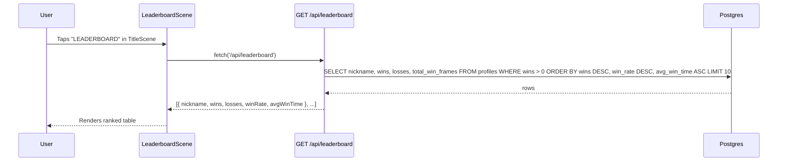

# RFC 0015: Global Leaderboard

**Status**: Proposed  
**Date**: 2026-04-10

## Problem

There is no way for players to see how they rank against each other. Wins and losses are already persisted in the `profiles` table (RFC 0004), but that data is invisible to users. A leaderboard closes this gap and gives players a reason to keep playing.

## Solution

Add a `LeaderboardScene` accessible from the Title screen that fetches and displays the top 10 players with rich stats: wins, losses, win rate, and average win time. A new public backend endpoint (`api/leaderboard.js`) serves the data — no authentication required, since rankings are intentionally public.

Average win time serves as the primary tiebreaker: when two players have the same number of wins, whoever wins their matches faster ranks higher.

## Design

### Data flow



### Stats displayed

| Column | Source | Description |
|---|---|---|
| `#` | computed | Rank position |
| `JUGADOR` | `profiles.nickname` | Player name |
| `V` | `profiles.wins` | Total wins |
| `D` | `profiles.losses` | Total losses |
| `%` | `wins / (wins + losses)` | Win rate, shown as integer (e.g. `72%`) |
| `T.PROM` | `total_win_frames / wins / 60` | Average seconds per win |

### Ranking order

1. `wins DESC` — most wins first
2. `wins / (wins + losses) DESC` — higher win rate breaks ties
3. `total_win_frames / wins ASC` — faster average win breaks further ties (requires new column, see Database Migration)

Players with 0 wins are excluded from the leaderboard (`WHERE wins > 0`).

### Scene layout (480×270)

```
┌──────────────────────────────────────────────────┐
│                 LEADERBOARD                       │  y=25
│  ────────────────────────────────────────────── │  y=45
│  #   JUGADOR          V    D     %    T.PROM     │  y=65  (headers)
│  1   simon           42    8    84%    38s        │
│  2   jeka            42   12    78%    41s        │
│  3   alv             31   19    62%    55s        │
│  ...                                              │
│                                                   │
│                  [ VOLVER ]                       │  y=250
└──────────────────────────────────────────────────┘
```

- Dark uniform background (`0x1a1a2e`), consistent with other menu scenes
- Alternating row shading (`0x16213e` / `0x0f1a30`) for readability
- Top 10 players. Fewer rows shown if fewer players qualify.
- While loading: show "Cargando..." placeholder
- On fetch failure: show "Error al cargar. Intentá de nuevo." instead of crashing

### Backend endpoint

`GET /api/leaderboard` — no authentication required.

```sql
SELECT
  nickname,
  wins,
  losses,
  ROUND(wins::numeric / NULLIF(wins + losses, 0) * 100) AS win_rate,
  ROUND(total_win_frames::numeric / NULLIF(wins, 0) / 60) AS avg_win_seconds
FROM profiles
WHERE wins > 0
ORDER BY
  wins DESC,
  (wins::numeric / NULLIF(wins + losses, 0)) DESC,
  (total_win_frames::numeric / NULLIF(wins, 0)) ASC
LIMIT 10;
```

Does not use `withAuth` — connects directly to the DB pool.

> **Note**: `getPool()` is not currently exported from `_lib/handler.js`. Duplicate the 5-line pool snippet inline in `leaderboard.js` to avoid modifying the handler and risking regressions.

## Database Migration

A new column `total_win_frames BIGINT NOT NULL DEFAULT 0` must be added to `profiles` to track cumulative fight duration for wins.

**New migration**: `db/migrations/20260410000000_add_win_frames_to_profiles.sql`

```sql
-- migrate:up
ALTER TABLE profiles ADD COLUMN total_win_frames BIGINT NOT NULL DEFAULT 0;

-- migrate:down
ALTER TABLE profiles DROP COLUMN total_win_frames;
```

`api/stats.js` must be updated to accept an optional `winFrames` field:

```js
// Before (current)
POST /api/stats  { isWin: true }

// After
POST /api/stats  { isWin: true, winFrames: 1440 }
```

When `isWin` is true and `winFrames` is provided, increment `total_win_frames` atomically:

```sql
UPDATE profiles
SET wins = wins + 1,
    total_win_frames = total_win_frames + $2,
    updated_at = now()
WHERE id = $1
RETURNING wins, losses, total_win_frames;
```

The caller (`VictoryScene` or wherever `updateStats` is called) must supply `winFrames`. If `winFrames` is missing or zero, `total_win_frames` is not updated — graceful degradation, no crash.

## File Plan

### New files

| File | Purpose |
|---|---|
| `src/scenes/LeaderboardScene.js` | Phaser scene with the ranked table |
| `api/leaderboard.js` | Public `GET /api/leaderboard` endpoint |
| `db/migrations/20260410000000_add_win_frames_to_profiles.sql` | Add `total_win_frames` column |

### Modified files

| File | Change |
|---|---|
| `src/scenes/TitleScene.js` | Add "LEADERBOARD" button and `goToLeaderboard()` method |
| `src/main.js` | Import and register `LeaderboardScene` in the `scene` array |
| `src/services/api.js` | Add `getLeaderboard()` function; update `updateStats()` to accept `winFrames` |
| `api/stats.js` | Accept optional `winFrames`, update `total_win_frames` atomically |

## Implementation Plan

### Phase 1 — Database

Run the new migration:
```bash
dbmate up
```

### Phase 2 — Backend

1. Create `api/leaderboard.js` with the ranking query.
2. Update `api/stats.js` to handle `winFrames`.

### Phase 3 — Client service

In `src/services/api.js`:

```js
export async function getLeaderboard() {
  return apiFetch('/leaderboard');
}
```

Update `updateStats` signature:
```js
export async function updateStats(isWin = true, winFrames = 0) {
  return apiFetch('/stats', {
    method: 'POST',
    body: JSON.stringify({ isWin, winFrames }),
  });
}
```

### Phase 4 — Scene

Create `src/scenes/LeaderboardScene.js` following the `MusicScene` pattern:
- `create()` draws background, title, decorative line, column headers
- Calls `getLeaderboard()`, awaits result, renders rows
- Loading state: "Cargando..." text
- "VOLVER" button fades back to `TitleScene`

### Phase 5 — TitleScene integration

In `TitleScene.js`:
1. Add button at `btnGap * 7` in `create()`
2. Add `goToLeaderboard()` method with fade, identical to `goToMusic()`

In `main.js`:
1. Import `LeaderboardScene`
2. Add to `scene` array

## Reused Infrastructure

- `createButton()` from `src/services/UIService.js`
- `apiFetch()` from `src/services/api.js`
- `GAME_WIDTH` / `GAME_HEIGHT` from `src/config.js`
- DB pool pattern from `api/_lib/handler.js`
- Fade + `transitioning` guard pattern from `TitleScene`

## Alternatives Considered

1. **Sort by win rate instead of wins**: Rejected. Favors players with very few matches (e.g. 1W/0L = 100%). Sorting by absolute wins rewards sustained activity; win rate is used only as a tiebreaker.

2. **Protect the endpoint with `withAuth`**: Rejected. Rankings are public by design — requiring login to view a leaderboard is unnecessary friction.

3. **Pagination**: Rejected for now. With 16 fighters (the full cast), top 10 is enough and fits on screen without scrolling.

4. **Track win time in the `fights` table instead of `profiles`**: Rejected. The `fights` table already exists and we'd need a JOIN + aggregation on every leaderboard request. Keeping a running total in `profiles` is O(1) to read and only slightly more expensive to write.

5. **Display win time as `mm:ss`**: Rejected. Matches are short (under 3 minutes). Showing seconds (e.g. `38s`) is more readable at small font sizes on a 480×270 canvas.

## Risks

- **Empty DB in dev**: In `dev:mp` mode, test users (`p1@test.local`, `p2@test.local`) start with 0 wins. The leaderboard will show no rows until matches are played. This is expected behavior, not a bug.
- **Null nickname**: Users who exist but haven't completed their profile may have a `null` nickname. The endpoint should use `COALESCE(nickname, 'Anónimo')` in the query.
- **`winFrames` not wired up yet**: After merging this RFC, `updateStats` callers in `VictoryScene` must be updated to pass `winFrames`. Until that happens, `total_win_frames` stays at 0 and `T.PROM` shows `--` for all players. The leaderboard still works — it just degrades the tiebreaker column.
