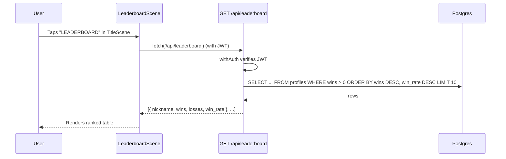

# RFC 0015: Global Leaderboard

**Status**: Proposed  
**Date**: 2026-04-10

## Problem

There is no way for players to see how they rank against each other. Wins and losses are already persisted in the `profiles` table (RFC 0004), but that data is invisible to users. A leaderboard closes this gap and gives players a reason to keep playing.

## Solution

Add a `LeaderboardScene` accessible from the Title screen that fetches and displays the top 10 players ranked by wins, with win rate as a tiebreaker. A new authenticated backend endpoint (`api/leaderboard.js`) serves the data. Scope is intentionally kept minimal for v1 — richer stats like average win time can be added later as a follow-up.

## Design

### Data flow



### Stats displayed

| Column | Source | Description |
|---|---|---|
| `#` | computed | Rank position |
| `JUGADOR` | `profiles.nickname` (fallback `Anónimo`) | Player name |
| `V` | `profiles.wins` | Total wins |
| `D` | `profiles.losses` | Total losses |
| `%` | `wins / (wins + losses)` | Win rate, shown as integer (e.g. `72%`) |

### Ranking order

1. `wins DESC` — most wins first
2. `win_rate DESC` — higher win rate breaks ties

Players with 0 wins are excluded (`WHERE wins > 0`). Ties beyond win rate are acceptable at the friend-group scale we're targeting; richer tiebreakers can be added later as a follow-up.

### Scene layout (480×270)

Uses a monospace font for the table body so columns align cleanly without needing per-column x anchors.

```
┌──────────────────────────────────────────────────┐
│                 LEADERBOARD                       │  y=25
│  ─────────────────────────────────────────────   │  y=45
│  #   JUGADOR              V     D      %         │  y=65  (headers)
│  1   simon               42     8     84%        │
│  2   jeka                38    12     76%        │
│  3   alv                 31    19     62%        │
│  ...                                              │
│                                                   │
│  [ VOLVER ]                                       │  (60, GAME_HEIGHT - 20)
└──────────────────────────────────────────────────┘
```

- Dark uniform background (`0x1a1a2e`), consistent with other menu scenes
- Alternating row shading (`0x16213e` / `0x0f1a30`) for readability
- Monospace font family (`'monospace'`) for the table — aligns columns at 480×270 without drift
- Top 10 players, fewer rows if fewer qualify
- While loading: show "Cargando..." placeholder
- On fetch failure: show "Error al cargar. Intentá de nuevo." instead of crashing
- `VOLVER` button at `(60, GAME_HEIGHT - 20)`, matching `MusicScene`'s pattern

### Backend endpoint

`GET /api/leaderboard` — authenticated via `withAuth`.

Using `withAuth` is effectively free rate limiting and caching (only logged-in users can hit it), and keeps infrastructure work off the critical path for v1. The handler already provides the DB client, so no pool duplication is needed.

```sql
SELECT
  COALESCE(nickname, 'Anónimo') AS nickname,
  wins,
  losses,
  ROUND(wins::numeric / (wins + losses) * 100) AS win_rate
FROM profiles
WHERE wins > 0
ORDER BY
  wins DESC,
  (wins::numeric / (wins + losses)) DESC
LIMIT 10;
```

Division is safe because `WHERE wins > 0` guarantees `wins + losses > 0`.

### Response shape

The API returns an array of rows using `snake_case` keys, matching the SQL output directly:

```json
[
  { "nickname": "simon", "wins": 42, "losses": 8, "win_rate": 84 },
  { "nickname": "jeka",  "wins": 38, "losses": 12, "win_rate": 76 }
]
```

The client does not transform the keys — it reads `row.win_rate` directly.

### Navigation

- `TitleScene` → "LEADERBOARD" button → `LeaderboardScene`
- `LeaderboardScene` → `VOLVER` button → `TitleScene` (with fade)

### TitleScene layout adjustment

`TitleScene` already has 7 buttons packed into the available vertical space. With the current anchor (`cy = GAME_HEIGHT / 2 - 50 = 85`) and `btnGap = 22`, button 7 (MUSICA) sits at `y = cy + 30 + btnGap * 6 = 247`. Adding an 8th button at `btnGap * 7 = 269` would clip against the 270px canvas bottom.

**Fix**: shift the layout anchor up by 15 pixels:

```js
// Before
const cy = GAME_HEIGHT / 2 - 50;   // 85

// After
const cy = GAME_HEIGHT / 2 - 65;   // 70
```

This moves the title from `y = 45` to `y = 30`, keeps all existing buttons on screen, and places the new 8th button (LEADERBOARD) at `y = 70 + 30 + 22 * 7 = 254` — within bounds with 16px of bottom margin. `btnGap` stays at 22 to preserve iPhone touch-target size.

## File Plan

### New files

| File | Purpose |
|---|---|
| `src/scenes/LeaderboardScene.js` | Phaser scene with the ranked table |
| `api/leaderboard.js` | Authenticated `GET /api/leaderboard` endpoint |
| `tests/api/leaderboard.test.js` | Backend query tests |

### Modified files

| File | Change |
|---|---|
| `src/scenes/TitleScene.js` | Add LEADERBOARD button, `goToLeaderboard()` method, shift `cy` anchor |
| `src/main.js` | Import and register `LeaderboardScene` |
| `src/services/api.js` | Add `getLeaderboard()` function |

## Implementation Plan

### Phase 1 — Backend

Create `api/leaderboard.js` using `withAuth`. The handler already provides `db`, so no pool bootstrap is needed:

```js
import { withAuth } from './_lib/handler.js';

export default withAuth(async (req, res, { db }) => {
  if (req.method !== 'GET') {
    return res.status(405).json({ error: 'Method Not Allowed' });
  }

  const result = await db.query(`
    SELECT
      COALESCE(nickname, 'Anónimo') AS nickname,
      wins,
      losses,
      ROUND(wins::numeric / (wins + losses) * 100) AS win_rate
    FROM profiles
    WHERE wins > 0
    ORDER BY wins DESC, (wins::numeric / (wins + losses)) DESC
    LIMIT 10;
  `);

  return res.status(200).json(result.rows);
});
```

### Phase 2 — Client service

In `src/services/api.js`:

```js
export async function getLeaderboard() {
  return apiFetch('/leaderboard');
}
```

### Phase 3 — Scene

Create `src/scenes/LeaderboardScene.js`. Pattern-match against `MusicScene`:
- `create()` draws background, title, decorative line, column headers
- Calls `getLeaderboard()`, awaits result, renders rows using monospace font
- Loading state: "Cargando..." text
- `VOLVER` button at `(60, GAME_HEIGHT - 20)` fades back to `TitleScene`

### Phase 4 — TitleScene integration

In `TitleScene.js`:
1. Change `cy` from `GAME_HEIGHT / 2 - 50` to `GAME_HEIGHT / 2 - 65`
2. Add button at `btnGap * 7` in `create()`
3. Add `goToLeaderboard()` method with the same fade pattern as `goToMusic()`

In `main.js`:
1. Import `LeaderboardScene`
2. Add to the `scene` array

## Tests

Following the pattern of `tests/api/profile.test.js` and `tests/api/stats.test.js`:

| Test | Scenario |
|---|---|
| Returns empty array when no profiles have wins | Empty DB or all players at 0 wins |
| Coalesces null nicknames to "Anónimo" | Profile row with `nickname IS NULL` |
| Orders by wins DESC | Player with 10 wins appears before player with 5 |
| Tiebreaks by win rate | Two players both at 10 wins, the one with fewer losses wins the tiebreak |
| Excludes players with 0 wins | A player at `wins=0, losses=5` is not in the response |
| Limits to 10 rows | 15 qualifying players → exactly 10 rows returned |
| Rejects unauthenticated requests | 401 without JWT or dev bypass header |

No tests are planned for the `LeaderboardScene` itself — scenes are Phaser-dependent and covered manually during dev. The ranking logic all lives in SQL, which is test-covered via the API layer.

## Reused Infrastructure

- `withAuth()` from `api/_lib/handler.js` — JWT verification + DB client
- `createButton()` from `src/services/UIService.js` — consistent button styling
- `apiFetch()` from `src/services/api.js` — JWT attachment, error handling
- `GAME_WIDTH` / `GAME_HEIGHT` from `src/config.js`
- Fade + `transitioning` guard pattern from `TitleScene`
- `VOLVER` button placement pattern from `MusicScene`

## Alternatives Considered

1. **Sort by win rate instead of wins**: Rejected. Favors players with very few matches (e.g. 1W/0L = 100%). Sorting by absolute wins rewards sustained activity; win rate is used only as a tiebreaker.

2. **Make the endpoint public (no auth)**: Rejected for v1. Authenticating via `withAuth` effectively gates the endpoint behind login, giving us rate limiting for free and keeping us out of the caching/abuse conversation. The tradeoff — rankings are hidden until login — is acceptable because the leaderboard is only meaningful to active players anyway. If we ever want pre-login visibility, flipping this is a one-line change.

3. **Track average win time as a tiebreaker** (`total_win_frames` column, `VictoryScene` wiring, migration): Rejected for v1. Out of scope for a first cut — ties on win count + win rate are acceptable at the friend-group scale. Reintroducing this cleanly would also require specifying where match duration comes from (`CombatSystem.timer` counts down, matches are multi-round, and there's no existing match clock). Revisit as a follow-up if wins-plus-win-rate ties become a real problem.

4. **Pagination**: Rejected for now. With 16 fighters (the full cast), top 10 is enough and fits on screen without scrolling.

## Risks

- **Empty DB in dev**: In `dev:mp` mode, test users (`p1@test.local`, `p2@test.local`) start with 0 wins. The leaderboard will show no rows until matches are played. This is expected behavior, not a bug.
- **TitleScene layout regression**: Shifting `cy` upward by 15px affects every element in the scene (title, subtitle, decorative line, all 8 buttons). Manual visual check required post-change on a 480×270 canvas, both in browser and in E2E test screenshots if they exist.
- **Monospace font availability**: Phaser's `'monospace'` fallback may render differently across iOS Safari and desktop Chrome. Acceptable — we only need columns to align *within* a single render, which monospace guarantees regardless of which specific font is picked.
