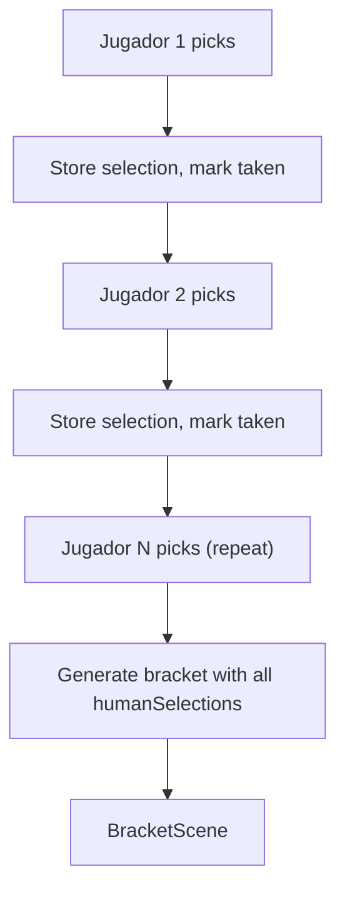
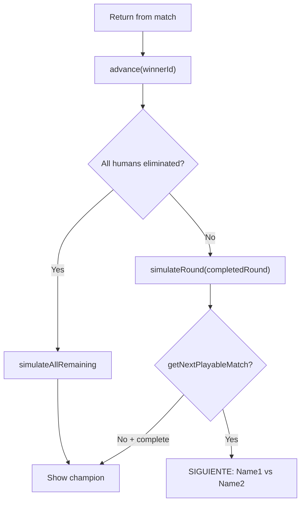

# RFC 0015: Local Multiplayer Tournament + VS Amigo

**Status**: Proposed  
**Date**: 2026-04-12

## Problem

The game only supports single-player local mode (human vs AI) and online multiplayer. Friends sitting at the same computer have no way to play against each other — neither a quick match nor a tournament.

## Solution

Three additions:

1. **Local multiplayer tournament** — N human players (1–8) + AI bots in a bracket, taking turns on a single machine
2. **VS Amigo quick match** — 2 humans on split keyboard in a one-off fight
3. **Input profile system** — configurable keyboard layouts per player slot, extensible for future gamepad support

## Design Decisions

| Decision | Choice | Rationale |
| :--- | :--- | :--- |
| Number of human players | 1–8 (configurable in setup) | Friends want to all participate, not just 2 |
| Fighter selection | Sequential, one at a time | Works with any input device; no multi-cursor complexity |
| Duplicate fighters | Not allowed | Fighter ID uniquely identifies each human in the bracket |
| Controls in human-vs-human fights | P1 = left keyboard, P2 = right keyboard | Ergonomic split; each player gets a distinct zone |
| Controls in human-vs-AI fights | Human always gets "full keyboard" (arrows + ZAXSD) | Familiar single-player layout; no split needed when alone |
| 3+ player match assignment | P1/P2 slot assignment varies per match | Bracket position determines who sits on which side |
| Match order within a round | Sequential, scan rounds in order | Predictable — BracketScene shows whose fight is next |

## 1. Input Profile System

### New file: `src/systems/InputProfiles.js`

Profiles are plain data objects describing key bindings. This design is forward-compatible — adding a `gamepad_1` profile later requires no architectural changes.

```js
export const INPUT_PROFILES = {
  keyboard_full: {
    name: 'Teclado Completo',
    type: 'keyboard',
    dirs:    { up: 'UP', down: 'DOWN', left: 'LEFT', right: 'RIGHT' },
    attacks: { lp: 'Z',  hp: 'A',     lk: 'X',      hk: 'S',       sp: 'D' },
  },
  keyboard_left: {
    name: 'Teclado Izquierdo',
    type: 'keyboard',
    dirs:    { up: 'W', down: 'S', left: 'A', right: 'D' },
    attacks: { lp: 'F', hp: 'G',  lk: 'C',   hk: 'V',   sp: 'E' },
  },
  keyboard_right: {
    name: 'Teclado Derecho',
    type: 'keyboard',
    dirs:    { up: 'UP',  down: 'DOWN', left: 'LEFT', right: 'RIGHT' },
    attacks: { lp: 'I',   hp: 'O',      lk: 'K',      hk: 'L',       sp: 'P' },
  },
};
```

Physical layout — zero overlap between `keyboard_left` and `keyboard_right`:

```
P1 (left hand)                    P2 (right hand)
  q [W] [E]  r   t   y  [U] [I] [O] [P]          ↑
 [A] [S] [D] [F] [G]  h   j  [K] [L]           ← ↓ →
  z   x  [C] [V]  b   n   m
```

`keyboard_full` and `keyboard_right` both use arrow keys for directions, but they're never active simultaneously — `keyboard_full` is only used in single-player mode.

### Modify: `src/systems/InputManager.js`

- Constructor gains a `profileId` parameter (default `'keyboard_full'`)
- Key registration is driven by profile data instead of hardcoded keys
- For `'UP'`/`'DOWN'`/`'LEFT'`/`'RIGHT'` directions → `createCursorKeys()` (preserves existing behavior)
- For letter directions (WASD) → `addKey()` per key
- All getters (`left`, `right`, `lightPunch`, etc.) remain identical in interface
- `touchState` and `consumeTouch()` unchanged

**Impact on existing code**: zero. The default profile produces the exact same key bindings.

## 2. TournamentManager — N Human Players

### Current state

`TournamentManager` tracks a single `playerFighterId`. All methods assume one human:
- `getCurrentMatch()` — finds match involving `playerFighterId`
- `advance(winnerId)` — finds unfinished match involving `playerFighterId`
- `simulateRound()` — skips matches with `playerFighterId`
- `_isPlayerPath()` / `_setWinnerInNextRound()` — uses `playerFighterId` for P1-slot logic

### Changes

**New fields:**
- `humanFighterIds: string[]` — all human-controlled fighter IDs
- `eliminatedHumans: string[]` — humans knocked out of the tournament
- `playerFighterId` kept as alias to `humanFighterIds[0]` for backward compat

**`generate(fighterIds, size, humanFighterIds, seed)`:**
- Accept `humanFighterIds` as an array (or single string for backward compat)
- Place all humans in the bracket, fill remaining with AI
- **Seeding rule**: spread humans evenly across the bracket so they meet as late as possible
  - Divide bracket into `N` equal segments (N = human count)
  - Place one human per segment
  - Each human gets a P1 slot (even index) in their first-round match

```
Example: 4 humans in size-16 bracket
Segment 0 (slots 0-3):  Human A at slot 0
Segment 1 (slots 4-7):  Human B at slot 4
Segment 2 (slots 8-11): Human C at slot 8
Segment 3 (slots 12-15): Human D at slot 12

Round of 8 → Humans can't meet
Quarterfinals → A vs B possible, C vs D possible
Semifinals → earliest A vs C
Finals → latest possible meeting
```

**`simulateRound(roundIndex)`:**
- Skip matches involving ANY non-eliminated human (check `humanFighterIds`)

**`advance(winnerId)`:**
- Find first unfinished match with at least one non-eliminated human participant
- Record winner; if loser is human, add to `eliminatedHumans`

**New method: `getNextPlayableMatch()`:**
- Scan rounds in order, return first match where:
  - Both p1 and p2 are filled
  - No winner yet
  - At least one participant is a non-eliminated human
- Returns `{ roundIndex, matchIndex, p1, p2 }` or `null`

**New method: `isHumanVsHuman(match)`:**
- Returns `true` if both `match.p1` and `match.p2` are in `humanFighterIds`

**`_setWinnerInNextRound()`:**
- Extend "player always takes P1 slot" rule to all humans (not just `playerFighterId`)

**`serialize()` / constructor:**
- Include `humanFighterIds` and `eliminatedHumans`
- Backward compat: if `humanFighterIds` missing in data, derive `[playerFighterId]`

## 3. Scene Changes

### 3.1 TournamentSetupScene

Add a player count selector to the existing UI:

```
         CONFIGURAR TORNEO

      JUGADORES: 2   [−] [+]

      TORNEO CORTO (8)
      TORNEO LARGO (16)

            VOLVER
```

- Range: 1 to `min(8, tournamentSize)` — capped at bracket size
- Passes `matchContext.localPlayers = playerCount` to SelectScene
- When `localPlayers === 1`, existing single-player flow is unchanged

### 3.2 SelectScene — Sequential N-Player Selection

**Current tournament flow**: P1 picks → bracket generates → BracketScene.

**New flow when `matchContext.localPlayers > 1`**:



- `this.humanSelections = []` accumulates choices
- `this.currentSelectingPlayer` tracks who's selecting (1-indexed)
- Header updates: "ELIGE TU LUCHADOR: JUGADOR N"
- **Duplicate prevention**: taken fighters get a gray overlay + "JN" label; confirmation is rejected if fighter is taken
- After last human confirms → `TournamentManager.generate(fighterIds, size, humanSelections, seed)` → BracketScene

### 3.3 BracketScene — N-Human Match Routing

**Returning from a match (`fromMatch`):**



**Display changes:**
- Each human fighter highlighted in a distinct color (cycle: red, blue, green, yellow, purple, cyan, orange, pink)
- `goToMatch()` adds `isHumanVsHuman` flag to scene data when both fighters are human

### 3.4 FightScene — Conditional Second InputManager

In `create()`, after existing input setup:

```js
if (this.matchContext?.isHumanVsHuman || this.matchContext?.type === 'versus') {
  this.inputManager = new InputManager(this, 'keyboard_left');
  this.inputManager2 = new InputManager(this, 'keyboard_right');
  this.aiController = null;
} else if (this.gameMode !== 'online') {
  // existing: human vs AI with 'keyboard_full'
  this.inputManager = new InputManager(this);
  this.aiController = new AIController(...);
}
```

In `_handleLocalUpdate()`, P2 input sourced from `inputManager2` when it exists:

```js
let p2Input = 0;
if (this.inputManager2) {
  const i2 = this.inputManager2;
  p2Input = encodeInput({
    left: i2.left, right: i2.right, up: i2.up, down: i2.down,
    lp: i2.lightPunch, hp: i2.heavyPunch,
    lk: i2.lightKick, hk: i2.heavyKick, sp: i2.special,
  });
  i2.consumeTouch();
} else if (this.aiController) {
  // existing AI code, unchanged
}
```

The simulation layer is unchanged — `tick()` receives two encoded inputs regardless of source.

### 3.5 PreFightScene — Pass-Through

- Accept `isHumanVsHuman` in `init()`, pass through to FightScene
- When `isHumanVsHuman`: show "JUGADOR 1" / "JUGADOR 2" labels

### 3.6 VictoryScene — Minor Changes

- `manager.advance(winnerId)` already broadened to work for N humans (§2)
- "CONTINUAR TORNEO" → BracketScene works as-is
- For `matchContext.type === 'versus'`: show standard buttons (REVANCHA, ELEGIR OTRO, MENU)

### 3.7 TitleScene — "VS AMIGO" Button

New button between "VS MAQUINA" and "TORNEO":

```
VS MAQUINA
VS AMIGO        ← new
TORNEO
...
```

Starts SelectScene with `matchContext: { type: 'versus' }`. The existing P1→P2 sequential selection flow handles the rest. FightScene detects `type === 'versus'` to create two InputManagers.

## 4. matchContext Shape

```js
// Tournament (N players)
{
  type: 'tournament',
  localPlayers: 3,                    // human count
  tournamentState: { ... },           // TournamentManager.serialize()
  matchInfo: { roundIndex, matchIndex },
  isHumanVsHuman: false,              // set per-match by BracketScene
}

// VS Amigo (always 2 players)
{
  type: 'versus',
}
```

## 5. Implementation Order

| Phase | Files | Description |
| :--- | :--- | :--- |
| 1 | `InputProfiles.js` (new), `InputManager.js` | Input profile system — foundation |
| 2 | `TournamentManager.js`, `TournamentManager.test.js` | N-human bracket logic + tests |
| 3 | `TournamentSetupScene.js` | Player count UI |
| 4 | `SelectScene.js` | Sequential N-player selection |
| 5 | `BracketScene.js` | N-human routing + display |
| 6 | `PreFightScene.js`, `FightScene.js` | 2nd InputManager for human-vs-human |
| 7 | `VictoryScene.js` | Minor tournament flow |
| 8 | `TitleScene.js`, `SelectScene.js` | VS Amigo flow |

## 6. Future Work

- **Gamepad support**: add `gamepad_0`, `gamepad_1` profiles to `INPUT_PROFILES` using the Gamepad API. No architectural changes needed — FightScene just passes a different profile ID to InputManager.
- **Controller config scene**: accessible from TitleScene, lets players manually assign input profiles to slots.
- **Online tournaments**: per RFC 0003 §6, the `TournamentManager` state can be mirrored via PartyKit.
- **Spectator mode**: non-playing humans could watch the current fight instead of staring at the bracket screen.

## 7. Risks & Mitigations

| Risk | Mitigation |
| :--- | :--- |
| Key conflicts between profiles | Layouts verified — zero overlap between `keyboard_left` and `keyboard_right` |
| Bracket seeding unfairness | Deterministic segment-based placement; humans are spread evenly |
| Backward compat with existing tournament saves | Constructor detects missing `humanFighterIds` and derives from legacy `playerFighterId` |
| Complex match ordering with N humans | `getNextPlayableMatch()` scans linearly — simple, predictable, testable |
| `keyboard_full` and `keyboard_right` share arrow keys | Never active simultaneously; `full` is single-player only |
