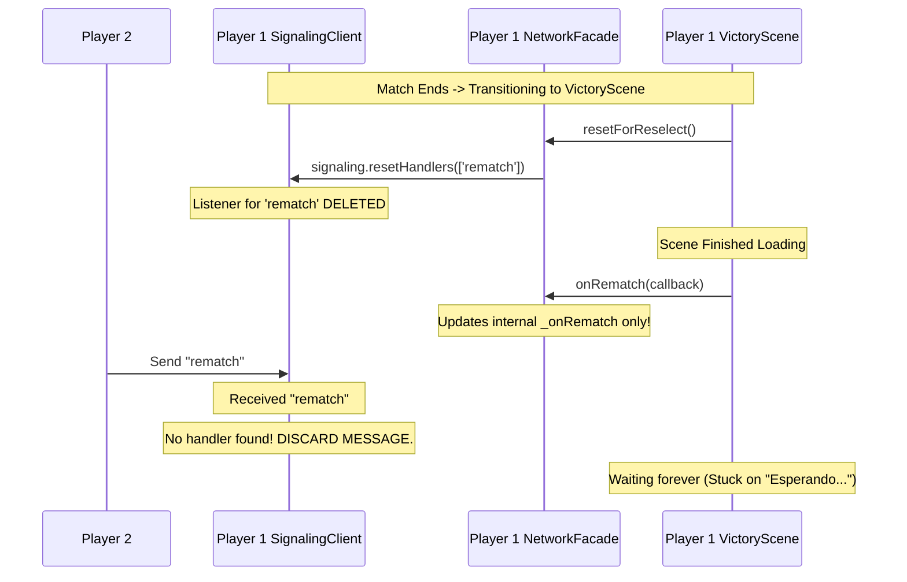
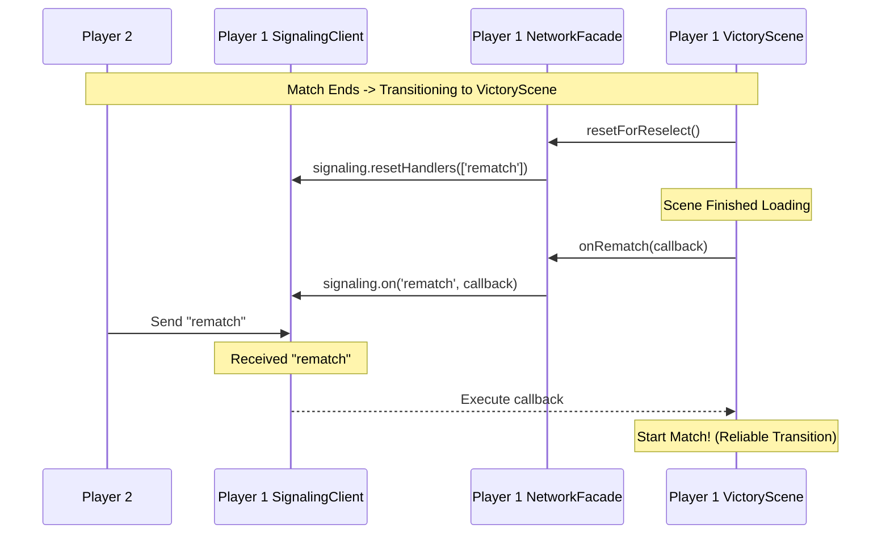

# RFC 0015: Reliability of Multiplayer Scene Transitions & Rematch Flow

## 1. Context
The project uses a multi-layered networking architecture:
- **SignalingClient:** Owns the WebSocket (PartyKit) and handles message dispatch.
- **NetworkFacade:** Composes multiple modules (Transport, InputSync, etc.) and provides a stable API for Phaser Scenes.
- **Phaser Scenes (`VictoryScene`, `SelectScene`):** Register callbacks to react to opponent actions (Rematch, Leave, Ready).

## 2. Problem Statement
Players frequently reported getting stuck on the "Esperando el oponente" (Waiting for opponent) message after a fight. Even if players waited on the Victory screen before clicking "Revancha", the game would still freeze.

Additionally, when players hit "Elegir otro", one player could get stuck on "Sincronizando..." in the new fight and eventually disconnect due to a Frame Zero Sync deadlock.

Through rigorous empirical testing, both of these issues were identified as symptoms of faulty handler lifecycle management within `NetworkFacade`, rather than network race conditions.

### Root Cause 1: The "Severed Wire" (Permanent Disconnection)
The reason the rematch flow failed 100% of the time was a design flaw in `NetworkFacade`'s Proxy Pattern combined with the `resetForReselect` cleanup process.
- In the constructor, `NetworkFacade` wired `SignalingClient`'s `rematch` event to its own internal callback `_onRematch`.
- During the transition to `VictoryScene`, `resetForReselect()` called `this.signaling.resetHandlers(['rematch', ...])`, which permanently deleted the listener inside `SignalingClient`.
- When `VictoryScene` later called `networkManager.onRematch(cb)`, the facade merely updated its internal `_onRematch` variable but *never* re-registered with `SignalingClient`.

Thus, `SignalingClient` was left completely deaf to `rematch` messages. Any incoming rematch signals were discarded because no handler was registered.

#### Failure Case 1: The Severed Wire (Old Behavior)


### Root Cause 2: The "Stale Handler" (Frame Zero Sync Deadlock)
This occurred when a handler was *not* cleared during `resetForReselect`.
- The old `FightScene` registered a `frame_sync` handler.
- Players chose "Elegir otro" and moved to `SelectScene`. `resetForReselect` was called, but failed to include `frame_sync` and `disconnect` in its cleanup list.
- The old `frame_sync` handler remained active in `SignalingClient` while players were picking characters.
- If Player 1 picked faster and entered the new fight, they began sending `frame_sync` retries every 500ms.
- Player 2 (still picking) received these messages. Because `SignalingClient` had an active handler (the stale one from the previous match), it dispatched the messages to the dead `FightScene` logic, which silently discarded them.
- When Player 2 finally entered the fight and sent their `frame_sync`, Player 1 received it and stopped sending retries. Player 2 was left waiting forever for a message they had already thrown away.

## 3. Proposed Solution

### Fix 1: Direct Signaling (Reconnecting the Wire)
`NetworkFacade` no longer stores scene callbacks in private variables for these types. Instead, it uses **Pattern A: Direct Signaling**, passing the callback directly to `SignalingClient`.

```javascript
// Inside NetworkFacade.js (New Behavior)
onRematch(cb) {
  this.signaling.on('rematch', cb); // Directly registers with SignalingClient!
}
```

This ensures the listener is properly recreated in the `SignalingClient` when a new scene requests it. We removed the old proxy wrapping logic for all scene transition events (`rematch`, `leave`, `opponent_ready`, `return_to_select`, etc.).

#### Fixed Case: Reliable Transition (New Behavior)


### Fix 2: Comprehensive State Cleanup
Added `frame_sync` and `disconnect` to the `this.signaling.resetHandlers([...])` array inside `resetForReselect()`. This ensures the stale handlers from the old `FightScene` are purged. Because `frame_sync` is already a `BUFFERABLE_TYPE` (B5 Buffering) in `SignalingClient`, clearing the handler means any early `frame_sync` messages from a faster player will now be safely buffered until the slower player reaches the new fight.

## 4. Implementation Details

### `NetworkFacade.js`
- Refactored `onRematch`, `onLeave`, `onOpponentReady`, `onReturnToSelect`, etc., to use `this.signaling.on(type, cb)`.
- Removed all corresponding internal state variables (`_onRematch`, `_onLeave`, etc.).
- Cleaned up the constructor and `resetForReselect()` to remove references to these removed internal variables.
- Added `frame_sync` and `disconnect` to `resetHandlers` array.

## 5. Verification Plan
- **Unit Tests:** `network-facade.test.js` updated to verify that internal proxy variables are removed and handlers are properly registered and reset via the direct signaling mechanism.
- **Manual Flow:** 
    - **Rematch:** Confirm that clicking "Revancha" triggers the fight reliably.
    - **Select Another:** Confirm that clicking "Elegir otro" correctly returns both players to the `SelectScene`, and entering a new fight does not deadlock on "Sincronizando...".

## 6. Conclusion
By ensuring direct signaling paths and comprehensive handler cleanup, we eliminate the permanent disconnection flaw ("Severed Wire") and the deadlock flaw ("Stale Handler"). This reconnects the event listeners properly during scene transitions and restores the online multiplayer rematch flow reliably.
