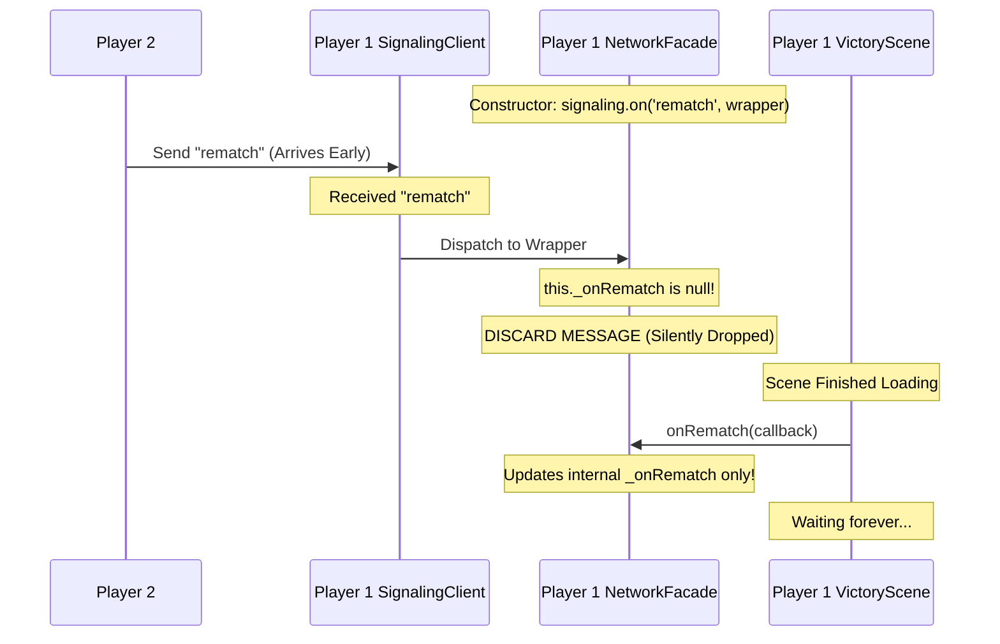
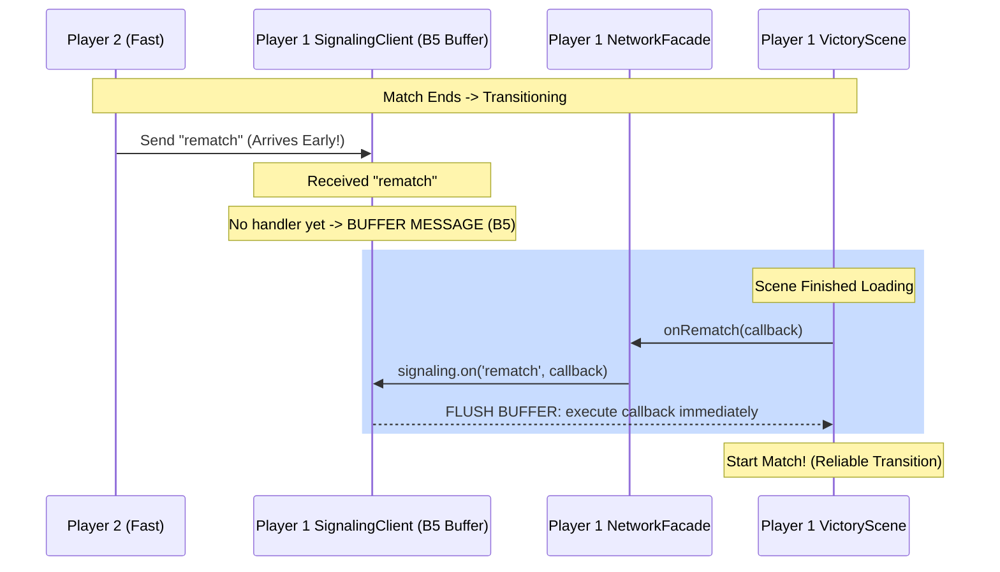

# RFC 0015: Reliability of Multiplayer Scene Transitions & Rematch Flow

## 1. Context
The project uses a multi-layered networking architecture:
- **SignalingClient:** Owns the WebSocket (PartyKit) and handles message dispatch. Implements a buffering strategy known internally as **B5 Buffering** (queueing incoming messages if no handler is currently registered, to be flushed when a handler attaches).
- **NetworkFacade:** Composes multiple modules (Transport, InputSync, etc.) and provides a stable API for Phaser Scenes.
- **Phaser Scenes (`VictoryScene`, `SelectScene`):** Register callbacks to react to opponent actions (Rematch, Leave, Ready).

## 2. Problem Statement
Players frequently reported getting stuck on the "Esperando el oponente" (Waiting for opponent) message after a fight. The rematch, leave, and return_to_select messages were being silently lost during scene transitions. 

This issue stemmed from two distinct failure paths in how `NetworkFacade` managed event listeners.

### Path A: The "Severed Wire" (After `resetForReselect`)
When transitioning between matches, `resetForReselect()` is called to clean up state.
1. `resetForReselect()` called `signaling.resetHandlers(['rematch', 'leave', ...])`, which deleted the handlers inside `SignalingClient`.
2. If an opponent clicked "Revancha" before the new scene registered its handlers, `SignalingClient` received the message.
3. Because there was no handler, and `rematch` was not in `BUFFERABLE_TYPES`, the message was completely discarded at the `SignalingClient` level.

### Path B: The "Proxy Blackhole" (Facade Wrapper Drops Message)
For events where `resetForReselect` was not called (or before it was called), a different failure occurred. 
1. In its constructor, `NetworkFacade` wrapped `SignalingClient` events: 
   `this.signaling.on('rematch', () => { if (this._onRematch) this._onRematch(); })`
2. This wrapper meant `SignalingClient` *always* had a handler registered for `rematch`, completely bypassing the B5 buffering logic.
3. If a message arrived before the scene called `networkManager.onRematch(cb)`, the `SignalingClient` successfully dispatched the message to the Facade's wrapper.
4. The wrapper checked `this._onRematch`, found it to be `null`, and silently dropped the message at the Facade level.

#### Failure Case: The Proxy Blackhole (Path B)


## 3. Proposed Solution

To solve both failure paths, we implement **Pattern A: Direct Signaling** combined with an expansion of **B5 Buffering**.

### Fix 1: Expand B5 Buffering
We add the following 12 message types to `BUFFERABLE_TYPES` in `SignalingClient`:
- **Scene Flow:** `rematch`, `leave`, `opponent_ready`, `return_to_select`, `full`, `opponent_joined`. (Safe to buffer: triggers scene transitions. Scenes use `transitioning` flags to ignore duplicate flushes if multiple messages buffered).
- **Reconnection Flow:** `opponent_reconnecting`, `opponent_reconnected`, `rejoin_available`, `rejoin_ack`. (Safe to buffer: updates UI state and triggers internal transport resets).
- **Debugging:** `debug_request`, `debug_response`.

This fixes **Path A**: messages arriving when no handler exists will now be buffered instead of discarded. `resetHandlers()` is also updated to clear these buffers to prevent stale messages from leaking into the next match.

### Fix 2: Pattern A (Direct Signaling)
**Pattern A** refers to having the Facade directly register the scene's callback with the `SignalingClient`, rather than wrapping it in a proxy closure.

```javascript
// NetworkFacade.js (New Behavior)
onRematch(cb) {
  this.signaling.on('rematch', cb); // Direct pass-through
}
```
This fixes **Path B**: The Facade no longer registers empty constructor wrappers. When a scene is loading, `SignalingClient` truly has "no handler" registered, which allows the B5 Buffering logic to engage.

#### Fixed Case: Reliable Transition (New Behavior)


## 4. Implementation Details & Trade-offs

### Managing Dual-Use Events (Internal + External)
Certain events (`opponent_joined`, `opponent_reconnected`) are "dual-use": they trigger internal `NetworkFacade` logic (like WebRTC initialization) AND require a callback to the Scene. 
Because `SignalingClient` only supports a single handler per event type, if the Facade registers an internal listener, it disables B5 buffering for the Scene. 

**Trade-off accepted:** We use manual `_pending...` flags inside `NetworkFacade` specifically for `opponent_joined` and `opponent_reconnected`. 
```javascript
this.signaling.on('opponent_joined', (msg) => {
  this._fetchTurnThenInitWebRTC(); // Internal work
  if (this._onOpponentJoined) this._onOpponentJoined(msg);
  else this._pendingOpponentJoined = msg; // Manual buffer
});
```
While this mimics the fragile proxy pattern, it is strictly isolated to these two specific connection-lifecycle events, avoiding the architectural overhaul required to convert `SignalingClient` into a full multi-listener `EventEmitter`.

### Buffer Edge Cases
- **Multiple Messages:** If an opponent spams a button (e.g., "Rematch"), the B5 buffer will collect multiple messages. Upon flush, the callback fires multiple times sequentially. Phaser scenes handle this idempotently via early-returns (`if (this.transitioning) return;`), making this safe.

## 5. Verification Plan
- **Unit Tests:** `network-facade.test.js` updated to verify that internal proxy variables are removed and B5 buffers correctly flush to direct signaling handlers.
- **Deterministic Race Condition Test:** Implemented a unit test that simulates the exact failure timing:
  1. Emit `rematch` message over mocked socket.
  2. Verify `NetworkFacade` stores it in the B5 buffer.
  3. Register `onRematch(cb)` handler.
  4. Assert the callback is fired immediately with the buffered message.
