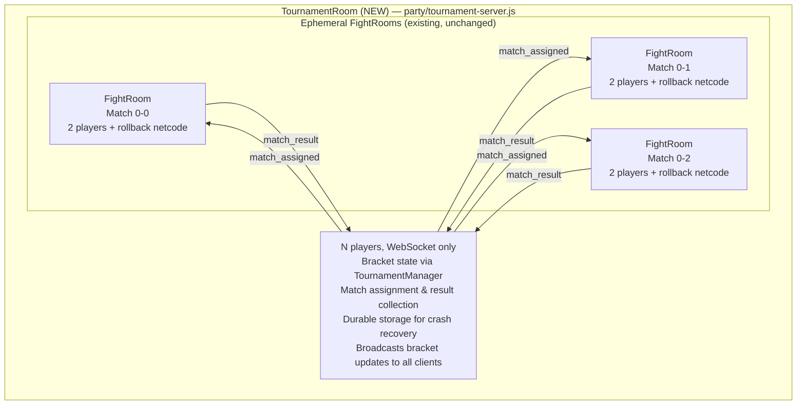
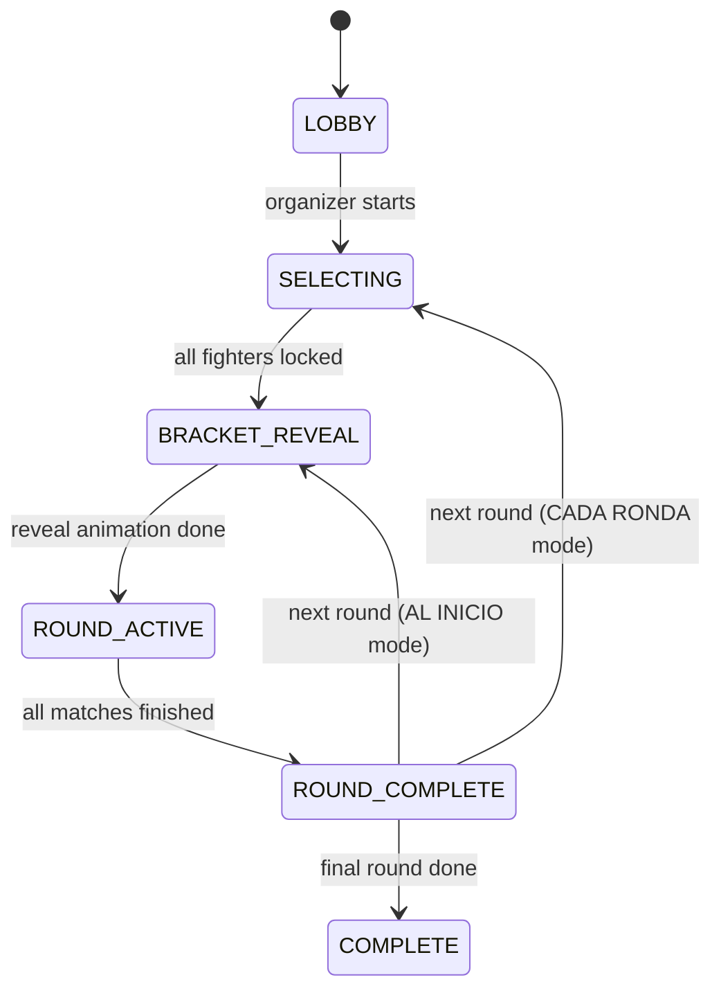
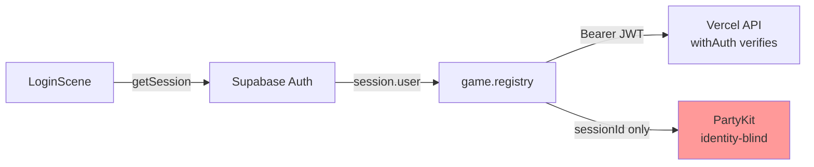
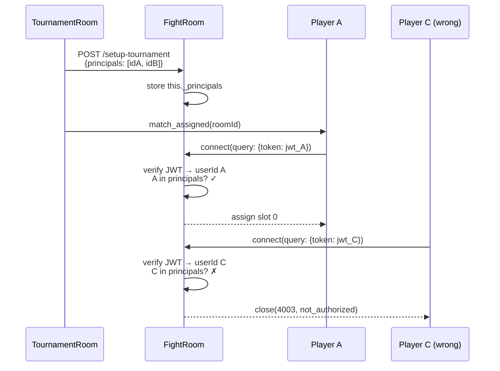
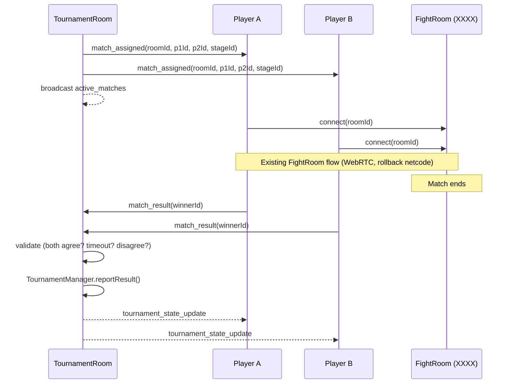
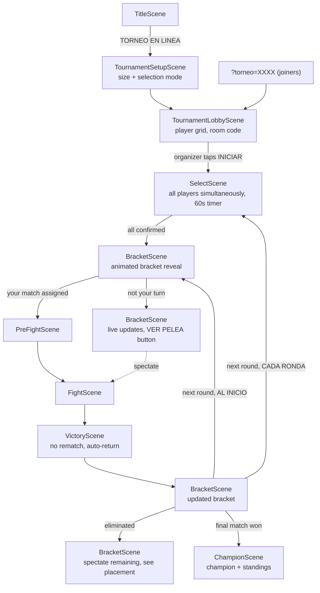

# RFC 0015: Multiplayer Tournament Mode

**Status:** Proposed
**Date:** 2026-04-12
**Author:** Architecture Team
**Predecessor:** [RFC 0003: Tournament Mode](0003-tournament-mode.md) (local single-player tournament, complete)
**Related:** [RFC 0002: Multiplayer Redesign](0002-multiplayer-redesign.md), [RFC 0004: Authentication](0004-authentication-redesign-vercel.md)

---

## 1. Context & Objectives

RFC 0003 implemented a local single-elimination tournament where one player fights AI opponents through a bracket. The architecture was explicitly designed for future online integration (Section 6): "TournamentManager logic mirrored on PartyKit server."

This RFC implements that vision: **a multiplayer tournament where 4-16 friends each play from their own phone** in a single-elimination bracket, with real fights over the existing rollback netcode.

### Key Goals

| Priority | Goal |
|----------|------|
| **P0** | **Real bracket tournament** — Up to 16 players, single-elimination, concurrent matches per round |
| **P0** | **Reuse existing combat** — Each match uses the existing FightRoom + rollback netcode, unchanged |
| **P0** | **Server-authoritative bracket** — TournamentManager runs on the server; clients receive read-only snapshots |
| **P1** | **Resilient to disconnects** — Forfeit on grace expiry, durable state survives server restarts |
| **P1** | **Spectating** — Eliminated/waiting players can watch active matches |
| **P2** | **Organizer options** — Tournament size (4/8/16), fighter selection mode (once vs. each round) |

### Non-Goals

| Non-Goal | Rationale |
|----------|-----------|
| Alternative formats (round-robin, double elimination, king of the hill) | Single-elimination first; other formats can be added later with the same infrastructure |
| Matchmaking / ELO seeding | This is a friend group, not ranked play. Bracket is shuffled randomly from a server seed |
| Server-side game simulation | Matches remain P2P with rollback netcode. Server is a relay + result recorder |

### Prerequisites

- **Login required.** Tournament mode is only available to authenticated users (not guests). The TitleScene button "TORNEO EN LINEA" is hidden or disabled when `game.registry.get('user') === null`.

---

## 2. Architecture

### 2.1 Two-Tier Room Topology

The existing `FightRoom` (`party/server.js`) is tightly coupled to a 2-player model: fixed `players = [null, null]` array, slot assignment assumes exactly 2, state machine built around a single match lifecycle. Extending it for N players would be invasive and risk regressions in the core fighting experience.

Instead, we introduce a **TournamentRoom** that orchestrates matches across standard FightRooms:



**Why two tiers?** FightRoom has battle-tested reconnection, WebRTC signaling, spectator relay, and rollback. Reusing it unchanged = zero regression risk. TournamentRoom only handles orchestration, never combat.

**PartyKit configuration** (`partykit.json`):
```json
{
  "name": "a-los-traques",
  "main": "party/server.js",
  "parties": {
    "tournament": "party/tournament-server.js"
  }
}
```

Clients connect via `PartySocket({ host, party: 'tournament', room: tournamentId })` for the tournament, and via the existing `PartySocket({ host, room: fightRoomId })` for individual matches.

### 2.2 Server State Machine



| State | Description |
|-------|-------------|
| `LOBBY` | Accepting joins. Organizer can start when all slots filled (or with byes). |
| `SELECTING` | All active players picking fighters. 60-second timer. |
| `BRACKET_REVEAL` | Bracket generated/updated, brief animation pause (~3s). |
| `ROUND_ACTIVE` | Matches in progress. Server tracks active rooms, waits for all results. |
| `ROUND_COMPLETE` | All matches done. Advance bracket. Next round or → COMPLETE. |
| `COMPLETE` | Champion crowned. Final standings broadcast. Write to DB. |

### 2.3 TournamentManager Refactoring

The existing `TournamentManager` (`src/services/TournamentManager.js`) is pure JS, Phaser-independent, and fully serializable. It needs these changes for multiplayer:

| Current (local) | Multiplayer |
|-----------------|-------------|
| `playerFighterId` (singular) | `playerFighterIds: Map<slot, fighterId>` |
| `simulateAI()` / `simulateRound()` | Removed — all matches are real players |
| `advance(winnerId)` | `reportResult(roundIndex, matchIndex, winnerId)` |
| Client-side state ownership | Server-side only; clients get read-only snapshots |
| Seeded PRNG for AI outcomes | Seeded PRNG for bracket shuffle only |

Preserved: `generate()`, `serialize()`, constructor restore, `getCurrentMatch()`, `isComplete()`.

### 2.4 Identity & Authentication

**Current gap:** The existing PartyKit server (`party/server.js`) is identity-blind. Players connect via `PartySocket({ query: { sessionId } })` where `sessionId` is a random UUID for log correlation only. The server sees `connection.id` (a WebSocket identifier) but has no knowledge of the Supabase user ID, nickname, or auth status. Identity is only known to the client and the Vercel API backend (which verifies JWTs via `withAuth()` in `api/_lib/handler.js`).

**How it works today:**



The Supabase JWT is verified by the Vercel backend using `jose` library + `SUPABASE_JWT_SECRET` (HS256) or JWKS endpoint (RS256). This happens in `api/_lib/handler.js:withAuth()`. But PartyKit never sees or verifies any JWT.

**Tournament solution: JWT in query param.** This is the standard pattern for WebSocket auth (used by Socket.io, Pusher, etc.). PartyKit's `onConnect(connection, ctx)` receives `ctx.request` which contains the query params, so verification happens synchronously on connect — before the player can send any other messages.

```javascript
// Client (TournamentClient.js)
const token = (await getSession())?.access_token;
const socket = new PartySocket({
  host,
  party: 'tournament',
  room: tournamentId,
  query: { token, sessionId }
});

// Server (tournament-server.js)
async onConnect(connection, ctx) {
  const token = new URL(ctx.request.url).searchParams.get('token');
  if (!token) return connection.close(4001, 'auth_required');

  try {
    const payload = await jwtVerify(token, secret);  // jose library
    const userId = payload.sub;
    const nickname = payload.user_metadata?.nickname;
    this._addPlayer(connection, userId, nickname);
  } catch {
    connection.close(4003, 'invalid_token');
  }
}
```

**Nickname resolution:** The JWT `sub` claim gives us the user UUID. The nickname comes from `user_metadata` in the Supabase JWT payload (set during signup in `LoginScene`, matches what `syncProfile()` sends to the backend). No DB call needed on the hot path.

**Dev bypass:** In development (when `SUPABASE_JWT_SECRET` is not set), accept `X-Dev-User-Id` and `X-Dev-Nickname` as query params, matching the existing dev bypass pattern in `api/_lib/handler.js`.

### 2.5 FightRoom Admission Control

**Problem:** FightRooms are identity-blind — they accept the first 2 connections. In a tournament, we must ensure that only the two assigned players can join a match's FightRoom.

**Solution:** The TournamentRoom pre-registers the expected player user IDs ("principals") on the FightRoom via an HTTP call before sending `match_assigned` to the players. The FightRoom then verifies each connecting player's JWT against the allowlist.



**FightRoom changes** (`party/server.js`) — backwards-compatible:

```javascript
// onRequest: new endpoint for tournament setup
async onRequest(request) {
  // ... existing diagnostics handler ...

  if (request.method === 'POST' && url.pathname.endsWith('/setup-tournament')) {
    const authHeader = request.headers.get('authorization');
    if (authHeader !== `Bearer ${this.party.env.INTERNAL_SECRET}`) {
      return new Response('Unauthorized', { status: 401 });
    }
    const { principals } = await request.json();
    this._principals = principals;  // [userIdA, userIdB]
    return new Response('OK');
  }
}

// onConnect: if principals set, verify JWT and check allowlist
onConnect(connection, ctx) {
  if (this._principals) {
    const token = new URL(ctx.request.url).searchParams.get('token');
    if (!token) return connection.close(4001, 'auth_required');
    try {
      const payload = jwtVerify(token, this.party.env.SUPABASE_JWT_SECRET);
      if (!this._principals.includes(payload.sub)) {
        return connection.close(4003, 'not_authorized_for_match');
      }
    } catch {
      return connection.close(4003, 'invalid_token');
    }
  }

  // ... existing slot assignment (unchanged) ...
}
```

**Key properties:**
- **Backwards-compatible.** If `_principals` is not set (regular 1v1 rooms), the JWT check is skipped entirely. Existing online play is unaffected.
- **Server-to-server auth.** The setup endpoint is protected by `INTERNAL_SECRET` env var (shared between TournamentRoom and FightRoom in the same PartyKit deployment). Clients cannot call it.
- **No FightRoom logic changes.** Slot assignment, state machine, reconnection, spectator relay — all unchanged. The only addition is a gate at the door.

**TournamentRoom side** (`party/tournament-server.js`):

```javascript
// Before sending match_assigned to players
const fightRoomUrl = `https://${this.party.host}/parties/main/${roomId}`;
await fetch(`${fightRoomUrl}/setup-tournament`, {
  method: 'POST',
  headers: {
    'Authorization': `Bearer ${this.party.env.INTERNAL_SECRET}`,
    'Content-Type': 'application/json',
  },
  body: JSON.stringify({ principals: [userIdA, userIdB] }),
});
```

**New env var:** `INTERNAL_SECRET` — a shared secret for server-to-server calls within the PartyKit deployment. Added to PartyKit env alongside existing `CLOUDFLARE_TURN_KEY_ID`, `CLOUDFLARE_TURN_API_TOKEN`, and `DIAG_TOKEN`.

---

## 3. Data Persistence

### 3.1 Active Tournament State — PartyKit Durable Storage

During a tournament, state lives in PartyKit's built-in Durable Object storage (`this.party.storage`). This is co-located with the room actor, survives server restarts, and requires no external DB calls on the hot path.

```javascript
// After every mutation
await this.party.storage.put('tournament', manager.serialize());
await this.party.storage.put('players', this.playerRoster);

// On server restart (onStart)
const saved = await this.party.storage.get('tournament');
if (saved) this.manager = new TournamentManager(saved);
```

### 3.2 Completed Tournaments — Supabase Database

When a tournament completes, a summary is written to Supabase for history, stats, and the admin panel. Two schema changes:

**New `tournaments` table:**
```sql
CREATE TABLE tournaments (
  id          UUID PRIMARY KEY DEFAULT gen_random_uuid(),
  room_id     TEXT NOT NULL,
  size        INT NOT NULL CHECK (size IN (4, 8, 16)),
  organizer_id UUID REFERENCES profiles(id),
  winner_id   UUID REFERENCES profiles(id),
  participants JSONB NOT NULL,  -- [{slot, userId, fighterId, placement}]
  config      JSONB NOT NULL,   -- {selectionMode, seed}
  started_at  TIMESTAMPTZ NOT NULL,
  completed_at TIMESTAMPTZ,
  created_at  TIMESTAMPTZ NOT NULL DEFAULT now()
);
```

**Extend `fights` table:**
```sql
ALTER TABLE fights ADD COLUMN tournament_id UUID REFERENCES tournaments(id);
```

This links individual match records to their tournament. The existing fight creation flow (P1 calls `POST /api/fights`) adds the `tournament_id` when the match is part of a tournament.

### 3.3 Profile Stats

Add `tournament_wins` to the `profiles` table, incremented when a player wins a tournament:
```sql
ALTER TABLE profiles ADD COLUMN tournament_wins INT NOT NULL DEFAULT 0;
```

---

## 4. Message Protocol

### 4.1 Client → TournamentRoom

| Message | Payload | When |
|---------|---------|------|
| `create_tournament` | `{ size, selectionMode }` | Organizer creates tournament |
| `join_tournament` | `{ }` | Player joins via room code |
| `select_fighter` | `{ fighterId }` | Fighter selection confirmed |
| `player_ready` | `{ }` | Ready to proceed |
| `match_result` | `{ roundIndex, matchIndex, winnerId }` | After match ends in VictoryScene |
| `leave_tournament` | `{ }` | Player exits tournament |

### 4.2 TournamentRoom → Client(s)

| Message | Payload | When |
|---------|---------|------|
| `tournament_joined` | `{ slot, tournamentId, config, playerCount }` | On successful join (after JWT verified) |
| `player_list` | `{ players: [{ slot, userId, nickname, fighterId?, ready, connected }] }` | When roster changes |
| `tournament_full` | `{ }` | Room at capacity |
| `all_fighters_selected` | `{ }` | All players locked in fighters |
| `tournament_started` | `{ state: TournamentManager.serialize() }` | Bracket generated |
| `match_assigned` | `{ roundIndex, matchIndex, roomId, p1Id, p2Id, stageId }` | Your match is ready to play |
| `active_matches` | `{ matches: [{ roomId, p1Name, p2Name, roundIndex, matchIndex }] }` | For spectating |
| `tournament_state_update` | `{ state: TournamentManager.serialize() }` | After each match result |
| `round_complete` | `{ roundIndex }` | All matches in a round done |
| `tournament_complete` | `{ winnerId, standings, tournamentId }` | Champion decided |
| `player_disconnected` | `{ slot, nickname, graceActive }` | Someone dropped |
| `forfeit` | `{ slot, nickname, roundIndex, matchIndex }` | Timeout/quit forfeit |

---

## 5. Match Lifecycle



### 5.1 Pairing and Assignment

When a round starts, the TournamentRoom:

1. Reads all matches for the round from `TournamentManager`.
2. For each match with two players, generates a cryptographically random fight room ID (e.g., `crypto.randomUUID().slice(0, 8)`).
3. Calls `POST /setup-tournament` on the FightRoom to register the two expected principals (see Section 2.5).
4. Sends `match_assigned` to both players with the room ID, fighter IDs, and stage ID.
5. Broadcasts `active_matches` to all connected clients (for spectating).

### 5.2 Fighting

Each player connects to the assigned FightRoom passing their JWT as a query param. The FightRoom verifies the JWT and checks the userId against the pre-registered principals (see Section 2.5). If authorized, the match proceeds with the existing fight flow: WebRTC negotiation, rollback netcode, spectator relay.

### 5.3 Result Reporting

Both clients send `match_result` to the TournamentRoom (not the FightRoom) after VictoryScene. The server validates:

1. Waits for both reports (30-second timeout).
2. **Both agree on winner** → accept, advance bracket.
3. **Only one reports** (timeout) → accept the single report. Absent player forfeits.
4. **Disagree** → accept P1's report as tiebreaker (P1 is the rollback authority in the existing netcode). Flag for admin review via debug bundles.

### 5.4 Forfeit

- **Disconnect during match**: FightRoom's existing 20-second grace period applies. If it expires, the remaining player wins. They report the result to TournamentRoom.
- **Disconnect between matches**: TournamentRoom has its own 60-second grace period per match assignment. If a player doesn't connect to their FightRoom within 60 seconds, they forfeit.
- **Voluntary leave**: `leave_tournament` = forfeit current and all future matches. Opponents get byes.

---

## 6. Scene Flow



---

## 7. UX Details

### 7.1 TournamentLobbyScene

- Room code display: "A B C D" (reuse LobbyScene pattern)
- Player grid: 2x2 (4p), 2x4 (8p), 4x4 (16p) — portrait thumbnails with nicknames
- Empty slots show "?" placeholder
- Connection status dot per player (green/yellow/red)
- "INICIAR TORNEO" button (organizer only, enabled when all slots filled)
- "COPIAR ENLACE" and "ENLACE ESPECTADOR" buttons
- If fewer players than tournament size: prompt organizer to resize ("Solo hay 5 jugadores. Hacer torneo de 4?")

### 7.2 SelectScene (Tournament Mode)

- No P2 panel — everyone picks their own fighter only
- "Listos: N/M" counter replaces opponent panel
- 60-second countdown starts after first player confirms
- Unconfirmed players get RANDOM when timer expires
- Blind pick: other players' selections not visible (prevents counter-picking)
- Locked cursor (gold border) after confirming

### 7.3 BracketScene (Multiplayer)

- Bracket state consumed from TournamentClient (WebSocket) instead of local TournamentManager
- Live updates: `tournament_state_update` re-renders bracket with winner slide-in animation
- Active match indicators: pulsing icon on in-progress matches
- Bottom bar shows: "TU COMBATE: Simo vs Jeka" or "Esperando..." or "ELIMINADO - Puesto: 5to de 8"
- [PELEAR] button when your match is assigned (gold, prominent)
- [VER PELEA: X vs Y] button to spectate any active match
- Animated bracket reveal on first display: names fill in sequentially (~3 seconds)
- 16-player layout: abbreviated names (4 chars), 40x18px match boxes, or round-by-round list view

### 7.4 VictoryScene (Tournament Mode)

- No REVANCHA or ELEGIR OTRO buttons
- "VOLVER AL TORNEO" button (auto-transitions after 5 seconds)
- Sends `match_result` to TournamentClient on create

### 7.5 ChampionScene

- Champion portrait with gold border, confetti/particle effects
- Final standings: 1st, 2nd, 3rd-4th, 5th-8th
- All connected players (including eliminated spectators) see this screen
- [VER BRACKET] shows completed bracket; [MENU] returns to title
- Stats updated for authenticated players (tournament_wins)

---

## 8. Risks & Mitigations

| Risk | Severity | Mitigation |
|------|----------|------------|
| Safari backgrounds WebSocket during wait between rounds | High | `visibilitychange` → send "pausing" message; extend tournament grace to 60s; auto-rejoin on return |
| Desync during tournament match (both claim different winner) | High | Dual result reporting; server validates agreement; P1 tiebreaker; debug bundle for admin review |
| Player doesn't show up for assigned match | High | 60-second match assignment timeout → forfeit, opponent auto-advances |
| Server restart mid-tournament | Medium | PartyKit Durable Storage persists bracket state; rehydrate in `onStart()` |
| 16-player bracket unreadable at 480x270 | Medium | Abbreviated names, smaller match boxes, or list view fallback. Test early. |
| Organizer disconnects | Medium | No special organizer role after creation. Server is the authority. All players are equal. |
| Odd number of players (not power of 2) | Low | Support byes — player with no opponent auto-advances. Bracket size = next power of 2. |

---

## 9. Implementation Phases

### Phase 1: Server Foundation
1. Refactor `TournamentManager` for multiplayer (remove AI, multi-player map, `reportResult()`)
2. Create `party/tournament-server.js` (state machine, durable storage, message handlers)
3. Create `src/systems/net/TournamentClient.js` (WebSocket wrapper for tournament messages)
4. Add `parties.tournament` to `partykit.json`
5. DB migration: `tournaments` table, `fights.tournament_id` FK, `profiles.tournament_wins`
6. Unit tests for refactored TournamentManager and server state machine

### Phase 2: Lobby & Selection
7. Create `TournamentLobbyScene.js` (room code, player grid, start button)
8. Add "TORNEO EN LINEA" to TitleScene + `?torneo=XXXX` URL param handling
9. Expand `TournamentSetupScene` for online config (size + selection mode toggle)
10. Modify `SelectScene` for tournament multiplayer (simultaneous pick, timer, ready counter)

### Phase 3: Match Flow
11. Modify `BracketScene` for server-driven state (WebSocket updates, match assignment, PELEAR button)
12. Wire match assignment → FightRoom connection → existing fight flow → result reporting
13. Modify `VictoryScene` for tournament (result report to TournamentClient, auto-return, no rematch)
14. Implement forfeit: match assignment timeout + disconnect grace → auto-advance opponent

### Phase 4: Polish & Spectating
15. BracketScene live updates (active match indicators, [VER PELEA] spectate button)
16. Create `ChampionScene` (champion celebration, standings, stats update)
17. Bracket reveal animation (sequential name fill-in)
18. "CADA RONDA" selection mode (SelectScene between rounds for active players)

### Phase 5: Hardening
19. Safari backgrounding resilience (`visibilitychange` hooks, extended grace periods)
20. E2E tests: 4-player happy path, disconnect/forfeit, asymmetric timing
21. Manual iPhone Safari testing (phone calls, screen lock, app switching)
22. 16-player bracket UI optimization
23. Write tournament summary to Supabase on completion

---

## 10. Files Summary

### New Files
| File | Purpose | ~Lines |
|------|---------|--------|
| `party/tournament-server.js` | TournamentRoom server (JWT auth, state machine, orchestration, durable storage) | 400-500 |
| `src/scenes/TournamentLobbyScene.js` | Tournament creation/join lobby UI | 200 |
| `src/systems/net/TournamentClient.js` | WebSocket wrapper for tournament room communication | 150 |
| `src/scenes/ChampionScene.js` | Champion celebration + standings | 150 |
| `db/migrations/YYYYMMDD_create_tournaments.sql` | tournaments table, fights FK, profile column | 30 |

### Modified Files
| File | Changes |
|------|---------|
| `party/server.js` | Add `/setup-tournament` endpoint in `onRequest()`, JWT + principal check in `onConnect()` (backwards-compatible: only active when `_principals` is set) |
| `src/services/TournamentManager.js` | Multi-player support, remove AI simulation, add `reportResult()` |
| `src/scenes/BracketScene.js` | Server-driven state, live updates, spectate buttons, match assignment UI |
| `src/scenes/SelectScene.js` | Tournament multiplayer path (simultaneous pick, timer, ready counter) |
| `src/scenes/VictoryScene.js` | Tournament result reporting, no rematch, auto-return |
| `src/scenes/TournamentSetupScene.js` | Online tournament config (size + selection mode) |
| `src/scenes/TitleScene.js` | "TORNEO EN LINEA" button, `?torneo=` URL param |
| `partykit.json` | Add `parties.tournament` |

---

## 11. Testing Strategy

### Unit Tests (Vitest)
- `TournamentManager` multiplayer: N players, `reportResult()`, concurrent results, byes, forfeit
- Tournament server state machine: transitions, result validation, grace periods
- Serialization round-trip with multiplayer state

### E2E Tests (Playwright)
- **4-player happy path**: 4 browsers with autoplay, full tournament to champion
- **Disconnect/forfeit**: Kill connection mid-fight, verify forfeit and bracket advancement
- **Between-round disconnect**: Player wins then disconnects, verify forfeit for next match
- **Asymmetric timing**: Different `speed` params per match, verify waiting state

### Manual Testing (iPhone Safari)
- [ ] Phone call during tournament match
- [ ] Lock screen / background app during match
- [ ] Background app during wait between rounds (Safari WebSocket survival)
- [ ] 8 phones on same WiFi (congestion)
- [ ] Force-quit Safari and rejoin tournament
