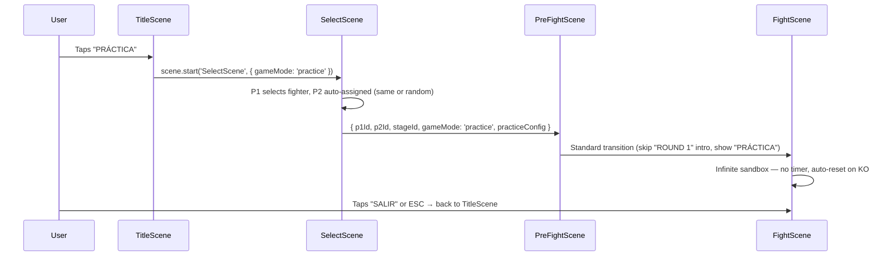

# RFC 0016: Practice Mode

**Status**: Proposed  
**Date**: 2026-04-12

## Problem

New players have no way to learn the game's mechanics — movement, attacks, combos, specials, blocking — without the pressure of a timed match against AI or another player. The only option today is "VS MAQUINA" which has a 60-second timer, rounds, and match-ending KOs. Players can't experiment freely, and losing feels punishing when you're still learning the controls.

Issues: #106, #45

## Solution

Add a **Practice Mode** accessible from the Title screen. The player selects a fighter and enters a sandbox fight with no timer, no rounds, and no match end. A dummy opponent stands still by default (optionally switchable to AI). When either fighter's HP reaches 0, both reset automatically. A training HUD shows inputs and combo count to help players learn.

## Design

### Game flow



### `gameMode: 'practice'`

A new mode alongside `'local'` and `'online'`. FightScene already branches on `gameMode` in ~10 places (`FightScene.js:91,144,153,158,225,241,251`), so the pattern is established. Practice mode reuses the local-mode code path (`_handleLocalUpdate`) with modifications.

### `practiceConfig` object

Passed through the scene chain alongside `gameMode`:

```js
{
  opponentMode: 'dummy',  // 'dummy' | 'ai'
  aiDifficulty: 'medium', // only used when opponentMode === 'ai'
  autoResetHP: true,       // reset both fighters when either reaches 0 HP
}
```

### Opponent behavior

| Mode | Behavior |
|---|---|
| **Dummy** (default) | P2 stands still. `AIController` is not created. P2 input is always `0` (no movement, no attacks, no blocking). Acts as a punching bag. |
| **AI** (optional) | Standard `AIController` with selectable difficulty (easy/medium/hard). Same behavior as "VS MAQUINA" but without match pressure. |

The player can toggle between dummy and AI from the pause menu during practice, without restarting.

### Timer and rounds

- **No timer**: `CombatSim.tickTimer()` is skipped in practice mode. The timer display shows `∞` or is hidden.
- **No rounds**: `ROUNDS_TO_WIN` is not checked. `roundNumber` stays at 1.
- **No match end**: `onMatchOver()` is never called. `VictoryScene` is never reached.

### Auto-reset on KO

When either fighter's HP reaches 0:

1. Both fighters reset to starting positions (`GAME_WIDTH * 0.3` and `GAME_WIDTH * 0.7`)
2. Both fighters reset to full HP (`MAX_HP`), full stamina (`MAX_STAMINA`), and zero special meter
3. A brief "K.O.!" flash displays (0.5s) then clears — no round-over UI, no score tracking
4. Fight continues immediately

Implementation: intercept the `roundEvent` in `_handleLocalUpdate()`. Instead of calling `onRoundOver()`/`onMatchOver()`, call a new `_practiceReset()` method.

### Manual reset

- **Keyboard**: R key resets both fighters to starting positions and full HP/stamina at any time
- **Touch**: On-screen "RESET" button in the training HUD area
- No confirmation dialog — instant reset for fast iteration

### Training HUD

Additional HUD elements displayed only in practice mode, below the standard HP/special bars:

#### Input display

Show the last 8 P1 inputs as a scrolling history on the left side of the screen. Each frame's input is decoded from the encoded integer and displayed as directional arrows + button abbreviations:

```
→ LP        (right + light punch)
→ HP        (right + heavy punch)
↑           (jump)
← ↓         (back + crouch/block)
SP          (special)
```

Uses monospace font at 8px, positioned at `(10, GAME_HEIGHT - 80)`. Scrolls upward as new inputs arrive.

#### Combo counter

When consecutive hits land without the opponent recovering to idle:

- Large number in the center-bottom: **"3 HITS"**
- Accumulates total damage: **"45 DMG"** below the hit count
- Resets when the opponent returns to idle state or after 60 frames (~1s) without a hit
- Uses the same yellow color (`#ffcc00`) as the leaderboard highlight

#### State indicator

Small text showing P2's current state (for learning frame data):

```
P2: idle | hurt (3f) | block | knockdown
```

Positioned at `(GAME_WIDTH - 10, GAME_HEIGHT - 20)`, right-aligned, monospace 8px.

### Scene layout (480×270)

```
┌──────────────────────────────────────────────────┐
│  [P1 HP BAR]        60/∞        [P2 HP BAR]      │  Standard HUD
│  [P1 SPECIAL]   P1name vs P2name  [P2 SPECIAL]   │
│                                                   │
│                                                   │
│     P1 Fighter              P2 Fighter (dummy)    │  Fight area
│                                                   │
│                    3 HITS                         │  Combo counter
│                    45 DMG                         │
│                                                   │
│  → LP          [RESET]          P2: idle          │  Training HUD
│  → HP                                             │  Input history
│  ↑                                                │
│  [SALIR]                                          │  (60, GAME_HEIGHT-20)
└──────────────────────────────────────────────────┘
```

### SelectScene changes

When `gameMode === 'practice'`:

- P1 selects their fighter normally
- P2 selection is skipped — auto-assigned to the same fighter (mirror match) or a random fighter. A toggle lets the player choose.
- Stage selection proceeds normally (or defaults to a random stage)
- No "waiting for P2" flow

### TitleScene button

TitleScene currently has 8 buttons after the leaderboard addition (RFC 0015). Adding a 9th button:

**Option A** — Shift `cy` further up and tighten `btnGap` slightly (from 22 to 20). Button 9 at `cy + 30 + 20*8 = y` needs to fit within 270px.

**Option B** — Replace "VS MAQUINA" with a submenu that offers "PELEA RÁPIDA" and "PRÁCTICA". This avoids adding more buttons.

**Option C** — Group INSPECTOR, MUSICA, LEADERBOARD into a "MÁS" submenu, freeing vertical space.

Recommended: **Option A** for simplicity. The `cy` shift from `-65` to `-75` and `btnGap` from 22 to 20 keeps all 9 buttons on screen. Touch targets at 20px gap are still usable on iPhone 15 (44pt minimum met at the scaled resolution).

### Pause menu additions

In practice mode, the pause menu (ESC / triple-tap) includes:

- **OPONENTE: DUMMY / IA** — toggle between dummy and AI opponent
- **DIFICULTAD: FÁCIL / MEDIA / DIFÍCIL** — AI difficulty (only shown when AI is active)
- **CONTINUAR** — resume practice
- **SALIR** — return to TitleScene

### Navigation

- `TitleScene` → "PRÁCTICA" button → `SelectScene` (practice mode)
- `SelectScene` → P1 picks fighter → `PreFightScene` → `FightScene` (practice mode)
- `FightScene` → "SALIR" button or ESC → `TitleScene`
- No `VictoryScene` reachable from practice mode

## File Plan

### New files

| File | Purpose |
|---|---|
| `docs/rfcs/0016-practice-mode.md` | This RFC |

### Modified files (implementation)

| File | Change |
|---|---|
| `src/scenes/TitleScene.js` | Add "PRÁCTICA" button, adjust layout (`cy`, `btnGap`) |
| `src/scenes/SelectScene.js` | Handle `gameMode: 'practice'` — skip P2 selection, auto-assign |
| `src/scenes/PreFightScene.js` | Show "PRÁCTICA" instead of "ROUND 1" when practice mode |
| `src/scenes/FightScene.js` | Handle `gameMode: 'practice'`: skip timer, auto-reset on KO, training HUD, reset key, dummy opponent, pause menu options |
| `src/systems/CombatSystem.js` | (Possibly) expose flag to skip `tickTimer()` — or handle in FightScene by not calling `tick()` timer path |
| `src/config.js` | (Optional) Add practice mode constants if needed |

### No backend changes

Practice mode is entirely client-side. No API endpoints, no database changes, no stats tracking.

## Implementation Plan

### Phase 1 — Core sandbox

- Add `gameMode: 'practice'` routing through TitleScene → SelectScene → PreFightScene → FightScene
- Skip P2 selection in SelectScene (auto-assign mirror or random)
- In FightScene: skip timer, use dummy opponent (P2 input = 0), skip `onRoundOver`/`onMatchOver`
- Add `_practiceReset()` method: reset both fighters on KO
- Add R key / RESET button for manual reset
- Add "SALIR" button to return to TitleScene

### Phase 2 — Training HUD

- Input display: decode last 8 P1 inputs, render as scrolling text
- Combo counter: track consecutive hits, display count + total damage
- P2 state indicator: show current state name + remaining frames

### Phase 3 — Pause menu options

- Add opponent toggle (dummy ↔ AI) in pause menu
- Add AI difficulty selector when AI is active
- Hot-swap opponent without restarting the scene

### Phase 4 — Polish

- PreFightScene shows "MODO PRÁCTICA" instead of "ROUND 1"
- Timer display shows "∞" instead of countdown
- Skip victory/defeat animations
- Ensure touch controls work correctly (RESET button placement doesn't conflict with action buttons)

## Reused Infrastructure

- `AIController` from `src/systems/AIController.js` — existing AI with difficulty levels
- `InputManager` + `TouchControls` from `src/systems/` — existing input handling
- `createButton()` from `src/services/UIService.js` — consistent button styling
- `encodeInput()` / `decodeInput()` from `src/systems/net/InputBuffer.js` — input encoding for display
- `tick()` / `simulateFrame()` from `src/simulation/` — reuse existing simulation loop
- `Fighter.reset()` — existing method for resetting fighter position and state
- `MatchStateMachine` from `src/systems/MatchStateMachine.js` — may need a `PRACTICE` state or bypass
- `_togglePause()` in FightScene — existing pause system to extend

## Alternatives Considered

1. **Separate PracticeScene instead of reusing FightScene**: Rejected. FightScene already has all the rendering, physics, input, and audio infrastructure. Duplicating it would create massive drift. Better to branch on `gameMode === 'practice'` within FightScene.

2. **Infinite HP instead of auto-reset**: Rejected. Players need to see KO animations and understand what kills them. Auto-reset preserves the feedback loop while removing the punishment (match end).

3. **Frame-by-frame advance (training mode staple in fighting games)**: Deferred for v2. Useful for frame data enthusiasts but adds significant complexity (step-through simulation, rewind). The simulation layer's `tick()` is designed for continuous execution, not single-frame stepping.

4. **Record/playback for P2 actions**: Deferred for v2. Would let the player record a sequence of attacks for P2, then practice defending against it. Requires input recording infrastructure (partially exists in `FightRecorder` but designed for debugging, not user-facing).

5. **Move list overlay**: Deferred for v2. Show all available moves and their inputs as an in-game reference. Currently moves are defined in `fighters.json` under each fighter's `moves` object but there's no UI to display them.

## Risks

- **TitleScene layout regression**: Adding a 9th button pushes the vertical layout further. Requires manual visual verification on 480×270 canvas and iPhone 15 Safari. If 9 buttons don't fit cleanly, fall back to Option B (submenu).
- **FightScene complexity**: FightScene is already ~2400 lines. Adding practice-mode branches increases complexity. Mitigate by keeping practice logic in clearly separated methods (`_practiceReset()`, `_createTrainingHUD()`, `_updateTrainingHUD()`).
- **Combo counter accuracy**: Defining "combo" requires tracking consecutive hits without the opponent recovering. This depends on fighter state transitions in `FighterSim` — need to verify that `idle` state detection is reliable for combo reset.
- **Touch target conflicts**: The RESET button and input display occupy screen space near the existing action buttons. Careful positioning needed to avoid accidental taps on iPhone.
- **Dummy opponent hit reactions**: When P2 is a dummy (input = 0), they never block. All attacks land. This is intentional for combo practice but may feel wrong if the player expects some resistance. The AI toggle in the pause menu addresses this.

## Related

- #106 — feat: modo practica
- #45 — Single Player Practice Mode (original detailed proposal)
- `src/scenes/FightScene.js` — Main fight logic (~2400 lines)
- `src/systems/AIController.js` — AI difficulty system
- `src/simulation/SimulationStep.js` — `simulateFrame()` and `tickTimer()` call chain
- `src/config.js` — `ROUND_TIME`, `ROUNDS_TO_WIN`, `MAX_HP`, `MAX_STAMINA`
