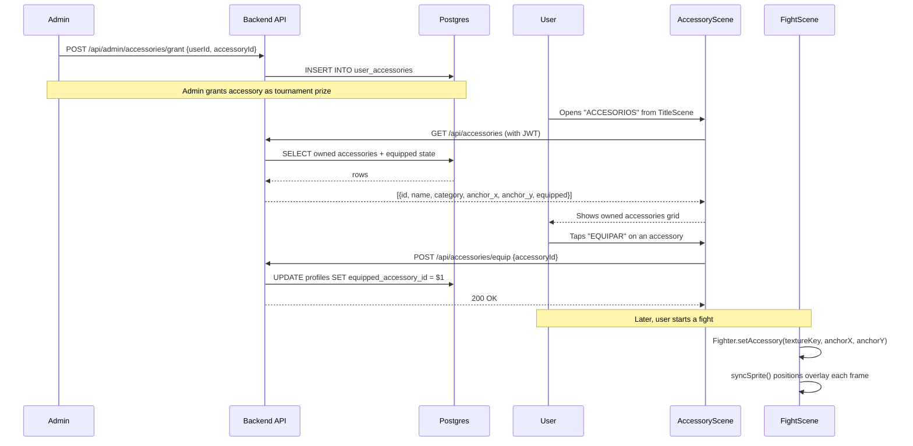

# RFC 0017: Character Accessories MVP

**Status**: Proposed
**Date**: 2026-04-13

## Problem

There's no way for players to visually distinguish themselves beyond fighter selection. Issue #103 proposes a full shop with coins, rewards, and rarity tiers, but that's too large for a first cut. We need the foundation: a system to attach optional cosmetic accessories to fighters, persist equipment state, and render them during fights — without a currency economy.

## Solution

Add cosmetic accessories as static overlay sprites on fighter sprites during fights. Accessories are stored in a DB catalog, granted to players by admins during special events (e.g., tournament prizes), and equipped via an in-game menu. One accessory at a time per player, applied globally (not per fighter).

This MVP delivers the visual reward loop without the economic complexity. A future phase (RFC TBD) adds coins, a shop, and progressive rewards on top of this foundation.

## Design

### Data flow



### Data model

Three DB changes via a single dbmate migration:

**`accessories` table** — catalog of available accessories:

```sql
CREATE TABLE accessories (
  id TEXT PRIMARY KEY,
  name TEXT NOT NULL,
  description TEXT NOT NULL,
  category TEXT NOT NULL,
  asset_key TEXT NOT NULL,
  anchor_x SMALLINT NOT NULL DEFAULT 0,
  anchor_y SMALLINT NOT NULL DEFAULT -100,
  created_at TIMESTAMPTZ NOT NULL DEFAULT now()
);
```

| Column | Description |
|---|---|
| `id` | Stable string ID, e.g. `'dildo_frontal'`, `'sombrero_catalina'` |
| `name` | Display name in Spanish |
| `description` | Short description in Spanish |
| `category` | Slot type: `'head'`, `'face'`, `'body'` — informational for MVP (one equipped at a time) |
| `asset_key` | Phaser texture key: `accessory_{id}` |
| `anchor_x` | Horizontal offset from fighter sprite center (pixels). 0 = centered |
| `anchor_y` | Vertical offset from fighter sprite origin (bottom). Negative = above feet. e.g. `-110` for head items |

**`user_accessories` table** — ownership, populated by admin grants:

```sql
CREATE TABLE user_accessories (
  user_id UUID NOT NULL REFERENCES profiles(id),
  accessory_id TEXT NOT NULL REFERENCES accessories(id),
  granted_at TIMESTAMPTZ NOT NULL DEFAULT now(),
  PRIMARY KEY (user_id, accessory_id)
);
```

**`profiles` extension** — equipped state:

```sql
ALTER TABLE profiles
  ADD COLUMN equipped_accessory_id TEXT REFERENCES accessories(id);
```

### Anchor point system

Each accessory has an `(anchor_x, anchor_y)` offset relative to the fighter sprite's origin point (center-bottom, since `sprite.setOrigin(0.5, 1)`).

For a **head** accessory on a 128x128 fighter sprite:
- `anchor_x = 0` — centered horizontally
- `anchor_y = -110` — near the top of the sprite (110px above feet)

The offset is applied in `syncSprite()`:

```
accessorySprite.x = sprite.x + (facingRight ? anchor_x : -anchor_x)
accessorySprite.y = sprite.y + anchor_y
accessorySprite.setFlipX(!facingRight)
```

The flip inverts `anchor_x` so asymmetric accessories (e.g., face items) stay on the correct side.

### Initial accessories

Three seed items matching the examples from issue #103:

| ID | Name | Category | anchor_y | Description |
|---|---|---|---|---|
| `dildo_frontal` | Dildo Frontal | head | -112 | Un dildo negro pegado en la frente. Máximo prestigio. |
| `sombrero_catalina` | Sombrero de Catalina | head | -120 | El icónico sombrero rosado de Cata. |
| `nariz_jessica` | Nariz Rota de Jessica | face | -95 | La nariz rota más famosa del grupo. |

Assets: 128x128 transparent PNGs in `public/assets/accessories/{id}.png`.

### API endpoints

All endpoints use `withAuth` from `api/_lib/handler.js`.

**`GET /api/accessories`** — user's owned accessories with equipped state:

```sql
SELECT
  a.id, a.name, a.description, a.category,
  a.asset_key, a.anchor_x, a.anchor_y,
  (a.id = p.equipped_accessory_id) AS equipped
FROM user_accessories ua
JOIN accessories a ON a.id = ua.accessory_id
JOIN profiles p ON p.id = ua.user_id
WHERE ua.user_id = $1
ORDER BY a.name;
```

Response: `[{ id, name, description, category, asset_key, anchor_x, anchor_y, equipped }]`

**`POST /api/accessories/equip`** — equip an owned accessory:

```js
// Validate ownership
const owns = await db.query(
  'SELECT 1 FROM user_accessories WHERE user_id = $1 AND accessory_id = $2',
  [userId, accessoryId]
);
if (owns.rows.length === 0) return res.status(403).json({ error: 'Not owned' });

await db.query(
  'UPDATE profiles SET equipped_accessory_id = $1 WHERE id = $2',
  [accessoryId, userId]
);
```

**`POST /api/accessories/unequip`** — remove equipped accessory:

```js
await db.query(
  'UPDATE profiles SET equipped_accessory_id = NULL WHERE id = $1',
  [userId]
);
```

**`POST /api/admin/accessories/grant`** — admin grants accessory to user (uses `withAdmin`):

```js
const { targetUserId, accessoryId } = req.body;
await db.query(
  `INSERT INTO user_accessories (user_id, accessory_id)
   VALUES ($1, $2)
   ON CONFLICT DO NOTHING`,
  [targetUserId, accessoryId]
);
```

**`GET /api/profile`** — extended to include `equipped_accessory_id`:

```sql
SELECT nickname, wins, losses, equipped_accessory_id FROM profiles WHERE id = $1
```

### Client API (`src/services/api.js`)

```js
export async function getAccessories() {
  return apiFetch('/accessories');
}

export async function equipAccessory(accessoryId) {
  return apiFetch('/accessories/equip', {
    method: 'POST',
    body: JSON.stringify({ accessoryId }),
  });
}

export async function unequipAccessory() {
  return apiFetch('/accessories/unequip', { method: 'POST' });
}
```

### Asset loading (`src/scenes/BootScene.js`)

Accessory textures are loaded alongside fighter sprites. For the MVP with 3 items, load all accessory images unconditionally (small payload):

```js
const ACCESSORY_IDS = ['dildo_frontal', 'sombrero_catalina', 'nariz_jessica'];

for (const id of ACCESSORY_IDS) {
  this.load.image(`accessory_${id}`, `assets/accessories/${id}.png`);
}
```

If the catalog grows beyond ~10 items, switch to loading only owned accessories (fetched from profile data in a prior scene).

### Fighter rendering (`src/entities/Fighter.js`)

New method and `syncSprite()` extension:

```js
setAccessory(textureKey, anchorX, anchorY) {
  if (this.accessorySprite) this.accessorySprite.destroy();
  if (!textureKey || !this.scene.textures.exists(textureKey)) return;

  this.accessorySprite = this.scene.add.sprite(this.sprite.x, this.sprite.y, textureKey);
  this.accessorySprite.setOrigin(0.5, 1);
  this.accessorySprite.setDepth(this.sprite.depth + 1);
  this._accessoryAnchorX = anchorX;
  this._accessoryAnchorY = anchorY;
}
```

In `syncSprite()`, after syncing the main sprite:

```js
if (this.accessorySprite) {
  const flipSign = this.sim.facingRight ? 1 : -1;
  this.accessorySprite.x = this.sprite.x + this._accessoryAnchorX * flipSign;
  this.accessorySprite.y = this.sprite.y + this._accessoryAnchorY;
  this.accessorySprite.setFlipX(!this.sim.facingRight);
  this.accessorySprite.setVisible(this.sim.state !== 'knockdown');
}
```

The accessory is hidden during knockdown for visual cleanliness. It's visible during all other states including hurt, blocking, and attacks.

### AccessoryScene (`src/scenes/AccessoryScene.js`)

New scene accessible from TitleScene via "ACCESORIOS" button.

```
┌──────────────────────────────────────────────────┐
│                  ACCESORIOS                       │  y=25
│  ─────────────────────────────────────────────   │  y=45
│                                                   │
│  ┌────┐  Dildo Frontal              [EQUIPAR]    │
│  │ img│  Un dildo negro pegado...                │
│  └────┘                                          │
│  ┌────┐  Sombrero de Catalina       [EQUIPAR]    │
│  │ img│  El icónico sombrero...                  │
│  └────┘                                          │
│  ┌────┐  Nariz Rota de Jessica   [DESEQUIPAR]    │
│  │ img│  La nariz rota más...     (equipped)     │
│  └────┘                                          │
│                                                   │
│  [ VOLVER ]                                       │  (60, GAME_HEIGHT - 20)
└──────────────────────────────────────────────────┘
```

- Fetches `GET /api/accessories` on `create()`
- Shows loading state ("Cargando...") while fetching
- Each row: accessory preview image (32x32), name, description, equip/unequip button
- Currently equipped item highlighted with yellow text and "DESEQUIPAR" button
- If user has no accessories: "No tenés accesorios todavía"
- Guest mode: "Iniciá sesión para ver tus accesorios"
- `VOLVER` button at `(60, GAME_HEIGHT - 20)`, fade transition to TitleScene

### Scene chain — accessory data flow

```
LoginScene
  └─ syncProfile() → game.registry.set('user', session.user)
  └─ getProfile() → stores equipped_accessory_id in registry

TitleScene
  └─ "ACCESORIOS" button → AccessoryScene

AccessoryScene
  └─ GET /api/accessories → browse owned items
  └─ POST equip/unequip → updates equipped_accessory_id in registry

SelectScene
  └─ Reads equipped_accessory_id from registry
  └─ Passes p1AccessoryId to PreFightScene

PreFightScene
  └─ Passes p1AccessoryId, p2AccessoryId to FightScene

FightScene.init(data)
  └─ this.p1AccessoryId = data.p1AccessoryId || null
  └─ this.p2AccessoryId = data.p2AccessoryId || null

FightScene.create()
  └─ Looks up accessory data (anchor points) from registry or fetched catalog
  └─ this.p1Fighter.setAccessory('accessory_dildo_frontal', 0, -112)
```

### Online mode

In online matches, accessory info needs to be exchanged between peers:

- The `ready` message in `LobbyScene` already sends `fighterId`. Extend it to include `accessoryId`.
- Each peer stores the opponent's `accessoryId` and applies it in FightScene.
- Spectators receive accessory info from P1's sync snapshots (same as fighter data).

This is a small extension to the existing signaling protocol — one new field in an existing message.

### TitleScene layout

TitleScene already has 8 buttons after the leaderboard addition (RFC 0015 shifted `cy` to `GAME_HEIGHT / 2 - 65 = 70`). Adding a 9th button requires another layout adjustment.

**Option A**: Reduce `btnGap` from 22 to 20. Button 9 lands at `y = 70 + 30 + 20 * 8 = 260` — within bounds with 10px bottom margin. Touch targets slightly tighter but still usable on iPhone 15.

**Option B**: Move "ACCESORIOS" into a sub-menu or attach it to SelectScene instead of TitleScene. This avoids the layout squeeze but hides the feature.

Recommend **Option A** for MVP — keep it visible, accept the tighter spacing.

## File plan

### New files

| File | Purpose |
|---|---|
| `db/migrations/20260413000000_create_accessories.sql` | accessories table, user_accessories table, profiles extension |
| `api/accessories.js` | GET (list owned), POST equip/unequip |
| `api/admin/accessories/grant.js` | Admin endpoint to grant accessories |
| `src/scenes/AccessoryScene.js` | Browse and equip accessories |
| `tests/api/accessories.test.js` | Unit tests for endpoints |
| `tests/api/accessories.integration.test.js` | PGLite integration tests for queries |

### Modified files

| File | Change |
|---|---|
| `api/profile.js` | Add `equipped_accessory_id` to GET SELECT |
| `src/services/api.js` | Add `getAccessories()`, `equipAccessory()`, `unequipAccessory()` |
| `src/scenes/BootScene.js` | Load accessory images |
| `src/entities/Fighter.js` | Add `setAccessory()`, extend `syncSprite()` |
| `src/scenes/FightScene.js` | Read accessory data from init, call `setAccessory()` on fighters |
| `src/scenes/TitleScene.js` | Add "ACCESORIOS" button, adjust `btnGap` |
| `src/scenes/SelectScene.js` | Pass `p1AccessoryId` to next scene |
| `src/scenes/PreFightScene.js` | Forward `p1AccessoryId`/`p2AccessoryId` to FightScene |
| `src/main.js` | Import and register AccessoryScene |

## Implementation plan

### Phase 1 — Database and API

1. Create migration with `accessories`, `user_accessories` tables and `profiles.equipped_accessory_id` column
2. Create `api/accessories.js` — GET list, POST equip, POST unequip
3. Create `api/admin/accessories/grant.js` — admin grant endpoint
4. Extend `api/profile.js` GET to return `equipped_accessory_id`
5. Add client functions to `src/services/api.js`
6. Write integration tests with PGLite (following `tests/api/leaderboard.integration.test.js` pattern)

### Phase 2 — Assets and loading

1. Create 3 initial accessory images (128x128 transparent PNGs) via asset pipeline or manual art
2. Place in `public/assets/accessories/{id}.png`
3. Seed the `accessories` table with the 3 initial items (SQL seed in migration or separate script)
4. Add accessory image loading to `BootScene`

### Phase 3 — Fighter rendering

1. Add `setAccessory(textureKey, anchorX, anchorY)` to `Fighter.js`
2. Extend `syncSprite()` to position/flip the accessory overlay
3. Test with hardcoded accessory in FightScene to verify rendering

### Phase 4 — AccessoryScene UI

1. Create `AccessoryScene` with browse/equip/unequip functionality
2. Add "ACCESORIOS" button to TitleScene, adjust `btnGap`
3. Register AccessoryScene in `main.js`

### Phase 5 — Scene chain wiring

1. Store equipped accessory data in `game.registry` on login
2. Pass `p1AccessoryId`/`p2AccessoryId` through SelectScene → PreFightScene → FightScene
3. FightScene reads accessory data and calls `setAccessory()` on fighters

### Phase 6 — Online mode

1. Extend `ready` message in LobbyScene to include `accessoryId`
2. Each peer applies opponent's accessory in FightScene
3. Spectator support via existing P1 sync snapshots

## Tests

Following the pattern of `tests/api/leaderboard.integration.test.js`:

| Test | Scenario |
|---|---|
| GET /api/accessories returns owned items | User with 2 granted accessories sees both |
| GET /api/accessories returns empty for new user | User with no grants gets `[]` |
| Equipped flag is correct | Equipped accessory has `equipped: true`, others `equipped: false` |
| Equip validates ownership | Can't equip an accessory you don't own → 403 |
| Equip updates profile | After equip, profile's `equipped_accessory_id` matches |
| Unequip clears profile | After unequip, `equipped_accessory_id` is null |
| Admin grant is idempotent | Granting same accessory twice doesn't error (ON CONFLICT DO NOTHING) |
| Admin grant requires admin | Non-admin user gets 403 |
| Profile GET includes equipped_accessory_id | Extended field appears in response |

No tests for AccessoryScene or Fighter rendering — those are Phaser-dependent and covered manually during dev. The DB logic is fully tested via the API layer.

## Reused infrastructure

- `withAuth()` from `api/_lib/handler.js` — JWT verification + DB client
- `withAdmin()` from `api/_lib/handler.js` — admin-only endpoints
- `createButton()` from `src/services/UIService.js` — consistent button styling
- `apiFetch()` from `src/services/api.js` — JWT attachment, error handling
- `GAME_WIDTH` / `GAME_HEIGHT` from `src/config.js`
- Fade + `transitioning` guard pattern from TitleScene
- `VOLVER` button placement pattern from MusicScene/LeaderboardScene
- PGLite integration test pattern from `tests/api/leaderboard.integration.test.js`
- `game.registry` for client-side state storage (same as user auth state)

## Alternatives considered

1. **All accessories unlocked by default**: Rejected. The user wants accessories to feel like earned rewards from special events. Universal access removes the prestige factor.

2. **Unlock by win count (e.g., 10 wins → first accessory)**: Rejected for MVP. Adds progression logic complexity. The admin-grant model is simpler and lets the dev team control distribution manually during early playtesting.

3. **Static JSON catalog instead of DB table**: Rejected. The user chose DB for flexibility — admins can add new accessories without code deploys, and the `user_accessories` join table needs a DB reference anyway.

4. **Full animation strips per accessory (13 animations × N frames)**: Rejected. Massive art effort for MVP. A single static overlay image per accessory is sufficient — it follows the fighter's position and flip, which reads well visually for head/face items. Animation strips can be added as a future enhancement for specific accessories that need it.

5. **Portrait-only rendering (no in-fight overlay)**: Rejected. The user specifically wants accessories visible during fights, which is the most impactful place visually. Portrait rendering can be added later as a low-effort follow-up.

6. **Per-fighter accessory equipment**: Rejected for MVP. Global per-user is simpler (one column on profiles). Per-fighter would require a junction table with `(user_id, fighter_id, accessory_id)` — overkill for 3 initial items.

## Risks

- **Anchor point tuning**: Each accessory needs manual `anchor_x`/`anchor_y` adjustment per the 128x128 sprite frame. Different fighters have slightly different head positions. For MVP, a single global anchor per accessory is acceptable since fighters share the same proportions. Per-fighter anchors can be added later if needed.

- **Sprite depth conflicts**: The accessory overlay must render above the fighter but below UI elements. Using `sprite.depth + 1` should work, but needs visual verification that accessories don't overlap with HUD bars or stage foreground elements.

- **Online desync risk**: Accessories are purely cosmetic — they don't affect simulation state at all. There is zero desync risk. The overlay is presentation-only, applied after `syncSprite()`.

- **TitleScene layout squeeze**: Adding a 9th button with `btnGap = 20` leaves only 10px of bottom margin on the 270px canvas. Needs manual visual check on iPhone 15 Safari to confirm buttons aren't clipped.

- **Asset pipeline gap**: There's no existing `accessory` type in the Gemini-based asset pipeline. Initial items will need manual art or a new pipeline type. Since there are only 3 items for MVP, manual creation is acceptable.
