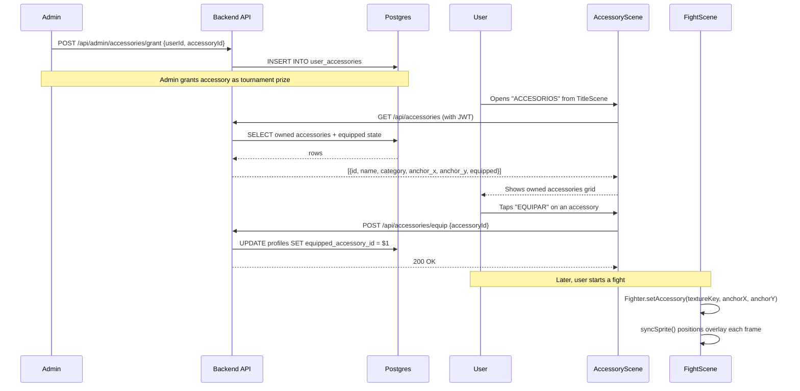

# RFC 0017: Character Accessories MVP

**Status**: Proposed
**Date**: 2026-04-13

## Problem

There's no way for players to visually distinguish themselves beyond fighter selection. Issue #103 proposes a full shop with coins, rewards, and rarity tiers, but that's too large for a first cut. We need the foundation: a system to attach optional cosmetic accessories to fighters, persist equipment state, and render them during fights — without a currency economy.

## Solution

Add cosmetic accessories as static overlay sprites on fighter sprites during fights. Accessories are stored in a DB catalog, granted to players by admins during special events (e.g., tournament prizes), and equipped via an in-game menu. One accessory at a time per player, applied globally (not per fighter).

This MVP delivers the visual reward loop without the economic complexity. A future phase (RFC TBD) adds coins, a shop, and progressive rewards on top of this foundation.

### Scope: hats only

The MVP ships with a **single category: `hat`**. Initial catalog is two items: `dildo_frontal` and `sombrero_catalina`. Face and body categories are deferred until the hat approach is validated visually (see Phase 1 POC below and the "Multi-category from day one" alternative).

The hardest unknown is visual fit: a fixed-anchor overlay sprite must look acceptable across 13 animations × 16 fighters. This RFC validates that with an in-Inspector POC **before** building DB schema, APIs, or the equip UI.

## Design

### Data flow



### Data model

Three DB changes via a single dbmate migration. Order matters — `accessories` must be created before `user_accessories` and the `profiles` FK reference it:

```sql
-- migrate:up
-- (1) catalog, (2) ownership, (3) profiles FK — in dependency order

-- migrate:down
ALTER TABLE profiles DROP COLUMN IF EXISTS equipped_accessory_id;
DROP TABLE IF EXISTS user_accessories;
DROP TABLE IF EXISTS accessories;
```

**`accessories` table** — catalog of available accessories:

```sql
CREATE TABLE accessories (
  id TEXT PRIMARY KEY,
  name TEXT NOT NULL,
  description TEXT NOT NULL,
  category TEXT NOT NULL CHECK (category IN ('hat')),
  anchor_x SMALLINT NOT NULL DEFAULT 0,
  anchor_y SMALLINT NOT NULL DEFAULT -100,
  created_at TIMESTAMPTZ NOT NULL DEFAULT now()
);
```

| Column | Description |
|---|---|
| `id` | Stable string ID, e.g. `'dildo_frontal'`, `'sombrero_catalina'` |
| `name` | Display name in Spanish |
| `description` | Short description in Spanish |
| `category` | Slot type: currently only `'hat'` for MVP. Enum is pre-scaffolded so future categories (face, body) require only a CHECK update, not a schema change. |
| `anchor_x` | Horizontal offset from fighter sprite center (pixels). 0 = centered |
| `anchor_y` | Vertical offset from fighter sprite origin (bottom). Negative = above feet. e.g. `-110` for head items |

The Phaser texture key is derived from the ID by convention: `accessory_{id}`. No separate column needed.

**`user_accessories` table** — ownership, populated by admin grants:

```sql
CREATE TABLE user_accessories (
  user_id UUID NOT NULL REFERENCES profiles(id),
  accessory_id TEXT NOT NULL REFERENCES accessories(id),
  granted_at TIMESTAMPTZ NOT NULL DEFAULT now(),
  PRIMARY KEY (user_id, accessory_id)
);
```

**`profiles` extension** — equipped state:

```sql
ALTER TABLE profiles
  ADD COLUMN equipped_accessory_id TEXT REFERENCES accessories(id);
```

### Anchor point system

Each accessory has an `(anchor_x, anchor_y)` offset relative to the fighter sprite's origin point (center-bottom, since `sprite.setOrigin(0.5, 1)`).

For a **head** accessory on a 128x128 fighter sprite:
- `anchor_x = 0` — centered horizontally
- `anchor_y = -110` — near the top of the sprite (110px above feet)

The offset is applied in `syncSprite()`:

```
accessorySprite.x = sprite.x + (facingRight ? anchor_x : -anchor_x)
accessorySprite.y = sprite.y + anchor_y
accessorySprite.setFlipX(!facingRight)
```

The flip inverts `anchor_x` so asymmetric accessories (e.g., face items) stay on the correct side.

### Initial accessories

Two seed items (hats only for MVP):

| ID | Name | Category | anchor_y | Description |
|---|---|---|---|---|
| `dildo_frontal` | Dildo Frontal | hat | -110 | Un dildo negro pegado en la frente. Máximo prestigio. |
| `sombrero_catalina` | Sombrero de Catalina | hat | -120 | El icónico sombrero rosado de Cata. |

`nariz_jessica` and other face/body items from issue #103 are deferred until hats are validated.

Assets: 128x128 transparent PNGs in `public/assets/accessories/{id}.png`.

### API endpoints

All endpoints use `withAuth` from `api/_lib/handler.js`.

**`GET /api/accessories`** — user's owned accessories with equipped state:

```sql
SELECT
  a.id, a.name, a.description, a.category,
  a.anchor_x, a.anchor_y,
  (a.id = p.equipped_accessory_id) AS equipped
FROM user_accessories ua
JOIN accessories a ON a.id = ua.accessory_id
JOIN profiles p ON p.id = ua.user_id
WHERE ua.user_id = $1
ORDER BY a.name;
```

Response: `[{ id, name, description, category, anchor_x, anchor_y, equipped }]`

**`POST /api/accessories/equip`** — equip an owned accessory:

Ownership validation and update in a single atomic query to avoid race conditions (e.g., admin revokes between check and update):

```js
const result = await db.query(
  `UPDATE profiles SET equipped_accessory_id = $1
   WHERE id = $2
   AND EXISTS (SELECT 1 FROM user_accessories WHERE user_id = $2 AND accessory_id = $1)`,
  [accessoryId, userId]
);
if (result.rowCount === 0) return res.status(403).json({ error: 'Not owned' });
```

**`POST /api/accessories/unequip`** — remove equipped accessory:

```js
await db.query(
  'UPDATE profiles SET equipped_accessory_id = NULL WHERE id = $1',
  [userId]
);
```

**`POST /api/admin/accessories/grant`** — admin grants accessory to user (uses `withAdmin`):

```js
const { targetUserId, accessoryId } = req.body;
await db.query(
  `INSERT INTO user_accessories (user_id, accessory_id)
   VALUES ($1, $2)
   ON CONFLICT DO NOTHING`,
  [targetUserId, accessoryId]
);
```

**`POST /api/admin/accessories/revoke`** — admin revokes accessory from user (uses `withAdmin`):

Removes ownership and clears equipped state in a single transaction:

```js
const { targetUserId, accessoryId } = req.body;
await db.query('BEGIN');
await db.query(
  'DELETE FROM user_accessories WHERE user_id = $1 AND accessory_id = $2',
  [targetUserId, accessoryId]
);
await db.query(
  'UPDATE profiles SET equipped_accessory_id = NULL WHERE id = $1 AND equipped_accessory_id = $2',
  [targetUserId, accessoryId]
);
await db.query('COMMIT');
```

**`GET /api/profile`** — extended to include equipped accessory with anchor data:

```sql
SELECT
  p.nickname, p.wins, p.losses, p.equipped_accessory_id,
  a.anchor_x AS accessory_anchor_x,
  a.anchor_y AS accessory_anchor_y
FROM profiles p
LEFT JOIN accessories a ON a.id = p.equipped_accessory_id
WHERE p.id = $1
```

The LEFT JOIN returns anchor data when an accessory is equipped, or NULLs when not. This avoids a second fetch — FightScene has everything it needs from the profile cached in `game.registry`.

### Client API (`src/services/api.js`)

```js
export async function getAccessories() {
  return apiFetch('/accessories');
}

export async function equipAccessory(accessoryId) {
  return apiFetch('/accessories/equip', {
    method: 'POST',
    body: JSON.stringify({ accessoryId }),
  });
}

export async function unequipAccessory() {
  return apiFetch('/accessories/unequip', { method: 'POST' });
}
```

### Asset loading (`src/scenes/BootScene.js`)

Accessory textures are loaded alongside fighter sprites. For the MVP with 2 items, load all accessory images unconditionally (small payload):

```js
const ACCESSORY_IDS = ['dildo_frontal', 'sombrero_catalina'];

for (const id of ACCESSORY_IDS) {
  this.load.image(`accessory_${id}`, `assets/accessories/${id}.png`);
}
```

The texture key convention is `accessory_{id}`, matching the asset path. If the catalog grows beyond ~10 items, switch to loading only owned accessories (fetched from profile data in a prior scene).

### Fighter rendering (`src/entities/Fighter.js`)

New method and `syncSprite()` extension:

```js
setAccessory(accessoryId, anchorX, anchorY) {
  if (this.accessorySprite) this.accessorySprite.destroy();
  const textureKey = `accessory_${accessoryId}`;
  if (!accessoryId || !this.scene.textures.exists(textureKey)) return;

  this.accessorySprite = this.scene.add.sprite(this.sprite.x, this.sprite.y, textureKey);
  this.accessorySprite.setOrigin(0.5, 1);
  this.accessorySprite.setDepth(this.sprite.depth + 1);
  this._accessoryAnchorX = anchorX;
  this._accessoryAnchorY = anchorY;
}
```

In `syncSprite()`, after syncing the main sprite:

```js
if (this.accessorySprite) {
  const flipSign = this.sim.facingRight ? 1 : -1;
  this.accessorySprite.x = this.sprite.x + this._accessoryAnchorX * flipSign;
  this.accessorySprite.y = this.sprite.y + this._accessoryAnchorY;
  this.accessorySprite.setFlipX(!this.sim.facingRight);
  this.accessorySprite.setVisible(this.sim.state !== 'knockdown');
}
```

The accessory is hidden during knockdown for visual cleanliness. It's visible during all other states including hurt, blocking, and attacks.

### AccessoryScene (`src/scenes/AccessoryScene.js`)

New scene accessible from TitleScene via "ACCESORIOS" button.

```
┌──────────────────────────────────────────────────┐
│                  ACCESORIOS                       │  y=25
│  ─────────────────────────────────────────────   │  y=45
│                                                   │
│  ┌────┐  Dildo Frontal              [EQUIPAR]    │
│  │ img│  Un dildo negro pegado...                │
│  └────┘                                          │
│  ┌────┐  Sombrero de Catalina       [EQUIPAR]    │
│  │ img│  El icónico sombrero...                  │
│  └────┘                                          │
│  ┌────┐  Nariz Rota de Jessica   [DESEQUIPAR]    │
│  │ img│  La nariz rota más...     (equipped)     │
│  └────┘                                          │
│                                                   │
│  [ VOLVER ]                                       │  (60, GAME_HEIGHT - 20)
└──────────────────────────────────────────────────┘
```

- Fetches `GET /api/accessories` on `create()`
- Shows loading state ("Cargando...") while fetching
- Each row: accessory preview image (32x32), name, description, equip/unequip button
- Currently equipped item highlighted with yellow text and "DESEQUIPAR" button
- If user has no accessories: "No tenés accesorios todavía"
- Guest mode: "Iniciá sesión para ver tus accesorios"
- `VOLVER` button at `(60, GAME_HEIGHT - 20)`, fade transition to TitleScene

### Scene chain — accessory data flow

Accessories are tied to user accounts. AI opponents never have accessories — `p2AccessoryId` is always `null` in local mode.

```
LoginScene
  └─ syncProfile() → game.registry.set('user', session.user)
  └─ getProfile() → stores equipped_accessory_id + anchor data in registry

TitleScene
  └─ "ACCESORIOS" button → AccessoryScene

AccessoryScene
  └─ GET /api/accessories → browse owned items
  └─ POST equip/unequip → updates equipped_accessory_id in registry

SelectScene
  └─ Reads equipped_accessory_id from registry for local player
  └─ Passes p1AccessoryId to StageSelectScene (p2AccessoryId = null in local mode)

StageSelectScene
  └─ Forwards p1AccessoryId, p2AccessoryId to PreFightScene

PreFightScene
  └─ Forwards p1AccessoryId, p2AccessoryId to FightScene

FightScene.init(data)
  └─ this.p1AccessoryId = data.p1AccessoryId || null
  └─ this.p2AccessoryId = data.p2AccessoryId || null

FightScene.create()
  └─ Reads anchor points from profile data cached in game.registry
  └─ this.p1Fighter.setAccessory('dildo_frontal', 0, -112)
  └─ P2 AI: no setAccessory() call (null accessory)
```

### All entry points to FightScene

Accessory IDs must be propagated through **every** path that starts FightScene, not just the normal flow:

| Entry point | File | Notes |
|---|---|---|
| Normal flow | `PreFightScene.js:318` | Standard path — add `p1AccessoryId`, `p2AccessoryId` |
| Tournament rematch | `VictoryScene.js:343` | Restarts FightScene for next round — must preserve accessory IDs |
| Tournament bracket | `BracketScene.js:189` → `PreFightScene` | Starts PreFightScene for each round — must pass accessory IDs |
| Spectator | `SpectatorLobbyScene.js:132` | Receives accessory info from server start message |

Each of these `scene.start()` calls must include accessory data in the payload. Missing any entry point means accessories silently disappear mid-tournament or for spectators.

### Online mode

In online matches, accessory info needs to be exchanged between peers. The changes touch the signaling protocol:

1. **`NetworkFacade.sendReady(fighterId)`** → extend to `sendReady(fighterId, accessoryId)`. The message becomes `{ type: 'ready', fighterId, accessoryId }`.
2. **PartyKit server** (`party/server.js`): The server relays `ready` messages between peers. No server-side changes needed — the new field passes through as-is since the server forwards the full message payload.
3. **SelectScene `onReady` handler**: Store the opponent's `accessoryId` alongside their `fighterId`. Pass both through the scene chain.
4. **`start` message from server**: Already includes both players' fighter IDs. Extend to include accessory IDs so spectators and late-joiners receive them.
5. **Spectators** (`SpectatorLobbyScene`): Read `p1AccessoryId`/`p2AccessoryId` from the `start` message and pass to FightScene.

This is a backward-compatible extension — old clients without accessory support ignore the new field, and `accessoryId: undefined` results in no overlay.

### TitleScene layout

TitleScene currently has 6 buttons (VS MAQUINA, MULTIJUGADOR, COMO JUGAR, INSPECTOR, MUSICA, LEADERBOARD) with `cy = GAME_HEIGHT / 2 - 65 = 70` and `btnGap = 22`. Button 6 (LEADERBOARD) sits at `y = 70 + 30 + 22 * 5 = 210`. Adding ACCESORIOS as button 7 at `btnGap * 6` lands at `y = 70 + 30 + 22 * 6 = 232` — well within the 270px canvas with 38px of bottom margin. No layout adjustment needed.

## File plan

### New files

| File | Purpose |
|---|---|
| `db/migrations/20260413000000_create_accessories.sql` | accessories table, user_accessories table, profiles extension |
| `api/accessories.js` | GET (list owned), POST equip/unequip |
| `api/admin/accessories/grant.js` | Admin endpoint to grant accessories |
| `api/admin/accessories/revoke.js` | Admin endpoint to revoke accessories |
| `src/scenes/AccessoryScene.js` | Browse and equip accessories |
| `tests/api/accessories.test.js` | Unit tests for endpoints |
| `tests/api/accessories.integration.test.js` | PGLite integration tests for queries |

### Modified files

| File | Change |
|---|---|
| `api/profile.js` | Add `equipped_accessory_id` to GET SELECT |
| `src/services/api.js` | Add `getAccessories()`, `equipAccessory()`, `unequipAccessory()` |
| `src/scenes/BootScene.js` | Load accessory images |
| `src/entities/Fighter.js` | Add `setAccessory()`, extend `syncSprite()` |
| `src/scenes/FightScene.js` | Read accessory data from init, call `setAccessory()` on fighters |
| `src/scenes/TitleScene.js` | Add "ACCESORIOS" button |
| `src/scenes/SelectScene.js` | Pass `p1AccessoryId` to StageSelectScene |
| `src/scenes/StageSelectScene.js` | Forward `p1AccessoryId`/`p2AccessoryId` to PreFightScene |
| `src/scenes/PreFightScene.js` | Forward accessory IDs to FightScene |
| `src/scenes/VictoryScene.js` | Preserve accessory IDs on rematch/next round |
| `src/scenes/BracketScene.js` | Pass accessory IDs when starting tournament rounds |
| `src/scenes/SpectatorLobbyScene.js` | Read accessory IDs from start message, pass to FightScene |
| `src/systems/net/NetworkFacade.js` | Extend `sendReady()` to include `accessoryId` |
| `src/main.js` | Import and register AccessoryScene |

## Implementation plan

Phases are ordered by **risk**, not by dependency graph. The tallest long pole is visual fit — whether a fixed-anchor overlay looks acceptable across 13 animations × 16 fighters. DB/API work is well-understood and retrofitted last.

### Phase 1 — Visual POC in Inspector (ships with this RFC)

Hardcoded accessory catalog, no DB, no API, no per-user state. Goal: let a dev browse every fighter × every animation with each hat overlaid and judge whether the design reads well.

1. Create placeholder `public/assets/accessories/dildo_frontal.png` and `sombrero_catalina.png` (128×128 transparent PNGs; final art deferred to asset pipeline).
2. Load both images in `BootScene`.
3. Extend `InspectorScene` with a cycle button — `ACCESORIO: <NAME>` — that toggles an overlay sprite on the preview, plus live-calibration keys (`I/K` head Y per fighter, `J/L` accessory X, `,/.` accessory Y, `U/O` scale, `P` prints JSON).
4. Manually verify visual fit across all fighters and animations.

**Exit criteria**: The overlay tracks the head region well enough for shipping. If it doesn't (e.g., head moves too much during `hurt`/`special`), we revisit the design — maybe per-animation anchors or per-frame motion data — before building any persistence.

#### Phase 1 findings (2026-04-14)

Phase 1 executed end-to-end with real art (pink RBD hat + forehead dildo) and full per-fighter calibration for 14/16 fighters. Result: **partial pass**.

- **Idle pose reads well** across all calibrated fighters. Per-fighter `headOffsetY` was needed (range -89 to -108, ~20px spread between fighters), confirming the RFC's hypothesis that a single global anchor was insufficient but that per-fighter anchors are tractable.
- **Moving animations drift badly.** During `walk` the fighter's head shifts horizontally inside the 128×128 frame while the overlay stays pinned — the accessory appears to float next to the head instead of on it. Same pattern in `hurt`, `special`, `knockdown`. Fighters with larger in-frame motion (e.g., Cata, Jeka) are worst affected.
- Root cause: Phaser only tracks the sprite's transform (fixed `x, y`), not the pixel position of the head *within* the animation frames. Per-frame head anchor data does not exist in the asset pipeline.

Implication: **static overlays are shippable for stationary contexts (idle, intros, portraits, victory) but not for active combat** without additional investment. This re-scopes Phase 2.

### Phase 2 — Static-context rendering (re-scoped)

Accessories render on fighter sprites **in stationary scenes only** — `SelectScene`, `PreFightScene`, `VictoryScene`, portraits. In-combat rendering (`FightScene`) is deferred to Phase 2.5 until the drift problem is solved.

1. Add `setAccessory(accessoryId, anchorX, anchorY, scale)` to `Fighter.js` (and equivalent for portraits).
2. Extend `syncSprite()` to position/flip the accessory overlay; pivot on `facingRight` like the RFC originally described.
3. Wire accessory rendering into the stationary scenes above.
4. **Do not** render accessories in `FightScene` yet — leave a feature-flag or clear TODO noting Phase 2.5 dependency.
5. Move the calibrated `FIGHTER_HEAD_OFFSETS` map out of `InspectorScene` into `src/data/fighters.json` as a `headOffsetY` field per fighter.

### Phase 2.5 — Moving-overlay strategy (decision gate, blocks FightScene integration)

Before accessories can ship in combat, the team must choose one of:

1. **Per-animation anchor offset**: coarse approximation; one `{x, y}` per animation name. Low effort (~1 day), improves average case but doesn't fix in-frame drift. Probably insufficient based on Phase 1 results.
2. **Per-frame anchor data**: `{ fighterId: { animName: [[x,y], ...] } }` table populated via Inspector calibration (`X`/`C` already cycle frames). High data-entry cost (~16 × 13 × ~14 ≈ 2880 anchor points), perfect visual result. Reuses the existing calibration UI.
3. **Accessory baked into sprites**: extend the Gemini asset pipeline with an `accessory_fighter` type that regenerates each fighter sheet with the accessory drawn in. Highest art authenticity, highest cost (~N × 16 regenerations + pipeline work per new accessory).

Recommended for shipping: **(2) per-frame anchors**, because the calibration tooling already exists and the data-entry cost is bounded and one-time per fighter (not per accessory — the anchor tracks the head, not the item).

This phase is a decision, not code — output is an amended RFC section and a concrete implementation plan for the chosen approach.

### Phase 3 — Scene chain wiring (hardcoded ownership)

1. Introduce a hardcoded ownership map keyed by `user.id` (temporary, replaced by DB in Phase 6).
2. Pass `p1AccessoryId`/`p2AccessoryId` through all scene transitions: SelectScene → StageSelectScene → PreFightScene → FightScene.
3. Ensure accessory IDs propagate through every FightScene entry point: `VictoryScene` (rematch), `BracketScene` (tournament rounds), `SpectatorLobbyScene`.
4. P2 AI never gets accessories.

### Phase 4 — AccessoryScene UI

1. Create `AccessoryScene` with browse/equip/unequip functionality, reading from the hardcoded ownership map.
2. Add "ACCESORIOS" button to TitleScene (fits as 7th button).
3. Register `AccessoryScene` in `main.js`.

### Phase 5 — Online mode

1. Extend `NetworkFacade.sendReady(fighterId)` to accept and send `accessoryId`.
2. `SelectScene` `onReady` handler stores opponent's `accessoryId`.
3. Extend server `start` message to include both players' accessory IDs.
4. `SpectatorLobbyScene` reads accessory IDs from `start` message and passes to FightScene.
5. Backward compatible — old clients ignore the new field.

### Phase 6 — Database and API

Replaces the hardcoded ownership map with real persistence.

1. Create migration with `accessories`, `user_accessories` tables and `profiles.equipped_accessory_id` column (in dependency order, with `migrate:down`).
2. Create `api/accessories.js` — GET list, POST equip (atomic single-query), POST unequip.
3. Create `api/admin/accessories/grant.js` — admin grant endpoint.
4. Create `api/admin/accessories/revoke.js` — admin revoke endpoint (transactional: delete ownership + clear equipped).
5. Extend `api/profile.js` GET to return `equipped_accessory_id` with anchor data (LEFT JOIN accessories).
6. Add client functions to `src/services/api.js`.
7. Replace hardcoded ownership map with API calls.
8. Write integration tests with PGLite (following `tests/api/leaderboard.integration.test.js` pattern).

## Tests

Following the pattern of `tests/api/leaderboard.integration.test.js`:

| Test | Scenario |
|---|---|
| GET /api/accessories returns owned items | User with 2 granted accessories sees both |
| GET /api/accessories returns empty for new user | User with no grants gets `[]` |
| Equipped flag is correct | Equipped accessory has `equipped: true`, others `equipped: false` |
| Equip validates ownership | Can't equip an accessory you don't own → 403 |
| Equip updates profile | After equip, profile's `equipped_accessory_id` matches |
| Unequip clears profile | After unequip, `equipped_accessory_id` is null |
| Admin grant is idempotent | Granting same accessory twice doesn't error (ON CONFLICT DO NOTHING) |
| Admin grant requires admin | Non-admin user gets 403 |
| Admin revoke removes ownership | After revoke, user no longer sees item in GET /api/accessories |
| Admin revoke clears equipped state | If revoked item was equipped, `equipped_accessory_id` becomes null |
| Admin revoke requires admin | Non-admin user gets 403 |
| Profile GET includes equipped accessory data | Response includes `equipped_accessory_id`, `accessory_anchor_x`, `accessory_anchor_y` |

No tests for AccessoryScene or Fighter rendering — those are Phaser-dependent and covered manually during dev. The DB logic is fully tested via the API layer.

## Reused infrastructure

- `withAuth()` from `api/_lib/handler.js` — JWT verification + DB client
- `withAdmin()` from `api/_lib/handler.js` — admin-only endpoints
- `createButton()` from `src/services/UIService.js` — consistent button styling
- `apiFetch()` from `src/services/api.js` — JWT attachment, error handling
- `GAME_WIDTH` / `GAME_HEIGHT` from `src/config.js`
- Fade + `transitioning` guard pattern from TitleScene
- `VOLVER` button placement pattern from MusicScene/LeaderboardScene
- PGLite integration test pattern from `tests/api/leaderboard.integration.test.js`
- `game.registry` for client-side state storage (same as user auth state)

## Alternatives considered

1. **All accessories unlocked by default**: Rejected. The user wants accessories to feel like earned rewards from special events. Universal access removes the prestige factor.

2. **Unlock by win count (e.g., 10 wins → first accessory)**: Rejected for MVP. Adds progression logic complexity. The admin-grant model is simpler and lets the dev team control distribution manually during early playtesting.

3. **Static JSON catalog instead of DB table**: Rejected. The user chose DB for flexibility — admins can add new accessories without code deploys, and the `user_accessories` join table needs a DB reference anyway.

4. **Full animation strips per accessory (13 animations × N frames)**: Rejected. Massive art effort for MVP. A single static overlay image per accessory is sufficient — it follows the fighter's position and flip, which reads well visually for head/face items. Animation strips can be added as a future enhancement for specific accessories that need it.

5. **Portrait-only rendering (no in-fight overlay)**: Rejected. The user specifically wants accessories visible during fights, which is the most impactful place visually. Portrait rendering can be added later as a low-effort follow-up.

6. **Per-fighter accessory equipment**: Rejected for MVP. Global per-user is simpler (one column on profiles). Per-fighter would require a junction table with `(user_id, fighter_id, accessory_id)` — overkill for 2 initial items.

7. **Multi-category from day one (head, face, body)**: Rejected. Face accessories (noses, glasses) need to track eye position, which shifts during `hurt`/`special` animations and would require per-animation anchors. Body accessories clip with attack poses. Hats are the easiest category to anchor reliably because the head stays mostly within a predictable vertical band across animations. Validating hats first de-risks the feature; more categories can be added once the anchor system proves out.

8. **POC with DB from day one**: Rejected. The feedback from the dev team was explicit: the visual validation is the hardest and riskiest unknown. Writing migrations, endpoints, tests, and an equip UI first wastes effort if the overlay approach turns out to look bad. The Phase 1 POC in Inspector costs ~1 file and validates the entire premise before any backend work.

## Risks

- **Anchor point tuning**: Each accessory needs manual `anchor_x`/`anchor_y` adjustment per the 128x128 sprite frame. Different fighters have slightly different head positions. For MVP, a single global anchor per accessory is acceptable since fighters share the same proportions. Per-fighter anchors can be added later if needed.

- **Sprite depth conflicts**: The accessory overlay must render above the fighter but below UI elements. Using `sprite.depth + 1` should work, but needs visual verification that accessories don't overlap with HUD bars or stage foreground elements.

- **Online desync risk**: Accessories are purely cosmetic — they don't affect simulation state at all. There is zero desync risk. The overlay is presentation-only, applied after `syncSprite()`.

- **Scene chain completeness**: Accessory IDs must propagate through 4 different entry points to FightScene (normal, rematch, tournament, spectator). Missing any one causes accessories to silently disappear. Each entry point must be verified during implementation.

- **Asset pipeline gap**: There's no existing `accessory` type in the Gemini-based asset pipeline. Initial items will need manual art or a new pipeline type. Since there are only 3 items for MVP, manual creation is acceptable.
