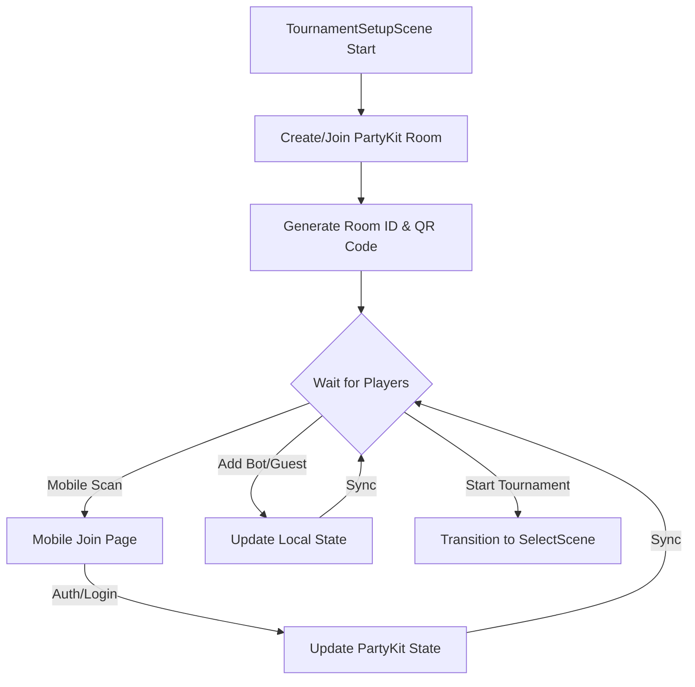
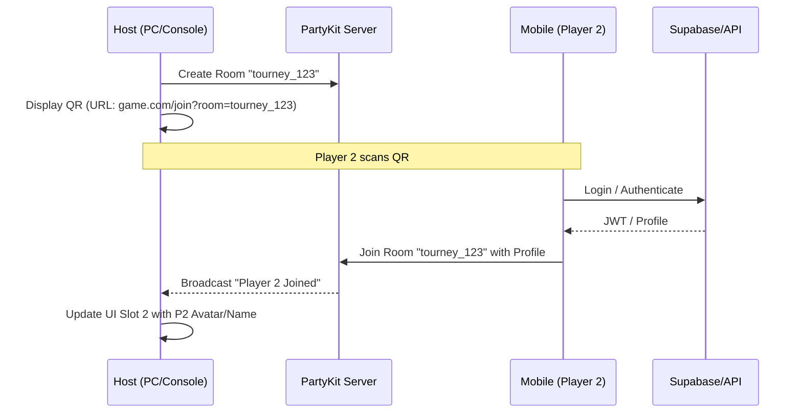
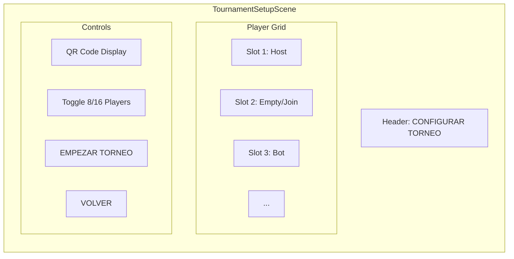

# RFC 0017: Redesigned Tournament Setup Lobby

**Status**: Proposed
**Date**: 2026-04-15

## Problem
The current `TournamentSetupScene` is a simple player count selector. It lacks the ability to identify specific players, handle multiple authenticated accounts in a local setting, or provide a "lobby" feel. Players want to see their names, stats, and avatars even in a local tournament, and they want an easy way for friends to join without passing the keyboard/controller around to type names.

## Proposed Solution
A "Lobby-style" `TournamentSetupScene` that acts as a central hub for tournament preparation.

### Key Features:
1.  **Host Persistence**: Player 1 (the person who started the tournament) is automatically assigned to Slot 1.
2.  **Dynamic Slots**: Support for 8 or 16 player brackets.
3.  **Multiple Join Methods**:
    *   **QR Code Login**: A QR code on screen allows friends to scan and log in via their mobile phones to join the tournament with their own accounts.
    *   **Guest Players**: Quick addition of "Guest" slots for players without accounts.
    *   **AI Bots**: Fill empty slots with configurable AI difficulty levels.
4.  **Real-time Sync**: Uses PartyKit to synchronize the lobby state between the main game and any mobile devices used for joining.

---

## Technical Design

### 1. Lobby State Management (PartyKit)
The tournament lobby will be managed by a PartyKit room. Even though the tournament is "local", the *setup* is hybrid-cloud to allow mobile joining.



### 2. QR Code Join Sequence
This flow allows a second player to use their own phone to "log in" to the host's local tournament.



### 3. UI Component Hierarchy
The scene will be composed of several interactive elements:



### 4. Slot States and Actions
Each slot in the grid can be in one of the following states:

| State | Visuals | Available Actions |
| :--- | :--- | :--- |
| **Empty** | Dashed border, "+" icon | Add Guest, Add Bot, (Wait for QR) |
| **Player** | Name, Avatar, "OK" status | Remove, Move Slot |
| **Guest** | "Invitado #N", Default icon | Remove, Convert to Bot, Rename |
| **Bot** | "Bot [Nivel]", AI icon | Remove, Change Level (1-5) |

---

## Data Model (PartyKit State)

```json
{
  "roomId": "tourney_123",
  "size": 8,
  "slots": [
    { "type": "human", "id": "uuid-p1", "name": "HostPlayer", "avatar": "url", "status": "ready" },
    { "type": "human", "id": "uuid-p2", "name": "Friend123", "avatar": "url", "status": "joining" },
    { "type": "guest", "name": "Invitado 1", "status": "ready" },
    { "type": "bot", "level": 3, "name": "RoboTraque", "status": "ready" },
    null,
    null,
    null,
    null
  ]
}
```

---

## Implementation Plan

### Phase 1: Infrastructure & Mobile Page
*   Create a simple mobile-friendly `/join` route in the existing web app.
*   Implement `api/tournament/create` and `api/tournament/join` endpoints if needed, or handle purely via PartyKit.
*   Update `party/server.js` to handle tournament lobby messages (JOIN_SLOT, ADD_BOT, etc.).

### Phase 2: TournamentSetupScene Redesign
*   Implement the grid-based UI in Phaser.
*   Add QR Code generation using a library like `qrcode`.
*   Connect the scene to the PartyKit room.

### Phase 3: Integration with SelectScene
*   Modify `SelectScene` to receive the full list of players/bots from the lobby.
*   Update the sequential selection flow to handle both human and bot assignments.

---

## Risks & Mitigations

| Risk | Mitigation |
| :--- | :--- |
| **Connectivity** | Provide a "Local Only" mode that disables QR/Mobile join if internet is down. |
| **Latency** | Lobby state changes are not time-critical; standard PartyKit latency is acceptable. |
| **Security** | Ensure only the Host can "Start" the tournament or remove other players. |
| **Screen Real Estate** | 16-player grid might be cramped; use a scrolling list or paged grid for smaller resolutions. |
