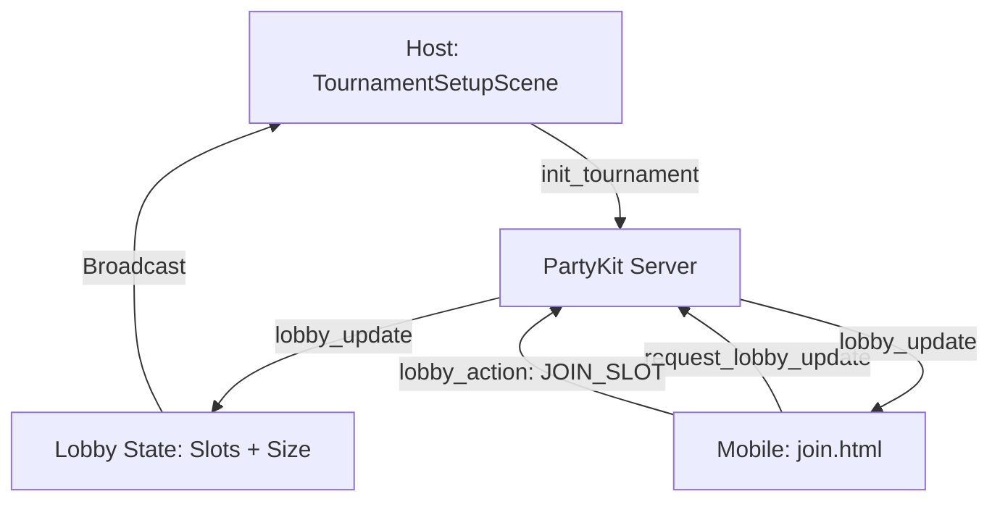
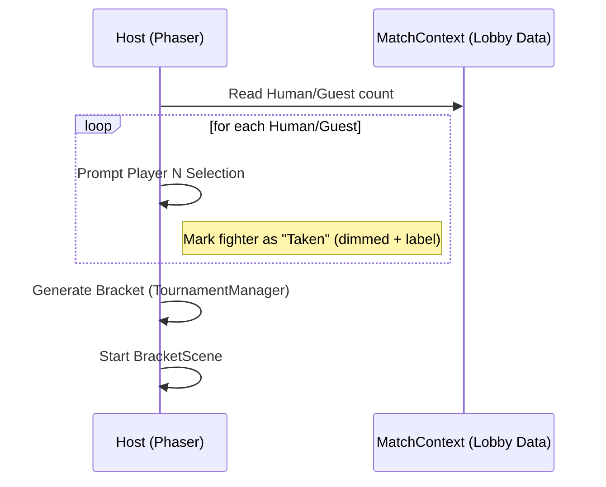

# RFC 0017: Redesigned Tournament Setup Lobby

**Status**: Implemented
**Date**: 2026-04-15

## Problem
The previous `TournamentSetupScene` was a simple player count selector that lacked the ability to identify specific players, handle multiple authenticated accounts in a local setting, or provide a "lobby" feel. Players wanted to see their names and avatars even in a local tournament, and required an easy way for friends to join without manual name entry on a shared device.

## Implemented Solution
A comprehensive "Lobby-style" `TournamentSetupScene` that acts as a central prepare-and-sync hub for local tournaments.

### Key Features:
1.  **Hybrid-Cloud Lobby**: Uses PartyKit to synchronize state between the main game (Host) and any mobile devices (Clients) scanning the on-screen QR code.
2.  **Flexible Slot Management**:
    *   Supports 8 or 16 player brackets.
    *   **Pagination**: The UI displays 8 slots at a time with navigation arrows to maintain clarity in 16-player modes.
3.  **Dynamic Join Methods**:
    *   **QR Code Join**: Points to a specialized `join.html` mobile page.
    *   **Account Support**: Mobile users can log in via Supabase to join with their global accounts (gaining XP/stats) or join as guests.
    *   **Guest/Bot Addition**: Host can instantly fill slots with guests or AI bots.
4.  **Advanced AI Difficulty**:
    *   Implemented a 5-level difficulty system (1: Very Easy to 5: Insane).
    *   The `AIController` maps these levels to specific intervals, miss rates, and tactical behaviors (blocking/punishing).
5.  **Dev Simulation**: A new console command `/dev:tournament:join [id]` for rapid testing without external devices.

---

## Technical Architecture

### 1. State Synchronization (PartyKit)
The server (`party/server.js`) was extended to handle a non-fighting `TOURNAMENT_LOBBY` state. 



**Key Improvements made during implementation:**
*   **Case Insensitivity**: Room IDs are forced to lowercase to ensure seamless joining regardless of input.
*   **State Requesting**: Clients can proactively request the latest lobby state upon connection to prevent sync hangs.
*   **Initialization Fallbacks**: The server allows `init_tournament` from multiple states to handle race conditions during host startup.

### 2. Character Selection Flow
The `SelectScene` was modified to handle sequential character picking for all human participants identified in the lobby.



### 3. AI Difficulty Mapping
The bot levels (1-5) selected in the lobby are preserved through the bracket and applied at the start of each match.

| Level | Mapping | Key Behaviors |
| :--- | :--- | :--- |
| 1-2 | Easy / Easy+ | No special moves, slow reactions, minimal/no blocking. |
| 3 | Medium | Balanced reactive play, standard blocking. |
| 4 | Hard | Faster reactions, active recovery punishing. |
| 5 | Insane | Frame-perfect blocking, high aggression, low miss rate. |

---

## Data Model

```json
{
  "roomId": "h8zo5ys",
  "size": 16,
  "slots": [
    { "type": "human", "id": "uuid-1", "name": "Host", "status": "ready" },
    { "type": "human", "id": "uuid-2", "name": "MobilePlayer", "status": "ready" },
    { "type": "bot", "level": 5, "name": "Bot Nivel 5", "status": "ready" },
    { "type": "guest", "name": "Invitado 1", "status": "ready" },
    null
  ]
}
```

---

## Testing Verification
*   **Local Simulation**: Verified via `dev:tournament:join` command.
*   **Multi-Account**: Verified using `npm run dev:mp` with test accounts `p1@test.local` and `p2@test.local`.
*   **Cross-Device**: Verified with mobile browser scanning the QR and syncing names back to the PC.
*   **Unit Tests**: 923 tests passing, including comprehensive coverage for TournamentManager progression, TournamentLobbyService synchronization, BaseSignalingClient lifecycle, and AIController difficulty mapping.
*   **Linting**: Biome check passed with zero errors.
