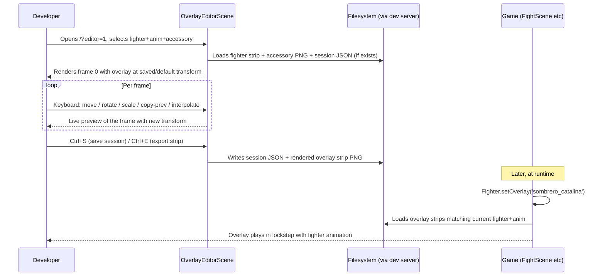

# RFC 0018: Sprite Overlay Editor

**Status**: Proposed
**Date**: 2026-04-14

## Problem

RFC 0017 Phase 1 validated that static accessory overlays read well on idle poses but drift badly during moving animations (`walk`, `hurt`, `special`, `knockdown`). The root cause is that Phaser only tracks the sprite's transform, not the pixel-level position of the head *within* each animation frame — data that the asset pipeline never produced.

Three paths were considered in RFC 0017 Phase 2.5:
1. Per-animation offset (coarse, doesn't fix in-frame drift)
2. Per-frame anchor data, baked into overlay strips (current keyboard calibration is too slow for that scale)
3. Baked-in sprites via Gemini (expensive, N×16 regenerations per accessory)

**This RFC commits to option 2** and, if approved, supersedes the Phase 2.5 decision gate in RFC 0017. Option 2 is the most pragmatic for the scale of the accessory catalog, **but the tooling has to exist before the calibration is feasible**. Typing `I`/`K`/`J`/`L` once per frame across the combat-relevant subset of animations (idle, walk, 4 attacks, hurt, knockdown, block, jump — ~40 frames/fighter average from `ANIM_DEFS`) is **3 × 16 × 40 = 1920 frames** for the current 3-accessory catalog — untenable without dedicated UX.

## Solution

A dev-only **Sprite Overlay Editor** scene that loads a fighter animation strip and an accessory image, lets a developer position and rotate the overlay per-frame with keyboard shortcuts, and exports both the baked overlay strip (consumed by the game) and a persistent session JSON (consumed by future re-edits).

Design principles:
- **Keyboard-only** for speed (no mouse hit-box tuning, copy/paste of transforms, frame navigation all at the home row)
- **Same repo, different scene**: reachable via `?editor=1` URL param, no separate build
- **Output is a sprite**, not anchor data: the game plays the overlay strip in lockstep with the fighter animation with zero runtime positioning logic
- **Resumable**: every session serializes to JSON so re-generating fighter sprites (or tweaking an existing overlay) doesn't require starting over

## Design

### High-level flow



### Data model

#### Session JSON (per `accessory × fighter × animation`)

```json
{
  "accessoryId": "sombrero_catalina",
  "fighterId": "cata",
  "animation": "walk",
  "frameCount": 4,
  "sourceStrip": "assets/fighters/cata/walk.png",
  "accessoryImage": "assets/accessories/sombrero_catalina.png",
  "frames": [
    { "x": 64, "y": 22, "rotation": 0,    "scale": 0.55 },
    { "x": 65, "y": 21, "rotation": -0.05, "scale": 0.55 },
    { "x": 66, "y": 23, "rotation": 0,    "scale": 0.55 },
    { "x": 65, "y": 22, "rotation": 0.03, "scale": 0.55 }
  ],
  "keyframes": [0, 3],
  "lastEditedAt": "2026-04-14T18:30:00Z"
}
```

- `x, y` — accessory center position in the 128×128 frame space (not screen space)
- `rotation` — radians, 0 = upright
- `scale` — uniform scale factor (width and height scaled identically)
- `keyframes` — indices of frames marked as keyframes; gaps interpolate linearly

#### Output overlay strip

Rendered PNG at the same dimensions as the source fighter strip (e.g., `128 × frameCount` pixels wide for horizontal strips) with:
- Transparent background
- Accessory composited at the session's per-frame transform
- Same frame count and frame order as the fighter strip

Naming: `public/assets/overlays/{fighterId}/{accessoryId}_{animation}.png`

Example: `public/assets/overlays/cata/sombrero_catalina_walk.png` (128×512 for a 4-frame walk).

Grouping by fighter (not by accessory) mirrors the existing `public/assets/fighters/{id}/{anim}.png` layout. This lets `BootScene` reuse a single traversal strategy and makes lazy-loading a fighter's full asset set (fighter + all equipped overlays) a single directory scan.

### Keyboard shortcuts

Home row centric. No mouse needed.

| Keys | Action |
|---|---|
| `←` / `→` | Prev / next frame |
| `↑` / `↓` | Prev / next animation |
| `W` / `S` | Prev / next fighter |
| `A` / `D` | Prev / next accessory |
| `H` / `J` / `K` / `L` | Translate overlay left/down/up/right by 1 px |
| `Shift` + `H/J/K/L` | Translate by 10 px |
| `Q` / `E` | Rotate overlay CCW / CW by 1° |
| `Shift` + `Q/E` | Rotate by 5° |
| `-` / `=` | Scale down / up by 0.02 |
| `Shift` + `-` / `=` | Scale by 0.1 |
| `C` | Copy transform from previous frame |
| `V` | Copy transform to next frame |
| `F` | Mark/unmark current frame as keyframe |
| `I` | Interpolate non-keyframe frames linearly between surrounding keyframes |
| `R` | Reset current frame transform to default (center, rotation 0, scale 0.5) |
| `Ctrl+Z` / `Ctrl+Y` | Undo / redo (session-scoped, not cross-session) |
| `Ctrl+S` | Save session JSON |
| `Ctrl+E` | Export overlay strip for current session |
| `Ctrl+Shift+E` | Batch export: all sessions with unsaved strip changes |
| `Tab` | Toggle onion-skin (previous frame shown at 30% alpha) |
| `G` | Toggle reference grid overlay on the canvas |
| `Space` | Play/pause animation preview at native speed |
| `Esc` | Return to TitleScene |

### Scene layout (480×270)

```
┌───────────────────────────────────────────────────┐
│ FIGHTER: cata  ANIM: walk  ACC: sombrero_catalina │  y=8   (context bar)
│ FRAME 2/4  [K] keyframe        x:65 y:22 r:0 s:.55│  y=20
│─────────────────────────────────────────────────  │  y=30
│                                                   │
│                  ┌─────────────┐                  │
│                  │             │                  │
│                  │  [fighter]  │                  │  y=50..178
│                  │   + overlay │                  │  (preview canvas
│                  │             │                  │   128×128 scaled 1x)
│                  └─────────────┘                  │
│                                                   │
│ ▸ ▸ ◆ ▸   (frame indicators: ▸ = normal, ◆ = keyframe)│  y=200
│                                                   │
│ H/J/K/L move  Q/E rotate  -/= scale               │  y=220
│ C/V copy  F keyframe  I interp  Ctrl+S save        │  y=240
└───────────────────────────────────────────────────┘
```

- Context bar (top): current fighter/anim/accessory + frame index + transform values
- Preview canvas (center): fighter frame composited with overlay using current transform, rendered at **3× zoom** (128×128 source → 384×384 on screen) so 1-pixel adjustments are visually distinguishable. Transform values displayed in context bar stay in native coords. Onion-skin and grid toggles both respect the zoom.
- Frame timeline (bottom-ish): colored dots, one per frame, highlighting the current frame and keyframes
- Shortcut help (bottom): always-visible cheat sheet for the most common keys

### Export pipeline

`Ctrl+E` renders the current session's overlay to a PNG using an off-screen `Phaser.Textures.CanvasTexture`:

```js
function exportOverlayStrip(session) {
  const { frameCount, frames, accessoryImage } = session;
  const canvas = document.createElement('canvas');
  canvas.width = FIGHTER_WIDTH * frameCount;
  canvas.height = FIGHTER_HEIGHT;
  const ctx = canvas.getContext('2d');
  const accImg = await loadImage(accessoryImage);
  for (let i = 0; i < frameCount; i++) {
    const t = frames[i];
    ctx.save();
    ctx.translate(i * FIGHTER_WIDTH + t.x, t.y);
    ctx.rotate(t.rotation);
    ctx.scale(t.scale, t.scale);
    ctx.drawImage(accImg, -accImg.width / 2, -accImg.height / 2);
    ctx.restore();
  }
  return canvas.toBlob((blob) => downloadBlob(blob, `${session.fighterId}_${session.animation}.png`));
}
```

Because the browser can only trigger downloads (not write to arbitrary filesystem paths), the editor also supports **a companion dev CLI** that accepts the exported blob via a `POST /dev/overlay-export` endpoint in Vite dev mode:

```js
// scripts/overlay-export-server.js — Vite plugin, dev-only
export function overlayExportPlugin() {
  return {
    name: 'overlay-export',
    configureServer(server) {
      server.middlewares.use('/dev/overlay-export', async (req, res) => {
        // Accepts { path, base64 }, writes to public/assets/overlays/...
      });
    },
  };
}
```

The editor prefers the dev endpoint when present and falls back to browser downloads otherwise. In CI or static hosting, the endpoint is absent and the editor is read-only.

### Batch export (`Ctrl+Shift+E`)

Scans `assets/overlay-editor/sessions/` for sessions whose `lastEditedAt` is newer than the output strip's file mtime (or whose strip is missing), exports them all in sequence, and reports a summary.

### Manifest and loading strategy

A single `public/assets/overlays/manifest.json` lists every calibrated combination:

```json
{
  "version": 1,
  "entries": [
    {
      "fighterId": "cata",
      "accessoryId": "sombrero_catalina",
      "animation": "walk",
      "frameCount": 4,
      "stripPath": "assets/overlays/cata/sombrero_catalina_walk.png",
      "exportedAt": "2026-04-14T18:30:00Z"
    }
  ]
}
```

- The editor **atomically rewrites** the manifest on each export: write to `manifest.json.tmp`, then rename. No partial states visible to other processes.
- Merge conflicts at commit time are human-resolved — JSON diffs are line-oriented, conflicts are rare because edits target different `(fighter, accessory, anim)` triples.
- `BootScene` loads only the manifest at boot (~KB), not the strips.
- Overlay strips load **lazily** per scene: `SelectScene`/`PreFightScene`/`FightScene` each load only the strips matching the current fighters and their equipped accessories (typically 2 fighters × 1 accessory × ~6 combat animations = 12 strips in memory). A `FightScene` teardown unloads them.
- Missing strip referenced by manifest: warn via `Logger.create('Overlays')`, skip silently (don't crash).
- Strip PNG present without manifest entry: ignored by `BootScene`. The editor's batch export reconciles the manifest on every run.

### Interpolation details

- **Translation and scale**: straight linear lerp between surrounding keyframes.
- **Rotation**: shortest-arc lerp. Delta is clamped to `[-π, π]` before applying the fraction, so a keyframe at `170°` followed by `-170°` interpolates through `180°` (20° of rotation), not backward through `0°` (340° of rotation).
- If only one keyframe exists, all non-keyframe frames copy its transform.
- If no keyframes exist, `I` is a no-op.

### Integration with `Fighter.js`

```js
// src/entities/Fighter.js — new method in Phase 2
setOverlay(accessoryId) {
  if (this.overlaySprite) this.overlaySprite.destroy();
  if (!accessoryId) return;
  const key = `overlay_${accessoryId}_${this.fighterId}`;
  // Animation key matches the fighter's animation key but with overlay prefix
  this.overlaySprite = this.scene.add.sprite(this.x, this.y, key);
  this.overlaySprite.setOrigin(this.originX, this.originY);
  // Play in lockstep with the fighter's current animation
  this.overlaySprite.play(`${key}_${this.currentAnim}`);
  this.sprite.on('animationstart', (anim) => {
    this.overlaySprite.play(`${key}_${anim.key.split('_').pop()}`);
  });
}

// syncSprite extension
syncSprite() {
  // ... existing position/flip logic
  if (this.overlaySprite) {
    this.overlaySprite.x = this.sprite.x;
    this.overlaySprite.y = this.sprite.y;
    this.overlaySprite.setFlipX(this.sprite.flipX);
    this.overlaySprite.depth = this.sprite.depth + 1;
  }
}
```

`BootScene` loads overlay strips using the same spritesheet loader as fighters, one animation key per `{accessory × fighter × anim}`. Missing overlays (uncalibrated combinations) simply don't render — no error.

### Where sessions live

- `assets/overlay-editor/sessions/{accessoryId}/{fighterId}_{animation}.json` — checked into repo (small, ~1 KB each)
- `public/assets/overlays/{fighterId}/{accessoryId}_{animation}.png` — checked into repo (larger, ~5–20 KB each)

Both are committed, because they serve different purposes: the **strips are runtime assets** (shipped to the browser via `public/`) and the **sessions are dev-only edit state** (source of truth for re-export after fighter sprite regeneration). Generating strips on CI from sessions was considered and rejected — it adds a build step that only benefits the ~12 MB repo-size saving, while making first-time dev setup and production hosting more brittle. Sessions are line-diffable JSON so PR review of calibration tweaks stays readable.

Pre-commit hook / CI check could verify session JSON matches strip PNG mtime (not in v1).

## File plan

### New files

| File | Purpose |
|---|---|
| `src/scenes/OverlayEditorScene.js` | The editor — keyboard handlers, canvas, timeline, preview |
| `src/editor/OverlaySession.js` | Session load/save/serialize + interpolation logic |
| `src/editor/OverlayExporter.js` | Canvas-based strip compositing |
| `scripts/overlay-export-server.js` | Vite dev plugin providing `POST /dev/overlay-export` |
| `tests/editor/overlay-session.test.js` | Unit tests for interpolation, serialization |
| `tests/editor/overlay-exporter.test.js` | Tests that exported canvas matches transform inputs |
| `assets/overlay-editor/sessions/.gitkeep` | Ensures the directory exists |
| `public/assets/overlays/.gitkeep` | Ensures the directory exists |

### Modified files

| File | Change |
|---|---|
| `src/main.js` | Conditional registration: `OverlayEditorScene` only if `?editor=1` present |
| `vite.config.js` | Register `overlayExportPlugin()` in dev-only mode |
| `src/scenes/BootScene.js` | Load overlay strips from `public/assets/overlays/` following a manifest, generate Phaser animations |
| `src/entities/Fighter.js` | Add `setOverlay()` + overlay sync in `syncSprite()` (Phase 2 of this RFC, not day one) |
| `CLAUDE.md` | Brief note in a new "Dev tools" section pointing to `?editor=1` |

## Implementation plan

Phases ordered by dependency. Phase 1 produces a working editor; Phase 2 wires outputs into the game.

### Phase 1 — Editor core (standalone, no game integration)

1. `OverlayEditorScene` scaffold: context bar, preview canvas, timeline, help text.
2. Fighter + accessory loading: dropdowns replaced with keyboard selection (`W/S` fighter, `↑/↓` anim, `A/D` accessory).
3. Per-frame transform state + keyboard handlers for translate / rotate / scale.
4. Onion-skin (previous frame at 30% alpha) and grid toggle.
5. Play/pause animation preview (`Space`).
6. Session load/save (`Ctrl+S`) via `POST /dev/overlay-export` or download fallback.
7. Strip export (`Ctrl+E`) via canvas compositing.
8. Batch export (`Ctrl+Shift+E`) — iterates sessions folder, exports all stale outputs.
9. Undo/redo stack (session-scoped, bounded to 50 entries).
10. Unit tests for `OverlaySession` interpolation and `OverlayExporter` compositing.

**Exit criteria**: a developer can open the editor, calibrate one `sombrero × cata × walk`, save the session, export the strip, and see the strip file appear on disk correctly composited.

### Phase 2 — Game integration

1. Extend `BootScene` to discover and load overlay strips using a manifest file (`public/assets/overlays/manifest.json`) that the editor maintains on each export.
2. Add `setOverlay(accessoryId)` to `Fighter.js`, wire into `syncSprite()`.
3. No separate feature flag: rendering is already gated by "user has an accessory equipped" (RFC 0017) and "overlay exists in manifest for this fighter × accessory × animation" (this RFC). A missing combination silently skips rendering. If an accessory is partially calibrated (e.g., only `idle` + `walk` done), only those animations show the overlay until more are exported.
4. Update the hardcoded accessory catalog in RFC 0017 to reference the new per-fighter overlay strips.
5. Manual QA of a single fighter × all accessories to validate lockstep playback.

### Phase 3 — Calibration sprint

Not code — a dedicated session (or multiple) where a developer runs through the 1152 calibrations. Tracked in a checklist. Productivity features from Phase 1 (copy/paste, interpolation, keyframes) should bring real time well below 1152 × (manual-seconds) thanks to interpolation.

### Phase 4 — Polish (optional)

- "Show reference" toggle: overlay the previous accessory's calibrated position on the canvas, for consistency when adding a new item.
- Export diff viewer: side-by-side of old and new output strips for review PRs.
- Bezier (instead of linear) interpolation between keyframes, if linear looks jerky.

## Tests

| Test | Scenario |
|---|---|
| Session serializes and deserializes roundtrip | In → JSON → out produces identical object |
| Linear interpolation fills gaps correctly | Two keyframes + one gap → middle frame is the midpoint |
| Interpolation with no keyframes is no-op | Empty `keyframes` array leaves frames unchanged |
| Interpolation with one keyframe sets all frames to that transform | Single keyframe broadcasts |
| Rotation interpolation uses shortest arc | Keyframes at `170°` → `-170°` produce intermediate frame at `180°` (or `-180°`), not `0°` |
| Rotation interpolation handles the ±π boundary correctly | Keyframes at `3.0` and `-3.0` rad interpolate through `π`, total arc < `0.3` rad |
| Exporter writes correct PNG dimensions | 4-frame strip → 512×128 canvas |
| Exporter applies translate / rotate / scale in the right order | Known transform → predictable pixel output |
| Export-server plugin writes files only under `public/assets/overlays/` | Reject paths with `..` or absolute paths |

No tests for `OverlayEditorScene` itself — it's a Phaser scene, covered manually during dev. The testable logic (session state machine, frame navigation, keyframe toggling, interpolation, undo stack) is **extracted into `OverlaySession.js`** as pure functions/classes following the `src/systems/combat-math.js` and `src/entities/combat-block.js` pattern, and unit-tested directly.

## Reused infrastructure

- Phaser scene lifecycle + keyboard handlers from existing scenes
- `Logger.create('OverlayEditor')` for debug logging (RFC 0005)
- Vite dev plugin API for the export endpoint
- PNG spritesheet loading pattern already used for fighter animations
- Animation frame-rate conventions from `ANIM_DEFS` in `BootScene.js`
- `CanvasTexture` / browser `<canvas>` for compositing (no new deps)

## Alternatives considered

1. **External tool (Aseprite, Photoshop, Piskel)**: rejected. Every round-trip between the game's asset layout and an external editor is manual filesystem juggling. Keeping the editor inside the repo means changes to fighter sprites, accessories, or animation frame counts flow through the same build without drift.

2. **CLI-only with numeric inputs (no visual editor)**: rejected. Aligning a 2° rotation by eye takes one second; by typing a number and re-rendering takes twenty. For 1152 frames this is the difference between a day of work and a week.

3. **Mouse-driven editor**: rejected per the direct decision for v1. Keyboard-only avoids hit-box design and keeps the developer's hands at the home row, which matters when the dominant loop is "tweak 1px, advance frame, repeat". Mouse may be added later as a polish item.

4. **Store transforms as anchor data and skip the strip export**: rejected — RFC 0017 Phase 2.5 evaluated this path; the conclusion was that baked strips eliminate per-frame positioning logic at runtime and make the game code trivial. The anchor table still exists as the session JSON, but it's for re-editing, not runtime.

5. **Generate strips via Gemini/image pipeline**: rejected — RFC 0017 Phase 2.5 option 3. Prohibitively expensive for adding new accessories; each new item requires N×16 regenerations.

6. **Bezier interpolation in v1**: deferred. Linear is dead simple and fast; if it looks jerky, Phase 4 adds curves.

7. **Standalone HTML page (outside Phaser)**: rejected. Reuses nothing from the existing loader, duplicates sprite-sheet parsing, and makes the same repo feel fragmented. Phaser's own loader is already optimized for the frame format we use.

## Risks

- **Dev data entry fatigue**: 1152 frames × even 20 seconds each is ~6 hours of focused work. Mitigation: interpolation between keyframes typically reduces manual frames by 50–70%, so realistic effort is 2–3 hours for the full catalog. Making the editor fun and efficient is itself a productivity feature.

- **Repo bloat from PNG overlays**: ~1152 output strips at ~10 KB each = ~11 MB of images checked in. Acceptable — the existing fighter sprite sheets already total more than that. Sessions JSON is negligible (~1 KB × 1152 = ~1 MB).

- **Drift when fighter sprites are regenerated**: if a fighter's animation frame count or silhouette changes, existing sessions become invalid for that fighter. Mitigation: sessions record the source strip path and a hash; editor shows a warning when they diverge. Re-editing is cheap because the tool exists.

- **Overlay strip rendering cost at runtime**: doubles sprite count on screen per fighter. For 2 fighters in `FightScene`, that's 2 extra sprites — negligible. Would become a concern at 4+ fighters, not on the roadmap.

- **Dev-endpoint attack surface**: `POST /dev/overlay-export` must only be active in dev mode and must reject path traversal. Mitigation: plugin is conditionally registered based on `command === 'serve'`, and path validation rejects anything containing `..` or not starting with `public/assets/overlays/`.

- **Undo scope**: per-session, but **persisted to the session JSON** so that closing and re-opening a session (or switching fighter/anim and returning) preserves the undo buffer. Bounded at 50 entries × ~100 bytes = 5 KB per session file. Global cross-session undo is out of scope for v1.

- **Browser canvas vs Phaser coordinate systems**: the exporter composites in raw canvas coordinates, while the Phaser preview uses Phaser's scene coordinates. Both must agree or the preview lies. Mitigation: a shared `transformToCanvas()` helper, unit-tested against known inputs, used by both the preview and the exporter.
