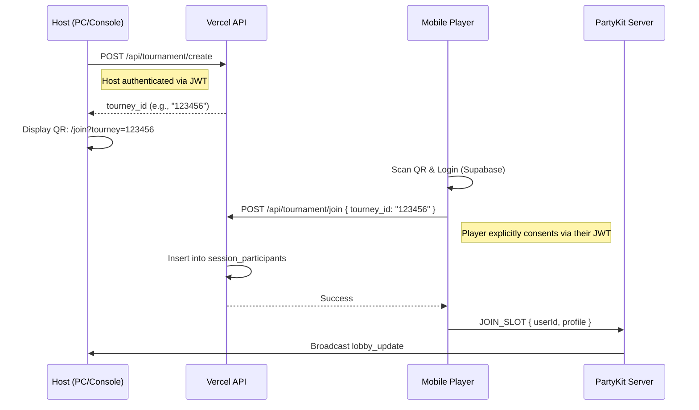
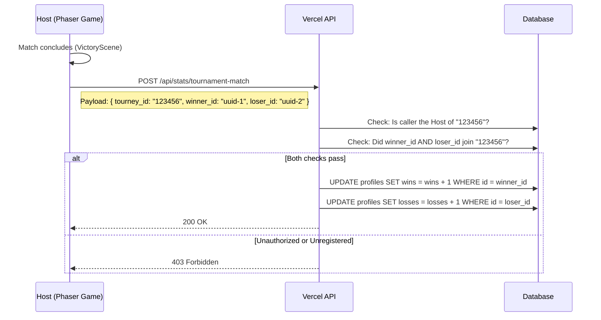
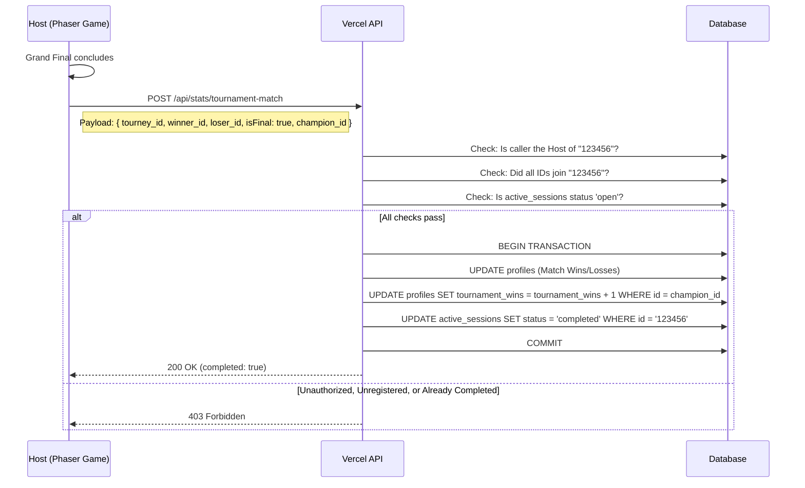

# RFC 0018: Tournament Participant Data Persistence

**Status**: Proposed
**Date**: 2026-04-18

## 1. Objective
Currently, local tournaments allow players to join using their credentials via the PartyKit lobby, but only the Host's wins and losses are tracked. This RFC proposes a secure "Session Handshake" system to safely persist match outcomes (wins/losses) for *all* authenticated participants in a local tournament, without exposing player credentials or tokens to the Host. Additionally, it introduces tracking of overall "Tournament Victories" to add prestige to players' profiles.

## 2. Background
RFC 0017 introduced the Tournament Lobby where mobile clients can scan a QR code and join the Host's session. However, the backend currently lacks a mechanism to verify that these mobile users explicitly consented to participate in the Host's tournament. This prevents the Host from safely recording the match results for those users. 

## 3. The "Session Handshake" Architecture

The system relies on a lightweight, temporary session validation model. The Vercel API acts as the source of truth for explicit player consent.

### 3.1. Database Schema Additions
A temporary lightweight structure is added to manage active tournament sessions, and a new prestige metric is added to player profiles.

- **`profiles` (Existing Table Update)**
  - `tournament_wins` (INTEGER, Default: 0)

- **`active_sessions` (or `tournaments`)**
  - `id` (TEXT or UUID, PK) - The unique tournament code (e.g. 6-digits or UUID).
  - `host_user_id` (UUID, FK -> profiles.id)
  - `created_at` (TIMESTAMPTZ)
  - `status` (TEXT: 'open', 'completed')

- **`session_participants`**
  - `session_id` (TEXT, FK -> active_sessions.id)
  - `user_id` (UUID, FK -> profiles.id)
  - `joined_at` (TIMESTAMPTZ)
  - `PRIMARY KEY (session_id, user_id)`

### 3.2. Flow 1: Creation and Join Handshake
Mobile clients interact directly with the secure Vercel API to provide consent, completely bypassing the Host for sensitive authentication.

### 3.3. Flow 2: Match Result Reporting
Because the Host is the machine running the physics and rules, only the Host is trusted to report individual match outcomes.

### 3.4. Flow 3: Atomic Crowning
When the Grand Final concludes, the Host makes a final match report that includes an `isFinal` flag and the `champion_id`. The API processes the final match results and the overall tournament victory in a single atomic database transaction. This prevents a race condition where a tournament might be locked before the final match stats are recorded.

## 4. Security & Benefits
1. **Zero Token Passing:** Mobile devices never share their passwords or JWTs with the Host or PartyKit. They only talk directly to the secure Vercel API.
2. **No Cheating:** A player cannot grant themselves a win, because only the designated Host of the session is allowed to report the result to the API.
3. **Explicit Consent:** A malicious Host cannot arbitrarily add losses to a random player's UUID, because the API strictly requires that player to have explicitly "joined" that specific tournament session via their own device first.
4. **Double-Count Prevention:** The `isFinal` flag in the `/api/stats/tournament-match` endpoint locks the tournament state permanently, preventing a Host from spamming API calls to artificially inflate a friend's `tournament_wins`.
5. **Clean Integration:** This seamlessly layers on top of the existing `TournamentLobbyService` and `TournamentManager` logic without modifying the core PartyKit room state machine.

## 5. Implementation Plan

1. **Database:**
   - Create migrations for `active_sessions` and `session_participants`.
   - Update `profiles` table to add the `tournament_wins` column.
2. **Vercel API Endpoints:**
   - Implement `POST /api/tournament/create`
   - Implement `POST /api/tournament/join`
   - Implement `POST /api/stats/tournament-match` (including `isFinal` logic)
3. **Host Client (`TournamentLobbyService.js`):**
   - On `initHost`, call `/api/tournament/create` and append `tourney_id` to the QR code and PartyKit room state.
4. **Mobile Client (`public/join.html`):**
   - Extract `tourney_id` from the URL parameters.
   - Upon successful login and profile sync, call `/api/tournament/join`.
5. **Game Loop (`TournamentManager.js` & `VictoryScene.js`):**
   - Ensure the original `userId`s (from lobby participants) are preserved in the bracket data.
   - Update `VictoryScene._saveResult()` to call `/api/stats/tournament-match` when `matchContext.type === 'tournament'`, passing the `tourney_id`, `winner_id`, and `loser_id`.
   - If the match is the Grand Final, include `isFinal: true` and `champion_id` in the same call to atomicly record the final match and crown the champion.
