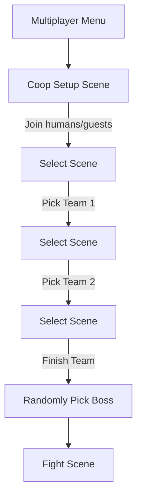
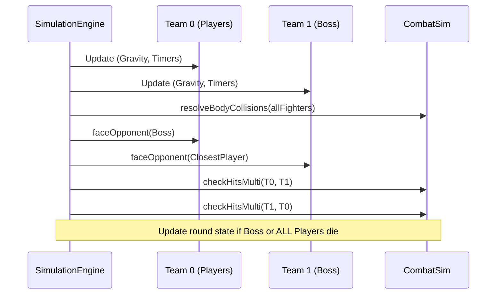

# RFC 0019: Local Collaborative Boss Mode (Collab vs Machine)

**Status**: Proposed  
**Date**: 2026-04-22

## Problem

The game currently focuses exclusively on 1v1 PvP combat (both local and online). There is no cooperative mode where friends can team up against a common threat. This limits the replayability for casual groups and doesn't utilize the engine's potential for asymmetric gameplay.

## Solution

Introduce a new **"COOPERATIVO LOCAL"** game mode. Multiple local players (logged in via account or guests) team up simultaneously in a single fight against a single, powerful AI-controlled "Boss" character.

## Design Decisions

| Decision | Choice | Rationale |
| :--- | :--- | :--- |
| **Player Count** | 1 to 4 local players | Allows for 2v1, 3v1, or 4v1 chaos |
| **Boss Character** | Randomly selected from roster | Reuses existing assets; every character can be a "Boss" |
| **Boss Power** | Stat Modifiers (HP, Damage, Speed) | HP scales with player count (e.g., 1.5x * P); slower but heavier hits |
| **Combat Style** | Simultaneous N vs 1 | More collaborative and chaotic than sequential (gauntlet) turns |
| **Team Killing** | Disabled for the player team | Prevents accidental (or intentional) frustration in coop |
| **Victory Condition** | Boss HP = 0 | Simple and direct |
| **Defeat Condition** | All players' HP = 0 | Requires at least one player to survive to continue |

## 1. Setup & Lobby (`CoopSetupScene`)

A new scene modeled after `TournamentSetupScene` will allow local players to join the "Team" via QR codes (accounts) or as guests.

- **Slot Management**: Up to 4 slots for team members.
- **Role Assignment**: All joined participants are assigned to Team 0 (Players).
- **Match Context**: Transitions to `SelectScene` with `type: 'coop_boss'`.

## 3. Selection Mode (`SelectScene`)

When in `coop_boss` mode, the character selection flow changes:
- Humans pick characters one by one for the team.
- Once all team members have picked, a **Boss** is randomly assigned from the remaining characters.
- The Boss is assigned to Team 1.

### Setup & Selection Flow

## 4. Engine Generalization (N vs 1)

The fight engine must be updated to support more than two active fighters.

### `src/simulation/FighterSim.js` & `Fighter.js`
- Add a `team` property (0 = Players, 1 = Boss).
- Add a `modifiers` object: `{ hp, damage, speed, attackSpeed }`.
- Modifiers are applied to base stats and move frame data (e.g., higher startup for "heavy" Boss feel).

### `src/simulation/CombatSim.js`
- **Hit Detection**: Update `checkHit` or add `checkHitsMulti` to iterate through team arrays.
- **Body Collisions**: Implement N-way body collision resolution (preventing players from overlapping).

### `src/simulation/SimulationEngine.js`
- Refactor `tick()` to `tickCoop()` or generalize `tick()` to accept arrays of fighters for each side.
- **Facing Logic**: Players always face the Boss. The Boss faces the *closest* player.

### Generalized Tick Logic

## 5. Boss AI (`AIController.js`)

The AI must be multi-target aware:
- Instead of a single `opponent` reference, it evaluates all members of Team 0.
- Prioritizes targets based on distance, HP, or "aggro" (last player to hit it).

## 5. User Interface (HUD)

The `FightScene` HUD needs to accommodate multiple health bars:
- **Boss Bar**: Centered at the top, much larger and more prominent.
- **Team Bars**: Smaller health/special/stamina bars for each player, potentially arranged at the bottom or corners.

## Implementation Plan

1. **Phase 1: Lobby & Setup**
   - Implement `CoopSetupScene`.
   - Update `MultiplayerMenuScene` to include the "COOPERATIVO LOCAL" entry.

2. **Phase 2: Simulation Core**
   - Update `FighterSim` to support team IDs and stat modifiers.
   - Update `CombatSim` to handle multi-fighter hit registration and collision.

3. **Phase 3: FightScene Refactor**
   - Generalize `p1Fighter` / `p2Fighter` logic into team arrays.
   - Implement the Boss-centric HUD.

4. **Phase 4: AI & Balancing**
   - Update `AIController` for multi-target targeting.
   - Fine-tune HP and damage multipliers for the Boss based on the number of players.
