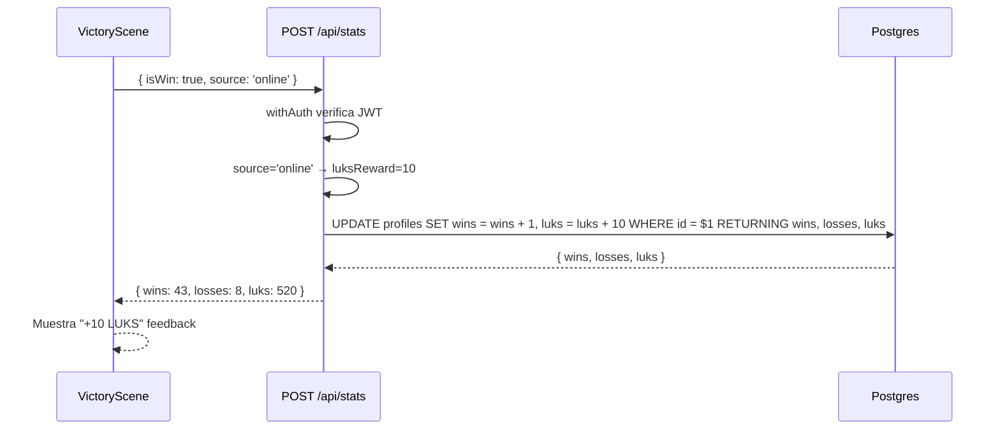
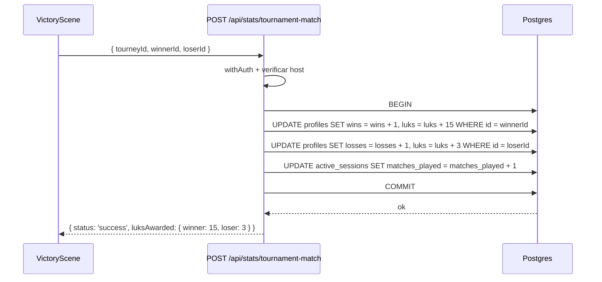

# RFC 0019: Economía de Luks

**Status**: Proposed  
**Date**: 2026-04-20

## Problem

A Los Traques no tiene un sistema de progresión más allá de contadores de victorias/derrotas y el leaderboard. Los jugadores pelean, ganan, y no hay nada tangible que ganar o en qué gastar. No hay incentivo para seguir jugando aparte del ranking. Una moneda interna daría una razón concreta para competir: ganar tokens para desbloquear accesorios visuales, taunts, o elementos cosméticos para sus fighters.

## Solution

Introducir **Luks**, una moneda virtual interna que los jugadores ganan por victorias en peleas y torneos. Los Luks se persisten en la base de datos y se muestran en el HUD del jugador. En una fase posterior, se introduce una tienda donde gastar Luks en accesorios cosméticos.

### Principios de diseño

1. **Todos los modos recompensan**: Las peleas locales (vs AI, VS Local) otorgan Luks a un monto reducido. Las peleas online y torneos otorgan montos mayores. Esto incentiva jugar online sin castigar al jugador casual que solo quiere pelear contra la IA.
2. **Server-authoritative**: El backend calcula y otorga los Luks atómicamente junto con la actualización de stats. El cliente envía el `gameMode` pero nunca el monto — el servidor decide cuánto dar según el source.
3. **Cosméticos puros**: Los Luks solo compran elementos visuales. Nunca stats, ventajas competitivas, ni fighters. Zero pay-to-win.
4. **Economía simple**: Cantidades fijas por evento, sin multiplicadores ni inflación. Fácil de entender y balancear.

## Design

### Tabla de recompensas

| Evento | Luks ganados | Dónde se otorga |
|---|---|---|
| Victoria en pelea local (vs AI / VS Local) | 3 | `POST /api/stats` (`source: 'local'`) |
| Derrota en pelea local | 1 | `POST /api/stats` (`source: 'local'`) |
| Victoria en pelea online | 10 | `POST /api/stats` (`source: 'online'`) |
| Derrota en pelea online | 2 | `POST /api/stats` (`source: 'online'`) |
| Victoria en match de torneo online | 15 | `POST /api/stats/tournament-match` |
| Derrota en match de torneo online | 3 | `POST /api/stats/tournament-match` |
| Victoria en match de torneo local | 3 | `POST /api/stats` (`source: 'local'`) — solo usuario autenticado |
| Derrota en match de torneo local | 1 | `POST /api/stats` (`source: 'local'`) — solo usuario autenticado |
| Campeón de torneo online | 50 (bonus) | `POST /api/stats/tournament-match` (isFinal) |

**Justificación de montos**:
- **Local vs Online (3:10)**: Una victoria local da 3 Luks, una online da 10. Ratio ~3:1 — necesitarías ~3.3 peleas locales para igualar una online. Esto recompensa jugar contra la IA sin trivializar el valor de las peleas online.
- **Por qué recompensar local**: El juego nació como experiencia entre amigos. Muchos jugadores solo juegan vs AI. Darles una progresión (aunque menor) incentiva seguir jugando y les da una razón para eventualmente probar online por mejores rewards.
- Una pelea online ganada = 10 Luks. Un torneo completo ganado (3 victorias + bonus campeón) = 45 + 50 = 95 Luks.
- Ganar un torneo vale ~10 peleas online sueltas o ~32 peleas locales, incentivando el modo competitivo.
- La derrota da un pequeño reward (1-3) para que nadie sienta que perdió el tiempo, pero la diferencia de ganar vs perder hace que ganar importe.

**Torneos locales**: En un torneo local con split keyboard, solo el usuario autenticado (el que hizo login) recibe Luks. Los demás jugadores humanos en split keyboard no están autenticados y no reciben Luks ni stats. El usuario autenticado recibe montos de pelea local (3/1) via el fallback a `updateStats` — los mismos montos que una pelea vs AI.
- Los montos son deliberadamente bajos para poder escalar precios de tienda después sin inflación.

**Nota sobre anti-abuse en local**: Las peleas locales son client-authoritative — el cliente reporta si ganó o perdió, y no hay servidor validando el resultado. Un jugador podría teóricamente modificar el cliente para reportar victorias falsas. Esto es un riesgo aceptado porque: (a) los montos locales son bajos (3 Luks), (b) los Luks solo compran cosméticos, (c) el juego es entre amigos y no hay incentivo real para hacer trampa, (d) el endpoint `POST /api/stats` ya confía en el cliente para wins/losses en modo local — los Luks simplemente acompañan esa misma llamada.

**Nota sobre source spoofing (online vs local)**: El cliente envía `source: 'online'` o `source: 'local'` y el backend confía en ese valor. Un cliente modificado podría enviar `source: 'online'` en peleas locales para obtener 10 Luks en vez de 3. Para mitigar esto sin necesidad de validar el source en el servidor, se implementa un **daily cap** de Luks en el backend: máximo **200 Luks por período de 24 horas** por usuario. El cap se verifica en el UPDATE atómico usando `LEAST`:

```sql
UPDATE profiles
SET luks = LEAST(luks + $2, luks_last_reset_luks + 200),
    ...
```

Alternativamente, un approach más simple: un counter `luks_earned_today` que se resetea diariamente. Si `luks_earned_today + reward > 200`, el reward se trunca al remanente. Esto previene inflación automatizada sin afectar al jugador normal — 200 Luks diarios equivalen a 20 victorias online o ~67 victorias locales, más de lo que un humano jugaría en un día.

El cap se implementa en `api/_lib/luks.js` como constante `LUKS_DAILY_CAP = 200` para mantener la centralización.

### Data flow — Pelea (local u online)



Para una pelea local (vs AI), el cliente envía `{ isWin: true, source: 'local' }` y el backend otorga 3 Luks en vez de 10. El flujo es idéntico.

### Data flow — Torneo online (match intermedio)



### Data flow — Torneo online (final)

Igual que el intermedio, pero adicionalmente:
- El campeón recibe el bonus de 50 Luks (`luks = luks + 65` total: 15 match win + 50 champion bonus).
- La respuesta incluye `championLuksBonus: 50`.

### Doble-conteo en torneos online (non-host)

En el flujo actual de `VictoryScene._saveResult()`, el **Host** (slot 0) reporta el resultado via `reportTournamentMatch()`, que actualiza stats y Luks de **ambos** jugadores atómicamente en el backend. Si la llamada tiene éxito, hace `return` y no cae al fallback de `updateStats()`.

El **non-host** (slot 1) también tiene `tourneyId` en su matchContext (sincronizado via PartyKit en `TournamentLobbyService._handleMessageInternal`). Entra al bloque de `reportTournamentMatch`, pero el backend responde 403 (solo el `host_user_id` puede reportar). El non-host cae al `catch`, y sin un guard, llegaría al fallback de `updateStats(didWin)` — haciendo un **segundo write de stats + Luks** para sí mismo. Esto es doble-conteo.

**Solución**: Después del bloque de `reportTournamentMatch`, el non-host no debe caer al fallback. El discriminador es `networkManager.isHost` (derivado de `playerSlot === 0`, pero semánticamente más claro y robusto ante futuros modos como espectadores o lobbies de 4 jugadores). El guard se coloca después del bloque de `reportTournamentMatch`:

```js
// VictoryScene._saveResult() — después del bloque de reportTournamentMatch
// Non-host en torneo online: el host ya reportó nuestro resultado.
// No hacer fallback a updateStats para evitar doble-conteo.
if (this.gameMode === 'online' && !this.networkManager?.isHost) {
  return; // Non-host: stats ya actualizados por el host via reportTournamentMatch
}
```

**Nota**: Si `networkManager` no expone `isHost` actualmente, se agrega como getter: `get isHost() { return this.playerSlot === 0; }`. Esto centraliza la lógica de autoridad en un solo lugar y evita comparaciones directas contra `playerSlot` dispersas por el código.

Flujos resultantes:
- **Host, report exitoso**: ya hizo `return` en el bloque anterior. Nunca llega al guard.
- **Host, report falla**: cae al catch, llega al guard, pero `isHost === true` → no entra al `if` → sigue al fallback de `updateStats`. Correcto: el host salva sus stats personales como fallback.
- **Non-host**: cae al catch (403), llega al guard, `isHost === false` → entra al `if` → retorna sin doble-conteo. Correcto.
- **Torneo local**: `gameMode === 'local'` → no entra al `if` → sigue al fallback. Correcto: el usuario autenticado salva sus stats.

### No-retroactividad

Los jugadores existentes arrancan con 0 Luks independientemente de su historial de victorias. Esto es una decisión deliberada:

- Calcular Luks retroactivos requeriría asignar montos a peleas pasadas que no distinguían entre online/local ni entre torneo/versus — el schema de `fights` no registra `gameMode`.
- Arrancando de cero, la economía es predecible y justa para todos desde el día uno.
- Si algún jugador pregunta "por qué tengo 0 si ya gané 40 peleas", la respuesta es: los Luks se ganan a partir de hoy.

### Schema changes

#### Nueva migración: `add_luks_to_profiles`

```sql
-- migrate:up
ALTER TABLE profiles ADD COLUMN luks INTEGER NOT NULL DEFAULT 0;

-- migrate:down
ALTER TABLE profiles DROP COLUMN IF EXISTS luks;
```

Sin índice — no hay queries que filtren u ordenen por `luks` en v1. Si la tienda necesita filtrar por balance, se agrega después.

### Backend changes

#### Constantes centralizadas: `api/_lib/luks.js`

Todos los montos de Luks viven en un solo archivo para tener un único source of truth. Si mañana se ajustan los montos, se toca un solo lugar:

```js
// api/_lib/luks.js
export const LUKS_LOCAL_WIN = 3;
export const LUKS_LOCAL_LOSS = 1;
export const LUKS_ONLINE_WIN = 10;
export const LUKS_ONLINE_LOSS = 2;
export const LUKS_TOURNAMENT_WIN = 15;
export const LUKS_TOURNAMENT_LOSS = 3;
export const LUKS_CHAMPION_BONUS = 50;

/** Resolve luks reward from source + isWin. Unknown sources default to local (lowest). */
export function getLuksReward(source, isWin) {
  if (source === 'online') return isWin ? LUKS_ONLINE_WIN : LUKS_ONLINE_LOSS;
  // Any value other than 'online' (including undefined, null, or unknown strings)
  // defaults to local amounts — the lowest tier. Safe fallback.
  return isWin ? LUKS_LOCAL_WIN : LUKS_LOCAL_LOSS;
}
```

#### `api/stats.js`

El endpoint acepta un nuevo campo `source` en el body (`'online'` o `'local'`). El UPDATE atómico incluye luks:

```js
import { getLuksReward } from './_lib/luks.js';

const { isWin, source } = req.body;
const luksReward = getLuksReward(source, isWin);
const col = isWin ? 'wins' : 'losses';

const query = `
  UPDATE profiles 
  SET ${col} = ${col} + 1, luks = luks + $2, updated_at = now() 
  WHERE id = $1 
  RETURNING wins, losses, luks;
`;

const result = await db.query(query, [userId, luksReward]);

return res.status(200).json({ ...result.rows[0], luksAwarded: luksReward });
```

Si `source` no se envía (backwards compatibility con clientes viejos), `getLuksReward` defaultea a montos locales — el monto más bajo. Esto es seguro: un cliente viejo que no manda `source` recibe el mínimo, nunca más de lo que merece.

La respuesta incluye tanto `luks` (balance total) como `luksAwarded` (monto otorgado en esta operación). El cliente usa `luksAwarded` para el feedback visual sin calcular deltas — consistente con el patrón de `tournament-match.js`. Backwards-compatible porque el cliente actual ignora campos extras.

#### `api/stats/tournament-match.js`

Dentro de la transacción existente, los UPDATEs de winner/loser incluyen luks:

```js
import { LUKS_TOURNAMENT_WIN, LUKS_TOURNAMENT_LOSS, LUKS_CHAMPION_BONUS } from '../_lib/luks.js';

// Winner
if (hasWinnerHandshake) {
  await db.query(
    'UPDATE profiles SET wins = wins + 1, luks = luks + $2, updated_at = now() WHERE id = $1',
    [winnerId, LUKS_TOURNAMENT_WIN]
  );
}

// Loser
if (hasLoserHandshake) {
  await db.query(
    'UPDATE profiles SET losses = losses + 1, luks = luks + $2, updated_at = now() WHERE id = $1',
    [loserId, LUKS_TOURNAMENT_LOSS]
  );
}

// Champion bonus (on isFinal)
if (isFinal && hasChampionHandshake) {
  await db.query(
    'UPDATE profiles SET tournament_wins = tournament_wins + 1, luks = luks + $2, updated_at = now() WHERE id = $1',
    [championId, LUKS_CHAMPION_BONUS]
  );
}
```

La respuesta incluye `luksAwarded`:

```json
{
  "status": "success",
  "updated": { "winner": true, "loser": true },
  "luksAwarded": { "winner": 15, "loser": 3 },
  "completed": false,
  "prestigeAwarded": false
}
```

#### `api/profile.js`

El GET actual usa columnas explícitas (`SELECT id, nickname, wins, losses, tournament_wins`). Hay que agregar `luks` en **ambos** paths:

**GET** (línea 9 actual):
```js
const result = await db.query(
  'SELECT id, nickname, wins, losses, tournament_wins, luks FROM profiles WHERE id = $1',
  [userId]
);
```

**POST** — el path de upsert (línea 37 actual) usa `SELECT *`, que devolverá `luks` automáticamente. No requiere cambio, pero documentamos que funciona por cobertura implícita.

#### `api/leaderboard.js`

Sin cambios en v1. El leaderboard sigue rankeando por wins. Se podría agregar una columna de Luks al display como follow-up.

### Client changes

#### Global state

`window.game.registry.get('user')` incluirá `luks`:
```js
{ id, nickname, wins, losses, tournament_wins, luks }
```

Se actualiza en `LoginScene` (al hacer `getProfile()`) y en `VictoryScene` (al recibir respuesta de stats).

#### `VictoryScene.js` — Feedback visual

El método `_showResultFeedback` actual renderiza siempre en `y=45`. Llamarlo dos veces (una para stats, otra para Luks) superpondría los textos. Se agrega un parámetro `y` opcional:

```js
_showResultFeedback(text, color, y = 45) {
  const feedback = this.add
    .text(GAME_WIDTH / 2, y, text, {
      fontFamily: 'Arial',
      fontSize: '9px',
      color: color,
    })
    .setOrigin(0.5)
    .setAlpha(0);
  // ... tween igual que antes
}
```

La llamada a `updateStats` pasa el `gameMode` como `source`:

```js
const data = await updateStats(didWin, this.gameMode);  // 'local' o 'online'
```

Y en `src/services/api.js`, `updateStats` incluye el source y usa `keepalive: true` para garantizar que el request se complete incluso si el jugador cierra la pestaña o navega fuera inmediatamente después del match:

```js
export async function updateStats(isWin = true, source = 'local') {
  return apiFetch('/stats', {
    method: 'POST',
    keepalive: true,
    body: JSON.stringify({ isWin, source }),
  });
}
```

Después de recibir la respuesta:

```js
// Feedback de stats (posición original)
this._showResultFeedback(
  didWin ? '+1 VICTORIA' : '+1 DERROTA',
  didWin ? '#44cc88' : '#ff4444',
);

// Feedback de Luks (debajo, con offset)
// El backend devuelve luksAwarded directamente — sin calcular deltas
this._showResultFeedback(`+${data.luksAwarded} LUKS`, '#FFD700', 56);

// Actualizar state global
user.luks = data.luks;
```

El backend devuelve `luksAwarded` (monto otorgado) y `luks` (balance total). El cliente usa `luksAwarded` para el feedback y `luks` para actualizar el state global. Sin cálculos de delta, sin riesgo de desincronización.

Para torneos (path de `reportTournamentMatch`), el feedback usa los montos de torneo y el host actualiza su state a partir de `luksAwarded`:

```js
this._showResultFeedback('RESULTADO REGISTRADO', '#44cc88');
const myLuks = amIWinner ? resp.luksAwarded.winner : resp.luksAwarded.loser;
this._showResultFeedback(`+${myLuks} LUKS`, '#FFD700', 56);
```

#### `TitleScene.js` — Balance display

Mostrar el balance de Luks del jugador en la esquina superior derecha del TitleScene:

```
LUKS: 520
```

Texto pequeño (fontSize 10), color dorado (`#FFD700`), alineado a la derecha con `setOrigin(1, 0)` y posición `(GAME_WIDTH - 8, 12)`. El `setOrigin(1, 0)` ancla el texto por su borde derecho, garantizando que no se corte independientemente del largo del número. Se verificará contra el aspect ratio de iPhone 15 landscape (target del juego) y se validará que no superponga el version string existente. Solo visible si el usuario está autenticado (`user.luks !== undefined`).

Se usa texto plano `LUKS:` en vez de emoji porque Phaser renderiza en canvas 2D, donde los emojis son inconsistentes entre plataformas (especialmente iOS Safari vs Chrome desktop). Se evita deliberadamente el símbolo `$` para no crear confusión con microtransacciones de dinero real — la moneda siempre se muestra como `LUKS` o `LK` en la UI. Si se quiere un icono visual, se puede agregar un sprite de moneda dedicado como follow-up.

### Endpoints de tienda (Phase 2 — fuera de scope de esta RFC)

La tienda es una feature separada que merece su propia RFC. Pero el modelo de datos se diseña para soportarla:

- `shop_items` table: catálogo de items con precio en Luks
- `player_items` table: items comprados por cada jugador
- `POST /api/shop/buy` endpoint con deducción atómica
- Items cosméticos: accesorios (sombreros, lentes, cadenas), taunts, victory poses

Los accesorios visuales usarían el sistema de poses (RFC de pose estimation, `poses.json`) para posicionarse sobre los fighters en runtime — por ejemplo, un sombrero en el keypoint `head`, unos lentes en `nose`, etc.

## File Plan

### New files

| File | Purpose |
|---|---|
| `db/migrations/YYYYMMDD000000_add_luks_to_profiles.sql` | Agrega columna `luks` a `profiles` (con `migrate:down`) |
| `api/_lib/luks.js` | Constantes centralizadas de montos de Luks + daily cap |

### Modified files

| File | Change |
|---|---|
| `api/stats.js` | Importar `getLuksReward` de `luks.js`, leer `source` del body, incluir `luks` en el UPDATE atómico y RETURNING |
| `api/stats/tournament-match.js` | Importar constantes de `luks.js`, incluir `luks` en los UPDATEs de winner/loser/champion |
| `api/profile.js` | Agregar `luks` a la lista de columnas en el SELECT del GET (línea 9) |
| `src/services/api.js` | Agregar parámetro `source` a `updateStats()`, incluirlo en el body del POST, usar `keepalive: true` |
| `src/systems/net/NetworkFacade.js` | Agregar getter `isHost` (si no existe) |
| `src/scenes/VictoryScene.js` | Pasar `gameMode` a `updateStats()`, agregar parámetro `y` a `_showResultFeedback`, mostrar feedback "+N LUKS" (delta calculado), actualizar global state, guard de non-host usando `isHost` en torneo online |
| `src/scenes/TitleScene.js` | Mostrar balance de Luks en esquina superior derecha (texto, no emoji) |
| `src/scenes/LoginScene.js` | Asegurar que `luks` se propaga al global state |

## Implementation Plan

### Phase 1 — Database + Backend

1. Crear migración SQL para agregar `luks` a `profiles` (con `migrate:down`)
2. Crear `api/_lib/luks.js` con constantes centralizadas, helper `getLuksReward(source, isWin)`, y `LUKS_DAILY_CAP = 200`
3. Modificar `api/stats.js` — leer `source` del body, usar `getLuksReward`, award Luks atómicamente con daily cap
4. Modificar `api/stats/tournament-match.js` — importar constantes, award Luks en transacción existente con daily cap
5. Modificar `api/profile.js` — agregar `luks` a la lista de columnas del SELECT en GET
6. Tests para los nuevos montos (local win/loss, online win/loss, source ausente defaultea a local, daily cap)

### Phase 2 — Client

1. Actualizar `src/services/api.js` — agregar parámetro `source` a `updateStats()`, usar `keepalive: true`
2. Agregar getter `isHost` a `NetworkFacade` (si no existe)
3. Actualizar `LoginScene` para propagar `luks` al global state
4. Actualizar `VictoryScene`:
   - Pasar `this.gameMode` como source a `updateStats(didWin, this.gameMode)`
   - Agregar parámetro `y` a `_showResultFeedback`
   - Mostrar feedback de Luks ganados en `y=56` (delta calculado desde la respuesta)
   - Agregar guard para non-host en torneo online usando `isHost` (evitar doble-conteo)
   - Actualizar `user.luks` en global state con la respuesta del backend
5. Actualizar `TitleScene` — mostrar balance actual con texto `LUKS: N` (sin emoji ni `$`), usando `setOrigin(1, 0)` para alinear a la derecha
5. Test manual en `dev:mp`, verificando:
   - Pelea local vs AI: jugador autenticado recibe 3/1 Luks (win/loss)
   - Pelea online: ambos jugadores reciben 10/2 Luks correctos
   - Torneo online: non-host no hace doble-conteo
   - Balance visible en TitleScene post-login

### Phase 3 — Tienda (RFC separada)

Fuera de scope. Se escribirá una RFC dedicada para el catálogo de items, la UI de tienda, y el sistema de accesorios visuales sobre fighters.

## Tests

Siguiendo el patrón de `tests/api/`:

| Test | Scenario |
|---|---|
| Local win awards 3 luks | `updateStats(isWin: true, source: 'local')` → profile.luks +3 |
| Local loss awards 1 luk | `updateStats(isWin: false, source: 'local')` → profile.luks +1 |
| Online win awards 10 luks | `updateStats(isWin: true, source: 'online')` → profile.luks +10 |
| Online loss awards 2 luks | `updateStats(isWin: false, source: 'online')` → profile.luks +2 |
| Missing source defaults to local | `updateStats(isWin: true)` sin source → profile.luks +3 (monto mínimo) |
| Tournament win awards 15 luks | `reportTournamentMatch(winnerId)` → winner.luks +15 |
| Tournament loss awards 3 luks | `reportTournamentMatch(loserId)` → loser.luks +3 |
| Champion gets 50 luks bonus | `reportTournamentMatch(isFinal, championId)` → champion.luks +50 extra |
| Profile GET returns luks | `getProfile()` includes `luks` field |
| New profile starts with 0 luks | Fresh profile → `luks: 0` |
| Luks never go negative | Deduction only happens in shop (Phase 3), but column has `DEFAULT 0` |
| Stats response includes luksAwarded | `updateStats` response has `luksAwarded` matching the awarded amount |
| Tournament response includes luksAwarded | `reportTournamentMatch` response has `luksAwarded.winner` and `luksAwarded.loser` |
| getLuksReward is consistent | Helper returns correct amounts for all source/isWin combinations |
| Daily cap prevents farming | After earning 200 Luks in 24h, further rewards are truncated to 0 |
| Daily cap resets after 24h | After reset period, rewards flow normally again |

No tests para escenas — son Phaser-dependent y se verifican manualmente.

## Alternatives Considered

1. **Solo Luks online (sin recompensa local)**: Rechazado. Excluir peleas locales castiga al jugador casual que solo pelea contra la IA. El juego es entre amigos y muchos solo juegan local. Un monto reducido (3 vs 10) incentiva el modo online sin dejar fuera a nadie. El riesgo de abuse es aceptable dado que los montos son bajos y los Luks solo compran cosméticos.

2. **Montos variables por dificultad/combos/rounds**: Rechazado para v1. Agrega complejidad al cálculo y al contrato de la API. Montos fijos son predecibles y fáciles de balancear. Se puede sofisticar después si la economía lo necesita.

3. **Wallet separada (tabla `wallets`)**: Rechazado. Una columna en `profiles` es suficiente para un balance simple. Una tabla separada tendría sentido si hubiera múltiples monedas o un ledger de transacciones, pero eso es over-engineering para el caso de uso actual.

4. **Ledger de transacciones**: Rechazado para v1. Un historial completo de cada ganancia/gasto sería útil para auditoría, pero agrega una tabla y writes extra por cada operación. Si la tienda lo necesita, se agrega en esa RFC.

5. **Mostrar Luks en el leaderboard**: Diferido. El leaderboard actual rankea por wins — agregar una columna de Luks es un cambio visual menor que se puede hacer como follow-up sin cambios de backend.

6. **Endpoint dedicado `GET /api/balance`**: Rechazado para v1. El balance se devuelve como parte de `GET /api/profile` y como parte de las respuestas de `updateStats`/`reportTournamentMatch`. Un endpoint separado tendría sentido si hubiera múltiples fuentes de Luks o si la tienda necesitara consultar el balance independientemente del perfil. Revisitar en la RFC de tienda.

7. **Emoji para moneda en UI**: Rechazado. Phaser renderiza en canvas 2D donde los emojis son inconsistentes entre plataformas (iOS Safari vs Chrome desktop vs Android WebView). Usar texto plano `LUKS:` con color dorado. Un sprite de moneda dedicado se puede agregar como follow-up si se quiere algo más visual.

## Risks

- **Balance de economía**: Si los precios de la tienda (Phase 3) no se calibran bien respecto a los montos de reward, la economía puede sentirse demasiado generosa o demasiado grindy. Mitigación: montos conservadores ahora, ajustables después con una migración simple.
- **Inflación a largo plazo**: Sin un sink (gasto), los Luks solo suben. Esto está bien hasta que exista la tienda. Si los jugadores acumulan mucho antes de que la tienda exista, los precios iniciales de la tienda deberían reflejar esa acumulación.
- **Backwards compatibility**: El campo `luks` es nuevo en la respuesta de `stats` y `profile`. El cliente actual ignora campos desconocidos, así que un deploy del backend antes del cliente no rompe nada.
- **Dev mode**: En `dev:mp` con fake auth, los perfiles de test empiezan con 0 Luks. Funciona igual que wins/losses — se acumulan jugando.
