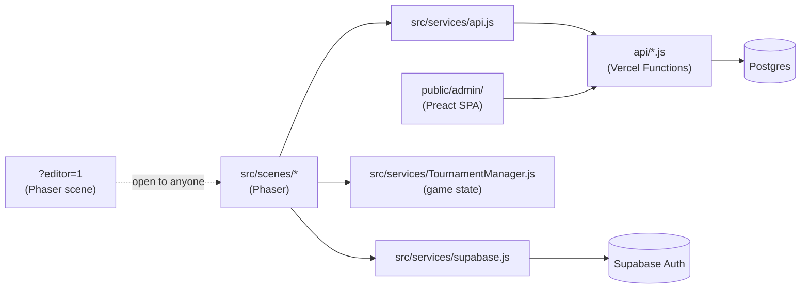
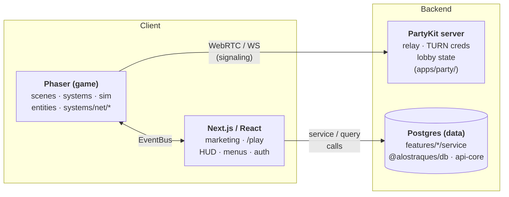

# RFC 0019: Next.js Monorepo Restructure

**Status**: Proposed
**Date**: 2026-04-22

## Problem

"A Los Traques" started as a single-page Vite + Phaser game and grew extra limbs: a loose `api/` folder of Vercel Functions, a Preact admin panel shoved into `public/admin/`, URL-param-gated dev tools (`OverlayEditorScene`, `InspectorScene`, `DevConsole`), a PartyKit multiplayer server in `party/`, and a handful of static utility HTML files (`public/join.html`, `public/replay.html`).

The result: three concerns that should be separate — **game** (Phaser), **UI shell** (React/Next), **data** (Postgres) — all live in the same folders and import each other freely. The coupling looks like this today:



Specifically:

- `src/services/` mixes infrastructure (`supabase.js`, `api.js`) with game state (`TournamentManager.js`, `TournamentLobbyService.js`) — one folder, two jobs.
- Phaser scenes directly import Supabase and call HTTP endpoints — the game world reaches into the data world.
- Dev tools ship in the default game bundle, gated only by the obscurity of the `?editor=1` URL param.
- `/` *is* the game. There is no URL tree for marketing pages, an engineering blog, or anything that isn't Phaser.
- Contributors have no canonical answer to "where do I put storage / business logic / UI for feature X?" because the three concerns share folders.

We need a structure where contributors follow well-established patterns when changing storage, game, UI, or any layer — and where changes to one layer don't bleed into the others. The guiding model is **three worlds** (Phaser / React / Postgres) connected by narrow typed bridges; the rest of this RFC is how to get there.

## Solution

Restructure the repo as a **bun-workspaces monorepo with two Next.js apps, a set of shared packages, and the PartyKit server as a sibling service.** Inside the web app, enforce a "three worlds" pattern — **Phaser (game)**, **Next.js/React (UI shell)**, **Postgres (data)** — connected by narrow, typed bridges. Admin and dev tools move to a separate Next.js app on an admin subdomain, gated by an `is_admin` check.

The migration is phased so the game remains playable after every PR. We are **not** rewriting the game, not swapping Supabase for something else, not introducing an ORM, and not replacing PartyKit. This RFC is about the house, not the furniture.

The intent is to stay **storage-provider-agnostic** at the architecture level. Supabase is an auth/JWT provider today; DB access is raw `pg`; storage is pluggable. The new structure preserves and strengthens that neutrality so swapping providers later is a one-package change.

## Guiding Principles — the three worlds



Rules of the road (each with the thing that breaks if violated):

- **The game knows nothing about React, Next.js, or HTTP.** If it did, the balance sim couldn't run headless in Node, and the game would break SSR on the landing page. Game code accepts config via a `createGame({ parent, params, env, eventBus })` factory and emits events on a bus.
- **React knows about the game only through the EventBus.** If a React component imports a Phaser scene, it pulls Phaser into the SSR graph and breaks the marketing page build.
- **The data world is framework-agnostic.** If `features/<domain>/service.ts` imported from `next/*`, cron jobs, tests, and PartyKit couldn't reuse it — we'd end up duplicating domain logic per entry point.
- **Networking is game-side infrastructure** (client transport in `@alostraques/game`) **plus a backend service** (PartyKit in `apps/party/`). PartyKit persists nothing; all durable state flows through the Next.js API. If PartyKit started writing to Postgres directly, we'd have two sources of truth for match state.

## Design Decisions

Grouped by theme. Each row resolves an actual ambiguity; obvious-in-context choices (TypeScript vs JS split per package, env var naming, URL-param compatibility) live in the body sections that discuss them.

### Monorepo & deployment

| Decision | Choice | Rationale |
| --- | --- | --- |
| Monorepo tool | Bun workspaces + Turborepo | `bun` is already the package manager. Turbo adds build caching and `turbo run dev` replaces `concurrently`. |
| `apps/` vs `packages/` | `apps/*` = things you **run** (web, admin, party, CLIs). `packages/*` = things other code **imports**. | Clean dividing line, no middle tier. A CLI is as much an app as a web server — both are invoked, not imported. |
| App split | `apps/web`, `apps/admin`, `apps/party`, `apps/asset-pipeline`, `apps/balance-sim` — all siblings | Admin is a hard requirement. Subdomain (admin.\*) over path prefix for cookie isolation + independent deploys. |
| Deployment | Two Vercel projects (web + admin), shared env group | Admin breakage can't take down the player app; service-role keys scoped tightest. |

### Architecture

| Decision | Choice | Rationale |
| --- | --- | --- |
| Game boundary | `@alostraques/game` workspace package, no `next` or `react` dep | Shareable with admin dev tools; never touches SSR; testable in isolation. |
| Client networking | Stays inside `@alostraques/game` at `systems/net/*` | Imports are Phaser-free; behavior is entangled with `FightScene` handoff and the rollback tick. Extract `@alostraques/netcode` only if a second consumer (headless bot, replay server) appears. See §2. |
| Multiplayer server | `apps/party/` — PartyKit, unchanged behavior | Its own deploy target, env scope, TURN endpoint. PartyKit never writes to Postgres directly. |
| React↔Phaser bridge | Single EventBus module with typed event catalog (TS-authored) | Phaser emits; React listens. React emits only commands (pause/resume/auth-changed). `EventBus.ts` is the one TS file in the JS game package. |
| Domain layer | `features/<domain>/{schema,service,queries,actions}` | `service.ts` pure + reusable; `actions.ts` thin `"use server"` wrappers; `queries.ts` server-only reads. |
| DB access | Raw `pg` in `@alostraques/db`; pool memoized on `globalThis` | No ORM (non-goal). `globalThis` survives Next.js HMR. |
| Storage | Pluggable backend (`local` / `supabase` / `s3`) in `@alostraques/api-core` | Preserves current abstraction. |
| Auth | Supabase JWT via `jose`; dev `X-Dev-User-Id` bypass preserved | Migrate as-is. `@alostraques/auth` is the swap point if the provider ever changes. |
| Validation | Zod schemas as source of truth at boundaries | Runtime validation + inferred TS types. |

### Conventions

| Decision | Choice | Rationale |
| --- | --- | --- |
| Dev tools | Move into `apps/admin/`, gated by `is_admin` | Removes the open `?editor=1` URL-param access. `?debug=1` stays (telemetry toggle, not a privileged editor). |
| Asset manifests | Build-time script replaces Vite `import.meta.glob` | Deterministic, Phaser-friendly. `scripts/build-music-manifest.js` runs pre-build in Phase 3. |
| Blog | MDX files in `app/(marketing)/blog/` (no CMS) | Simplest viable. CMS is a later call. |
| Tests | Colocated `__tests__/` per package + app; Playwright at `apps/*/tests/e2e/`; shared fixtures in `packages/test-utils/` (born Phase 3) | See §6 for the per-layer pattern. |
| Dev tooling | CLIs under `apps/*`; one-off glue in root `scripts/` | A CLI is a runnable unit, not a library. See §7. |

## 1. Target Repo Layout

```
a-los-traques/
  apps/
    web/                           # Next.js — marketing + /play
      app/
        (marketing)/page.tsx       # Landing
        (marketing)/about/page.tsx
        (marketing)/blog/[slug]/page.tsx
        play/page.tsx              # Hosts <GameHost/> via next/dynamic ssr:false
        join/page.tsx              # Ported from public/join.html
        replay/page.tsx            # Ported from public/replay.html
        leaderboard/page.tsx       # Server component → features/scores/queries
        me/page.tsx                # Server component → features/profiles/queries
        api/
          fights/route.ts
          leaderboard/route.ts
          profile/route.ts
          stats/route.ts
          stats/tournament-match/route.ts
          tournament/create/route.ts
          tournament/join/route.ts
          debug-bundles/route.ts
          public-config/route.ts
          cron/cleanup-bundles/route.ts
        layout.tsx
      components/
        GameHost.tsx               # Client. Owns <div id="game-container"> + EventBus wiring
        EventBusProvider.tsx
        hud/                       # HealthBar, RoundTimer, RankToast
        menus/
      features/                    # Domain — pure TS, no React/Phaser
        fights/{schema,service,queries,actions}.ts
        tournaments/{schema,service,queries,actions}.ts
        profiles/{schema,service,queries,actions}.ts
        scores/{schema,service,queries}.ts
        debug-bundles/{schema,service,queries,actions}.ts
        roster/queries.ts          # Re-exports fighters.json for React consumers
      lib/                         # App-internal only. Not a package — no package.json.
        auth/middleware.ts         # Next.js Request/Response adapters over @alostraques/auth
        env.ts                     # Zod-validated env access (app-specific)
        logger.ts                  # App-configured logger instance
      public/assets/               # Sprites, audio — moved from root /public/assets
      next.config.mjs
      tsconfig.json
      biome.jsonc                  # Extends repo-root base; noRestrictedImports added in Phase 3 if gaps appear
      package.json

    party/                         # PartyKit server — multiplayer relay + TURN creds
      server.js
      partykit.json

    asset-pipeline/                # CLI — Gemini sprite/portrait/stage/pose generation
      src/
      pose/                        # nested Python uv project for MediaPipe pose estimation
      package.json                 # own deps (Gemini SDK, image helpers); exposes `cli` binary

    balance-sim/                   # CLI — headless AI-vs-AI simulation
      src/                         # adapter, match runner, report generator
      package.json                 # depends on @alostraques/sim + @alostraques/game (for AIController)

    admin/                         # Next.js — admin + dev tools, no marketing
      app/
        (auth)/login/page.tsx
        (authed)/
          layout.tsx               # Server — blocks non-admins at the edge
          fights/page.tsx
          fights/[id]/page.tsx
          debug-bundles/page.tsx
          dev-tools/
            overlay-editor/page.tsx
            inspector/page.tsx
            calibration/page.tsx
        api/
          admin/fights/route.ts
          admin/debug-bundle/route.ts
      game-tools/                  # Phaser-only dev scenes (OverlayEditor, Inspector, Calibration)
        index.ts
        scenes/
          OverlayEditorScene.ts
          InspectorScene.ts
      components/
      middleware.ts                # Edge admin check
      package.json

  packages/
    sim/                           # @alostraques/sim — pure sim (no Phaser)
      src/                         # lift of src/simulation/
    game/                          # @alostraques/game — Phaser scenes/systems/entities/data/bridges
      src/
        index.ts                   # createGame({ parent, params, env, eventBus })
        EventBus.ts                # Single-source event catalog + typed emit/on helpers (TS carve-out)
        config.ts
        scenes/                    # 18 scenes (20 total in src/scenes/; OverlayEditorScene + InspectorScene move to apps/admin)
        systems/                   # CombatSystem, InputManager, AIController, net/*, bridges
        entities/
        services/                  # TournamentManager, TournamentLobbyService (game state)
        data/                      # fighters.json, stages.json, accessories.json, animations.js
        dev/                       # DebugOverlay, DevConsole, FightRecorder, MatchTelemetry
    db/                            # @alostraques/db — pg Pool factory + migrations
      migrations/                  # moved from /db/migrations, still dbmate-driven
      src/{pool,client,index}.ts
    api-core/                      # @alostraques/api-core — framework-agnostic handler logic
      src/
        handlers/                  # Pure (input, deps) → result
        validate.ts
        storage.ts                 # Pluggable backend (local|supabase|s3)
        auth.ts                    # jose-based JWT verify, no Next coupling
    auth/                          # @alostraques/auth
      src/
        client.ts                  # Browser Supabase client (getSession, onAuthStateChange)
        server.ts                  # withAuth/withAdmin adapters for Next Route Handlers
    ui/                            # @alostraques/ui — shared React primitives (Button, Dialog, Table)
    test-utils/                    # @alostraques/test-utils — born in Phase 3 with the first domain tests (not Phase 1)

  scripts/                         # one-off glue only (build-music-manifest, migrate wrapper)
  package.json                     # workspaces: ["apps/*", "packages/*"]
  turbo.json
  bun.lock
  tsconfig.base.json               # repo-root TS base — apps/packages extend via `extends`
  biome.base.jsonc                 # repo-root Biome base — apps override as needed
  biome.jsonc                      # repo-wide Biome runner config
```

**Why `@alostraques/game` is a package, not a folder inside `apps/web/`**: the admin app needs a minimal Phaser runtime to host overlay editor + inspector. A workspace package is the cleanest way to share scene bases, the EventBus, and asset loaders across both apps without cross-app relative imports. It also keeps Phaser out of Next.js's SSR graph by default — apps only reach it via `next/dynamic({ ssr: false })`.

### `packages/` vs `lib/` — when to use which

Both hold "supporting code." They mark different boundaries:

| | `packages/<name>/` | `apps/<app>/lib/` |
| --- | --- | --- |
| **What it is** | A workspace package with its own `package.json` | A folder inside one app |
| **Import as** | `@alostraques/name` | `@/lib/name` (TS path alias) |
| **Shareable?** | Yes — multiple apps can depend on it | No — private to that one app |
| **Framework coupling** | Framework-agnostic (no `next`, no `react`) | Can be Next.js-specific |
| **Test style** | Unit tests wherever possible (pure logic or mockable deps); integration for important business logic. Colocated `__tests__/`. | Same rule — unit when possible, integration when needed. Tests run via the app's test command. |

Rule of thumb: **if two apps would want it, it's a package.** If it's Next.js glue — Route-Handler middleware, app-specific env schema, a logger instance configured for this app — it's `lib/`. This is the pattern Turborepo, pnpm-workspaces, and the Next.js docs all use.

There is deliberately no `apps/web/lib/db/` or `apps/web/lib/storage/`: those *are* cross-app concerns, so they live in packages (`@alostraques/db`, `@alostraques/api-core`). If you find yourself wanting to add a `lib/` subfolder that feels like it could also exist in the admin app, that's a signal to make it a package instead.

## 2. Networking — WebRTC + PartyKit

Networking splits into two pieces, both game-owned: the **client transport** (WebRTC DataChannel with a WebSocket fallback, plus rollback input buffers) and the **PartyKit server** (a thin relay that brokers signaling and hands out TURN credentials). React never sees either — it only hears about match-level outcomes through the EventBus.

1. **Client transport** (`src/systems/net/*`, 7 files, ~1.5 KLOC, only external dep is `partysocket`):
   - `BaseSignalingClient`, `SignalingClient` — WebSocket to PartyKit.
   - `TransportManager` — WebRTC DataChannel with TURN fallback.
   - `InputSync` — rollback-netcode input buffers.
   - `ConnectionMonitor` — ping/RTT/quality.
   - `SpectatorRelay` — one-way snapshot broadcast.
   - `NetworkFacade` — composition surface scenes call.
2. **Server** (`party/server.js`, ~950 LOC): max-2-players-per-room relay, slot assignment, rate limiting, tournament lobby state machine, `/turn-creds` endpoint generating short-lived Cloudflare TURN credentials.

**Decision: client net modules stay inside `@alostraques/game`** (at `packages/game/src/systems/net/`). Their imports are Phaser-free, but they read from and write to match state — e.g. `NetworkFacade` calls into `FightScene` when a round ends, `InputSync` hands frames to the rollback tick in `SimulationEngine`. Separating them into a package would force that scene/sim surface into the public API. Today there's no second consumer to justify it; a future headless spectator or bot would. The Phaser-free imports are a property we *preserve* so that extraction stays cheap when the second consumer appears.

**Decision: PartyKit moves to `apps/party/`, otherwise unchanged.** Own deployment via `bunx partykit deploy`. Own env var scope. Not affected by the Next.js migration. Keeps its tournament lobby logic, TURN credential endpoint, and rate limiting.

How the game learns the signaling URL (preserving current behavior):
- Build-time: `NEXT_PUBLIC_PARTYKIT_HOST` on `apps/web`, read by `createGame({ env })`.
- Dev override: `?partyHost=…` URL param preserved at `/play`.
- Production fallback: `a-los-traques.simon0191.partykit.dev` stays as the hardcoded last resort.

Where net touches the other worlds:
- **Game → React (EventBus)**: `TELEMETRY` events surface RTT / rollback / desync for the debug overlay; `MATCH_START` / `ROUND_END` / `MATCH_END` fire identically in online and local matches so React doesn't care which transport was used.
- **Game → Data**: only indirectly. When a match ends the game emits `MATCH_END`; a React handler calls `features/fights/actions.ts#recordResultAction`. Debug bundles follow the same path through `features/debug-bundles/actions.ts`.
- **Game ↔ PartyKit**: direct. No React or Next.js in between. PartyKit stays a stateless relay for in-match data; persistent state always goes through `apps/web/app/api/*`.

## 3. The EventBus — Phaser↔React Bridge

Single emitter, single event catalog, payload shapes defined as TypeScript types. `EventBus.ts` is the one TS file inside the otherwise-JS `@alostraques/game` package — the carve-out is worth it for autocomplete at every call site with zero runtime or build cost.

No Zod, no `.proto` codegen: EventBus emit and consume always happen in the same build, so schema evolution, wire compat, and runtime validation are empty-set features. TypeScript's compile-time enforcement is the whole value proposition, and it's free.

```ts
// packages/game/src/EventBus.ts (illustrative — see the actual file for the canonical event set)
import Phaser from 'phaser';

export type WinnerSlot = 1 | 2;

export type MatchStart    = { matchId: string; p1: string; p2: string; stageId: string };
export type RoundEnd      = { winnerSlot: WinnerSlot; durationMs: number };
export type MatchEnd      = { matchId: string; winnerSlot: WinnerSlot };
export type RankUpdated   = { delta: number; newRank: number };
export type Telemetry     = { key: string; value: number };
export type FightRecorded = { fightId: string };
export type AuthChanged   = { userId: string | null };

export const Events = {
  GAME_READY:      'game-ready',
  MATCH_START:     'match-start',
  ROUND_END:       'round-end',
  MATCH_END:       'match-end',
  RANK_UPDATED:    'rank-updated',
  RETURN_TO_MENU:  'return-to-menu',
  TELEMETRY:       'telemetry',
  FIGHT_RECORDED:  'fight-recorded',
  REQUEST_PAUSE:   'request-pause',
  REQUEST_RESUME:  'request-resume',
  AUTH_CHANGED:    'auth-changed',
} as const;

export type EventMap = {
  [Events.GAME_READY]:     void;
  [Events.MATCH_START]:    MatchStart;
  [Events.ROUND_END]:      RoundEnd;
  [Events.MATCH_END]:      MatchEnd;
  [Events.RANK_UPDATED]:   RankUpdated;
  [Events.RETURN_TO_MENU]: void;
  [Events.TELEMETRY]:      Telemetry;
  [Events.FIGHT_RECORDED]: FightRecorded;
  [Events.REQUEST_PAUSE]:  void;
  [Events.REQUEST_RESUME]: void;
  [Events.AUTH_CHANGED]:   AuthChanged;
};

export const EventBus = new Phaser.Events.EventEmitter();

// Typed helpers — enforce the payload shape at every call site.
export function emit<K extends keyof EventMap>(event: K, payload: EventMap[K]): void {
  EventBus.emit(event, payload);
}
export function on<K extends keyof EventMap>(event: K, fn: (payload: EventMap[K]) => void): void {
  EventBus.on(event, fn);
}
```

### Rules

- Every EventBus payload has a matching type in `EventMap`. No ad-hoc inline types, no untyped `any` in emit sites.
- Phaser emits; React listens. React emits *only* the command events (`REQUEST_PAUSE`, `REQUEST_RESUME`, `AUTH_CHANGED`).
- No scene-to-scene use — scenes use Phaser's own scene events; `EventBus` is strictly cross-world.
- Changing a payload shape: update the type, fix the compile errors on both sides, ship in one commit. There is no "old shape" compat because emit and consume are always the same build.
- If events ever need to cross a real boundary (PartyKit wire messages, persisted replay logs), revisit serialization *then* — Zod or protobuf can be introduced per-boundary without touching the in-process EventBus.

## 4. The `features/` Pattern

Each domain (fights, tournaments, profiles, scores, debug-bundles) is a self-contained module under `apps/web/features/<domain>/` with four files: **schema** for validation, **service** for pure business logic, **queries** for server-only reads, **actions** for the client-facing surface. The split lets the service be called from route handlers, cron jobs, tests, or PartyKit without pulling Next.js into any of them.

Example for `features/fights/`:

```
apps/web/features/fights/
  schema.ts      # Zod — FightRecord, CreateFightInput, PatchFightInput
  service.ts     # createFight(), patchFight(), validateResult() — PURE (no next, no react)
  queries.ts     # getFightById(), listFightsByUser() — server-only reads (marked `'server-only'`)
  actions.ts     # 'use server' thin wrappers around service, called by client components
```

```ts
// service.ts — no next/*, no react, no phaser
import { CreateFightInput } from './schema';
import { acquire } from '@alostraques/db';
export async function createFight(userId: string, raw: unknown) {
  const input = CreateFightInput.parse(raw);
  const db = await acquire();
  try {
    await db.query(
      `INSERT INTO fights (id, room_id, p1_user_id, p1_fighter, p2_fighter, stage_id)
       VALUES ($1,$2,$3,$4,$5,$6)`,
      [input.id, input.roomId, userId, input.p1Fighter, input.p2Fighter, input.stageId],
    );
    return { id: input.id };
  } finally { db.release(); }
}
```

```ts
// actions.ts — thin; this is what CLIENT components call
'use server';
import { revalidatePath } from 'next/cache';
import { requireUser } from '@/lib/auth/middleware';
import * as service from './service';
export async function createFightAction(raw: unknown) {
  const { userId } = await requireUser();
  const out = await service.createFight(userId, raw);
  revalidatePath('/me');
  return out;
}
```

Route handlers become ~10-line thin adapters that parse input, call `withAuth`, delegate to `service`, and shape the response. `service.ts` is the reusable unit — callable from routes, cron jobs, tests, or PartyKit.

## 5. Import Boundaries

Boundaries are one-per-table so each rule reads top-to-bottom. Every "may not import" has a specific failure mode — see examples below.

**Game (Phaser) world**
| Location | May import | May NOT import |
| --- | --- | --- |
| `packages/game/**` | own sources, `@alostraques/sim` | `next/*`, `react`, `@/features/*`, `@alostraques/db`, `@alostraques/api-core`, `@/app/*` |

**Domain layer (framework-agnostic)**
| Location | May import | May NOT import |
| --- | --- | --- |
| `features/*/service.ts` | `@alostraques/db`, `@alostraques/api-core` (storage), own `schema` | `game/**`, `components/**`, `app/**`, `next/*`, `react` |
| `features/*/queries.ts` | same as service + `'server-only'` | same as service |
| `features/*/actions.ts` | own service/queries/schema, `next/cache`, `@/lib/auth/middleware` | `game/**`, `components/**` |

**App shell (Next.js routes + components)**
| Location | May import | May NOT import |
| --- | --- | --- |
| `app/**/page.tsx` (server) | `features/*/queries`, `components/**`, `@/lib/*`, packages | `features/*/actions`, `game/**` |
| `app/**/route.ts` | `features/*/service`, `@/lib/auth/middleware`, `@alostraques/db` | `features/*/actions`, `game/**` |
| `components/**` (client) | `features/*/actions`, EventBus types | `features/*/service`, `@alostraques/db`, `@/lib/auth/middleware` |

**Concrete examples of violations (and why they break things)**

- *`features/fights/service.ts` imports `next/cache`*: now you can't call `service.createFight()` from PartyKit or a cron job without dragging Next.js's module graph in. The whole point of keeping services framework-agnostic.
- *A React client component imports `features/fights/service.ts`*: `service.ts` opens a `pg.Pool` on the server; in the browser you'd ship the connection string in the bundle and break at runtime when `pg` can't find `net`. Client components must go through `actions.ts`.

**Enforcement — three layers of friction**:

1. **Package boundaries.** `@alostraques/game` has no `next` or `react` in its `dependencies`; import attempts fail resolution at install time.
2. **TypeScript project references with scoped `paths`** per sub-tsconfig — catches boundary violations at typecheck.
3. *(Biome `noRestrictedImports` per-folder overrides are added in Phase 3 only if the first two layers leave gaps — typically they don't.)*

## 6. Testing — patterns by layer

The architecture has several distinct testable zones, and each gets a default test style. The guiding principle: **faster tests catch more bugs per minute than slow tests.** Unit tests (milliseconds) are cheaper than integration (hundreds of milliseconds, with a real DB), which are cheaper than E2E (seconds, with a browser). If you're reaching for a slower test because a faster one would be awkward, the code is usually too coupled to its framework — fix the coupling, not the test.

| Zone | Test style | Runner | Speed | Example |
| --- | --- | --- | --- | --- |
| `packages/sim/**` | Pure unit, fully deterministic | Vitest | ms | `CombatSim` hit detection, ELO math |
| `packages/db/**` | Integration against PGLite | Vitest | 100s ms | Pool acquire/release, migration roundtrip |
| `packages/api-core/**`, `packages/auth/**` | Pure unit with fake `{ input, deps }` | Vitest | ms | JWT verify, dev-bypass header precedence |
| `features/<domain>/service.ts` | Integration against PGLite | Vitest | 100s ms | `createFight` inserts + returns id |
| `features/<domain>/queries.ts` | Integration against PGLite (seeded) | Vitest | 100s ms | `getLeaderboard` ordering / windowing |
| `apps/*/app/**/route.ts` | Smoke — happy path + 401/403 only | Vitest | ms | `/api/fights` POST routes to service, returns 201 |
| `apps/*/components/**` | React Testing Library | Vitest + jsdom | ms | HUD renders on `MATCH_START` EventBus event |
| `packages/game/systems/**`, `net/**` | Unit with stubbed inputs | Vitest | ms | `InputSync` rollback window, `CombatSystem.tickTimer` |
| `packages/game/scenes/**` | Rarely tested directly — push logic into systems | — | — | Prefer testing `CombatSystem` over `FightScene` |
| `apps/*/tests/e2e/` | Playwright against real stack | Playwright | seconds | Autoplay + checksum determinism |

### Shared test utilities — `packages/test-utils/`

*(This package is created in Phase 3 alongside the first `features/*/service` tests. Phase 1–2 tests use local helpers inside each package; consolidation happens when there's actual test code to share.)*

Everything gets built once, used everywhere:

- **`withTestDb()`** — spins up PGLite, runs migrations, truncates between tests. Used by `@alostraques/db` tests and every `features/*/service.test.ts`. One canonical way to get a test DB.
- **`makeUser()`, `makeFightRecord()`, `makeTournament()`** — factory builders for domain fixtures. One canonical way to construct each domain object. Refactor-friendly: if `FightRecord` shape changes, edit the factory, not every test.
- **`makeTestEventBus()`** — returns a fresh `Phaser.Events.EventEmitter` plus a `recorded: Array<{ event, payload }>` that captures every emission. Used for testing scenes that emit AND React components that listen.
- **`mockJwt(userId, { admin })`** — signs a JWT with a test secret; paired with a test-harness `withAuth` that verifies against the same secret.

**Rule**: no test inlines ad-hoc fixture data. If `makeFightRecord()` doesn't cover a case, extend the factory — don't write `{ id: 'x', ... }` in a test file. This keeps domain-shape changes a one-file refactor.

### Determinism is the sim's contract test

The pure sim is deterministic given `(fighters, stage, seed, inputs)`. One "replay" test in `packages/sim/__tests__/` asserts `replay(bundle).finalChecksum === bundle.expectedChecksum` across a handful of stored bundles. That single test is the tripwire for any change that breaks determinism — which would also break E2E, balance sim, and debug-bundle replay. Cheap to write, catches the most expensive class of regressions.

`bun run balance` is the larger version (28,900 fights across the 17×17 matrix). Run it pre-merge for combat-tuning changes; not a default CI gate.

### E2E is for cross-app flows only

Playwright tests are for things no other layer can cover:

- **Autoplay + full match** — two browsers, real PartyKit, real WebRTC, checksum determinism across peers.
- **Reconnection / graceful disconnect** — grace period, state machine transitions, spectator rejoin.
- **Admin login → debug-bundle download** — multi-app flow, JWT across subdomains.

If an E2E test catches a logic bug, **a faster test should also catch it**. E2E failures that surface pure logic bugs mean the logic lives too high in the stack — extract it into a feature service and test it there. E2E failures that surface plumbing bugs (wrong endpoint, missing header, bad CORS) are exactly what E2E is for.

### The Phaser corner

Phaser doesn't run cleanly in jsdom — scenes touch the real DOM, WebGL, `requestAnimationFrame`. Don't try to make them. Instead:

- **Systems** (`packages/game/systems/**`) are mostly pure JS with stubbable inputs. They're the layer to unit-test.
- **Sim** (`packages/sim/**`) is already Phaser-free and pure. Test it like any pure module.
- **Scenes** are a thin integration layer. Their correctness is covered by E2E autoplay + visual QA, not by jsdom.
- **EventBus consumers** (React components) use `makeTestEventBus()` to fire synthetic events without booting Phaser.

This is the inverse of the advice-for-new-Phaser-projects to aim for "100% scene coverage." That advice doesn't scale. The pure sim + systems coverage is what actually matters.

### Anti-patterns

1. **Don't mock `pg` or `@alostraques/db`.** Mocks drift from the real query behavior; PGLite runs in milliseconds and tests the real SQL.
2. **Don't test `actions.ts` directly.** They're thin wrappers — you'd be testing `next/cache` and Next.js plumbing, not your code. Test the service; smoke-test the route.
3. **Don't test Phaser scenes with jsdom.** Phaser touches real WebGL + `requestAnimationFrame`; jsdom stubs them imperfectly and you end up debugging the test environment, not the code.
4. **Don't write E2E for happy-path validation.** E2E is slow and hides the real failure location; if it could be a service test, it should be.
5. **Don't duplicate fixture data.** Inlining `{ id: 'x', ... }` in tests means every schema change becomes a shotgun-edit; extend the factory in `test-utils/`.
6. **Don't skip a failing test.** A skipped test is a bug report in disguise. Fix it or delete it.
7. **Don't assert on `console.log` output.** Log messages aren't contracts; they'll change. If it's observable, it's a return value or a recorded EventBus event.
8. **Don't test across the world boundary.** A service test that imports Phaser stops being a service test; a system test that hits the DB is really an integration test in the wrong file.

## 7. Dev Tooling — CLIs and scripts

The current `scripts/` tree mixes substantial CLIs (asset pipeline, balance sim) with small imperative glue (dev DB, overlay export plugin). Under the new layout they split by *"is this something you run, or something code imports?"*:

- **Something you run** → `apps/*`. A CLI sits alongside web/admin/party because they're all runnable units; only the transport differs (HTTP server vs. `bunx` invocation).
- **Something code imports** → `packages/*`. Libraries that other apps or tools pull in.
- **Neither — just glue** → root `scripts/`. One file, one job, no deps, the kind of thing you'd paste into a README.

### What becomes an app

- **`apps/asset-pipeline/`** (was `scripts/asset-pipeline/`) — Gemini-based sprite / portrait / stage / pose generation CLI. Has its own `package.json` with the Gemini SDK and image helpers. The nested `pose/` directory keeps its Python `uv` project. Exposes a CLI binary: `bunx @alostraques/asset-pipeline fighter <config>`. Depends on no runtime packages; it reads manifests and writes PNGs.
- **`apps/balance-sim/`** (was `scripts/balance-sim/`) — headless AI-vs-AI simulation CLI. Depends on `@alostraques/sim` (pure sim) and `@alostraques/game` (for `AIController` + fighter data). Imports the specific modules it needs; the game package's scenes and Phaser runtime are never touched at import time, so Node-only execution is fine. If the AIController module turns out to be fully Phaser-free in practice, a later refactor can move it into `@alostraques/sim` — not required by this RFC. Exposes a CLI: `bunx @alostraques/balance-sim --fights=50 --p1=simon --p2=jeka`. Outputs `balance-report.{json,md}` at the repo root.

### What stays in `scripts/`

Short, single-file glue with no independent lifecycle:

- `scripts/build-music-manifest.js` — replaces Vite's `import.meta.glob`; generates `packages/game/src/data/music-manifest.ts` pre-build. Runs in Turbo's build pipeline before `apps/web#build`.
- `scripts/migrate.sh` — thin `dbmate` wrapper pointed at `packages/db/migrations/`, so `bun run migrate` still works from the repo root.

### What gets deleted

Dev orchestration scripts are replaced by Turbo, not relocated:

- `scripts/dev-multiplayer.js`, `scripts/dev-db.js` → `turbo run dev` fans out to `apps/web#dev`, `apps/admin#dev`, `apps/party#dev`, and a PGLite bootstrap task.
- `scripts/overlay-export-server.js` (Vite dev plugin) → Route Handler in `apps/admin`.

### DX: `bun run <name>` stays the same

Root `package.json` forwards into the workspace so contributors don't need to learn `bun --filter` syntax:

```json
{
  "scripts": {
    "dev": "turbo run dev",
    "build": "turbo run build",
    "test": "turbo run test",
    "lint": "turbo run lint",
    "balance": "bun --filter @alostraques/balance-sim run start",
    "gen:fighter": "bun --filter @alostraques/asset-pipeline run cli fighter",
    "gen:portrait": "bun --filter @alostraques/asset-pipeline run cli portrait",
    "gen:stage": "bun --filter @alostraques/asset-pipeline run cli stage",
    "gen:poses": "bun --filter @alostraques/asset-pipeline run cli poses",
    "migrate": "bash scripts/migrate.sh"
  }
}
```

`bun run balance` — same command as today. `bun run gen:fighter simon` — same command as today (the slash-command skills that invoke these keep working unchanged).

### Where generated assets land

Asset pipeline writes to `apps/web/public/assets/fighters/{id}/*.png`. `apps/web` is the canonical host; `apps/admin` references assets via `https://alostraques.com/assets/...` in production and proxies through `apps/web`'s dev server locally. Alternatives (a `packages/assets/` workspace holding binaries, a CDN, symlinks) are possible but out of scope for this RFC — flagged as an open question.

### Anti-patterns

1. **Don't add a new top-level `scripts/` file for a multi-file tool.** If it has its own CLI, its own deps, or its own tests, make it an app.
2. **Don't import from `packages/game` or `packages/sim` in a root `scripts/` file.** Coupling tooling to the runtime graph leaks concerns. If you need game types, it's an app.
3. **Don't depend on `apps/web/public/` from a pipeline.** Pipelines *write to* public assets; they don't *read from* them. Source manifests belong in `packages/game/src/data/` or `assets/manifests/`.
4. **Don't write long-running async tools as root `bun run` scripts.** If it takes more than ~30 seconds or hits external APIs (Gemini, S3, etc.), it's an app with a CLI.
5. **Don't put libraries in `apps/`.** If other code will import it, it's a package. Apps are invoked; packages are imported.

## 8. Migration Phases

Every phase must leave the game playable. The Vite app coexists until Phase 3. Each phase has a **Definition of Done** — a PR isn't shippable until every bullet is green.

### Phase 1 — Monorepo setup + pure packages

Move the existing Vite app under `apps/game-vite/`. Set up bun workspaces + `turbo.json`. Move `party/` to `apps/party/`. Repoint Biome / Vitest / Playwright paths. Extract `@alostraques/sim` (lift `src/simulation/`), `@alostraques/db` (lift `api/_lib/db.js` + migrations), and `@alostraques/api-core` (split `api/_lib/handler.js` into framework-agnostic core + Vercel-Function adapter). The existing Vite app and Vercel Functions now import from these packages.

**Done when**:
- `apps/game-vite/` boots the game at `localhost:5173` with identical behavior.
- `@alostraques/sim`, `@alostraques/db`, `@alostraques/api-core` have zero imports from `next`, `react`, `phaser` (verified by `rg`).
- All existing tests pass. `bun run balance` still produces a report.

### Phase 2 — Next.js shell + API port

Stand up `apps/web` as an empty Next.js App Router app. Routes: `/` placeholder landing, `/blog` (MDX on disk), `/about`. Port every file in `api/*.js` to `apps/web/app/api/**/route.ts` thin adapters over `@alostraques/api-core`. Cron moves under `apps/web/vercel.json`. `apps/game-vite`'s API base points at `apps/web`'s origin; `apps/game-vite/api/` is deleted. `@alostraques/ui`, `@alostraques/auth` born here with the minimum needed for the landing page.

**Done when**:
- `apps/web` deploys a landing page + `/blog` + `/about` to a Vercel preview.
- Every `/api/*` endpoint reachable with curl + JWT; `X-Dev-User-Id` bypass works.
- `apps/game-vite` still runs end-to-end against the new `apps/web` API origin.
- Cron cleanup job verified (manual trigger via Vercel).

### Phase 3 — Embed Phaser at `/play`

Create `apps/web/components/GameHost.tsx` with `dynamic(() => import('@alostraques/game'), { ssr: false })`. Extract `src/` into `@alostraques/game` (the big lift — scenes, systems, entities, data, config). `createGame({ parent, params, env, eventBus })` accepts pre-parsed URL params instead of reading `window.location` itself. URL params preserved at `/play`: `?room`, `?autoplay`, `?debug`, `?replay`, `?seed`, `?speed`, `?partyHost`. `?editor=1` is **removed** from this path. Playwright baseURL updated to `/play`. Sim-checksum baselines re-recorded at this boundary — the two-tier determinism check (within-build bitwise + cross-migration structural) is defined in the Definition of Done below. Delete `apps/game-vite/` — the game is now only served from Next.js.

Phase 3 carries the bulk of the migration's compatibility work. The specific Vite-isms and Phaser-shell concerns to resolve:

- **`import.meta.glob('/public/assets/audio/fights/*.mp3')`** (used in `BootScene` and `MusicScene`) → build-time manifest generator `scripts/build-music-manifest.js` writes `packages/game/src/data/music-manifest.ts`, imported normally. This is the Phase 3 task where the Turbo pre-build hook actually matters.
- **`import.meta.env.VITE_*`** (`src/config.js`, `src/services/supabase.js`, `src/services/api.js`) → `process.env.NEXT_PUBLIC_*` for client, `process.env.*` on the server. Game never reads env directly — values come via `createGame({ env })`.
- **`import.meta.env.DEV`** → `process.env.NODE_ENV !== 'production'`.
- **PartyKit URL** in `src/config.js` → `NEXT_PUBLIC_PARTYKIT_HOST`, same fallback chain preserved.
- **Asset paths** in Phaser preloads are relative (`'assets/...'`). The `public/assets/` tree moves to `apps/web/public/assets/` — runtime URLs unchanged. Grep for `./assets/` leading dot-slash oddities.
- **`index.html` inline viewport-fix script** (`visualViewport` listener calling `game.scale.refresh()`) → client component wrapping `GameHost`, not `apps/web/app/layout.tsx` (shared with marketing pages that don't want viewport mutation).
- **Guest mode** fallback (when Supabase env vars are missing) → preserved via `lib/env.ts` Zod-validated env with optional fields.
- **`public/manifest.json`** → `apps/web/public/manifest.json`, referenced in root layout metadata.
- **Autoplay / replay globals** (`window.__REPLAY_BUNDLE`, `window.__FIGHT_LOG`, `window.__DEBUG_BUNDLE`) → preserved; set from React via a client-only bootstrap that runs before `createGame`.
- **Sim checksum baselines** recorded under Vite are **not** expected to match post-migration Next.js checksums bit-for-bit. Bundler transforms, polyfills, and module-evaluation order can desync a seeded sim by one frame even when logic is identical. The project only promises *within-build* bitwise determinism; *cross-migration* parity is asserted structurally (same winner, same round outcomes).

**Done when**:
- `/play?autoplay=1&createRoom=1&fighter=simon&seed=42&speed=2` runs an autoplay match end-to-end under the Next.js build.
- Two consecutive runs produce identical `CombatSim` checksums (within-build determinism).
- The outcome of that autoplay URL matches the pre-migration Vite run structurally: same winner, same rounds, same round outcomes. Bitwise parity is NOT required.
- Manual smoke: real Safari landscape, one local-vs-AI round, one online-vs-another-browser round.
- `apps/game-vite/` deleted from the repo.

### Phase 4 — Stand up `apps/admin`

New Next.js app on `admin.alostraques.com` (port `:3001` in dev). Port `public/admin/` Preact to real React components. Admin-only API routes (`/api/admin/fights`, `/api/admin/debug-bundle`) move here. Admin layout gated by a server-component `withAdmin` check.

**Done when**:
- `admin.localhost:3001` (dev) requires login; non-admin JWT gets 403 on every admin route.
- Fights list + debug-bundle download work against production data.
- `public/admin/` deleted from the repo.

### Phase 5 — Move dev tools into admin

Overlay editor, inspector, and calibration scenes move out of `@alostraques/game`'s default scene registry and into `apps/admin/game-tools/`. Admin hosts them via the same `GameHost`/dynamic-import pattern with only dev scenes registered. Remove `?editor=1` registration from `createGame`. `?debug=1` stays — it's a telemetry toggle, not a privileged editor.

**Done when**:
- `rg "\?editor=1" apps packages` returns zero runtime references.
- Overlay editor reachable only inside admin, only for admins.
- Existing E2E tests still pass.

### Phase 6 — Cleanup

Port `join.html` + `replay.html` to `/join` and `/replay` Next pages. Consolidate tsconfigs. Delete `scripts/dev-multiplayer.js` in favor of `turbo run dev`. Final Biome + TS pass. Update `CLAUDE.md` to reflect new structure.

**Done when**:
- `public/join.html`, `public/replay.html`, root-level `src/`, `api/`, `party/`, `vite.config.js`, `index.html` are all gone.
- `bun run dev` (via Turbo) boots web + admin + party + dev-db in parallel.
- CLAUDE.md updated; no references to the old structure remain.

## 9. Where Existing Code Migrates

| From | To |
| --- | --- |
| `src/scenes/**` (minus editor/inspector) | `packages/game/src/scenes/**` |
| `src/systems/**` incl. `net/` | `packages/game/src/systems/**` |
| `src/simulation/**` | `packages/sim/src/**` |
| `src/entities/**` | `packages/game/src/entities/**` |
| `src/data/**` | `packages/game/src/data/**` |
| `src/services/TournamentManager.js`, `TournamentLobbyService.js`, `UIService.js` | `packages/game/src/services/**` (game state, stays with Phaser) |
| `src/services/supabase.js` | `packages/auth/src/client.ts` (shared — both apps consume it) |
| `src/services/api.js` | mostly deleted; replaced by `features/*/actions` + plain fetch to `/api/*` |
| `src/editor/**` + `OverlayEditorScene` + `InspectorScene` | `apps/admin/game-tools/**` |
| `api/_lib/handler.js` | split: framework-agnostic → `packages/api-core/src/auth.ts`; Next adapters → `apps/web/lib/auth/middleware.ts` |
| `api/_lib/db.js` | `packages/db/src/pool.ts` |
| `api/_lib/storage.js` | `packages/api-core/src/storage.ts` |
| `api/_lib/validate.js` | per-feature schemas or `packages/api-core/src/validate.ts` |
| `api/profile.js` | `apps/web/app/api/profile/route.ts` + `features/profiles/service.ts` |
| `api/fights.js` | `apps/web/app/api/fights/route.ts` + `features/fights/service.ts` |
| `api/stats.js` | `apps/web/app/api/stats/route.ts` + `features/profiles/service.ts` (general wins/losses increment) |
| `api/stats/tournament-match.js` | `apps/web/app/api/stats/tournament-match/route.ts` + `features/tournaments/service.ts#reportMatch` |
| `api/leaderboard.js` | `app/leaderboard/page.tsx` server component + `features/scores/queries.ts` |
| `api/tournament/{create,join}.js` | `features/tournaments/service.ts` |
| `api/debug-bundles.js` + `api/admin/debug-bundle.js` | `features/debug-bundles/service.ts`; write surface in web, read surface in admin |
| `api/admin/fights.js` | `apps/admin/app/fights/**` + `apps/admin/features/fights/queries.ts` (admin has its own `features/`; no cross-app imports) |
| `api/cron/cleanup-bundles.js` | `apps/web/app/api/cron/cleanup-bundles/route.ts` + `features/debug-bundles/service.ts#pruneExpired` |
| `api/public-config.js` | inline `apps/web/app/api/public-config/route.ts` or replaced by `lib/env.ts` |
| `public/admin/**` | `apps/admin/app/**` |
| `public/join.html` | `apps/web/app/join/page.tsx` |
| `public/replay.html` | `apps/web/app/replay/page.tsx` |
| `party/` | `apps/party/` (unchanged) |
| `scripts/asset-pipeline/` | `apps/asset-pipeline/` (promoted to workspace app; Python `pose/` subdir stays nested) |
| `scripts/balance-sim/` | `apps/balance-sim/` (promoted; depends on `@alostraques/sim`) |
| `scripts/dev-multiplayer.js`, `scripts/dev-db.js` | deleted — `turbo run dev` replaces them |
| `scripts/overlay-export-server.js` (Vite plugin) | deleted — overlay export becomes a Route Handler in `apps/admin` |
| `scripts/calibrate-overlays.js` | becomes a subcommand of the `apps/asset-pipeline/` CLI |
| `tests/data|systems|simulation|entities/` | colocated `__tests__/` per package |
| `tests/party/` | `apps/party/__tests__/` |
| `tests/balance-sim/` | `apps/balance-sim/__tests__/` (colocated with the app it tests) |
| `tests/e2e/` | `apps/web/tests/e2e/` |
| `tests/fixtures/`, `tests/helpers/` | `packages/test-utils/` |

## 10. Anti-Patterns

Codify these in CLAUDE.md after the migration:

1. **Don't import Phaser from a Server Component.** Phaser touches `window` at module load — SSR will crash on the build server.
2. **Don't import `features/*/actions` from Phaser.** Actions are Next-specific (`'use server'`, `next/cache`); importing them couples the game to Next. Emit on the EventBus; React listens and calls the action.
3. **Don't import `features/*/service` from a Client Component.** Services open `pg.Pool` and read server env; the client bundle would ship the connection string and crash at runtime.
4. **Don't put business logic in `app/**/route.ts`.** Route handlers are the HTTP-to-service adapter, nothing else. Business logic in routes can't be reused by cron or tests.
5. **Don't write raw SQL in Phaser scenes.** Even if it's currently impossible by the import graph, the convention keeps scenes free of data-layer concerns — the game talks to EventBus, not the DB.
6. **Don't add a new `services/` folder outside `packages/game/`.** The name is ambiguous (was both infra and game state in the old layout). Non-game logic goes in `features/<domain>/service.ts`.
7. **Don't cross apps via `../../` imports.** Share via `packages/*`. Any two apps that need the same code get a package; relative imports across `apps/*` bypass the boundary system.
8. **Don't use `NEXT_PUBLIC_*` for secrets.** Those env vars ship into the client bundle — inspectable in any browser. Server-only secrets stay on `process.env.*` in server code paths.
9. **Don't import `packages/game/src/data/*.json` directly from React.** Go through `features/roster/queries.ts`. The game owns its data; the queries layer is the read-only contract for other consumers.
10. **Don't spawn a new `pg.Pool` per request.** Pools are expensive and have connection limits. Use the memoized pool exported by `@alostraques/db`.
11. **Don't reach into `packages/game/` from `features/**`.** Features must run without Phaser — cron jobs, tests, and PartyKit call the same service modules.
12. **Don't introduce a second EventBus.** One bus, one `Events` catalog, one import. Multiple buses mean multiple places to look when an event "disappears."

## 11. Non-Goals

- **No ORM.** Current `pg` + raw SQL stays. Drizzle/Kysely tempting but a separate RFC.
- **No game rewrite**, no scene refactors, no editor rewrite. Phaser code is lifted as-is.
- **No PartyKit replacement.**
- **No `@alostraques/netcode` extraction** — net modules stay inside `@alostraques/game`. Revisit if/when a second consumer appears (headless bot, replay server).
- **No consolidation of PartyKit lobby state** with the Postgres `active_sessions` / `session_participants` tables. Separate design question.
- **No auth-provider swap.** Supabase Auth stays. `@alostraques/auth` abstraction makes a future swap trivial but doesn't perform one here.
- **No storage-backend consolidation.** Pluggable `local`/`supabase`/`s3` stays.
- **No CSS framework adoption** (Tailwind etc.) — separate call. Default CSS modules are fine for initial marketing/admin surfaces.
- **No blog CMS.** `/blog` is MDX files on disk initially.
- **No blanket TypeScript conversion of game code.** New React/Next surfaces are born in TS; lifted packages (`@alostraques/game`, `@alostraques/sim`, `@alostraques/db`) stay JS. A later RFC can migrate them file-by-file.
- **No path-based admin mux.** Admin gets its own subdomain, not `alostraques.com/admin`.

## 12. Verification

Per-phase PR gates — each phase's Definition of Done (see §8) covers the phase-specific checks. These apply to **every** phase's PR on top of that:

- `bun run lint` clean.
- `bun run test:run` green.
- `bun run test:e2e` green — autoplay URL + fight log roundtrip still works. This is the home for spectator-mode and two-peer checksum-determinism assertions; the RFC does not re-list them per phase.
- Manual smoke: Safari landscape on iPhone dev-tools viewport — one local-vs-AI round, one online-vs-another-browser round. Distinct from Playwright; catches real-WebRTC issues Playwright fakes or skips.
- `bun run balance` still produces a report (proves `@alostraques/sim` boundary stays clean).

Architectural assertions (CI-checked on every PR):

- `@alostraques/game`'s `package.json` has no `next` or `react` dependency (one-line `jq` check).
- `rg "from ['\"]next" packages/game packages/sim packages/db` returns zero.
- `rg "@/features/.*/(actions|service)" packages/game` returns zero.

One-time post-migration checks (not per-phase CI):

- **TURN path**: `/turn-creds` on the prod PartyKit returns valid ICE credentials with an admin JWT (curl). Distinct from the E2E suite because E2E doesn't exercise TURN.

## 13. Decisions That Were Open

Resolved before merging the RFC:

- **Monorepo command surface**: `bun --filter <pkg> run <script>` for per-package ops; `turbo run <task>` for pipeline tasks with caching (`build`, `test`, `lint`). Root `package.json` forwards the common ones (`bun run balance`, `bun run gen:fighter`, etc.) so contributors don't learn `--filter` syntax. Documented in CLAUDE.md post-migration.
- **Admin URL**: production on `admin.alostraques.com`; dev on `localhost:3001`. Subdomain gives cookie isolation and independent deploys in prod; a dedicated port avoids hosts-file fiddling in dev. Toggle via `NEXT_PUBLIC_ADMIN_HOST`.
- **Game data ownership**: `fighters.json` and `stages.json` stay inside `@alostraques/game`. If marketing pages need the roster, they go through `features/roster/queries.ts` — the game remains the authority; marketing gets a read-only view.
- **`apps/admin` preview deployments**: accepted tradeoff — Vercel gives separate preview URLs per project. Document the two URLs in PR templates.

Still open:

- **Shared assets location**: `apps/web/public/assets/` (current plan — admin proxies web in dev) vs a `packages/assets/` workspace vs a CDN. Revisit when `apps/admin` actually needs assets and the proxy setup is annoying.
- **Marketing content**: who writes the landing page copy and the first blog post? Not a code question but this RFC creates the slots.

*(A detailed "critical files to touch" checklist lives in the Phase 1 PR description, not here — it's implementation guidance, not RFC content.)*
