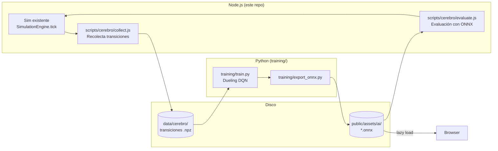

# RFC 0020: El Cerebro — Deep RL Fighting AI

**Status**: Proposed  
**Date**: 2026-04-21

## Problem

El AI actual (`src/systems/AIController.js`) es rule-based: árboles de decisión que revisan distancia, estado del oponente, salud, y stamina. Funciona para casual play pero es predecible — los patrones se descubren en pocas peleas. No hay sensación de *estilo* por personaje: todos los fighters pelean esencialmente igual a la misma dificultad. El AI tiene 5 niveles (easy → hard_plus) con parámetros configurados a mano (`thinkInterval`, `missRate`, `blockChance`, etc.), pero la estructura de decisión es idéntica para los 16 fighters.

## Solution

Reemplazar el AI rule-based con agentes entrenados por reinforcement learning. Cada uno de los 16 fighters recibe su propia red neuronal que desarrolla un estilo de pelea emergente a partir de sus stats únicos (speed, power, defense, special) y frame data de moves.

El entrenamiento usa la simulación determinista existente (`src/simulation/`) como entorno, recolecta datos en Node.js, entrena en Python, y exporta modelos ONNX para inferencia en el browser.

### Principios de diseño

1. **Todo local**: Entrenamiento, recolección de datos, y evaluación corren en la máquina del developer. Sin cloud, sin GPUs remotas.
2. **Un solo lenguaje por responsabilidad**: Node.js para simulación y evaluación (reutilizando la sim existente), Python solo para entrenamiento (lee datos de disco, produce ONNX). Sin port de la sim a Python.
3. **Incremental con gate**: POC con un solo fighter antes de escalar. Go/no-go gate explícito después de Phase 2.
4. **Feature flag**: El AI actual sigue como default de producción. El Cerebro se activa con `?ai=cerebro` y solo reemplaza al default cuando pasa todas las métricas de éxito.

## Design

### 1. Observation space (qué ve el agente)

Vector normalizado de floats, ~47 dimensiones:

**Nota sobre fixed-point**: Las posiciones y velocidades en `FighterSim` se almacenan como enteros fixed-point (`simX`, `simY` escalados por `FP_SCALE=1000`). La extracción de observación debe dividir por `FP_SCALE` primero y luego normalizar:
```js
posX_normalized = (fighter.simX / FP_SCALE) / STAGE_RIGHT  // correcto
// NO: fighter.simX / STAGE_RIGHT  // sería ~1000x demasiado grande
```

| Grupo | Dims | Valores |
|---|---|---|
| **Self position** | 2 | `(simX / FP_SCALE) / STAGE_RIGHT`, `(simY / FP_SCALE) / GROUND_Y` (0-1) |
| **Self velocity** | 2 | `(simVX / FP_SCALE) / MAX_VEL`, `(simVY / FP_SCALE) / MAX_VEL` (-1 a 1) |
| **Self resources** | 3 | `hp / MAX_HP`, `stamina / MAX_STAMINA_FP`, `special / MAX_SPECIAL_FP` (0-1) |
| **Self state** | 7 | One-hot: idle, walking, jumping, attacking, hurt, knockdown, blocking |
| **Self attack info** | 3 | `attackCooldown / MAX_COOLDOWN`, `attackFrameElapsed / MAX_COOLDOWN`, `isCurrentAttackActive` (0/1) |
| **Self combat** | 2 | `comboCount / MAX_COMBO`, `blockTimer / MAX_BLOCKSTUN` |
| **Self flags** | 4 | `isOnGround`, `facingRight`, `hasDoubleJumped`, `_isTouchingWall` (0/1 cada uno) |
| **Opponent position** | 2 | Misma normalización que self |
| **Opponent velocity** | 2 | Misma normalización que self |
| **Opponent resources** | 3 | Misma normalización que self |
| **Opponent state** | 7 | One-hot (mismos 7 estados) |
| **Opponent attack info** | 3 | `attackCooldown`, `attackFrameElapsed`, `isCurrentAttackActive` — cruciales para punish windows |
| **Opponent combat** | 2 | `comboCount`, `blockTimer` — misma normalización que self |
| **Opponent flags** | 4 | `isOnGround`, `facingRight`, `hasDoubleJumped`, `_isTouchingWall` |
| **Context** | 3 | `roundTimer / MAX_TIMER`, `distanceToOpponent / STAGE_WIDTH`, `distanceToNearestWall / (STAGE_WIDTH/2)` |
| **Total** | **47** | |

**Constantes de normalización**: `MAX_COOLDOWN` se computa una vez al inicio como el máximo `startup + active + recovery` global entre todos los fighters y todos los ataques (actualmente: special con 8+4+10 = 22 frames para varios fighters). Se usa el máximo global (no per-fighter) para que la semántica de la observación sea consistente entre agentes. Misma lógica para `MAX_BLOCKSTUN` (máximo `blockstun` global) y `MAX_COMBO` (hardcodeado a 10, suficiente para cualquier secuencia realista).

La inclusión de `attackCooldown` y `attackFrameElapsed` del oponente es crítica: sin ella, el agente no puede aprender a castigar recovery frames. `comboCount` es necesario para que los glass cannons optimicen el archetype bonus de combos ≥ 3. `blockTimer` permite a los tanks saber cuándo termina su blockstun para contraatacar. `hasDoubleJumped` e `_isTouchingWall` permiten juego aéreo y wall-jumps informados.

### 2. Action space (qué decide el agente)

Multi-discreto mapeado al encoding de 9 bits existente (`InputBuffer.js`):

| Dimensión | Opciones | Bits en InputBuffer |
|---|---|---|
| Movement | left / none / right (3) | bits 0-1 (`left`, `right`) |
| Jump | no / yes (2) | bit 2 (`up`) |
| Block | no / yes (2) | bit 3 (`down`) |
| Attack | none / lp / hp / lk / hk / special (6) | bits 4-8 (`lp`, `hp`, `lk`, `hk`, `sp`) |

**Total**: 3 × 2 × 2 × 6 = **72 combinaciones válidas**.

#### Mapping a 9 bits

La red neuronal produce un índice de acción (0-71). Una lookup table convierte ese índice a los 9 bits que `encodeInput()` espera:

```js
// Ejemplo de mapping
const ACTION_TABLE = [];
for (const move of [-1, 0, 1]) {         // left/none/right
  for (const jump of [0, 1]) {            // no/yes
    for (const block of [0, 1]) {         // no/yes
      for (const atk of [null, 'lp', 'hp', 'lk', 'hk', 'sp']) {
        ACTION_TABLE.push({ move, jump, block, atk });
      }
    }
  }
}
// ACTION_TABLE[57] → { move: 1, jump: 0, block: 1, atk: 'lk' }
// Stride: move(24) × jump(12) × block(6) × atk(1)
// Index: 2*24 + 0*12 + 1*6 + 3 = 57
// → encodeInput({ left: false, right: true, up: false, down: true,
//                  lp: false, hp: false, lk: true, hk: false, sp: false })
// → bits: right(bit1) + down(bit3) + lk(bit6) = 2 + 8 + 64 = 74 (0b001001010)
```

**Invariantes del mapping**:
- `left` + `right` simultáneo nunca ocurre (el eje movement es ternario, no dos bools independientes)
- Solo un ataque a la vez (el sim ignora ataques adicionales si ya hay uno activo)
- `jump` + `block` simultáneo es válido en el encoding pero el sim prioriza block si está en ground — documentado pero no restringido, el agente aprende la prioridad naturalmente
- La tabla tiene exactamente 72 entries, indexadas 0-71

### 3. Reward shaping

#### Rewards densos (por frame)

| Reward | Valor | Propósito |
|---|---|---|
| Daño infligido | `+dmg_dealt / 100` | Incentiva atacar |
| Daño recibido | `−dmg_taken / 100` | Incentiva defender |
| Acercarse al oponente | `+0.001` por frame si la velocidad del agente apunta hacia el oponente | Anti-camping. Basado en la velocidad propia del agente (`sign(velX) == sign(opponent.posX - self.posX)`), no en el delta de distancia — esto evita dar reward cuando el oponente se acerca solo |

#### Rewards escasos (por evento)

| Reward | Valor | Propósito |
|---|---|---|
| Ganar round | `+1.0` | Objetivo principal |
| Perder round | `−1.0` | Penalización principal |
| Ganar por timeup (ventaja HP) | `+0.5` | Reward parcial por ventaja |

#### Penalties

| Penalty | Valor | Condición | Propósito |
|---|---|---|---|
| Whiff en rango cercano | `−0.01` | Ataque falló **y** distancia al oponente < `avgReach * 1.5` | Anti-spam. Solo penaliza whiffs a distancia de castigo — los whiffs a distancia segura (zoning, space control) son legítimos y no se penalizan. `avgReach` es el promedio de `reach` de los ataques del fighter que lo tienen definido; si ningún ataque tiene `reach`, se usa 45px (la mediana global) |
| Esquina | `−0.005` / frame | Distancia a pared más cercana < 30px | Incentiva salir de la esquina |

#### Archetype bonus (por fighter, soft bias)

Derivados de stats en vez de hardcodeados — fighters con stats similares reciben incentivos similares automáticamente:

| Condición de stats | Archetype | Bonus |
|---|---|---|
| `speed >= 5` | Rushdown | `+0.005/frame` cuando `distancia < avgReach * 1.2` |
| `speed <= 2` | Zoner | `+0.005/frame` cuando `distancia > avgReach * 2.5` |
| `power >= 4 && defense <= 1` | Glass cannon | `+0.02` por combo ≥ 3 hits |
| `defense >= 4` | Tank/Counter | `+0.02` por secuencia block → hit dentro de 15 frames |
| Ninguna condición | Balanced | Sin bonus extra |

Donde `avgReach` es el promedio de reach de los 5 ataques del fighter. Esto hace que fighters con stats idénticos reciban los mismos incentivos, y fighters con stats divergentes desarrollen estilos divergentes **sin hardcodear el mapping**.

Fighters actuales por archetype derivado:
- **Rushdown** (speed ≥ 5): jeka, sun, gartner
- **Zoner** (speed ≤ 2): chicha, peks, richi
- **Glass cannon** (power ≥ 4, defense ≤ 1): sun, alv
- **Tank/Counter** (defense ≥ 4): cata, migue
- **Balanced**: simon, carito, mao, lini, cami, bozzi, angy, adil

Nota: algunos fighters caen en dos categorías (sun = rushdown + glass cannon). Los bonus se acumulan.

### 4. Training algorithm: Dueling DQN

**Por qué DQN sobre PPO**: El requisito es correr muchas iteraciones y guardar los datos localmente. PPO es on-policy — cada batch se usa una vez y se descarta. DQN con prioritized experience replay es **offline-compatible**: datos recolectados en una sesión se pueden reentrenar múltiples veces. El action space es discreto (72 combinaciones) que es el sweet spot de DQN.

Arquitectura:
- **Dueling DQN** con double Q-learning (reduce overestimation bias)
- **Prioritized experience replay** buffer (1M transiciones, muestreadas por TD-error priority)
- **Target network** actualizada cada 10K steps (Polyak average τ=0.005)
- Red: MLP `obs(47) → 128 → 128 → Q(72)` con ReLU activations
- ε-greedy exploration: ε decae de 1.0 → 0.05 en 500K steps

### 5. Training pipeline (todo local)

#### Arquitectura: un solo lenguaje por responsabilidad



**Por qué NO hay port de la sim a Python**: La simulación tiene ~1200 LOC de lógica determinista con fixed-point math (`FP_SCALE=1000`), edge cases de wall jumps, block stun, stamina regen, etc. Portarla a Python sería un proyecto en sí mismo con riesgo permanente de desync. En vez de eso:

- **Recolección** (Tier 1): Node.js usa la sim existente directamente. Zero riesgo de conformance.
- **Entrenamiento** (Tier 2): Python lee las transiciones `(obs, action, reward, next_obs, done)` de disco. No necesita simular nada — solo optimizar Q-values.
- **Evaluación**: Node.js carga modelos ONNX via `onnxruntime-node` y corre matches con el headless runner existente (`scripts/balance-sim/match-runner.js`). Reutiliza la misma infra del balance sim.

#### Tier 1 — Recolección de datos (Node.js)

Nuevo directorio `scripts/cerebro/`:

| File | Purpose |
|---|---|
| `env.js` | Gym-like wrapper: reset (nuevo match), step (tick + reward), observe (state → vector) |
| `collect.js` | CLI: corre N matches headless, guarda transiciones a disco |
| `action-table.js` | Lookup table de 72 acciones → 9-bit encoded input |
| `storage.js` | Escritura binaria `.npz`-compatible con compresión lz4 por batch |

**Frame-skip (action repeat)**: El agente decide cada **4 sim frames** — la acción elegida se repite durante los 3 frames intermedios. Esto es práctica estándar en RL para juegos de pelea y análogo al `thinkInterval` del AI rule-based (easy=40, hard=8). Solo se almacena la transición en el frame de decisión.

Esto es necesario porque DQN requiere tuplas completas `(obs, action, reward, next_obs, done)`. Las observaciones cambian cada frame (posiciones, velocidades, cooldowns), así que no se pueden reconstruir frames omitidos sin re-simular. Frame-skip resuelve esto reduciendo las transiciones a almacenar sin perder información.

```bash
node scripts/cerebro/collect.js --fighter=simon --episodes=100000 --workers=4 --frame-skip=4
```

Target de performance: ~1500 fights/sec single-threaded (M1 Mac), ~5000/sec con `worker_threads`.

Storage estimate (frame-skip=4):
- ~500 sim frames/episode ÷ 4 = ~125 decision-point transitions/episode
- Per transition: obs(47 floats) + action(1) + reward(1) + next_obs(47) + done(1) = 388 bytes
- 125 × 388 = ~48KB/episode
- 1M episodes ≈ 48GB raw → ~4-5GB con lz4 compression por batch

#### Tier 2 — Entrenamiento (Python)

Nuevo directorio top-level `training/`:

| File | Purpose |
|---|---|
| `replay_buffer.py` | Carga batches `.npz`, prioritized replay buffer |
| `dqn.py` | Dueling DQN + double Q-learning (CleanRL-style, single-file, minimal deps) |
| `train.py` | CLI: `python training/train.py --fighter=simon --data-dir=data/cerebro/simon/` |
| `export_onnx.py` | Exporta modelo entrenado a ONNX |
| `requirements.txt` | PyTorch, numpy, onnx |

#### Entrenamiento en dos fases distintas

**Fase A — Bootstrap (offline puro)**:
1. Recolectar datos contra el AI rule-based a varias dificultades (easy → hard_plus)
2. Entrenar DQN puramente offline desde los datos guardados
3. Esto produce un agente que ya es mejor que el rule-based

Esto es DQN offline clásico: collect once, train many times. No hay loop iterativo.

**Fase B — Self-play iterativo**:
1. Exportar el agente de Fase A a ONNX
2. Cargar ONNX en Node.js via `onnxruntime-node`
3. Recolectar datos con el agente entrenado como oponente
4. Agregar al replay buffer y reentrenar
5. Repetir hasta convergencia

Esto es un **loop iterativo de dos procesos** — documentado explícitamente como tal:

```bash
# Iteración N del self-play loop
node scripts/cerebro/collect.js --fighter=simon --opponent-model=data/cerebro/simon/checkpoint_N.onnx --episodes=50000
python training/train.py --fighter=simon --data-dir=data/cerebro/simon/ --resume=checkpoint_N.pt
python training/export_onnx.py --fighter=simon --checkpoint=checkpoint_N+1.pt
```

Cada iteración toma ~5-10 minutos (recolección + training). El replay buffer acumula datos de todas las iteraciones — DQN es off-policy, así que los datos viejos siguen siendo útiles (con priority decay).

**Past selves**: Se guardan checkpoints cada 100K steps. En iteraciones futuras, el oponente se samplea aleatoriamente entre: checkpoint actual (50%), past selves (30%), AI rule-based (20%). Esto previene catastrophic forgetting y overfitting al último oponente. Los ratios son configurables via CLI:

```bash
node scripts/cerebro/collect.js --fighter=simon --opponent-mix="current:0.5,past:0.3,rule:0.2" --episodes=50000
```

Si el agente empieza a overfitear al rule-based o los past selves son demasiado débiles, se puede ajustar sin cambiar código.

### 6. Diversity entre fighters

Fighters con stats similares (simon/bozzi/angy: speed=4, power~3-4) convergen a la misma política sin incentivos explícitos.

**Mecanismo — Intrinsic diversity reward**:
- Reward extra: `r_diversity = +0.01 * KL(π_agent || π_league_avg)`
- Esto incentiva a cada agente a encontrar su *nicho* en vez de converger a una sola meta.

**Workflow de cómputo** (resuelto en Python, no en JS):
1. **Data collection (JS)**: Guarda las tuplas base `(obs, action, reward, next_obs, done)` con los rewards de combate (daño, victoria, penalties). No computa KL — JS no tiene acceso a las 16 políticas.
2. **Training (Python)**: Antes de insertar en el replay buffer, Python agrega el bonus KL al reward almacenado. Para esto necesita:
   - La acción tomada (ya en la tupla)
   - La distribución de acciones del agente actual (forward pass del modelo)
   - La distribución promedio de la liga (recomputada cada 50K steps a partir de 1000 observaciones random por agente)
3. **Liga promedio**: Se mantiene un archivo `league_avg.npy` con la distribución promedio (72 floats). Se actualiza periódicamente durante Phase 3 cuando los 16 agentes ya tienen checkpoints. En Phase 2 (un solo fighter) no aplica.

Combinado con los archetype bonus de §3 (derivados de stats), cada fighter tiene dos fuerzas de diversificación: una global (KL reward, computada en Python) y una local (archetype bonus, computado en JS durante collection).

### 7. Inferencia en browser

- Exportar modelos a **ONNX** (MLP pequeño: 2 hidden layers × 128 units ≈ 50-100KB por fighter)
- Cargar via **ONNX Runtime Web** (WASM backend) — funciona en Safari iOS, sin WebGL
- Payload total: 16 × ~100KB = ~1.6MB (lazy-loaded por fighter, no upfront)
- **Pre-warm en PreFightScene**: ONNX WASM cold start es ~200ms, primera inferencia >5ms por JIT. Inicializar el runtime y correr una inferencia dummy durante el countdown de PreFight (3 segundos de tiempo muerto) para que la primera inferencia real en FightScene sea sub-1ms
- Inferencia determinista: misma observación → misma acción (argmax en hard; ε-greedy con seeded PRNG para dificultades fáciles)

### 8. Difficulty levels

Mapeados a los **5 niveles existentes** del AI rule-based para mantener paridad:

| Nivel | Modelo | ε (random actions) | Fuente |
|---|---|---|---|
| **Fácil** (1) | Checkpoint temprano (100K steps, agente débil) | 0.35 | Equivale a `easy` rule-based |
| **Fácil+** (2) | Checkpoint temprano (200K steps) | 0.25 | Equivale a `easy_plus` |
| **Normal** (3) | Checkpoint medio (400K steps) | 0.10 | Equivale a `medium` |
| **Difícil** (4) | Modelo final | 0.05 | Equivale a `hard` |
| **Difícil+** (5) | Modelo final | 0.00 (puro argmax) | Equivale a `hard_plus` |

Los checkpoints de entrenamiento proveen naturalmente una escalera de habilidad sin configuración manual.

### 9. Integración con código existente

Nueva clase `NeuralAIController` implementando la misma interfaz que `AIController`:

```js
class NeuralAIController {
  constructor(scene, fighter, opponent, difficulty) { ... }
  update(dt) { ... }  // Corre inferencia ONNX, setea this.decision
  setSeed(n) { ... }  // Semilla el PRNG del ε-greedy para replays deterministas
}

// Mismo output que AIController:
this.decision = {
  moveDir: 0,     // -1 left, 0 stop, 1 right
  jump: false,
  attack: null,   // null | 'lightPunch' | 'heavyPunch' | 'lightKick' | 'heavyKick' | 'special'
  block: false,
};
```

**Feature flag**: `?ai=cerebro` URL param O toggle en TitleScene. Default = `AIController` rule-based.

**Fallback automático**: Si el modelo ONNX falla al cargar (red, formato, etc.), se cae al `AIController` rule-based con un `log.warn`. El jugador nunca se queda sin oponente.

**Lazy load**: `BootScene` descarga `public/assets/ai/{fighterId}.onnx` solo para el fighter AI seleccionado. No se cargan los 16 modelos upfront.

**Rollback netcode**: Inferencia es pura (sin side effects), determinista (PRNG seeded), y corre en <1ms post pre-warm. Compatible con el rollback existente.

### 10. Evaluación: `cerebro-report`

Post-entrenamiento, `scripts/cerebro/evaluate.js` corre en Node.js (reutilizando `match-runner.js` + `onnxruntime-node`):

1. Round-robin: cada agente juega 500 matches vs cada otro → 16×15×500 = 120K matches
2. Win rate matrix (mismo formato que `balance-report.md`)
3. Tier placement por agente
4. Style profile por agente: distancia promedio, frecuencia de ataque, block rate, combo rate, whiff rate
5. Diversity score: KL divergence pairwise media
6. Anti-spam score: max action-repeat % por agente
7. Output: `cerebro-report.md` + `cerebro-report.json`

```bash
node scripts/cerebro/evaluate.js --models-dir=public/assets/ai/ --fights=500
```

Esto espeja el pipeline existente `bun run balance` — mismo formato, diferente fuente de input.

### 11. Success metrics (exit criteria)

El Cerebro se activa como default cuando **todos** los siguientes se cumplen:

| Métrica | Target | Cómo se mide |
|---|---|---|
| Win rate vs rule-based AI (por nivel) | Fácil: pierde 60-70%, Normal: ~50/50, Difícil: gana 70-80%, Difícil+: gana 95%+ | 1000 matches round-robin por fighter por nivel |
| Action diversity (anti-spam) | Max repeat-action streak < 40% de frames en cualquier match | 10K matches por agente |
| Style diversity (inter-agente) | Mean pairwise KL divergence > 0.5 nats entre los 16 agentes | Action distributions de 10K matches cada uno |
| Inferencia latency (post pre-warm) | p99 < 1ms en iPhone 15 Safari | `performance.now()` en debug mode |
| Model size | < 150KB por fighter ONNX | File size check |
| Sin regresiones de balance | Tier list de `bun run balance` no cambia más de 1 tier para ningún fighter | Comparar pre/post balance reports |

### 12. Go/No-Go gate después de Phase 2

Después de completar el POC con un solo fighter (Phase 2), se evalúa:

**Go** si el agente:
- Se acerca al oponente (no campea en esquina)
- Usa ataques variados (no spamea un solo move)
- Bloquea ataques incoming (al menos 30% de los que podría bloquear)
- "Se siente" cualitativamente diferente al AI rule-based en playtesting
- Inferencia sub-1ms post pre-warm en Safari

**No-Go** si:
- El agente converge a una política degenerada (spam, camping, inacción)
- La diferencia subjetiva con el rule-based no es perceptible
- La latencia de inferencia ONNX WASM es >2ms p99
- El esfuerzo de escalar a 16 fighters no se justifica vs mejorar el rule-based

Si es No-Go, se explora la **alternativa incremental**: mejorar el AI rule-based derivando parámetros de stats (`idealRange` basado en `reach`, `blockChance` basado en `defense`, `thinkInterval` basado en `speed`) + agregar variación por fighter + patrones de combo condicionales. Esto no requiere ML y resuelve el problema de "todos pelean igual" con ~2-3 días de trabajo.

## File Plan

### New files

| File | Purpose |
|---|---|
| `docs/rfcs/0020-el-cerebro-deep-rl-ai.md` | Este documento |

Todos los archivos de `scripts/cerebro/`, `training/`, y `public/assets/ai/` son trabajo de implementación de Phases 1-5, no parte de este PR.

### Files que se modificarán (en phases futuras)

| File | Change |
|---|---|
| `src/systems/NeuralAIController.js` | Nueva clase (Phase 4) |
| `src/scenes/BootScene.js` | Lazy-load ONNX model (Phase 4) |
| `src/scenes/PreFightScene.js` | Pre-warm ONNX runtime (Phase 4) |
| `src/scenes/FightScene.js` | Feature flag `?ai=cerebro` para usar `NeuralAIController` (Phase 4) |
| `package.json` | Agregar `onnxruntime-node` como dev dependency (Phase 1) |

## Implementation Plan

### Phase 1 — Data collection pipeline (~1 semana)

Construir `scripts/cerebro/` con env wrapper, collect CLI, delta-encoded storage, action table.
Correr 100K peleas para Simon como validación. Guardar en `data/cerebro/simon/`.

**Deliverable**: `node scripts/cerebro/collect.js --fighter=simon --episodes=100000` produce archivos `.npz` válidos.

### Phase 2 — Single-fighter DQN POC (~1 semana)

Python `training/` con Dueling DQN. Entrenar con datos de Simon (bootstrap offline contra rule-based). Exportar ONNX. Cargar ONNX en Node.js y evaluar contra rule-based AI.

**Deliverable**: Un modelo ONNX que gana >50% contra el AI rule-based en medium **y** pasa los criterios cualitativos del go/no-go gate (§12). El target de >70% contra hard es para el modelo final post-self-play (Phase 3), no para el POC bootstrap.

### **GO/NO-GO GATE**

Evaluar el POC contra los criterios de §12. Si no-go, pivotar a mejoras del AI rule-based.

### Phase 3 — Self-play + diversidad (~2 semanas, solo si go)

Extender recolección a los 16 fighters. Loop de self-play iterativo (Fase B de §5).
Entrenar con diversity rewards + archetype bonus derivados de stats.
Guardar checkpoints a 100K/200K/400K/final para la escalera de dificultad.

**Deliverable**: 16 modelos ONNX con `cerebro-report` que muestra KL divergence > 0.5 nats.

### Phase 4 — Integración browser (~1 semana)

`NeuralAIController` con feature flag, pre-warm en PreFightScene, lazy-load en BootScene, selector de dificultad mapeado a 5 niveles.

**Deliverable**: `?ai=cerebro` funciona end-to-end en Safari iOS.

### Phase 5 — Evaluación + playtesting (~1 semana)

Correr `cerebro-report`, validar todas las success metrics. Playtesting con el grupo.
Player feedback → retrain cycle si es necesario.

**Deliverable**: Todas las métricas de §11 cumplidas. Ship como default o mantener como opt-in.

## Alternatives Considered

1. **PPO en vez de DQN**: Rechazado. PPO es on-policy — los datos se usan una vez y se descartan. El requisito de guardar datos y reentrenar offline favorece DQN con experience replay. El action space discreto (72 acciones) es el sweet spot de DQN.

2. **Port completo de la sim a Python**: Rechazado. ~1200 LOC de lógica determinista con fixed-point math, edge cases de wall jumps, stamina, block stun. El riesgo de desync permanente no justifica el beneficio. Usar `onnxruntime-node` para evaluación en Node.js elimina la necesidad del port completamente.

3. **Solo mejorar el AI rule-based**: Considerado como fallback si el POC no pasa el go/no-go gate. Derivar parámetros de stats, agregar variación por fighter, patrones de combo. Resuelve "todos pelean igual" sin ML. Menor wow-factor, pero mucho menor costo (~3 días vs ~6 semanas).

4. **Exploiter agents separados (como AlphaStar)**: Diferido. El plan original proponía entrenar agents cuyo único propósito es explotar debilidades del agent principal. Esto agrega complejidad significativa al loop de self-play para un beneficio marginal en un juego de amigos. Los past selves + diversity reward logran un efecto similar con mucha menos complejidad.

5. **Training en la nube**: Rechazado. Agrega setup, costo, y dependency external. Las redes son pequeñas (MLP 39→128→128→72), un laptop con GPU (incluso una 3060) es suficiente. Un M1/M2 Mac sin GPU discreta puede entrenar en CPU en tiempo razonable para estos tamaños.

## Risks

- **Políticas degeneradas**: El RL puede converger a spam, camping, o inacción. Mitigación: whiff penalty condicionado a rango, esquina penalty, anti-spam metric como exit criteria. Si persiste, es el trigger del no-go gate.
- **Overhead de pipeline**: El loop JS↔Python es operativamente más complejo que un solo lenguaje. Mitigación: scripts CLI claros, sin state compartido más allá de archivos en disco.
- **ONNX WASM en Safari iOS**: ONNX Runtime Web funciona en Safari con WASM backend, pero el ecosistema es menos maduro que en Chrome. Mitigación: pre-warm esconde el cold start, y el fallback al AI rule-based garantiza que el juego nunca se rompe.
- **Determinism con floats**: La sim usa fixed-point integers pero el ONNX model usa float32. Diferentes plataformas podrían producir Q-values ligeramente distintos para la misma observación. Mitigación: argmax sobre Q-values es robusto a variaciones pequeñas. Para el ε-greedy seeded, el PRNG vive en JS (no en ONNX), así que es determinista independientemente de la plataforma.
- **Scope creep**: 6 semanas para un juego entre amigos es significativo. Mitigación: el go/no-go gate después de Phase 2 (~2 semanas) limita el downside. Si no pasa, se pivotan 2 semanas de trabajo al rule-based mejorado.
- **Inflation de dificultad post-balance**: Entrenar agentes RL puede cambiar el balance percibido entre fighters (un fighter con stats mediocres pero buena policy podría sentirse OP). Mitigación: métrica de "sin regresiones de balance" como exit criteria.
