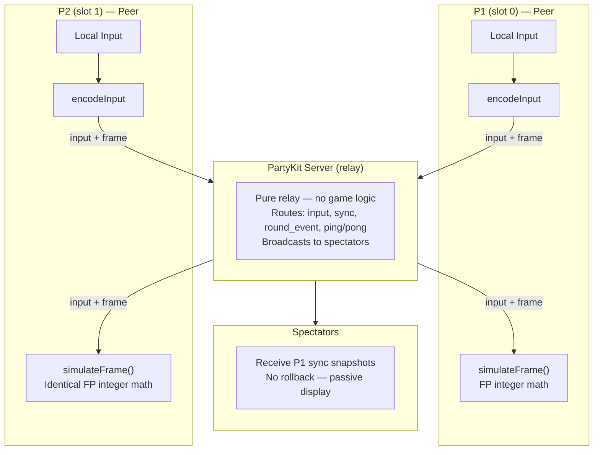
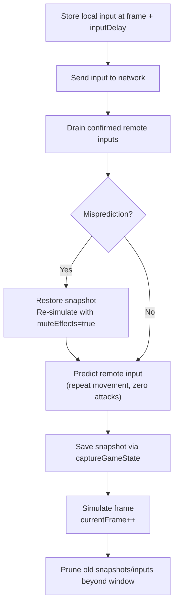

# Rollback Netcode Architecture

GGPO-style input prediction + rollback for online fighting. Both peers run identical deterministic simulations with zero perceived input lag.

## Overview

## Peer-Equal Model

Both peers are equal in the simulation. There is no host/guest distinction for gameplay — both independently detect KO, timeup, round transitions, and match over. Deterministic fixed-point math guarantees bit-for-bit agreement.

P1 has additional **non-gameplay** responsibilities:
- Sends sync snapshots to spectators (every 3 frames)
- Sends `round_event` messages for spectators (3x with 200ms spacing)
- Handles potion requests from spectators

## Simulation Step

Each frame, `simulateFrame()` runs these steps in order using fixed-point integer math (no floats):

1. `fighter.update()` — FP gravity, cooldown frame timers
2. `applyInput()` — FP velocities, attack triggers
3. `resolveBodyCollision()` — FP coordinate push-back
4. `faceOpponent()` — simX comparison
5. `checkHit()` — `fpRectsOverlap()` hitbox detection
6. `tickTimer()` — frame-counted (60 frames = 1 second)
7. `syncSprite()` — render positions from sim state

## RollbackManager.advance() — Per Frame

## Parameters

| Parameter | Value | Notes |
|-----------|-------|-------|
| `inputDelay` | 2 frames | Local input buffering |
| `maxRollbackFrames` | 7 (~117ms) | Max frames to re-simulate on misprediction |
| `FIXED_DELTA` | 16.667ms (60fps) | Deterministic timestep |
| Input encoding | 9 bits | `l, r, u, d, lp, hp, lk, hk, sp` packed as integer |
| `FP_SCALE` | 1000x | Integer math for determinism |

## Key Files

| File | Role |
|------|------|
| `FixedPoint.js` | FP constants + helpers |
| `GameState.js` | Snapshot/restore (simX, simY, hp, etc.) |
| `InputBuffer.js` | 9-bit input encoding/decoding |
| `SimulationStep.js` | Single-frame deterministic advance |
| `RollbackManager.js` | Orchestration (predict, rollback, re-simulate) |
| `Fighter.js` | FP physics + frame-based timers |
| `CombatSystem.js` | FP collision + hit detection |
| `FightScene.js` | Integration + render |
