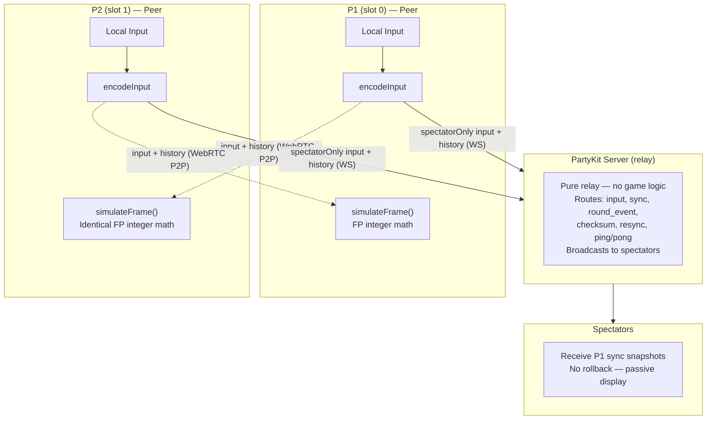
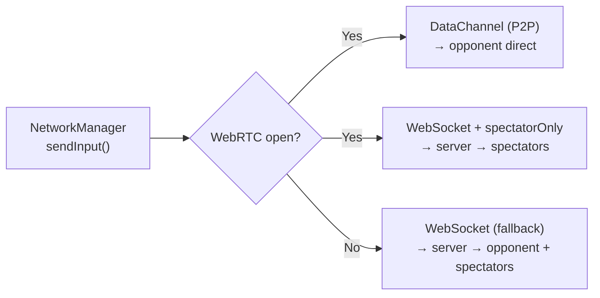
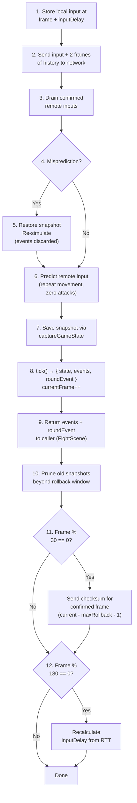
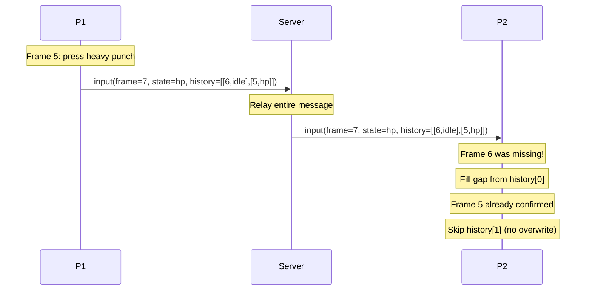
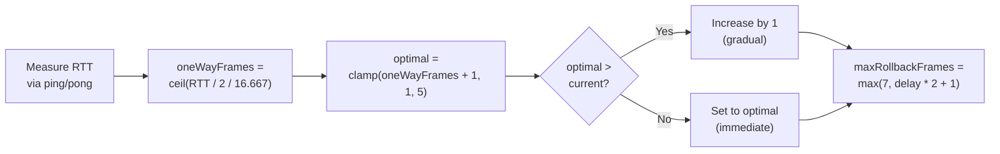
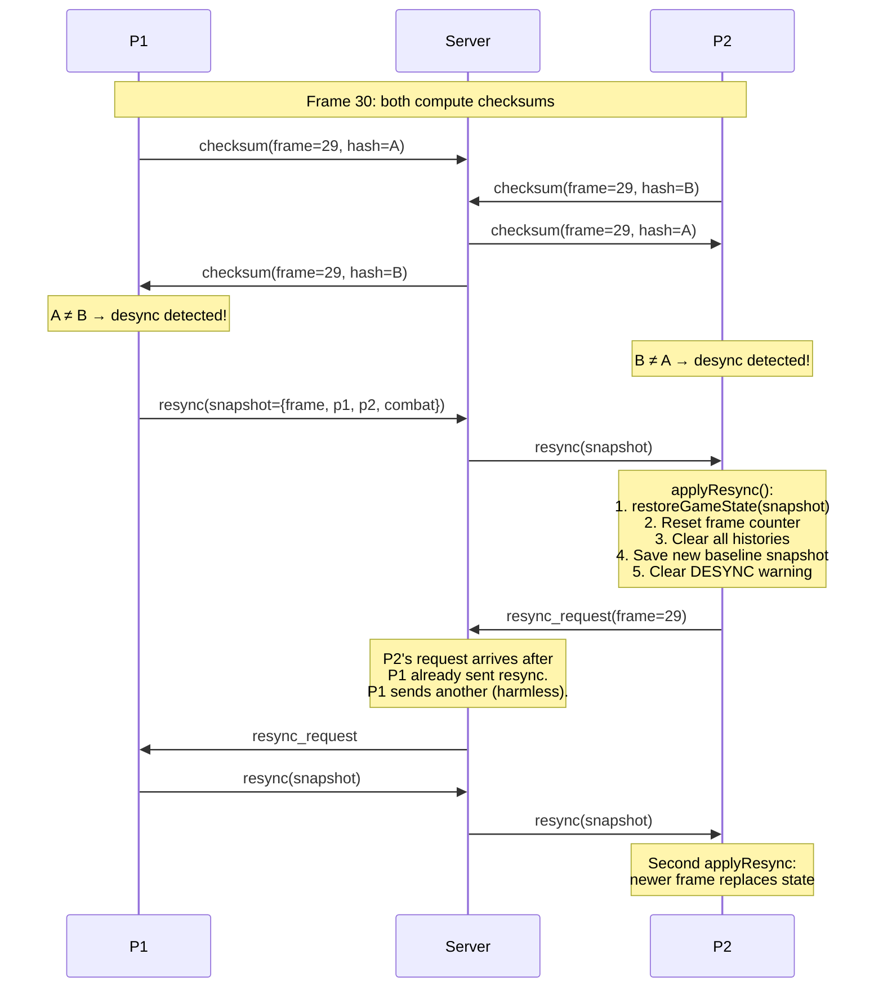
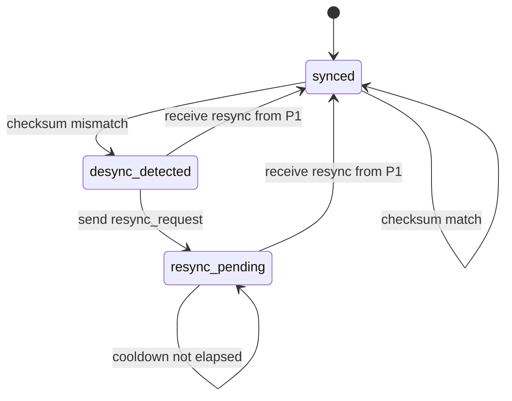
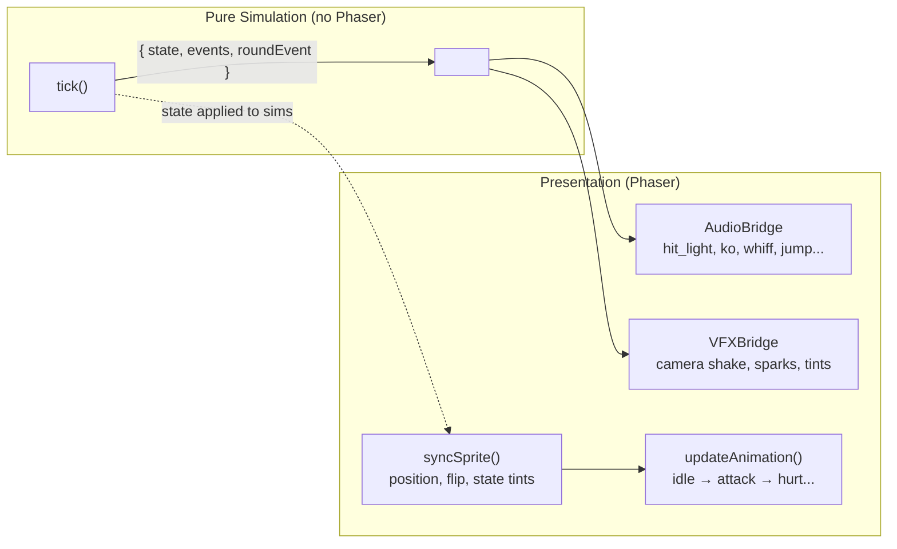

# Rollback Netcode Architecture

GGPO-style input prediction + rollback for online fighting. Both peers run identical deterministic simulations with zero perceived input lag.

## Overview



> **Transport:** Game inputs use WebRTC DataChannels (P2P, unreliable/unordered) when available, with automatic fallback to WebSocket relay via the PartyKit server. The rollback system handles packet loss natively. See [webrtc-transport.md](webrtc-transport.md) for full details.

## Transport Layer



The rollback system is transport-agnostic — `RollbackManager` reads from `remoteInputBuffer` regardless of whether inputs arrived via DataChannel or WebSocket. This means:
- **No code changes** in RollbackManager, GameState, SimulationStep, or InputBuffer
- **Packet loss** on the unreliable DataChannel is handled the same as late TCP delivery — prediction + rollback
- **Mid-fight transport switch** (P2P drops → WS fallback) is invisible to the simulation layer

## Peer-Equal Model with Deferred Round Events

Both peers run identical deterministic simulations with zero perceived input lag. Round-ending events (KO/timeup) are **deferred** — `tick()` returns a round event descriptor instead of firing side effects directly. All audio and visual effects flow through an **event-driven presentation layer** (see [Event-Driven Presentation](#event-driven-presentation) below), so rollback re-simulation never produces ghost sounds or visual artifacts.

Both P1 and P2 set `combat.suppressRoundEvents = true` in online mode:
- **P1 (host):** Captures round events from `advance()` return value, calls `onRoundOver()`/`onMatchOver()` for UI transitions, and sends the event to P2 + spectators
- **P2 (guest):** Ignores local round event detection; receives authoritative round events from P1 via `onRoundEvent` network handler

P1 has additional **non-gameplay** responsibilities:
- Sends sync snapshots to spectators (every 3 frames)
- Sends `round_event` messages to P2 + spectators (3x with 200ms spacing)
- Handles potion requests from spectators
- Sends authoritative resync snapshots on desync detection

## Simulation Step

Each frame, `tick()` (in `SimulationEngine.js`) runs these steps in order using fixed-point integer math (no floats) and returns `{ state, events, roundEvent }`:

1. `fighter.update(events)` — FP gravity, cooldown frame timers; emits `whiff` event on attack end without hit
2. `applyInputToFighter(fighter, input, events)` — FP velocities, attack triggers; emits `jump`, `special_charge` events
3. `resolveBodyCollision()` — FP coordinate push-back
4. `faceOpponent()` — simX comparison
5. `checkHit(attacker, defender, events)` — `fpRectsOverlap()` hitbox detection; emits `hit` or `hit_blocked` events
6. `tickTimer()` — frame-counted (60 frames = 1 second); returns `{ timeup: true }` when timer reaches 0
7. Round state update — if KO or timeup: stop round, increment rounds, check match over, emit `round_ko` or `round_timeup` event
8. Transition timer — deterministic round reset countdown (both peers agree on frame)
9. `captureGameState()` — return immutable snapshot for rollback window

KO takes priority over timeup if both occur on the same frame. The caller (`RollbackManager.advance()` or the local update loop) feeds `events` to presentation bridges and uses `roundEvent` for game flow.

> **Note:** Both local mode (vs AI) and online mode use the same `tick()` function. The only difference is input source (keyboard/AI vs network). This eliminates the class of bugs where local and online modes diverge.

## RollbackManager.advance() — Per Frame



## Parameters

| Parameter | Value | Notes |
|-----------|-------|-------|
| `inputDelay` | 3 frames (`ONLINE_INPUT_DELAY`), adaptive 1-5 | Local input buffering, adjusts to RTT every 180 frames |
| `maxRollbackFrames` | 7 (~117ms), scales with `inputDelay` | `max(7, inputDelay * 2 + 1)` |
| `FIXED_DELTA` | 16.667ms (60fps) | Deterministic timestep |
| Input encoding | 9 bits | `l, r, u, d, lp, hp, lk, hk, sp` packed as integer |
| `FP_SCALE` | 1000x | Integer math for determinism |
| Input redundancy | 2 frames | Each packet includes last 2 inputs as backup |
| Checksum interval | 30 frames (~0.5s) | XOR-rotate hash over 16 game state fields |
| Adaptive delay interval | 180 frames (~3s) | RTT-based delay recalculation |
| Resync cooldown | 60 frames (~1s) | Min time between resync attempts |

## Input Redundancy

Each input packet includes the last 2 frames of local input history so a single lost WebSocket message doesn't drop an attack.



The receiver fills gaps in `remoteInputBuffer` from `history` entries without overwriting already-confirmed data.

## Adaptive Input Delay

Input delay is recalculated every 180 frames (~3s) based on smoothed RTT:



| RTT | One-way frames | Optimal delay | Max rollback |
|-----|---------------|---------------|-------------|
| 0-16ms (LAN) | 0-1 | 1-2 frames | 7 |
| 50ms | 2 | 3 frames | 7 |
| 100ms | 3 | 4 frames | 9 |
| 150ms+ | 5+ | 5 frames | 11 |

## Desync Detection & Recovery

Both peers exchange state checksums every 30 frames. Checksums compare **confirmed** frames (`currentFrame - maxRollbackFrames - 1`) to avoid false positives from predicted inputs. On mismatch, P1 sends an authoritative state snapshot to resync P2.

### Detection

`hashGameState()` computes an XOR-rotate hash over 16 key integer fields:

```
p1: simX, simY, hp, special, stamina, attackCooldown, hurtTimer
p2: simX, simY, hp, special, stamina, attackCooldown, hurtTimer
combat: timer, roundNumber
```

### Recovery Flow



### Resync State Machine (P2)



### Server Relay Rules

| Message | From | Relayed to | Spectators |
|---------|------|-----------|------------|
| `checksum` | Either peer | Other peer | No |
| `resync_request` | Either peer | Other peer | No |
| `resync` | Slot 0 only | Other peer | No |
| `resync` | Slot 1 | **Dropped** | No |

## Event-Driven Presentation

The simulation is **pure** — `tick()` never calls audio, camera, or sprite methods. Instead, it returns an `events` array describing what happened. Separate bridge modules consume these events and trigger the actual presentation effects.



### Event types

| Event | When | Key fields |
|-------|------|------------|
| `hit` | Attack connects | `attackerIndex`, `defenderIndex`, `intensity`, `damage`, `ko`, `hitX`, `hitY` |
| `hit_blocked` | Defender is blocking | Same as `hit` |
| `whiff` | Attack ends without hitting | `playerIndex` |
| `jump` | Fighter leaves the ground | `playerIndex` |
| `special_charge` | Special attack starts | `playerIndex` |
| `round_ko` | Fighter's HP reaches 0 | `winnerIndex`, `matchOver` |
| `round_timeup` | Round timer expires | `winnerIndex`, `matchOver` |

### Why events instead of direct calls

During **rollback re-simulation**, the game replays past frames with corrected inputs. If the simulation directly played sounds or shook the camera, every re-simulated frame would produce ghost effects. The event-based approach eliminates this entirely:

- **Normal frame:** `tick()` returns events → bridges play audio/VFX
- **Resim frame:** `tick()` returns events → **events discarded** (never passed to bridges)

No flags, no guards, no risk of forgetting to check a mute condition.

### State-driven vs one-shot presentation

Not all visual effects are events. Some depend on the fighter's current state rather than a one-shot occurrence:

| Effect | Type | Where |
|--------|------|-------|
| Block tint (blue) | State-driven | `Fighter.syncSprite()` — applied when `sim.state === 'blocking'` |
| Special tint (yellow) | State-driven | `Fighter.syncSprite()` — applied when `sim._specialTintTimer > 0` |
| Sprite flip (facing) | State-driven | `Fighter.syncSprite()` — from `sim.facingRight` |
| Hit flash (white/red) | One-shot event | `VFXBridge` — 80ms/150ms via `scene.time.delayedCall()` |
| Camera shake | One-shot event | `VFXBridge` — intensity varies by attack type |
| Hit spark particles | One-shot event | `VFXBridge` — position from event's `hitX`/`hitY` |

## Key Files

| File | Role |
|------|------|
| `SimulationEngine.js` | `tick()` — deterministic frame advance, returns `{ state, events, roundEvent }` |
| `FighterSim.js` | Pure fighter state + logic (no Phaser). Emits `whiff`, `jump`, `special_charge` events |
| `CombatSim.js` | Pure combat resolution. Emits `hit`, `hit_blocked` events |
| `AudioBridge.js` | Maps sim events → `audioManager.play()` |
| `VFXBridge.js` | Maps sim events → camera shake, hit sparks, tint flashes |

| File | Role |
|------|------|
| `FixedPoint.js` | FP constants + helpers, `ONLINE_INPUT_DELAY` |
| `SimulationEngine.js` | `tick()` — deterministic frame advance, event generation, snapshot capture |
| `GameState.js` | Re-exports from SimulationEngine (snapshot/restore, `hashGameState()`) |
| `InputBuffer.js` | 9-bit input encoding/decoding |
| `FighterSim.js` | Pure fighter state + logic (no Phaser) |
| `CombatSim.js` | Pure combat resolution (no Phaser) |
| `RollbackManager.js` | Orchestration: predict, rollback, re-simulate, checksum, adaptive delay, resync |
| `AudioBridge.js` | Maps sim events → audio playback |
| `VFXBridge.js` | Maps sim events → camera shake, sparks, tint flashes |
| `Fighter.js` | Phaser sprite wrapper; delegates to FighterSim; `syncSprite()` + `updateAnimation()` |
| `CombatSystem.js` | Phaser wrapper; delegates to CombatSim; timer management |
| `WebRTCTransport.js` | P2P DataChannel transport (unreliable/unordered) |
| `NetworkManager.js` | Dual transport: WebRTC primary, WebSocket fallback; send/receive input, checksum, resync |
| `FightScene.js` | Integration: wires rollback + bridges + desync + resync + HUD |
| `party/server.js` | Relay: routes messages between peers, enforces resync authority |
