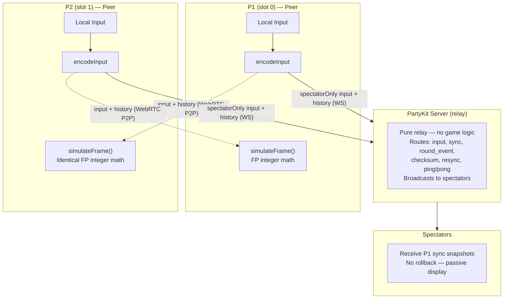
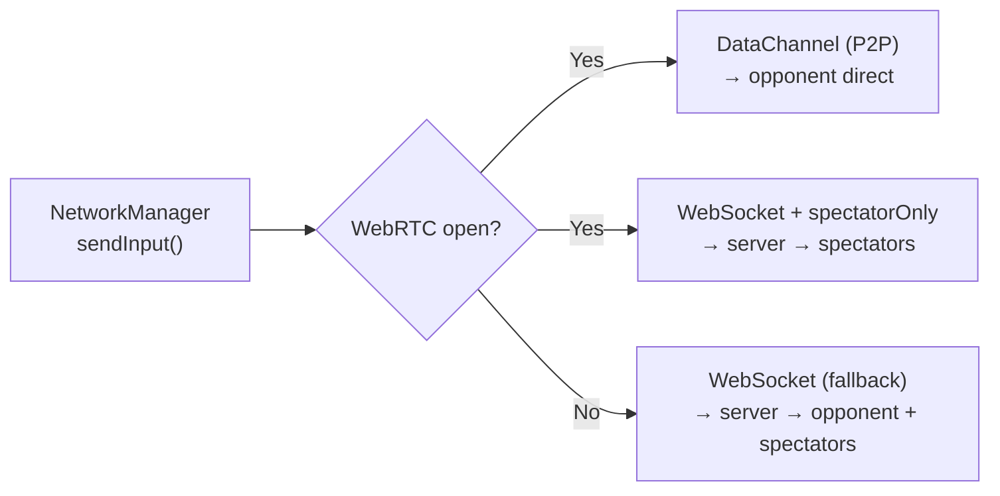
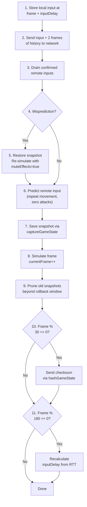
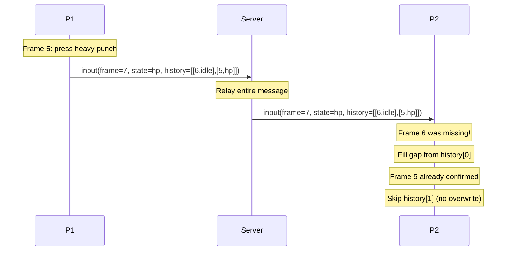
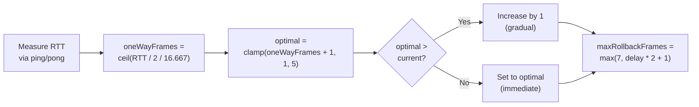
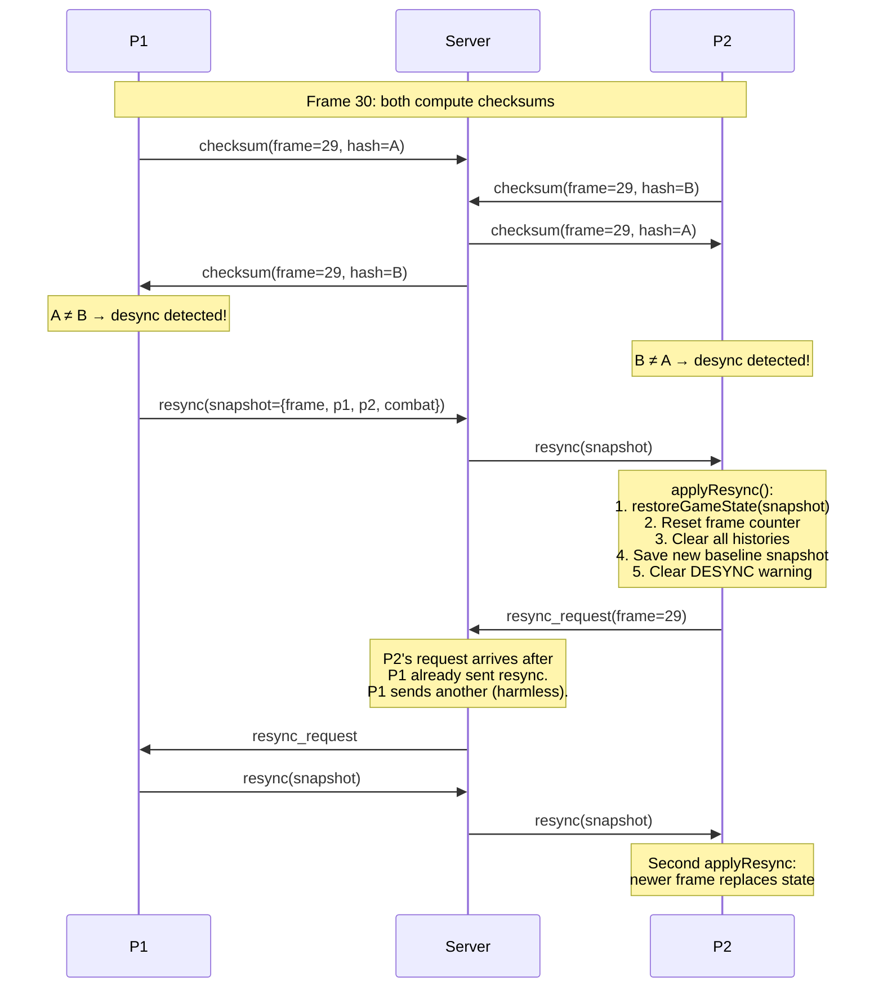
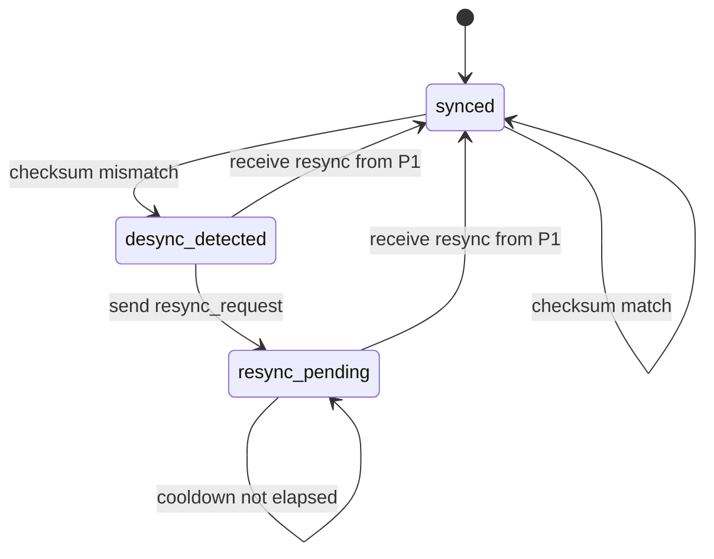

# Rollback Netcode Architecture

GGPO-style input prediction + rollback for online fighting. Both peers run identical deterministic simulations with zero perceived input lag.

## Overview



> **Transport:** Game inputs use WebRTC DataChannels (P2P, unreliable/unordered) when available, with automatic fallback to WebSocket relay via the PartyKit server. The rollback system handles packet loss natively. See [webrtc-transport.md](webrtc-transport.md) for full details.

## Transport Layer



The rollback system is transport-agnostic — `RollbackManager` reads from `remoteInputBuffer` regardless of whether inputs arrived via DataChannel or WebSocket. This means:
- **No code changes** in RollbackManager, GameState, SimulationStep, or InputBuffer
- **Packet loss** on the unreliable DataChannel is handled the same as late TCP delivery — prediction + rollback
- **Mid-fight transport switch** (P2P drops → WS fallback) is invisible to the simulation layer

## Peer-Equal Model

Both peers are equal in the simulation. There is no host/guest distinction for gameplay — both independently detect KO, timeup, round transitions, and match over. Deterministic fixed-point math guarantees bit-for-bit agreement.

P1 has additional **non-gameplay** responsibilities:
- Sends sync snapshots to spectators (every 3 frames)
- Sends `round_event` messages for spectators (3x with 200ms spacing)
- Handles potion requests from spectators
- Sends authoritative resync snapshots on desync detection

## Simulation Step

Each frame, `simulateFrame()` runs these steps in order using fixed-point integer math (no floats):

1. `fighter.update()` — FP gravity, cooldown frame timers
2. `applyInput()` — FP velocities, attack triggers
3. `resolveBodyCollision()` — FP coordinate push-back
4. `faceOpponent()` — simX comparison
5. `checkHit()` — `fpRectsOverlap()` hitbox detection
6. `tickTimer()` — frame-counted (60 frames = 1 second)
7. `syncSprite()` — render positions from sim state

## RollbackManager.advance() — Per Frame



## Parameters

| Parameter | Value | Notes |
|-----------|-------|-------|
| `inputDelay` | 3 frames (`ONLINE_INPUT_DELAY`), adaptive 1-5 | Local input buffering, adjusts to RTT every 180 frames |
| `maxRollbackFrames` | 7 (~117ms), scales with `inputDelay` | `max(7, inputDelay * 2 + 1)` |
| `FIXED_DELTA` | 16.667ms (60fps) | Deterministic timestep |
| Input encoding | 9 bits | `l, r, u, d, lp, hp, lk, hk, sp` packed as integer |
| `FP_SCALE` | 1000x | Integer math for determinism |
| Input redundancy | 2 frames | Each packet includes last 2 inputs as backup |
| Checksum interval | 30 frames (~0.5s) | XOR-rotate hash over 16 game state fields |
| Adaptive delay interval | 180 frames (~3s) | RTT-based delay recalculation |
| Resync cooldown | 60 frames (~1s) | Min time between resync attempts |

## Input Redundancy

Each input packet includes the last 2 frames of local input history so a single lost WebSocket message doesn't drop an attack.



The receiver fills gaps in `remoteInputBuffer` from `history` entries without overwriting already-confirmed data.

## Adaptive Input Delay

Input delay is recalculated every 180 frames (~3s) based on smoothed RTT:



| RTT | One-way frames | Optimal delay | Max rollback |
|-----|---------------|---------------|-------------|
| 0-16ms (LAN) | 0-1 | 1-2 frames | 7 |
| 50ms | 2 | 3 frames | 7 |
| 100ms | 3 | 4 frames | 9 |
| 150ms+ | 5+ | 5 frames | 11 |

## Desync Detection & Recovery

Both peers exchange state checksums every 30 frames. On mismatch, P1 sends an authoritative state snapshot to resync P2.

### Detection

`hashGameState()` computes an XOR-rotate hash over 16 key integer fields:

```
p1: simX, simY, hp, special, stamina, attackCooldown, hurtTimer
p2: simX, simY, hp, special, stamina, attackCooldown, hurtTimer
combat: timer, roundNumber
```

### Recovery Flow



### Resync State Machine (P2)



### Server Relay Rules

| Message | From | Relayed to | Spectators |
|---------|------|-----------|------------|
| `checksum` | Either peer | Other peer | No |
| `resync_request` | Either peer | Other peer | No |
| `resync` | Slot 0 only | Other peer | No |
| `resync` | Slot 1 | **Dropped** | No |

## Key Files

| File | Role |
|------|------|
| `FixedPoint.js` | FP constants + helpers, `ONLINE_INPUT_DELAY` |
| `GameState.js` | Snapshot/restore, `hashGameState()` for checksums |
| `InputBuffer.js` | 9-bit input encoding/decoding |
| `SimulationStep.js` | Single-frame deterministic advance |
| `RollbackManager.js` | Orchestration: predict, rollback, re-simulate, checksum, adaptive delay, resync |
| `WebRTCTransport.js` | P2P DataChannel transport (unreliable/unordered) |
| `NetworkManager.js` | Dual transport: WebRTC primary, WebSocket fallback; send/receive input, checksum, resync |
| `Fighter.js` | FP physics + frame-based timers |
| `CombatSystem.js` | FP collision + hit detection |
| `FightScene.js` | Integration: wires rollback + desync + resync + HUD |
| `party/server.js` | Relay: routes messages between peers, enforces resync authority |
