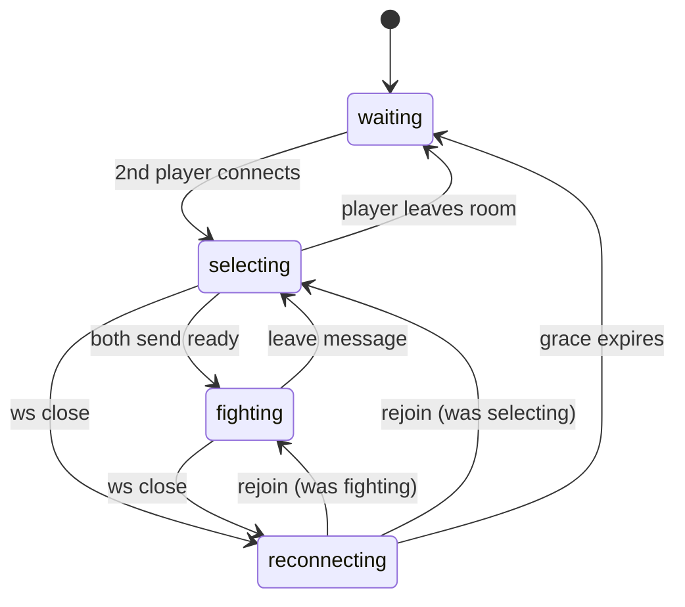
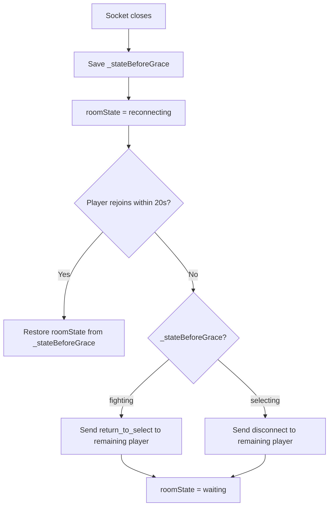

# Room State Machine

The server (`party/server.js`) tracks an explicit `roomState` that determines how disconnections are handled. Clients never track room state — they react to server messages that trigger scene transitions.

## States

| State | Meaning |
|-------|---------|
| `waiting` | 0–1 players connected, no opponent yet |
| `selecting` | Both players connected, choosing fighters |
| `fighting` | Both players readied up, fight in progress |
| `reconnecting` | A player's socket dropped, grace period running |

## Transitions

## Grace Period Behavior

When a player's WebSocket closes, the server saves `_stateBeforeGrace` (the state before the drop) and enters `reconnecting`. A 20-second grace timer starts.

### Why two different messages?

- **`return_to_select`**: Grace expired during a fight. The room is still viable — the remaining player transitions back to `SelectScene` while keeping their `NetworkManager` connection alive. A new opponent can join and both re-select fighters.
- **`disconnect`**: Grace expired during fighter select. The remaining player goes to `TitleScene` and the `NetworkManager` is destroyed.

## Client Handling

The client's current Phaser scene is its implicit state. It reacts to server messages:

| Message | SelectScene | FightScene |
|---------|------------|------------|
| `opponent_reconnecting` | — | Show "RECONECTANDO..." overlay |
| `opponent_reconnected` | — | Hide overlay, resume |
| `disconnect` | Go to TitleScene | Show "DESCONECTADO" (frozen) |
| `return_to_select` | — | Show "DESCONECTADO" for 2s, fade to SelectScene |
