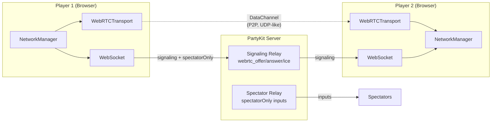
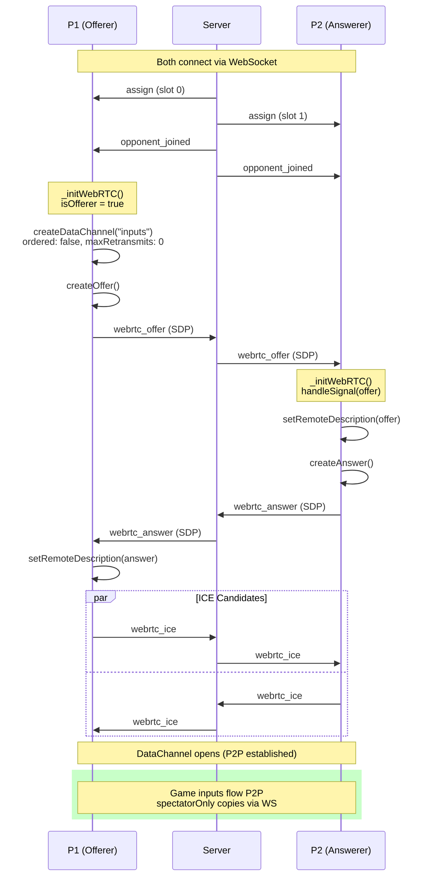
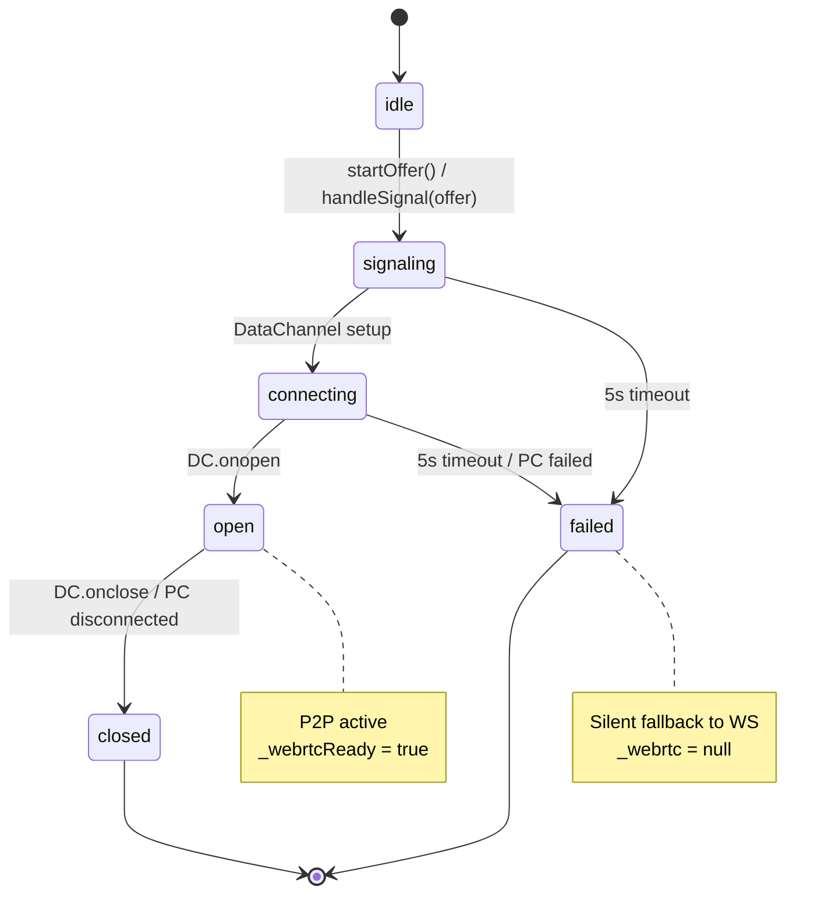
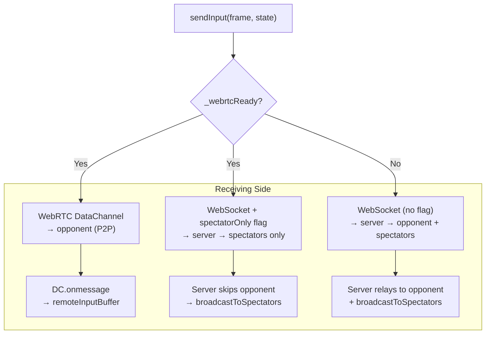
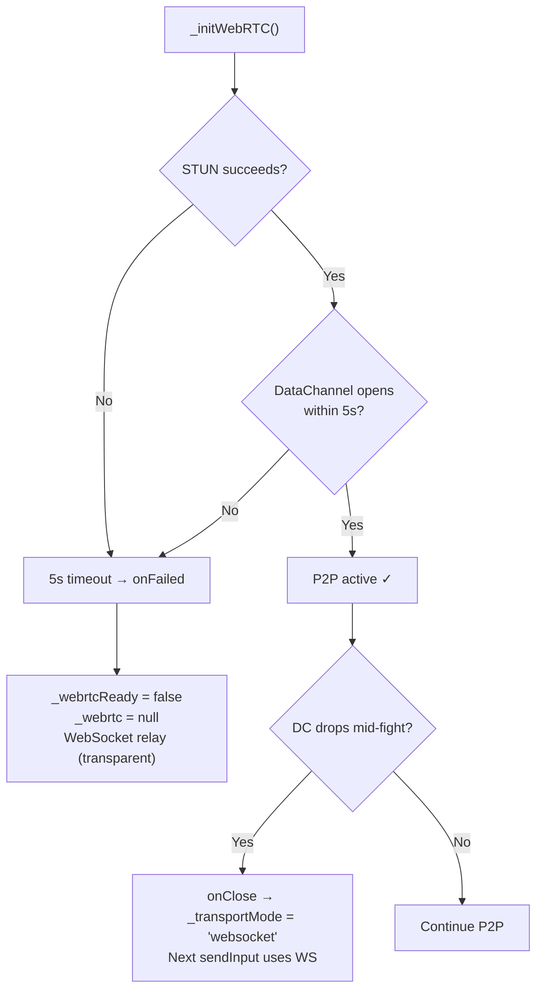
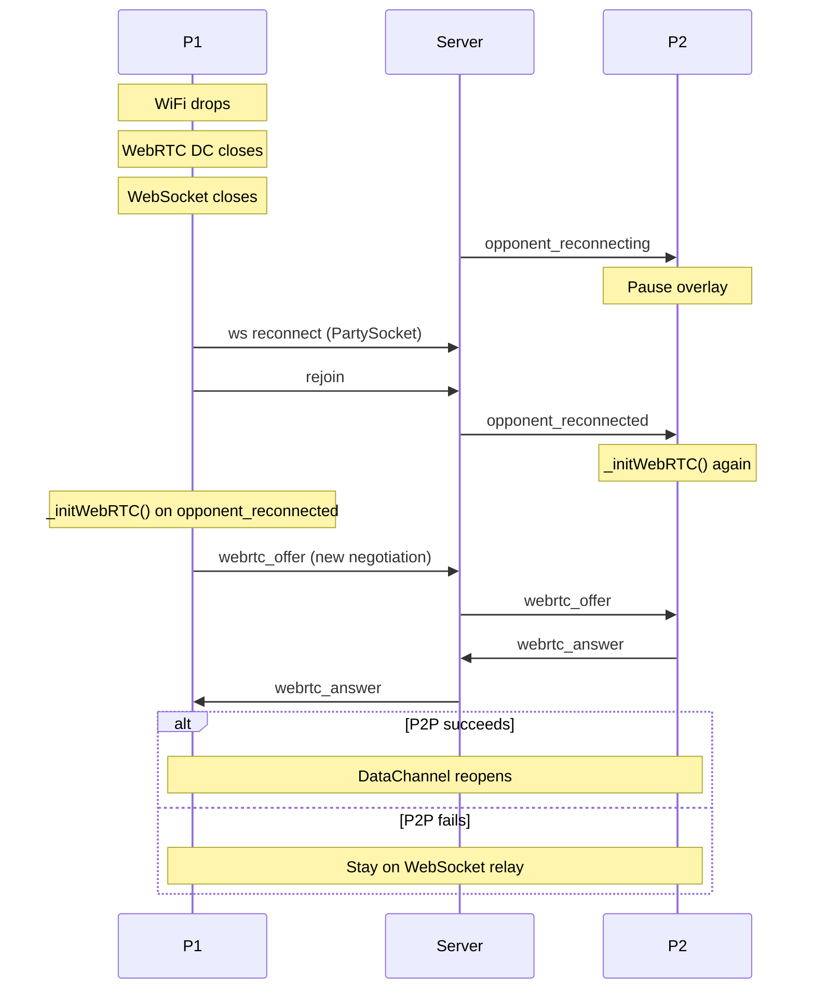

# WebRTC P2P Transport

WebRTC DataChannels provide direct peer-to-peer communication for game inputs, eliminating the server round-trip. The existing GGPO-style rollback system already handles packet loss and out-of-order delivery, making unreliable DataChannels a natural fit.

## Architecture

## Transport Negotiation Timeline

## WebRTCTransport State Machine

## Dual-Send Input Flow

When WebRTC is active, `sendInput()` sends each input twice via different paths:

WebSocket `input` messages are always accepted regardless of local DataChannel state. This prevents input loss during asymmetric reconnection (where one peer has DataChannel open but the other is still sending via WebSocket). No duplication risk: when a peer sends via DataChannel, its WebSocket copy uses `spectatorOnly` so the server won't forward it to the opponent.

## Fallback Scenarios

| Scenario | What Happens | User Impact |
|----------|-------------|-------------|
| Symmetric NAT (mobile carrier) | STUN fails → 5s timeout → WS fallback | None — same as before WebRTC |
| Corporate firewall blocks UDP | Same as above | None |
| WebRTC opens then drops mid-fight | `onClose` → fall back to WS | Brief latency increase, no disruption |
| Browser lacks WebRTC API | `typeof RTCPeerConnection === 'undefined'` → skip init | None |
| Both WS and WebRTC drop | Existing ReconnectionManager handles it (20s grace) | Pause overlay |

## Reconnection

## Configuration

| Setting | Value | Rationale |
|---------|-------|-----------|
| DataChannel `ordered` | `false` | Rollback handles reordering |
| DataChannel `maxRetransmits` | `0` | Rollback handles loss; retransmits add latency |
| STUN server | `stun:stun.l.google.com:19302` | Free, widely available |
| Connection timeout | 5000ms | Enough for STUN + ICE; fails fast for blocked UDP |
| Offerer | Always P1 (slot 0) | Deterministic role assignment |

## Key Files

| File | Role |
|------|------|
| `src/systems/WebRTCTransport.js` | RTCPeerConnection + DataChannel state machine |
| `src/systems/NetworkManager.js` | Dual transport orchestration, signaling relay, fallback |
| `party/server.js` | Signaling message relay (`webrtc_offer/answer/ice`), `spectatorOnly` input filter |
| `src/scenes/FightScene.js` | Transport indicator (P2P/WS) in bottom-left corner |
